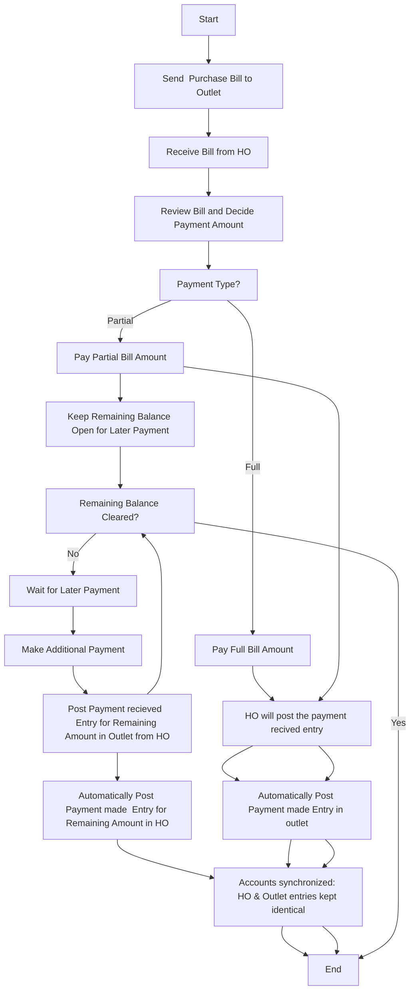

### sales workflows

#### Mermaid Diagram

```mermaid
graph TD
    ~W_OD2oDP8k0["Create Bills"] --> ~W_OW9SAGXd2["Create Invoice"]
    .W_OE1S7P2sq["Receive Quotation Request"] --> .W_Op-X3dQ8u["Create Quotation"]
    .W_OLvgC2oKA["Check Stock Availability"] -->|In stock| .W_Obghnu2iz["Generate Picklist (Available for Sales)"]
    .W_Op-X3dQ8u["Create Quotation"] --> .W_OLt_dtnaJ["Send Quotation to Customer"]
    q18O1c2~iJhM["Check Inventory"] -->|In Stock| q18OOzoNLvz8["Generate Picklist"]
    LS_OFN9AmXF8["Check Stock Availability"] -->|Not in stock| MS_Oerlmjym7["Create Purchase Order to Vendor"]
    r18O0VU47SF6["Deliver to Customer"] --> q18O4M2VTCaM["End"]
    q18OOzoNLvz8["Generate Picklist"] --> q18Oal0ZW._1["Create Invoice"]
    q18Oal0ZW._1["Create Invoice"] --> r18O0VU47SF6["Deliver to Customer"]
    ~W_ODXONCu0t["Customer Response"] -->|Reject| .W_OvlKs_vy0["End"]
    q18OOhOIuxax["Vendor Invoice Type"] -->|Separate Bill| r18OcDXDnr8a["Enter Bill Directly"]
    .W_ONWHpX~Hn["Convert Quotation to Sales Order"] --> .W_OLvgC2oKA["Check Stock Availability"]
    MS_OzZkvHSYh["Create Picklist After Receipt"] --> MS_OhULT_jBB["Package Items"]
    MS_O3lnIzRUr["Create Picklist"] --> MS_OhULT_jBB["Package Items"]
    .W_OuODF8jDx["Package Items"] --> .W_OU7~tApuZ["Ship Items (Shipment)"]
    q18O-_HNS~zc["Start"] --> q18OTzZkWYv1["Receive Customer Order"]
    ~W_OqMF6_1y6["Receive Items (Purchase Receives)"] --> .W_Obghnu2iz["Generate Picklist (Available for Sales)"]
    .W_OLt_dtnaJ["Send Quotation to Customer"] --> ~W_ODXONCu0t["Customer Response"]
    MS_O3W~TNac.["Ship Items"] --> LS_OW4wFilvV["Create Final Invoice"]
    ~W_OW9SAGXd2["Create Invoice"] --> ~W_OZdX.~0yV["Generate E-way Bills"]
    r18O0VU47SF6["Deliver to Customer"] --> q18O4M2VTCaM["End"]
    .W_ONWHpX~Hn["Convert Quotation to Sales Order"] --> .W_OLvgC2oKA["Check Stock Availability"]
    r18OcDXDnr8a["Enter Bill Directly"] --> r18OjMJ88Qlj["Convert Bill to Invoice"]
    .W_OLvgC2oKA["Check Stock Availability"] -->|Non stocked item| .W_OeXFD5971["Create Purchase Order"]
    MS_OGeLUgaRS["Customer Pays"] --> LS_OEA6ZzQAW["Convert Retainer Invoice to Payment Made"]
    .W_OeXFD5971["Create Purchase Order"] --> ~W_OqMF6_1y6["Receive Items (Purchase Receives)"]
    MS_Oerlmjym7["Create Purchase Order to Vendor"] --> MS_ONZGQss3D["Receive Items from Vendor"]
    q18OWgli.bS3["Enter Purchase Receives"] --> q18OYgMhz0Ce["Enter Bill"]
    LS_Oim882Ere["Start"] --> LS_OLlU9rDer["Raise Sales Order"]
    q18OYgMhz0Ce["Enter Bill"] --> q18OkdUecEyT["Generate Picklist After Receipt"]
    LS_OW4wFilvV["Create Final Invoice"] --> LS_OqDNt5O-b["End"]
    LS_OFN9AmXF8["Check Stock Availability"] -->|In stock| MS_O3lnIzRUr["Create Picklist"]
    MS_O3W~TNac.["Ship Items"] --> LS_OW4wFilvV["Create Final Invoice"]
    DhzQT1F9vcZw["convert to payment made"] --> .W_ONWHpX~Hn["Convert Quotation to Sales Order"]
    r18OjMJ88Qlj["Convert Bill to Invoice"] --> r18O0VU47SF6["Deliver to Customer"]
    LS_OH_qN0I.W["Enter Bill"] --> MS_OzZkvHSYh["Create Picklist After Receipt"]
    ~W_OW9SAGXd2["Create Invoice"] --> ~W_OZdX.~0yV["Generate E-way Bills"]
    q18O1c2~iJhM["Check Inventory"] -->|No Stock| q18O80_E91md["Create Purchase Order to Vendor"]
    q18Oal0ZW._1["Create Invoice"] --> r18O0VU47SF6["Deliver to Customer"]
    .W_Orm4XHp_U["Accept Orders from Outlets (SO)"] --> .W_OLvgC2oKA["Check Stock Availability"]
    wfzQpyWHBe~y["request retainer invoice"] --> DhzQT1F9vcZw["convert to payment made"]
    q18OOhOIuxax["Vendor Invoice Type"] -->|Combined Invoice| q18OWgli.bS3["Enter Purchase Receives"]
    LS_OLlU9rDer["Raise Sales Order"] --> LS_OMAMuKcdd["Request Retainer Invoice"]
    .W_OktXIvJG8["Start"] --> .W_OE1S7P2sq["Receive Quotation Request"]
    ~W_OqMF6_1y6["Receive Items (Purchase Receives)"] --> ~W_OD2oDP8k0["Create Bills"]
    ~W_ODXONCu0t["Customer Response"] -->|Accept| wfzQpyWHBe~y["request retainer invoice"]
    .W_OU7~tApuZ["Ship Items (Shipment)"] --> ~W_OW9SAGXd2["Create Invoice"]
    .W_Obghnu2iz["Generate Picklist (Available for Sales)"] --> .W_OuODF8jDx["Package Items"]
    LS_OEA6ZzQAW["Convert Retainer Invoice to Payment Made"] --> LS_OFN9AmXF8["Check Stock Availability"]
    q18OkdUecEyT["Generate Picklist After Receipt"] --> q18Oal0ZW._1["Create Invoice"]
    ~W_OZdX.~0yV["Generate E-way Bills"] --> ~W_O8p0cVKeQ["Deliver to Outlet Customer"]
    q18O80_E91md["Create Purchase Order to Vendor"] --> q18OOhOIuxax["Vendor Invoice Type"]
    q18OTzZkWYv1["Receive Customer Order"] --> q18O1c2~iJhM["Check Inventory"]
    LS_OW4wFilvV["Create Final Invoice"] --> LS_OqDNt5O-b["End"]
    ~W_O8p0cVKeQ["Deliver to Outlet Customer"] --> .W_OvlKs_vy0["End"]
    LS_OMAMuKcdd["Request Retainer Invoice"] --> MS_OGeLUgaRS["Customer Pays"]
    MS_OhULT_jBB["Package Items"] --> MS_O3W~TNac.["Ship Items"]
    MS_ONZGQss3D["Receive Items from Vendor"] --> LS_OH_qN0I.W["Enter Bill"]
    .W_OktXIvJG8["Start"] --> .W_Orm4XHp_U["Accept Orders from Outlets (SO)"]
    MS_OhULT_jBB["Package Items"] --> MS_O3W~TNac.["Ship Items"]
```

#### Written Workflow

- Create Bills -> Create Invoice
- Receive Quotation Request -> Create Quotation
- Check Stock Availability (In stock) -> Generate Picklist (Available for Sales)
- Create Quotation -> Send Quotation to Customer
- Check Inventory (In Stock) -> Generate Picklist
- Check Stock Availability (Not in stock) -> Create Purchase Order to Vendor
- Deliver to Customer -> End
- Generate Picklist -> Create Invoice
- Create Invoice -> Deliver to Customer
- Customer Response (Reject) -> End
- Vendor Invoice Type (Separate Bill) -> Enter Bill Directly
- Convert Quotation to Sales Order -> Check Stock Availability
- Create Picklist After Receipt -> Package Items
- Create Picklist -> Package Items
- Package Items -> Ship Items (Shipment)
- Start -> Receive Customer Order
- Receive Items (Purchase Receives) -> Generate Picklist (Available for Sales)
- Send Quotation to Customer -> Customer Response
- Ship Items -> Create Final Invoice
- Create Invoice -> Generate E-way Bills
- Deliver to Customer -> End
- Convert Quotation to Sales Order -> Check Stock Availability
- Enter Bill Directly -> Convert Bill to Invoice
- Check Stock Availability (Non stocked item) -> Create Purchase Order
- Customer Pays -> Convert Retainer Invoice to Payment Made
- Create Purchase Order -> Receive Items (Purchase Receives)
- Create Purchase Order to Vendor -> Receive Items from Vendor
- Enter Purchase Receives -> Enter Bill
- Start -> Raise Sales Order
- Enter Bill -> Generate Picklist After Receipt
- Create Final Invoice -> End
- Check Stock Availability (In stock) -> Create Picklist
- Ship Items -> Create Final Invoice
- convert to payment made -> Convert Quotation to Sales Order
- Convert Bill to Invoice -> Deliver to Customer
- Enter Bill -> Create Picklist After Receipt
- Create Invoice -> Generate E-way Bills
- Check Inventory (No Stock) -> Create Purchase Order to Vendor
- Create Invoice -> Deliver to Customer
- Accept Orders from Outlets (SO) -> Check Stock Availability
- request retainer invoice -> convert to payment made
- Vendor Invoice Type (Combined Invoice) -> Enter Purchase Receives
- Raise Sales Order -> Request Retainer Invoice
- Start -> Receive Quotation Request
- Receive Items (Purchase Receives) -> Create Bills
- Customer Response (Accept) -> request retainer invoice
- Ship Items (Shipment) -> Create Invoice
- Generate Picklist (Available for Sales) -> Package Items
- Convert Retainer Invoice to Payment Made -> Check Stock Availability
- Generate Picklist After Receipt -> Create Invoice
- Generate E-way Bills -> Deliver to Outlet Customer
- Create Purchase Order to Vendor -> Vendor Invoice Type
- Receive Customer Order -> Check Inventory
- Create Final Invoice -> End
- Deliver to Outlet Customer -> End
- Request Retainer Invoice -> Customer Pays
- Package Items -> Ship Items
- Receive Items from Vendor -> Enter Bill
- Start -> Accept Orders from Outlets (SO)
- Package Items -> Ship Items

---

### return workflows

#### Mermaid Diagram

```mermaid
graph TD
    tepPD0~uL5wk["Customer Reports Damaged Goods"] --> tepPJ-hPq8xg["No Goods Returned to HO Inventory"]
    YepPVw3~WzcG["Receive Credit Note from Vendor"] --> YepPE~Q8as9B["Convert Purchase Return to Vendor Credits"]
    mhoPmZ328~hW["Start"] --> mhoPQh_ebcd8["Sales Return"]
    XepPybe59SGz["Start"] --> XepPNh1C_q_Y["Invoice to Customer(outlet)"]
    YepPE~Q8as9B["Convert Purchase Return to Vendor Credits"] --> XepPoGl2XndD["End"]
    XepPCYe_1_37["Create Purchase Return Request to HO"] --> XepPRHgGh5LW["HO Accepts Return Request?"]
    XepPxUMeUD1H["Customer Returns Item to Outlet"] --> XepPpMQM.oS6["Item Condition at Outlet?"]
    XepPpMQM.oS6["Item Condition at Outlet?"] -->|Non-damaged or non-expired| XepP4Hv5LgtQ["Keep in Outlet Inventory"]
    YepPMyyY4m04["Create Sales Return at HO"] --> YepPko0wTCoC["Convert to Return Receives"]
    j90PP5DJ4HwA["purchase return in outlet convert into damage (inventory adjustment)"] --> XepPoGl2XndD["End"]
    tepPN3Sxcsju["Generate Sales Return"] --> tepP0m.J2oqK["Create Credit Note for Customer"]
    tepPJ-hPq8xg["No Goods Returned to HO Inventory"] --> tepPrzLIA8Fz["Outlet Raises PR Request to HO"]
    tepP0m.J2oqK["Create Credit Note for Customer"] --> tepPfXglb9tM["End"]
    tepPU4Z.ujct["Courier from HO Arrives Damaged"] --> tepPD0~uL5wk["Customer Reports Damaged Goods"]
    YepPiG18XlSd["Create Purchase Return to Vendor"] --> YepPVw3~WzcG["Receive Credit Note from Vendor"]
    tepPN-soAb8I["HO Accepts PO Request?"] -->|Accept| tepPN3Sxcsju["Generate Sales Return"]
    mhoPq.cVCx7j["Transfer Orders"] --> mhoP2m~n-PrC["End"]
    XepPpMQM.oS6["Item Condition at Outlet?"] -->|Damaged or expired| XepPmVfbuO1c["Return Item to HO"]
    XepPmVfbuO1c["Return Item to HO"] --> XepPCYe_1_37["Create Purchase Return Request to HO"]
    YepPvts8soGZ["Create Credit Note at HO"] -->|Non-damaged or non-expired goods| YepPbRL6uvL1["Create Transfer Order to Main Warehouse"]
    XepPNh1C_q_Y["Invoice to Customer(outlet)"] --> XepPxUMeUD1H["Customer Returns Item to Outlet"]
    mhoPgJnvNZNW["Purchase Return"] --> mhoP~PNQouY5["Vendor Credits"]
    mhoPQh_ebcd8["Sales Return"] --> mhoPTpsPjPxH["Sales Return Receives"]
    mhoP~Cpbogpi["Credit Note"] -->|Non-expired items| mhoPq.cVCx7j["Transfer Orders"]
    YepPbRL6uvL1["Create Transfer Order to Main Warehouse"] --> YepP1~nz52~_["Store as Live Ready Items in Main Warehouse"]
    YepPko0wTCoC["Convert to Return Receives"] --> YepPvts8soGZ["Create Credit Note at HO"]
    XepPRHgGh5LW["HO Accepts Return Request?"] -->|Reject| XepPoGl2XndD["End"]
    XepPRHgGh5LW["HO Accepts Return Request?"] -->|Accept| YepPMyyY4m04["Create Sales Return at HO"]
    YepPvts8soGZ["Create Credit Note at HO"] -->|Damaged or expired goods| YepPiG18XlSd["Create Purchase Return to Vendor"]
    mhoP~Cpbogpi["Credit Note"] -->|Expired or damaged items| mhoPgJnvNZNW["Purchase Return"]
    YepP1~nz52~_["Store as Live Ready Items in Main Warehouse"] --> XepPoGl2XndD["End"]
    XepP4Hv5LgtQ["Keep in Outlet Inventory"] --> j90PP5DJ4HwA["purchase return in outlet convert into damage (inventory adjustment)"]
    tepPrzLIA8Fz["Outlet Raises PR Request to HO"] --> tepPN-soAb8I["HO Accepts PO Request?"]
    tepPUi-DjrV4["Start"] --> tepPU4Z.ujct["Courier from HO Arrives Damaged"]
    mhoPTpsPjPxH["Sales Return Receives"] --> mhoP~Cpbogpi["Credit Note"]
    mhoP~PNQouY5["Vendor Credits"] --> mhoP2m~n-PrC["End"]
    tepPN-soAb8I["HO Accepts PO Request?"] -->|Reject| tepPfXglb9tM["End"]
```

#### Written Workflow

- Customer Reports Damaged Goods -> No Goods Returned to HO Inventory
- Receive Credit Note from Vendor -> Convert Purchase Return to Vendor Credits
- Start -> Sales Return
- Start -> Invoice to Customer(outlet)
- Convert Purchase Return to Vendor Credits -> End
- Create Purchase Return Request to HO -> HO Accepts Return Request?
- Customer Returns Item to Outlet -> Item Condition at Outlet?
- Item Condition at Outlet? (Non-damaged or non-expired) -> Keep in Outlet Inventory
- Create Sales Return at HO -> Convert to Return Receives
- purchase return in outlet convert into damage (inventory adjustment) -> End
- Generate Sales Return -> Create Credit Note for Customer
- No Goods Returned to HO Inventory -> Outlet Raises PR Request to HO
- Create Credit Note for Customer -> End
- Courier from HO Arrives Damaged -> Customer Reports Damaged Goods
- Create Purchase Return to Vendor -> Receive Credit Note from Vendor
- HO Accepts PO Request? (Accept) -> Generate Sales Return
- Transfer Orders -> End
- Item Condition at Outlet? (Damaged or expired) -> Return Item to HO
- Return Item to HO -> Create Purchase Return Request to HO
- Create Credit Note at HO (Non-damaged or non-expired goods) -> Create Transfer Order to Main Warehouse
- Invoice to Customer(outlet) -> Customer Returns Item to Outlet
- Purchase Return -> Vendor Credits
- Sales Return -> Sales Return Receives
- Credit Note (Non-expired items) -> Transfer Orders
- Create Transfer Order to Main Warehouse -> Store as Live Ready Items in Main Warehouse
- Convert to Return Receives -> Create Credit Note at HO
- HO Accepts Return Request? (Reject) -> End
- HO Accepts Return Request? (Accept) -> Create Sales Return at HO
- Create Credit Note at HO (Damaged or expired goods) -> Create Purchase Return to Vendor
- Credit Note (Expired or damaged items) -> Purchase Return
- Store as Live Ready Items in Main Warehouse -> End
- Keep in Outlet Inventory -> purchase return in outlet convert into damage (inventory adjustment)
- Outlet Raises PR Request to HO -> HO Accepts PO Request?
- Start -> Courier from HO Arrives Damaged
- Sales Return Receives -> Credit Note
- Vendor Credits -> End
- HO Accepts PO Request? (Reject) -> End

---

### modules workflows

#### Mermaid Diagram

```mermaid
graph TD
    buqPy5TtCGY3["Enter Bill"] --> buqPYGJxOZ.a["Generate Picklist"]
    mjqPtrNA3skL["Prepare Estimate(quatation) (Optional)"] --> mjqPfppiCHhQ["Accepted Estimate"]
    I7qPnk.-EOze["Delivered Order"] --> I7qPxeoquyCe["Sales Return Created"]
    mjqPVNHxq822["Shipment"] --> mjqPIjMbAlVd["Create Invoice"]
    I7qPAfZ.2~V3["Picklist Created"] --> I7qPgikgbVOd["Package Created"]
    mjqPFmPQFoKc["Stock Available?"] -->|No| mjqPbCv-u7T.["Create Purchase Order"]
    I7qPg8coFvX2["Shipment Created"] -->|Full| I7qPpXHXEXSI["Full Delivery → Invoice → Paid"]
    I7qP6KmGTpyo["Purchase Request (Auto/Manual)"] --> I7qPnxCeAvI6["Purchase Order (PO)"]
    I7qP5yaI5Whc["Vendor Bill Recorded"] --> I7qPvpJ2rdes["Vendor Payment"]
    mjqPFmPQFoKc["Stock Available?"] -->|Yes| mjqPaCwgd8la["Create Picklist"]
    I7qPnxCeAvI6["Purchase Order (PO)"] --> I7qPu4fvknrp["purchase recieves"]
    H7qP1SrqFnHn["Customer Request"] --> J7qPc~n_hB9-["Customer Advance / Retainer Invoice"]
    J7qPT9TewTDW["Adjust with Future Bills"] --> I7qP5yaI5Whc["Vendor Bill Recorded"]
    I7qP7rTcjhq7["Goods Received Back (Stock Increased)"] --> I7qPXZbleBXA["Credit Note Issued"]
    buqPxz._cO26["Package Items"] --> buqP65XRq6S9["Shipment"]
    buqPirUNPn-9["Start"] --> buqPzmxJR1kJ["Sales Order (SO)"]
    buqPhU6F-7v1["Raise Purchase Order to Vendor"] --> buqPvgTHmTqO["Purchase Receives"]
    mjqPaCwgd8la["Create Picklist"] --> mjqPKrZ4wRni["Package Items"]
    mjqPKrZ4wRni["Package Items"] --> mjqPVNHxq822["Shipment"]
    I7qPiy6V36EB["Return to Supplier(purchase return)"] --> I7qP2dcMI8xC["Vendor Credit Note"]
    I7qPXZbleBXA["Credit Note Issued"] --> I7qPozU2NqGz["Customer: Refund or Apply as Credit?"]
    I7qPERxUTw2u["Confirm Sales Order"] --> I7qPOKpm5kj1["Check Stock Availability"]
    I7qPXZbleBXA["Credit Note Issued"] -->|NON ACTIVE GOODS| I7qPiy6V36EB["Return to Supplier(purchase return)"]
    mjqP1xHdO1E9["Enter Vendor Bills"] --> mjqPaCwgd8la["Create Picklist"]
    mjqPUawRGLYw["Customer Request"] --> mjqP5lyV3J5.["Create Sales Order"]
    I7qPnk.-EOze["Delivered Order"] --> I7qPxeoquyCe["Sales Return Created"]
    I7qPOKpm5kj1["Check Stock Availability"] -->|Stock Available| I7qPAfZ.2~V3["Picklist Created"]
    I7qPILDwd0Dm["Refund Processed"] --> J7qPEbfuRYW8["End"]
    buqP65XRq6S9["Shipment"] --> cuqP9rv4MwQI["invoice"]
    mjqPbCv-u7T.["Create Purchase Order"] --> mjqP2VHa7dsB["Receive Purchased Items(PURCHASE RECIEVE)"]
    I7qP_0dpnDh6["Create Sales Order (SO)"] --> I7qPERxUTw2u["Confirm Sales Order"]
    I7qPNHu-IcmK["Mark as Delivered"] -->|if reject| I7qPnk.-EOze["Delivered Order"]
    I7qPg80M2_n2["PAID"] --> J7qPEbfuRYW8["End"]
    H7qPyX5DprAq["Start"] --> H7qP1SrqFnHn["Customer Request"]
    mjqP2VHa7dsB["Receive Purchased Items(PURCHASE RECIEVE)"] --> mjqP1xHdO1E9["Enter Vendor Bills"]
    I7qPxeoquyCe["Sales Return Created"] --> I7qP7rTcjhq7["Goods Received Back (Stock Increased)"]
    I7qPXZbleBXA["Credit Note Issued"] -->|ACTIVE STOCK| j7ZPSohrRueb["transfer orders"]
    I7qPNHu-IcmK["Mark as Delivered"] -->|if accept| I7qPYZANBrm9["Invoice Created (Draft)"]
    buqPvgTHmTqO["Purchase Receives"] --> buqPy5TtCGY3["Enter Bill"]
    I7qP-brN8NSh["Stock Increased + Batch Created"] --> I7qP5yaI5Whc["Vendor Bill Recorded"]
    I7qP03kSnnC5["Applied as Credit to Future Invoice"] --> I7qPYZANBrm9["Invoice Created (Draft)"]
    I7qPPaZWr1P7["Vendor: Refund or Adjust with Future Bills?"] -->|Adjust| J7qPT9TewTDW["Adjust with Future Bills"]
    J7qPc~n_hB9-["Customer Advance / Retainer Invoice"] --> J7qPPEN8kGiM["Advance Payment Received"]
    I7qP1Lo89wdo["Invoice Sent"] --> I7qPnr0JdP3e["Payment Received"]
    cuqPYyXFC3.1["Stock available?"] -->||Stocked|| buqPYGJxOZ.a["Generate Picklist"]
    I7qPYZANBrm9["Invoice Created (Draft)"] --> I7qP1Lo89wdo["Invoice Sent"]
    I7qPg8coFvX2["Shipment Created"] -->|Partial| I7qPREBC.DHs["Partial Delivery → Partial Invoice + Backorder"]
    buqPYGJxOZ.a["Generate Picklist"] --> buqPxz._cO26["Package Items"]
    I7qPvpJ2rdes["Vendor Payment"] --> I7qPYZANBrm9["Invoice Created (Draft)"]
    mjqPpRxjpX9P["Start"] --> mjqPUawRGLYw["Customer Request"]
    I7qP5yaI5Whc["Vendor Bill Recorded"] --> I7qPYZANBrm9["Invoice Created (Draft)"]
    I7qPOKpm5kj1["Check Stock Availability"] -->|Stock Not Available| I7qP6KmGTpyo["Purchase Request (Auto/Manual)"]
    H7qPmUu0~2eO["Accepted Estimate"] --> I7qP_0dpnDh6["Create Sales Order (SO)"]
    I7qPu4fvknrp["purchase recieves"] --> I7qP-brN8NSh["Stock Increased + Batch Created"]
    I7qP2dcMI8xC["Vendor Credit Note"] --> I7qPPaZWr1P7["Vendor: Refund or Adjust with Future Bills?"]
    mjqPbf9BTnZV["Confirm Sales Order"] --> mjqPFmPQFoKc["Stock Available?"]
    I7qPu4fvknrp["purchase recieves"] --> I7qP-brN8NSh["Stock Increased + Batch Created"]
    H7qP1SrqFnHn["Customer Request"] --> H7qPZ1teyN7w["Estimate(QUOTES) (Optional)"]
    buqPy5TtCGY3["Enter Bill"] --> cuqP9rv4MwQI["invoice"]
    J7qPFt6~Z7fA["Stored as Customer Credit"] --> J7qPv3wCRTGf["Auto Apply to Future Invoices"]
    mjqPfppiCHhQ["Accepted Estimate"] --> mjqP5lyV3J5.["Create Sales Order"]
    I7qPozU2NqGz["Customer: Refund or Apply as Credit?"] -->|Apply as Credit| I7qP03kSnnC5["Applied as Credit to Future Invoice"]
    J7qPPEN8kGiM["Advance Payment Received"] --> J7qPFt6~Z7fA["Stored as Customer Credit"]
    I7qPu4fvknrp["purchase recieves"] --> I7qPAfZ.2~V3["Picklist Created"]
    J7qP~l_JrJsc["Vendor Refund"] --> J7qPEbfuRYW8["End"]
    H7qPZ1teyN7w["Estimate(QUOTES) (Optional)"] --> H7qPmUu0~2eO["Accepted Estimate"]
    mjqP5lyV3J5.["Create Sales Order"] --> mjqPbf9BTnZV["Confirm Sales Order"]
    mjqP98BFcWvy["Receive Payment"] --> mjqPcZ9LOf0e["End"]
    H7qP1SrqFnHn["Customer Request"] --> I7qP_0dpnDh6["Create Sales Order (SO)"]
    I7qPnr0JdP3e["Payment Received"] --> I7qPg80M2_n2["PAID"]
    J7qPv3wCRTGf["Auto Apply to Future Invoices"] --> I7qPYZANBrm9["Invoice Created (Draft)"]
    mjqPUawRGLYw["Customer Request"] --> mjqPtrNA3skL["Prepare Estimate(quatation) (Optional)"]
    buqPzmxJR1kJ["Sales Order (SO)"] --> cuqPYyXFC3.1["Stock available?"]
    I7qPRWhz6a0T["Failed Delivery → Return Entry"] --> I7qPxeoquyCe["Sales Return Created"]
    cuqPYyXFC3.1["Stock available?"] -->||Non-stocked|| buqPhU6F-7v1["Raise Purchase Order to Vendor"]
    I7qPozU2NqGz["Customer: Refund or Apply as Credit?"] -->|Refund| I7qPILDwd0Dm["Refund Processed"]
    mjqPIjMbAlVd["Create Invoice"] --> mjqP98BFcWvy["Receive Payment"]
    I7qPg8coFvX2["Shipment Created"] -->|Failed| I7qPRWhz6a0T["Failed Delivery → Return Entry"]
    I7qPg8coFvX2["Shipment Created"] --> I7qPvP8H2Xey["Delivery Challan (Optional)"]
    I7qPvP8H2Xey["Delivery Challan (Optional)"] --> I7qPNHu-IcmK["Mark as Delivered"]
    I7qPgikgbVOd["Package Created"] --> I7qPg8coFvX2["Shipment Created"]
    I7qPPaZWr1P7["Vendor: Refund or Adjust with Future Bills?"] -->|Refund| J7qP~l_JrJsc["Vendor Refund"]
```

#### Written Workflow

- Enter Bill -> Generate Picklist
- Prepare Estimate(quatation) (Optional) -> Accepted Estimate
- Delivered Order -> Sales Return Created
- Shipment -> Create Invoice
- Picklist Created -> Package Created
- Stock Available? (No) -> Create Purchase Order
- Shipment Created (Full) -> Full Delivery → Invoice → Paid
- Purchase Request (Auto/Manual) -> Purchase Order (PO)
- Vendor Bill Recorded -> Vendor Payment
- Stock Available? (Yes) -> Create Picklist
- Purchase Order (PO) -> purchase recieves
- Customer Request -> Customer Advance / Retainer Invoice
- Adjust with Future Bills -> Vendor Bill Recorded
- Goods Received Back (Stock Increased) -> Credit Note Issued
- Package Items -> Shipment
- Start -> Sales Order (SO)
- Raise Purchase Order to Vendor -> Purchase Receives
- Create Picklist -> Package Items
- Package Items -> Shipment
- Return to Supplier(purchase return) -> Vendor Credit Note
- Credit Note Issued -> Customer: Refund or Apply as Credit?
- Confirm Sales Order -> Check Stock Availability
- Credit Note Issued (NON ACTIVE GOODS) -> Return to Supplier(purchase return)
- Enter Vendor Bills -> Create Picklist
- Customer Request -> Create Sales Order
- Delivered Order -> Sales Return Created
- Check Stock Availability (Stock Available) -> Picklist Created
- Refund Processed -> End
- Shipment -> invoice
- Create Purchase Order -> Receive Purchased Items(PURCHASE RECIEVE)
- Create Sales Order (SO) -> Confirm Sales Order
- Mark as Delivered (if reject) -> Delivered Order
- PAID -> End
- Start -> Customer Request
- Receive Purchased Items(PURCHASE RECIEVE) -> Enter Vendor Bills
- Sales Return Created -> Goods Received Back (Stock Increased)
- Credit Note Issued (ACTIVE STOCK) -> transfer orders
- Mark as Delivered (if accept) -> Invoice Created (Draft)
- Purchase Receives -> Enter Bill
- Stock Increased + Batch Created -> Vendor Bill Recorded
- Applied as Credit to Future Invoice -> Invoice Created (Draft)
- Vendor: Refund or Adjust with Future Bills? (Adjust) -> Adjust with Future Bills
- Customer Advance / Retainer Invoice -> Advance Payment Received
- Invoice Sent -> Payment Received
- Stock available? (Stocked) -> Generate Picklist
- Invoice Created (Draft) -> Invoice Sent
- Shipment Created (Partial) -> Partial Delivery → Partial Invoice + Backorder
- Generate Picklist -> Package Items
- Vendor Payment -> Invoice Created (Draft)
- Start -> Customer Request
- Vendor Bill Recorded -> Invoice Created (Draft)
- Check Stock Availability (Stock Not Available) -> Purchase Request (Auto/Manual)
- Accepted Estimate -> Create Sales Order (SO)
- purchase recieves -> Stock Increased + Batch Created
- Vendor Credit Note -> Vendor: Refund or Adjust with Future Bills?
- Confirm Sales Order -> Stock Available?
- purchase recieves -> Stock Increased + Batch Created
- Customer Request -> Estimate(QUOTES) (Optional)
- Enter Bill -> invoice
- Stored as Customer Credit -> Auto Apply to Future Invoices
- Accepted Estimate -> Create Sales Order
- Customer: Refund or Apply as Credit? (Apply as Credit) -> Applied as Credit to Future Invoice
- Advance Payment Received -> Stored as Customer Credit
- purchase recieves -> Picklist Created
- Vendor Refund -> End
- Estimate(QUOTES) (Optional) -> Accepted Estimate
- Create Sales Order -> Confirm Sales Order
- Receive Payment -> End
- Customer Request -> Create Sales Order (SO)
- Payment Received -> PAID
- Auto Apply to Future Invoices -> Invoice Created (Draft)
- Customer Request -> Prepare Estimate(quatation) (Optional)
- Sales Order (SO) -> Stock available?
- Failed Delivery → Return Entry -> Sales Return Created
- Stock available? (Non-stocked) -> Raise Purchase Order to Vendor
- Customer: Refund or Apply as Credit? (Refund) -> Refund Processed
- Create Invoice -> Receive Payment
- Shipment Created (Failed) -> Failed Delivery → Return Entry
- Shipment Created -> Delivery Challan (Optional)
- Delivery Challan (Optional) -> Mark as Delivered
- Package Created -> Shipment Created
- Vendor: Refund or Adjust with Future Bills? (Refund) -> Vendor Refund

---

### store to store workflow

#### Mermaid Diagram

```mermaid
graph TD
    K5lQso8g2.27["SALES RETURN"] --> 45lQ0S~A2KTQ["CREDITNOTE"]
    eqUQ2v2Z65hs["{Approve request?}"] -->|Entry-wise: Approve| eqUQ1gbc89XM["Raise Purchase Return Request to HO"]
    58lQEAGgJ9Wi["invoice to OUTLET A"] --> t2lQrt0JWW31["end"]
    eqUQ22vuMGcw["Auto Convert to Invoice for Outlet A"] --> eqUQu65RykJc["Dispatch Items from Outlet B"]
    eqUQcqV2-A9T["{HO approves purchase return?}"] -->|No| eqUQ~Oqm6XVP["H3_Notify HO Rejection to Outlet B"]
    eqUQ~Oqm6XVP["H3_Notify HO Rejection to Outlet B"] --> eqUQz5wCBK1F["Review Request"]
    45lQ0S~A2KTQ["CREDITNOTE"] --> S7lQ9qo77e1i["VENDOR CREDIT TO OUTLET B"]
    eqUQ-w9cWien["Convert to Vendor Credits TO outlet B (inventory & accounts cleared for Vendor B and HO)"] --> dqUQ0P2PqJOE["End"]
    dqUQw4_XDqIS["Receive Items at Outlet A"] --> eqUQrquGWeAG["Complete Transfer and Settlement"]
    eqUQ1gbc89XM["Raise Purchase Return Request to HO"] --> eqUQ~ugs0EB4["Review Purchase Return Request"]
    u0lQeUXxubq0["OUTLET B"] -->|ACCEPT| R3lQHOh8igKT["purchase return request to HO"]
    eqUQcqV2-A9T["{HO approves purchase return?}"] -->|Yes| eqUQZ46xTSCY["_Auto Convert to Sales RETURN and Credit Note"]
    45lQ0S~A2KTQ["CREDITNOTE"] --> 58lQEAGgJ9Wi["invoice to OUTLET A"]
    dqUQsr5I1gpn["OUTLET A_Create Product Requirement Request"] --> dqUQgSZ_e3Vi["Send Request to Outlet B"]
    dqUQMuDqdxRe["_Resend Request to Outlet B"] --> eqUQz5wCBK1F["Review Request"]
    tZlQE3HhJwN.["OUTLET A"] -->|RAISE A PRODUCT REQUIRMENT REQUEST TO OUTLET B| u0lQeUXxubq0["OUTLET B"]
    u0lQeUXxubq0["OUTLET B"] -->|REJECT| t2lQrt0JWW31["end"]
    dqUQlbmVaqhg["_Revise Request"] --> dqUQMuDqdxRe["_Resend Request to Outlet B"]
    H2lQfUN5tBQX["start"] --> tZlQE3HhJwN.["OUTLET A"]
    eqUQz5wCBK1F["Review Request"] --> eqUQ2v2Z65hs["{Approve request?}"]
    dqUQhzYANH82["_Close Rejected Request"] --> dqUQ0P2PqJOE["End"]
    eqUQ2v2Z65hs["{Approve request?}"] -->|Entry-wise: Reject| eqUQRrvR8y0j["Notify Rejection to Outlet A (item/entry rejected)"]
    eqUQZ46xTSCY["_Auto Convert to Sales RETURN and Credit Note"] --> eqUQ-w9cWien["Convert to Vendor Credits TO outlet B (inventory & accounts cleared for Vendor B and HO)"]
    eqUQZ46xTSCY["_Auto Convert to Sales RETURN and Credit Note"] --> eqUQ22vuMGcw["Auto Convert to Invoice for Outlet A"]
    eqUQDMoMANmE["itemwise{Item-wise: Approve item?}"] -->|Rejected items| eqUQRrvR8y0j["Notify Rejection to Outlet A (item/entry rejected)"]
    eqUQu65RykJc["Dispatch Items from Outlet B"] --> dqUQw4_XDqIS["Receive Items at Outlet A"]
    eqUQRrvR8y0j["Notify Rejection to Outlet A (item/entry rejected)"] --> eqUQvqfDrqXA["_Notify Rejection to Outlet A"]
    dqUQgSZ_e3Vi["Send Request to Outlet B"] --> eqUQz5wCBK1F["Review Request"]
    c5lQTeDJyC8r["recieve pr request"] --> K5lQso8g2.27["SALES RETURN"]
    eqUQ2v2Z65hs["{Approve request?}"] -->|Item-wise: Some items approved / some rejected| eqUQDMoMANmE["itemwise{Item-wise: Approve item?}"]
    S7lQ9qo77e1i["VENDOR CREDIT TO OUTLET B"] --> t2lQrt0JWW31["end"]
    dqUQ27~QwDm7["Start"] --> dqUQsr5I1gpn["OUTLET A_Create Product Requirement Request"]
    eqUQ1gbc89XM["Raise Purchase Return Request to HO"] --> eqUQu65RykJc["Dispatch Items from Outlet B"]
    eqUQDMoMANmE["itemwise{Item-wise: Approve item?}"] -->|Approved items| eqUQ1gbc89XM["Raise Purchase Return Request to HO"]
    R3lQHOh8igKT["purchase return request to HO"] --> c5lQTeDJyC8r["recieve pr request"]
    eqUQvqfDrqXA["_Notify Rejection to Outlet A"] --> dqUQlbmVaqhg["_Revise Request"]
    eqUQvqfDrqXA["_Notify Rejection to Outlet A"] --> dqUQhzYANH82["_Close Rejected Request"]
    eqUQrquGWeAG["Complete Transfer and Settlement"] --> dqUQ0P2PqJOE["End"]
    eqUQ~ugs0EB4["Review Purchase Return Request"] --> eqUQcqV2-A9T["{HO approves purchase return?}"]
```

#### Written Workflow

- SALES RETURN -> CREDITNOTE
- {Approve request?} (Entry-wise: Approve) -> Raise Purchase Return Request to HO
- invoice to OUTLET A -> end
- Auto Convert to Invoice for Outlet A -> Dispatch Items from Outlet B
- {HO approves purchase return?} (No) -> H3_Notify HO Rejection to Outlet B
- H3_Notify HO Rejection to Outlet B -> Review Request
- CREDITNOTE -> VENDOR CREDIT TO OUTLET B
- Convert to Vendor Credits TO outlet B (inventory & accounts cleared for Vendor B and HO) -> End
- Receive Items at Outlet A -> Complete Transfer and Settlement
- Raise Purchase Return Request to HO -> Review Purchase Return Request
- OUTLET B (ACCEPT) -> purchase return request to HO
- {HO approves purchase return?} (Yes) -> _Auto Convert to Sales RETURN and Credit Note
- CREDITNOTE -> invoice to OUTLET A
- OUTLET A_Create Product Requirement Request -> Send Request to Outlet B
- _Resend Request to Outlet B -> Review Request
- OUTLET A (RAISE A PRODUCT REQUIRMENT REQUEST TO OUTLET B) -> OUTLET B
- OUTLET B (REJECT) -> end
- _Revise Request -> _Resend Request to Outlet B
- start -> OUTLET A
- Review Request -> {Approve request?}
- _Close Rejected Request -> End
- {Approve request?} (Entry-wise: Reject) -> Notify Rejection to Outlet A (item/entry rejected)
- _Auto Convert to Sales RETURN and Credit Note -> Convert to Vendor Credits TO outlet B (inventory & accounts cleared for Vendor B and HO)
- _Auto Convert to Sales RETURN and Credit Note -> Auto Convert to Invoice for Outlet A
- itemwise{Item-wise: Approve item?} (Rejected items) -> Notify Rejection to Outlet A (item/entry rejected)
- Dispatch Items from Outlet B -> Receive Items at Outlet A
- Notify Rejection to Outlet A (item/entry rejected) -> _Notify Rejection to Outlet A
- Send Request to Outlet B -> Review Request
- recieve pr request -> SALES RETURN
- {Approve request?} (Item-wise: Some items approved / some rejected) -> itemwise{Item-wise: Approve item?}
- VENDOR CREDIT TO OUTLET B -> end
- Start -> OUTLET A_Create Product Requirement Request
- Raise Purchase Return Request to HO -> Dispatch Items from Outlet B
- itemwise{Item-wise: Approve item?} (Approved items) -> Raise Purchase Return Request to HO
- purchase return request to HO -> recieve pr request
- _Notify Rejection to Outlet A -> _Revise Request
- _Notify Rejection to Outlet A -> _Close Rejected Request
- Complete Transfer and Settlement -> End
- Review Purchase Return Request -> {HO approves purchase return?}

---

### purchase return workflow for ho and outlets

#### Mermaid Diagram

```mermaid
graph TD
    QOFQyEPfTHBc["purchase return"] --> 0OFQFdij62qN["vendor credits"]
    zWTQQ8IzZZZF["HO accepts request?"] -->|No| zWTQoZlk8be4["HO rejects request"]
    bJFQxMY2N2Qt["sales return"] -->|partially accepting| CQFQcNGXrKwV["will reject the items row wise"]
    K.EQ3yqVcMNH["Outlet accepts receipt"] --> K.EQUvvooo8_["Item details auto-fill into Purchase Receives"]
    bJFQxMY2N2Qt["sales return"] --> lMFQBYxW9C25["sales return recieves"]
    zWTQnPA~MIHh["HO converts Sales Return to Return Receives"] --> zWTQgMQunYBq["HO converts Return Receives to Vendor Credits"]
    zWTQrBEYuwQY["Cancel draft"] --> zWTQYyYVD5Ho["End"]
    UHFQof4hOBiH["purchase return request from outlet"] --> eIFQ49.ssIx7["Sales return request in HO"]
    CQFQcNGXrKwV["will reject the items row wise"] -->|teh items already exist here will ship in next corier| 3IFQScru5n8W["END"]
    K.EQUHvd7D93["Outlet receives items from HO"] --> K.EQEUk-Yq35["System sends notification to outlet"]
    eIFQ49.ssIx7["Sales return request in HO"] --> 3IFQScru5n8W["END"]
    K.EQJQCCbIi_["Any issues? Damage / Shortage"] -->|No issues| L.EQZOMLViIz["Save receive"]
    CQFQcNGXrKwV["will reject the items row wise"] --> lMFQBYxW9C25["sales return recieves"]
    L.EQbHlIhnJY["Convert receive into bill"] -->|Issues marked| L.EQJNOWDMfV["Create purchase return request to HO instendly"]
    L.EQbHlIhnJY["Convert receive into bill"] -->|No issues| L.EQj4MPPuSB["End"]
    K.EQUvvooo8_["Item details auto-fill into Purchase Receives"] --> K.EQKUT6YcCD["Outlet checks received items"]
    K.EQKUT6YcCD["Outlet checks received items"] --> K.EQJQCCbIi_["Any issues? Damage / Shortage"]
    L.EQZOMLViIz["Save receive"] --> L.EQbHlIhnJY["Convert receive into bill"]
    zWTQgMQunYBq["HO converts Return Receives to Vendor Credits"] --> zWTQYyYVD5Ho["End"]
    KOFQ_CHsuzzB["creditnote"] --> QOFQyEPfTHBc["purchase return"]
    zWTQ2p1dL_Kp["Outlet submits Purchase Return Request to HO"] --> zWTQ9boJlH5x["HO reviews Purchase Return Request"]
    eIFQ49.ssIx7["Sales return request in HO"] -->|fully accepting| bJFQxMY2N2Qt["sales return"]
    L.EQcdcNIsd-["Mark issues: damage / shortage"] --> L.EQZOMLViIz["Save receive"]
    K.EQJQCCbIi_["Any issues? Damage / Shortage"] -->|Issues found| L.EQcdcNIsd-["Mark issues: damage / shortage"]
    zWTQ35Hkmbe3["HO converts Purchase Return Request to Sales Return"] --> zWTQnPA~MIHh["HO converts Sales Return to Return Receives"]
    zWTQa6v6XmlM["Start"] --> zWTQ1ndjhdOj["Outlet creates Purchase Return Request"]
    zWTQ1ndjhdOj["Outlet creates Purchase Return Request"] --> zWTQBNiS.Ds-["Outstanding balance exists or credit limit exceeded?"]
    zWTQBNiS.Ds-["Outstanding balance exists or credit limit exceeded?"] -->|No| zWTQ2p1dL_Kp["Outlet submits Purchase Return Request to HO"]
    zWTQLEAtB1A1["Outlet cannot submit request to HO"] --> zWTQrBEYuwQY["Cancel draft"]
    zWTQnnJbnlZw["Wait until balance is cleared or credit limit is restored"] --> zWTQ4C4rPe7c["Recheck account status"]
    zWTQ9boJlH5x["HO reviews Purchase Return Request"] --> zWTQQ8IzZZZF["HO accepts request?"]
    L.EQJNOWDMfV["Create purchase return request to HO instendly"] --> L.EQj4MPPuSB["End"]
    L.EQJNOWDMfV["Create purchase return request to HO instendly"] -->|if the shoetage items is already having in ho| CQFQcNGXrKwV["will reject the items row wise"]
    zWTQBNiS.Ds-["Outstanding balance exists or credit limit exceeded?"] -->|Yes| zWTQLEAtB1A1["Outlet cannot submit request to HO"]
    K.EQEUk-Yq35["System sends notification to outlet"] --> K.EQ3yqVcMNH["Outlet accepts receipt"]
    zWTQQ8IzZZZF["HO accepts request?"] -->|Yes| zWTQ35Hkmbe3["HO converts Purchase Return Request to Sales Return"]
    zWTQLEAtB1A1["Outlet cannot submit request to HO"] --> zWTQnnJbnlZw["Wait until balance is cleared or credit limit is restored"]
    lMFQBYxW9C25["sales return recieves"] --> KOFQ_CHsuzzB["creditnote"]
    K.EQF7Vx9ytu["Start"] --> K.EQUHvd7D93["Outlet receives items from HO"]
    zWTQoZlk8be4["HO rejects request"] --> zWTQYyYVD5Ho["End"]
    zWTQ4C4rPe7c["Recheck account status"] --> zWTQBNiS.Ds-["Outstanding balance exists or credit limit exceeded?"]
```

#### Written Workflow

- purchase return -> vendor credits
- HO accepts request? (No) -> HO rejects request
- sales return (partially accepting) -> will reject the items row wise
- Outlet accepts receipt -> Item details auto-fill into Purchase Receives
- sales return -> sales return recieves
- HO converts Sales Return to Return Receives -> HO converts Return Receives to Vendor Credits
- Cancel draft -> End
- purchase return request from outlet -> Sales return request in HO
- will reject the items row wise (teh items already exist here will ship in next corier) -> END
- Outlet receives items from HO -> System sends notification to outlet
- Sales return request in HO -> END
- Any issues? Damage / Shortage (No issues) -> Save receive
- will reject the items row wise -> sales return recieves
- Convert receive into bill (Issues marked) -> Create purchase return request to HO instendly
- Convert receive into bill (No issues) -> End
- Item details auto-fill into Purchase Receives -> Outlet checks received items
- Outlet checks received items -> Any issues? Damage / Shortage
- Save receive -> Convert receive into bill
- HO converts Return Receives to Vendor Credits -> End
- creditnote -> purchase return
- Outlet submits Purchase Return Request to HO -> HO reviews Purchase Return Request
- Sales return request in HO (fully accepting) -> sales return
- Mark issues: damage / shortage -> Save receive
- Any issues? Damage / Shortage (Issues found) -> Mark issues: damage / shortage
- HO converts Purchase Return Request to Sales Return -> HO converts Sales Return to Return Receives
- Start -> Outlet creates Purchase Return Request
- Outlet creates Purchase Return Request -> Outstanding balance exists or credit limit exceeded?
- Outstanding balance exists or credit limit exceeded? (No) -> Outlet submits Purchase Return Request to HO
- Outlet cannot submit request to HO -> Cancel draft
- Wait until balance is cleared or credit limit is restored -> Recheck account status
- HO reviews Purchase Return Request -> HO accepts request?
- Create purchase return request to HO instendly -> End
- Create purchase return request to HO instendly (if the shoetage items is already having in ho) -> will reject the items row wise
- Outstanding balance exists or credit limit exceeded? (Yes) -> Outlet cannot submit request to HO
- System sends notification to outlet -> Outlet accepts receipt
- HO accepts request? (Yes) -> HO converts Purchase Return Request to Sales Return
- Outlet cannot submit request to HO -> Wait until balance is cleared or credit limit is restored
- sales return recieves -> creditnote
- Start -> Outlet receives items from HO
- HO rejects request -> End
- Recheck account status -> Outstanding balance exists or credit limit exceeded?

---

### auto payment ledger in outlets

#### Mermaid Diagram



#### Written Workflow

- Payment Type? (Partial) -> Pay Partial Bill Amount
- Wait for Later Payment -> Make Additional Payment
- Start -> Send  Purchase Bill to Outlet
- HO will post the payment recived entry -> Automatically Post Payment made Entry in outlet
- Remaining Balance Cleared? (No) -> Wait for Later Payment
- HO will post the payment recived entry -> Automatically Post Payment made Entry in outlet
- Pay Full Bill Amount -> HO will post the payment recived entry
- Post Payment recieved  Entry for Remaining Amount in Outlet from HO -> Remaining Balance Cleared?
- Receive Bill from HO -> Review Bill and Decide Payment Amount
- Post Payment recieved  Entry for Remaining Amount in Outlet from HO -> Automatically Post Payment made  Entry for Remaining Amount in HO
- Automatically Post Payment made  Entry for Remaining Amount in HO -> Accounts synchronized: HO & Outlet entries kept identical
- Accounts synchronized: HO & Outlet entries kept identical -> End
- Accounts synchronized: HO & Outlet entries kept identical -> End
- Automatically Post Payment made Entry in outlet -> Accounts synchronized: HO & Outlet entries kept identical
- Send  Purchase Bill to Outlet -> Receive Bill from HO
- Make Additional Payment -> Post Payment recieved  Entry for Remaining Amount in Outlet from HO
- Automatically Post Payment made Entry in outlet -> Accounts synchronized: HO & Outlet entries kept identical
- Payment Type? (Full) -> Pay Full Bill Amount
- Remaining Balance Cleared? (Yes) -> End
- Pay Partial Bill Amount -> HO will post the payment recived entry
- Pay Partial Bill Amount -> Keep Remaining Balance Open for Later Payment
- Review Bill and Decide Payment Amount -> Payment Type?
- Keep Remaining Balance Open for Later Payment -> Remaining Balance Cleared?

---

### settings flows 

#### Mermaid Diagram

```mermaid
graph TD
    ih4SYIJJuXqu["Create Branch - Branch Name - Location - Contact Info - Other branch details"] -->|Creates branch data for| ih4SexGSHM.n["Auto-load Branch Profile Data Source: Organization Branch Creation"]
    ih4SmypelxWk["Enable Bin Locations by Default"] -->|Enables bin tracking| jh4SibNKgxQn["Rule: Bin tracking is mandatory at branch level"]
    eM1SFEnpH-~T["Default Warehouse (Auto)"] --> eM1S~c8l_mt7["Branch warehouses have bin-level tracking enabled by default"]
    eM1SZBS~-Iuj["Branch A"] -->|Default Warehouse (Auto-created)| eM1SFEnpH-~T["Default Warehouse (Auto)"]
    ih4SkEmw5ZvN["Auto-create Default Warehouse Warehouse Name = [Organization Location + Organization Name]"] -->|Generates hierarchy| ih4SLq1-Zbl8["Hierarchy: Organization → Branch → Warehouse → Bin"]
    ih4S4_sTZfPe["Profile Fields = View Only or Limited Editable Fields (e.g., Contact Number if allowed)"] -->|Read-only / Limited Edit| ih4S4_sTZfPe["Profile Fields = View Only or Limited Editable Fields (e.g., Contact Number if allowed)"]
    ih4SU2zopfSf["Click Save?"] -->|Yes| ih4SWkIewEao["Create New Organization"]
    ih4S18i_PUQ6["Open Settings Module"] --> ih4SexGSHM.n["Auto-load Branch Profile Data Source: Organization Branch Creation"]
    ih4SexGSHM.n["Auto-load Branch Profile Data Source: Organization Branch Creation"] --> ih4S4_sTZfPe["Profile Fields = View Only or Limited Editable Fields (e.g., Contact Number if allowed)"]
    ih4Sa4h.7qYM["Branch User Login"] --> ih4S18i_PUQ6["Open Settings Module"]
    dM1S35UwEOGP["Branch created?"] -->|Yes| dM1Sy~DqNk_W["Auto-create Branch Default Warehouse (System) Name = [Branch Location + 'Store']"]
    ih4SU2zopfSf["Click Save?"] -->|No / Edit| ih4SPmOSa.gI["Fill Organization Profile - Name - Location - Contact Info - Other profile details"]
    ih4SrAgl2aG5["Operate Only Within Assigned Warehouse and Bins"] -->|Subject to| jh4S2sc632KX["Rule: Branch operates only within its assigned warehouse"]
    ih4SsvIRSO-0["Enter Settings Module (HO Login)"] --> ih4SPmOSa.gI["Fill Organization Profile - Name - Location - Contact Info - Other profile details"]
    dM1SIER-k~Fy["Save successful?"] -->|No| dM1SaHXGop1y["Review / Correct Profile Details"]
    eM1S76E.EhFn["Default Warehouse (Auto)"] --> eM1SlH62Jpk6["Bin 2 (Auto/Enabled)"]
    ih4SrAgl2aG5["Operate Only Within Assigned Warehouse and Bins"] -->|Must place stock per| jh4SERHBt9e9["Rule: All stock must exist inside Warehouse and Bin"]
    ih4SLq1-Zbl8["Hierarchy: Organization → Branch → Warehouse → Bin"] --> jh4SERHBt9e9["Rule: All stock must exist inside Warehouse and Bin"]
    ih4S-BWnCGkV["Restricted Operational Access"] --> ih4SCZKVvAgX["Settings Module Workflow Complete"]
    dM1SfwY3oYh~["Create Branch (Linked to parent Organization)"] --> dM1S35UwEOGP["Branch created?"]
    ih4SrAgl2aG5["Operate Only Within Assigned Warehouse and Bins"] --> ih4S-BWnCGkV["Restricted Operational Access"]
    ih4S18i_PUQ6["Open Settings Module"] --> ih4SK.a2aQBZ["Branch Management Module Not Available"]
    ih4Ste8WF52a["Auto-create Branch Default Warehouse Warehouse Name = [Branch Location + 'Store']"] -->|Generates branch warehouse| ih4SLq1-Zbl8["Hierarchy: Organization → Branch → Warehouse → Bin"]
    ih4SkEmw5ZvN["Auto-create Default Warehouse Warehouse Name = [Organization Location + Organization Name]"] --> ih4SYIJJuXqu["Create Branch - Branch Name - Location - Contact Info - Other branch details"]
    jh4S2sc632KX["Rule: Branch operates only within its assigned warehouse"] --> jh4SibNKgxQn["Rule: Bin tracking is mandatory at branch level"]
    eM1S76E.EhFn["Default Warehouse (Auto)"] --> eM1S~c8l_mt7["Branch warehouses have bin-level tracking enabled by default"]
    dM1Sy~DqNk_W["Auto-create Branch Default Warehouse (System) Name = [Branch Location + 'Store']"] --> dM1SPF-qybzC["Enable Bin Locations by Default (System)"]
    eM1S76E.EhFn["Default Warehouse (Auto)"] --> eM1SnDlq6Zwd["Bin 1 (Auto/Enabled)"]
    ih4Ste8WF52a["Auto-create Branch Default Warehouse Warehouse Name = [Branch Location + 'Store']"] --> ih4SmypelxWk["Enable Bin Locations by Default"]
    ih4SPmOSa.gI["Fill Organization Profile - Name - Location - Contact Info - Other profile details"] --> ih4SU2zopfSf["Click Save?"]
    dM1SM.7v1CA.["User enters Settings Module"] --> dM1SqTqUN124["Fill Organization Profile (Name, Location, Contact Info, etc.)"]
    ih4SYIJJuXqu["Create Branch - Branch Name - Location - Contact Info - Other branch details"] --> ih4Ste8WF52a["Auto-create Branch Default Warehouse Warehouse Name = [Branch Location + 'Store']"]
    jh4SERHBt9e9["Rule: All stock must exist inside Warehouse and Bin"] --> jh4S2sc632KX["Rule: Branch operates only within its assigned warehouse"]
    dM1SrDaYEwdl["Auto-create Default Warehouse (System) Name = [Org Location + Org Name] Belongs to Organization"] --> dM1SfwY3oYh~["Create Branch (Linked to parent Organization)"]
    ih4SWkIewEao["Create New Organization"] --> ih4SkEmw5ZvN["Auto-create Default Warehouse Warehouse Name = [Organization Location + Organization Name]"]
    dM1SIER-k~Fy["Save successful?"] -->|Yes| dM1SFIeDhaA1["Create Organization (System)"]
    eM1SFEnpH-~T["Default Warehouse (Auto)"] -->|Multiple Bins| eM1SVcFQvmOT["Bin 1 (Auto/Enabled)"]
    dM1SPF-qybzC["Enable Bin Locations by Default (System)"] --> dM1S~M9jaVao["Organization"]
    ih4SkEmw5ZvN["Auto-create Default Warehouse Warehouse Name = [Organization Location + Organization Name]"] -->|Auto-created entity| ih4SkEmw5ZvN["Auto-create Default Warehouse Warehouse Name = [Organization Location + Organization Name]"]
    dM1SqTqUN124["Fill Organization Profile (Name, Location, Contact Info, etc.)"] --> dM1SIER-k~Fy["Save successful?"]
    ih4S4_sTZfPe["Profile Fields = View Only or Limited Editable Fields (e.g., Contact Number if allowed)"] --> ih4SrAgl2aG5["Operate Only Within Assigned Warehouse and Bins"]
    ih4SmypelxWk["Enable Bin Locations by Default"] --> ih4SSjsxRJZS["Organization Setup Complete"]
    ih4SSjsxRJZS["Organization Setup Complete"] --> ih4SCZKVvAgX["Settings Module Workflow Complete"]
    dM1S35UwEOGP["Branch created?"] -->|No| dM1SfwY3oYh~["Create Branch (Linked to parent Organization)"]
    jh4SibNKgxQn["Rule: Bin tracking is mandatory at branch level"] --> ih4SCZKVvAgX["Settings Module Workflow Complete"]
    dM1S~M9jaVao["Organization"] --> eM1Ss8DOjlE9["Inventory Path: Organization -> Branch -> Warehouse -> Bin"]
    eM1S335crnrp["Branch B"] -->|Default Warehouse (Auto-created)| eM1S76E.EhFn["Default Warehouse (Auto)"]
    dM1SaHXGop1y["Review / Correct Profile Details"] --> dM1SqTqUN124["Fill Organization Profile (Name, Location, Contact Info, etc.)"]
    eM1SFEnpH-~T["Default Warehouse (Auto)"] --> eM1SDTzfp.Hx["Bin 2 (Auto/Enabled)"]
    dM1S~M9jaVao["Organization"] --> eM1S335crnrp["Branch B"]
    dM1SFIeDhaA1["Create Organization (System)"] --> dM1SrDaYEwdl["Auto-create Default Warehouse (System) Name = [Org Location + Org Name] Belongs to Organization"]
    eM1Ss8DOjlE9["Inventory Path: Organization -> Branch -> Warehouse -> Bin"] --> eM1SdEaP99go["All inventory transactions flow through Warehouse and Bin"]
    dM1SPF-qybzC["Enable Bin Locations by Default (System)"] --> dM1Su63LJeR1["End Flow"]
    ih4SMQAOklYo["Restrictions: - Cannot modify Organization details - Cannot create/edit/delete branches - Cannot change warehouse structure"] -->|Notes| ih4SrAgl2aG5["Operate Only Within Assigned Warehouse and Bins"]
    dM1S~M9jaVao["Organization"] -->|Multiple Branches| eM1SZBS~-Iuj["Branch A"]
    ih4SexGSHM.n["Auto-load Branch Profile Data Source: Organization Branch Creation"] -->|Uses hierarchy| ih4SLq1-Zbl8["Hierarchy: Organization → Branch → Warehouse → Bin"]
    ih4SMQAOklYo["Restrictions: - Cannot modify Organization details - Cannot create/edit/delete branches - Cannot change warehouse structure"] -->|Notes| ih4S4_sTZfPe["Profile Fields = View Only or Limited Editable Fields (e.g., Contact Number if allowed)"]
    ih4Ste8WF52a["Auto-create Branch Default Warehouse Warehouse Name = [Branch Location + 'Store']"] -->|Auto-created entity| ih4Ste8WF52a["Auto-create Branch Default Warehouse Warehouse Name = [Branch Location + 'Store']"]
```

#### Written Workflow

- Create Branch - Branch Name - Location - Contact Info - Other branch details (Creates branch data for) -> Auto-load Branch Profile Data Source: Organization Branch Creation
- Enable Bin Locations by Default (Enables bin tracking) -> Rule: Bin tracking is mandatory at branch level
- Default Warehouse (Auto) -> Branch warehouses have bin-level tracking enabled by default
- Branch A (Default Warehouse (Auto-created)) -> Default Warehouse (Auto)
- Auto-create Default Warehouse Warehouse Name = [Organization Location + Organization Name] (Generates hierarchy) -> Hierarchy: Organization → Branch → Warehouse → Bin
- Profile Fields = View Only or Limited Editable Fields (e.g., Contact Number if allowed) (Read-only / Limited Edit) -> Profile Fields = View Only or Limited Editable Fields (e.g., Contact Number if allowed)
- Click Save? (Yes) -> Create New Organization
- Open Settings Module -> Auto-load Branch Profile Data Source: Organization Branch Creation
- Auto-load Branch Profile Data Source: Organization Branch Creation -> Profile Fields = View Only or Limited Editable Fields (e.g., Contact Number if allowed)
- Branch User Login -> Open Settings Module
- Branch created? (Yes) -> Auto-create Branch Default Warehouse (System) Name = [Branch Location + "Store"]
- Click Save? (No / Edit) -> Fill Organization Profile - Name - Location - Contact Info - Other profile details
- Operate Only Within Assigned Warehouse and Bins (Subject to) -> Rule: Branch operates only within its assigned warehouse
- Enter Settings Module (HO Login) -> Fill Organization Profile - Name - Location - Contact Info - Other profile details
- Save successful? (No) -> Review / Correct Profile Details
- Default Warehouse (Auto) -> Bin 2 (Auto/Enabled)
- Operate Only Within Assigned Warehouse and Bins (Must place stock per) -> Rule: All stock must exist inside Warehouse and Bin
- Hierarchy: Organization → Branch → Warehouse → Bin -> Rule: All stock must exist inside Warehouse and Bin
- Restricted Operational Access -> Settings Module Workflow Complete
- Create Branch (Linked to parent Organization) -> Branch created?
- Operate Only Within Assigned Warehouse and Bins -> Restricted Operational Access
- Open Settings Module -> Branch Management Module Not Available
- Auto-create Branch Default Warehouse Warehouse Name = [Branch Location + 'Store'] (Generates branch warehouse) -> Hierarchy: Organization → Branch → Warehouse → Bin
- Auto-create Default Warehouse Warehouse Name = [Organization Location + Organization Name] -> Create Branch - Branch Name - Location - Contact Info - Other branch details
- Rule: Branch operates only within its assigned warehouse -> Rule: Bin tracking is mandatory at branch level
- Default Warehouse (Auto) -> Branch warehouses have bin-level tracking enabled by default
- Auto-create Branch Default Warehouse (System) Name = [Branch Location + "Store"] -> Enable Bin Locations by Default (System)
- Default Warehouse (Auto) -> Bin 1 (Auto/Enabled)
- Auto-create Branch Default Warehouse Warehouse Name = [Branch Location + 'Store'] -> Enable Bin Locations by Default
- Fill Organization Profile - Name - Location - Contact Info - Other profile details -> Click Save?
- User enters Settings Module -> Fill Organization Profile (Name, Location, Contact Info, etc.)
- Create Branch - Branch Name - Location - Contact Info - Other branch details -> Auto-create Branch Default Warehouse Warehouse Name = [Branch Location + 'Store']
- Rule: All stock must exist inside Warehouse and Bin -> Rule: Branch operates only within its assigned warehouse
- Auto-create Default Warehouse (System) Name = [Org Location + Org Name] Belongs to Organization -> Create Branch (Linked to parent Organization)
- Create New Organization -> Auto-create Default Warehouse Warehouse Name = [Organization Location + Organization Name]
- Save successful? (Yes) -> Create Organization (System)
- Default Warehouse (Auto) (Multiple Bins) -> Bin 1 (Auto/Enabled)
- Enable Bin Locations by Default (System) -> Organization
- Auto-create Default Warehouse Warehouse Name = [Organization Location + Organization Name] (Auto-created entity) -> Auto-create Default Warehouse Warehouse Name = [Organization Location + Organization Name]
- Fill Organization Profile (Name, Location, Contact Info, etc.) -> Save successful?
- Profile Fields = View Only or Limited Editable Fields (e.g., Contact Number if allowed) -> Operate Only Within Assigned Warehouse and Bins
- Enable Bin Locations by Default -> Organization Setup Complete
- Organization Setup Complete -> Settings Module Workflow Complete
- Branch created? (No) -> Create Branch (Linked to parent Organization)
- Rule: Bin tracking is mandatory at branch level -> Settings Module Workflow Complete
- Organization -> Inventory Path: Organization -> Branch -> Warehouse -> Bin
- Branch B (Default Warehouse (Auto-created)) -> Default Warehouse (Auto)
- Review / Correct Profile Details -> Fill Organization Profile (Name, Location, Contact Info, etc.)
- Default Warehouse (Auto) -> Bin 2 (Auto/Enabled)
- Organization -> Branch B
- Create Organization (System) -> Auto-create Default Warehouse (System) Name = [Org Location + Org Name] Belongs to Organization
- Inventory Path: Organization -> Branch -> Warehouse -> Bin -> All inventory transactions flow through Warehouse and Bin
- Enable Bin Locations by Default (System) -> End Flow
- Restrictions: - Cannot modify Organization details - Cannot create/edit/delete branches - Cannot change warehouse structure (Notes) -> Operate Only Within Assigned Warehouse and Bins
- Organization (Multiple Branches) -> Branch A
- Auto-load Branch Profile Data Source: Organization Branch Creation (Uses hierarchy) -> Hierarchy: Organization → Branch → Warehouse → Bin
- Restrictions: - Cannot modify Organization details - Cannot create/edit/delete branches - Cannot change warehouse structure (Notes) -> Profile Fields = View Only or Limited Editable Fields (e.g., Contact Number if allowed)
- Auto-create Branch Default Warehouse Warehouse Name = [Branch Location + 'Store'] (Auto-created entity) -> Auto-create Branch Default Warehouse Warehouse Name = [Branch Location + 'Store']

---

