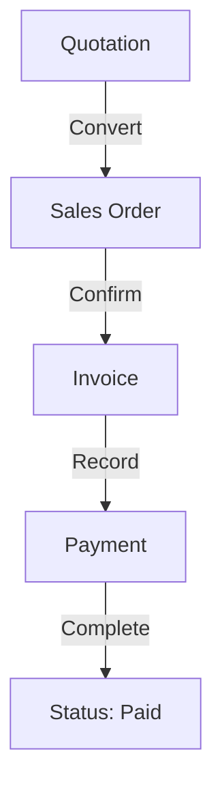

# 🔄 Appflow / Workflow Document - Zerpai ERP

**Last Updated:** 2026-05-15 13:25:00 IST
**Version:** 1.0 (Lifecycle Aligned)

---

## 1. Overall System Flow
- **Boot Sequence:** SharedPreferences -> Entity Resolution -> Hive Sync -> Dashboard.
- **Entry Points:** Named GoRouter routes with org-scoping.
- **Data Movement:** Flutter Form -> Riverpod State -> NestJS API -> Supabase DB.

---

## 2. Authentication Flow
- **Flow:** Login Screen (Planned) -> Credential Verification -> JWT Issue -> Secure Storage.
- **Session Expiry:** Auto-refresh tokens; redirect to login if refresh fails.
- **Dev Mode:** Auth currently bypassed for velocity; "Auth-Ready" architecture.

---

## 3. Module Specific Workflows

### 3.1 Sales Flow

### 3.2 Inventory Flow
- **Movement:** Request -> Approval -> Dispatch -> Receipt.
- **Adjustment:** Count -> Reason Entry -> Stock Update.

---

## 4. Approval & Automation Logic
- **Multi-level Approval:** (Planned V2) for large purchase orders.
- **Stock Alerts:** Trigger auto-draft POs when stock < Reorder Point.
- **Sync Logic:** Background Hive-to-API synchronization with conflict resolution.

---

## 5. Notification Flow
- **Trigger:** Document Save/Confirm.
- **Channels:** WhatsApp (Retail), Email (B2B), Push (Staff Alerts).
- **Format:** PDF Attachment + Short CTA message.

---

## 6. Error & Recovery Flow
- **Failure Condition:** API Timeout.
- **Recovery:** Retry with Exponential Backoff; fallback to Hive Local Cache.
- **Conflict:** "Merge Mine" vs "Use Server" user prompt.

---

## 7. Business Rules
- **Tax Rules:** Auto-calculate CGST/SGST vs IGST based on Place of Supply.
- **Pricing Rules:** Branch Price List > Customer Price List > Global Price.
- **Tenancy Rules:** All business data MUST have a valid `entity_id`.

---

## Strict Structure + Handoff Merge Governance (2026-05-24)

1. Canonical placement mandatory:
- Business code -> `lib/modules/<domain>/...`
- App infra -> `lib/core/...` or `lib/app/...`
- Cross-domain reusable UI -> `lib/shared/widgets/...`
- Cross-domain services -> `lib/shared/services/...`

2. File/folder creation controls:
- Confirm owner domain before creating files/folders.
- No new legacy roots or ambiguous sink files/folders.
- New `shared/` items require real cross-domain reuse justification.

3. Incoming handoff merge protocol:
- Backup first: `backups/refactor-batches/<timestamp>-<scope>/`.
- Map every inbound file/folder to canonical destination before merge.
- Use compatibility shims for moved active paths until import-zero proof.
- No destructive delete in same batch as move/rewire.

4. Mandatory verification gates:
- Frontend touched -> `dart analyze` touched scope.
- Backend touched -> `npm.cmd run build` in `backend/`.
- Route/deeplink-affecting changes -> route smoke checks.

5. Mandatory audit trail:
- Update root `log.md` with moved files, shim status, verifications, risks.
- Keep handoff backups/handoff folders until explicit approval to delete.

6. Auto-reject merge if any true:
- analyze/build failures,
- unresolved ownership ambiguity,
- schema/DTO drift vs `current schema.md`,
- route regression without safe fallback.
