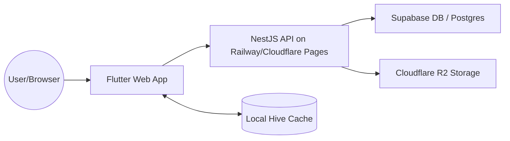

# 🛠️ Technical Requirements Document (TRD) - Zerpai ERP

**Last Updated:** 2026-05-15 13:00:00 IST
**Version:** 2.1 (Lifecycle Aligned)

---

## 1. Technical Overview
### 1.1 Architecture Summary
- **Backend:** NestJS (Node.js/TypeScript) monolithic API on Railway/Cloudflare Pages.
- **Frontend:** Flutter (Web/Android/iOS) for multi-platform delivery.
- **Database:** Supabase (PostgreSQL) + Drizzle ORM.
- **State Management:** Riverpod for granular state synchronization.
- **Offline Storage:** Hive for high-performance client-side caching.

### 1.2 Design Philosophy
- **Offline-First:** Critical POS operations function without active internet.
- **Polymorphic Tenancy:** Data is scoped via a single `entity_id` to either Head Office or Branch.
- **Performance:** Sub-100ms UI response times for keyboard-driven data entry.

---

## 2. Tech Stack
- **Languages:** Dart, TypeScript, SQL.
- **Frontend:** Flutter, Dio, Riverpod, GoRouter, Hive.
- **Backend:** NestJS, Drizzle ORM, Class-Validator, Winston.
- **Infrastructure:** Supabase (DB/Auth), Railway/Cloudflare Pages (API Hosting), Cloudflare R2 (Object Storage).
- **CI/CD:** GitHub Actions.

---

## 3. System Architecture
### 3.1 High-Level Flow


### 3.2 Folder Structure & Naming Conventions
- **Frontend (Flutter):** 
    - `lib/core/`: Infrastructure (routing, theme).
    - `lib/shared/`: Reusable components/services.
    - `lib/modules/`: Feature-specific code.
    - **Naming:** `module_submodule_page.dart`.
- **Backend (NestJS):** 
    - `src/modules/`: Feature modules.
    - `src/common/`: Decorators, interceptors, filters.
    - `src/database/`: Drizzle schemas and migrations.

---

## 4. API Architecture
- **Protocol:** RESTful JSON API.
- **Version:** `/api/v1`.
- **Response Format:**
  ```json
  {
    "data": { ... },
    "meta": { "total": 120, "page": 1 }
  }
  ```
- **Error Handling:** Centralized NestJS `ExceptionFilter` returning standard status codes and error messages.

---

## 5. Database Design
### 5.1 Tenancy & Relationships
- **Scoping:** Business records (Invoices, Receipts) use `entity_id` (FK to `organisation_branch_master`).
- **Global Data:** Products, Categories, and Master lookups are shared across all tenants.
- **Normalization:** 3NF approach for core business tables; selective denormalization for POS performance.

### 5.2 Scalability Plan
- **Horizontal Scaling:** Railway/Cloudflare Pages auto-scales API instances.
- **Connection Pooling:** Managed via Supabase for high-concurrency DB access.
- **Storage Scaling:** Cloudflare R2 handles unlimited asset growth.

---

## 6. Security Standards
- **Encryption:** SSL/TLS for transit; AES-256 for data at rest.
- **Authorization:** Supabase RLS (Row Level Security) enforced via `entity_id`.
- **Authentication:** JWT-based flow (Auth-Ready, currently disabled for dev velocity).
- **Secrets:** Managed via Railway/Cloudflare Pages/GitHub Environment Secrets.

---

## 7. Logging & Monitoring
- **Backend Logging:** Winston for structured server logs and audit trails.
- **Frontend Monitoring:** Sentry for crash reporting and performance profiling.
- **Health Checks:** Railway/Cloudflare Pages and Supabase monitoring dashboards.

---

## 8. Testing Strategy
- **Unit Testing:** Services, providers, and utility logic.
- **Integration Testing:** API endpoint verification with test databases.
- **E2E Testing:** Playwright for critical Sales and Inventory browser-based flows.

---

## 9. Environment Variables
- **Required:**
    - `DATABASE_URL`: Supabase Postgres connection string.
    - `SUPABASE_URL` / `SUPABASE_KEY`: API access to Supabase.
    - `R2_ACCESS_KEY` / `R2_SECRET_KEY`: Storage bucket credentials.
    - `RAZORPAY_SECRET`: (Planned) Payment integration.


---

## Strict Structure + Handoff Merge Governance (2026-05-24)

1. Canonical placement mandatory:
- Business code -> `lib/modules/<domain>/...`
- App infra -> `lib/core/...` or `lib/app/...`
- Cross-domain reusable UI -> `lib/shared/widgets/...`
- Cross-domain services -> `lib/shared/services/...`

2. File/folder creation controls:
- Confirm owner domain before creating files/folders.
- No new legacy roots or ambiguous sink files/folders.
- New `shared/` items require real cross-domain reuse justification.

3. Incoming handoff merge protocol:
- Backup first: `backups/refactor-batches/<timestamp>-<scope>/`.
- Map every inbound file/folder to canonical destination before merge.
- Use compatibility shims for moved active paths until import-zero proof.
- No destructive delete in same batch as move/rewire.

4. Mandatory verification gates:
- Frontend touched -> `dart analyze` touched scope.
- Backend touched -> `npm.cmd run build` in `backend/`.
- Route/deeplink-affecting changes -> route smoke checks.

5. Mandatory audit trail:
- Update root `log.md` with moved files, shim status, verifications, risks.
- Keep handoff backups/handoff folders until explicit approval to delete.

6. Auto-reject merge if any true:
- analyze/build failures,
- unresolved ownership ambiguity,
- schema/DTO drift vs `current schema.md`,
- route regression without safe fallback.
