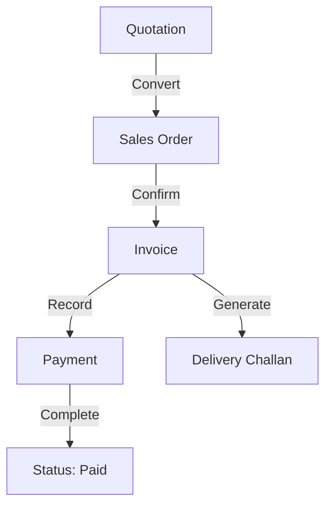
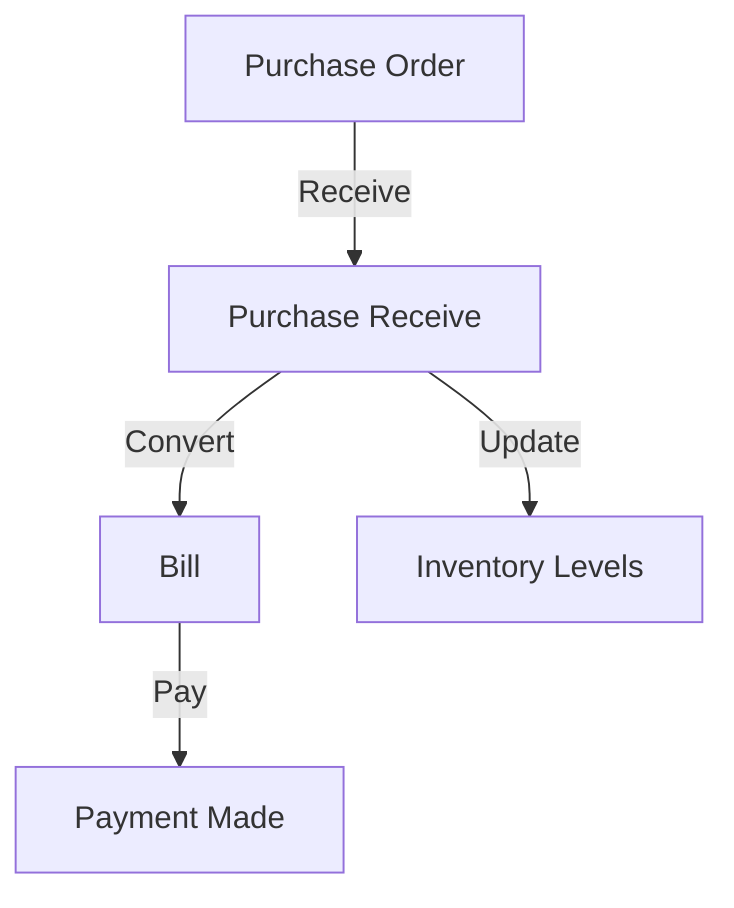

# 🔄 Appflow & Operational Workflows - Zerpai ERP

**Last Updated:** 2026-05-15 13:10:00 IST
**Version:** 2.1 (Lifecycle Aligned)

---

## 1. System Navigation & Lifecycle

### 1.1 Application Boot Flow
1. **Initialize**: App boots, reads local config from `shared_preferences`.
2. **Context Resolution**: Identifies active `entityId` and `orgSystemId` from URL or local cache.
3. **Master Data Sync**: Background sync of `products`, `customers`, and `vendors` to Hive.
4. **Dashboard Render**: Displays active branch metrics.

### 1.2 Authentication & Authorization Flow
- **Login:** (Planned) Supabase Auth screen -> Credential check -> JWT issued.
- **Session Persistence:** JWT stored in secure storage; auto-refresh logic.
- **Access Control:** User `entity_id` and `role` injected into state; GoRouter guards restrict navigation.
- **Auth-Free Exception:** During dev, all guards are bypassed.

### 1.3 Page Lifecycle Standard
- **initState**: Start loading state, trigger providers.
- **Data Fetch**: Concurrent fetch from Hive (fast) and API (fresh).
- **Stream/Notify**: UI updates as data arrives.
- **Interaction**: Local state changes (dirty flag).
- **Save**: Validation -> API Call -> Update Hive -> Success Feedback.

---

## 2. Core Business Workflows

### 2.1 Sales Lifecycle
The sales flow is the primary revenue driver of the system.

### 2.2 Purchase Lifecycle
The purchase flow manages stock acquisition and vendor liabilities.

---

## 3. Inventory & Stock Movements

### 3.1 Transfer Order Flow (Branch-to-Branch)
1. **Request**: Branch A creates a Transfer Order (Type: Request).
2. **Dispatch**: HO/Source Branch approves and dispatches stock.
3. **Transit**: Stock is "In-Transit" (Accounting stock reduced from source).
4. **Receive**: Branch A confirms receipt. Physical stock updated.

### 3.2 Inventory Adjustment
- **Reason-Based**: Cycle Count, Damage, Theft, or Opening Balance.
- **Approval**: Large adjustments require manager approval (V2).

---

## 4. Price List Logic

### 4.1 Pricing Hierarchy
When an item is added to a transaction (Sales Order/Invoice):
1. **Check Customer**: Does the customer have a specific Price List assigned?
2. **Check Branch**: Does the active branch have a Price List override?
3. **Check Global**: Use the global selling price from the `products` table.
4. **Apply Volume Tiers**: If "Volume Pricing" is enabled, adjust rate based on line-item quantity.

---

## 5. Approval & Automation Flows

### 5.1 Approval Workflows
- **Sales/Purchase**: Draft -> Pending Approval -> Confirmed.
- **Credit Limits**: Block invoice generation if customer exceeds credit limit (requires override).

### 5.2 Automation Logic
- **Stock Alerts**: Auto-generate PO Drafts when stock falls below reorder points.
- **Notifications**: Send WhatsApp/Email on invoice generation.

### 5.3 Notification & Communication Flow
- **Email:** Triggered on Invoice/PO completion; PDF attachment included.
- **WhatsApp:** Automated message with "View Invoice" link for retail customers.
- **Push Notifications:** Alerts for low stock and pending approval requests.

---

## 6. Edge Cases & Error States

### 6.1 Connectivity Issues
- **POS Mode**: Allows billing while offline; stores in `Hive` drafts.
- **Sync Conflict**: If data was modified on another device, user is prompted to "Keep Mine" or "Sync Server".

### 6.2 Data Integrity
- **Concurrency**: Version check on saves to prevent overwriting parallel edits.
- **Deletion**: Soft-delete strategy for all major entities to preserve audit trails.

---

## 7. State Transitions

### 7.1 Transaction States
- **Sales Order:** `Draft` -> `Confirmed` -> `Invoiced` -> `Closed`.
- **Purchase Order:** `Draft` -> `Sent` -> `Partially Received` -> `Received` -> `Billed`.
- **Transfer Order:** `Draft` -> `Pending Dispatch` -> `In-Transit` -> `Partially Received` -> `Received`.

### 7.2 Inventory Item States
- **Status:** `Active` -> `Inactive` -> `Archived`.
- **Stock Condition:** `Damaged` -> `Expired` -> `Under-Review`.

### 7.3 Payment States
- **Invoice/Bill:** `Unpaid` -> `Partially Paid` -> `Paid` -> `Overdue`.
- **Refund:** `Pending` -> `Processed`.

---

## 8. Data Movement & Processing
- **Input:** User entry via keyboard-optimized Flutter forms.
- **Processing:** 
    - Frontend: Tax calculation, discount application, rounding.
    - Backend: Entity scoping, uniqueness checks, audit logging.
- **Storage:** Persistent save to Supabase (primary) and Hive (cache).
- **Output:** PDF invoice, Excel reports, real-time dashboard metrics.

---

## Strict Structure + Handoff Merge Governance (2026-05-24)

1. Canonical placement mandatory:
- Business code -> `lib/modules/<domain>/...`
- App infra -> `lib/core/...` or `lib/app/...`
- Cross-domain reusable UI -> `lib/shared/widgets/...`
- Cross-domain services -> `lib/shared/services/...`

2. File/folder creation controls:
- Confirm owner domain before creating files/folders.
- No new legacy roots or ambiguous sink files/folders.
- New `shared/` items require real cross-domain reuse justification.

3. Incoming handoff merge protocol:
- Backup first: `backups/refactor-batches/<timestamp>-<scope>/`.
- Map every inbound file/folder to canonical destination before merge.
- Use compatibility shims for moved active paths until import-zero proof.
- No destructive delete in same batch as move/rewire.

4. Mandatory verification gates:
- Frontend touched -> `dart analyze` touched scope.
- Backend touched -> `npm.cmd run build` in `backend/`.
- Route/deeplink-affecting changes -> route smoke checks.

5. Mandatory audit trail:
- Update root `log.md` with moved files, shim status, verifications, risks.
- Keep handoff backups/handoff folders until explicit approval to delete.

6. Auto-reject merge if any true:
- analyze/build failures,
- unresolved ownership ambiguity,
- schema/DTO drift vs `current schema.md`,
- route regression without safe fallback.
