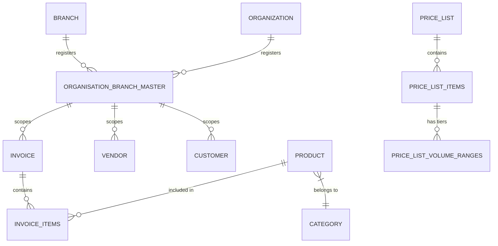

# 🗄️ Backend Schema & Database Design - Zerpai ERP

**Last Updated:** 2026-05-15 12:45:00 IST
**Version:** 2.0 (Relational Integrity & Tenancy)

---

## 1. Database Overview

Zerpai ERP utilizes **PostgreSQL** (hosted on Supabase) as its primary relational engine. **Drizzle ORM** serves as the schema definition and migration layer, ensuring type safety between the backend logic and the persistence layer.

### 1.1 Core Principles
- **Strict Tenancy**: Every business-owned record must reference a unique `entity_id`.
- **Global Masters**: Shared resources (Products, Units, Countries) have no `entity_id`.
- **Precision**: Financial values use `decimal` (numeric) types with 15,2 precision.
- **Auditability**: `created_at` and `updated_at` timestamps are mandatory for all tables.

---

## 2. Key Modules & Tables

### 2.1 Entity & Multi-Tenancy
- **`organization`**: Root organization details.
- **`branches`**: Physical/Logical locations under an organization.
- **`organisation_branch_master`**: The polymorphic registry that unifies Org and Branch IDs into a single `entity_id`.

### 2.2 Inventory Master (Global)
- **`products`**: The canonical product master (Item Name, SKU, HSN).
- **`categories`, `brands`, `manufacturers`**: Global lookup masters.
- **`units`, `uqc`**: Standardized measurement units.

### 2.3 Sales & Customers (Entity-Scoped)
- **`customers`**: Profiles scoped to `entity_id`.
- **`invoices`, `sales_orders`, `quotations`**: Transactional tables.
- **`invoice_items`**: Line items for sales transactions.

### 2.4 Purchases & Vendors (Entity-Scoped)
- **`vendors`**: Supplier profiles.
- **`purchase_orders`, `bills`, `purchase_receives`**: Procurement tracking.

### 2.5 Price Lists & Volume Pricing
- **`inventory_price_lists`**: Stores pricing strategies (Markup/Markdown) for global/HO use.
- **`inventory_price_list_items`**: Custom rates for specific items within a list.
- **`inventory_branch_price_list_mapping`**: Scopes price lists to specific branches and date ranges.
- **`price_list_volume_ranges`**: Tiered pricing based on quantity thresholds.

---

## 3. Tenancy Implementation

The system implements a **Unified Tenant Column** strategy:
```sql
ALTER TABLE invoices ADD COLUMN entity_id UUID NOT NULL REFERENCES organisation_branch_master(id);
```
- **Filter**: All repository queries must include `.where(eq(table.entityId, context.entityId))`.
- **Validation**: NestJS interceptors verify that the `entity_id` in the request header matches the user's allowed scope (Prod).

---

## 4. Schema Conventions

- **ID**: `uuid().primaryKey().defaultRandom()`.
- **Booleans**: Prefixed with `is_` (e.g., `is_active`, `is_deleted`).
- **Money**: `decimal("amount", { precision: 15, scale: 2 })`.
- **Timestamps**: `timestamp("created_at").defaultNow()`.
- **Naming**: Snake_case in DB, CamelCase in code.

---

## 5. ER Diagram (High Level)



---

## 6. Security & Integrity

- **Foreign Keys**: Enforced at the database level to prevent orphaned records.
- **Soft Delete**: `is_deleted` boolean used for data retention compliance.
- **Unique Constraints**: SKU and Item Codes are globally unique in the `products` table.

---

## 7. Middleware & Interceptors

### 7.1 Tenant Interceptor
- **Purpose:** Automatically extracts `x-entity-id` and `x-org-id` from request headers.
- **Action:** Injects the resolved `entityId` into the request context for use by the `@Tenant()` decorator.

### 7.2 Standard Response Interceptor
- **Purpose:** Wraps all successful responses in a consistent `{ data, meta }` structure.
- **Action:** Formats pagination metadata and transforms object keys to snake_case for DB-consistency.

### 7.3 Logging Middleware
- **Purpose:** Logs all incoming requests and outgoing response times for performance monitoring.

---

## 8. Error Handling Logic

### 8.1 Global Exception Filter
- **Purpose:** Catches all unhandled exceptions and returns a standardized JSON error response.
- **Structure:**
  ```json
  {
    "statusCode": 400,
    "message": "Custom error message",
    "error": "Bad Request",
    "timestamp": "2026-05-15T12:45:00.000Z"
  }
  ```

### 8.2 Validation Errors
- **Purpose:** Handles `class-validator` errors from DTOs.
- **Action:** Returns a `400 Bad Request` with an array of specific field validation failures.

### 8.3 Database Constraints
- **Purpose:** Gracefully handles Postgres unique constraint or foreign key violations.
- **Action:** Transforms low-level SQL errors into human-readable business messages (e.g., "SKU already exists").

---

---

## Strict Structure + Handoff Merge Governance (2026-05-24)

1. Canonical placement mandatory:
- Business code -> `lib/modules/<domain>/...`
- App infra -> `lib/core/...` or `lib/app/...`
- Cross-domain reusable UI -> `lib/shared/widgets/...`
- Cross-domain services -> `lib/shared/services/...`

2. File/folder creation controls:
- Confirm owner domain before creating files/folders.
- No new legacy roots or ambiguous sink files/folders.
- New `shared/` items require real cross-domain reuse justification.

3. Incoming handoff merge protocol:
- Backup first: `backups/refactor-batches/<timestamp>-<scope>/`.
- Map every inbound file/folder to canonical destination before merge.
- Use compatibility shims for moved active paths until import-zero proof.
- No destructive delete in same batch as move/rewire.

4. Mandatory verification gates:
- Frontend touched -> `dart analyze` touched scope.
- Backend touched -> `npm.cmd run build` in `backend/`.
- Route/deeplink-affecting changes -> route smoke checks.

5. Mandatory audit trail:
- Update root `log.md` with moved files, shim status, verifications, risks.
- Keep handoff backups/handoff folders until explicit approval to delete.

6. Auto-reject merge if any true:
- analyze/build failures,
- unresolved ownership ambiguity,
- schema/DTO drift vs `current schema.md`,
- route regression without safe fallback.
