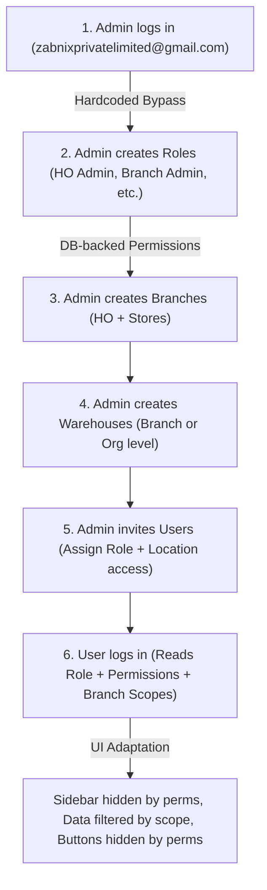

# Zerpai ERP — Roles, Permissions and Settings Visibility Plan

Status: ACTIVE PLAN — partially implemented in auth, users/roles runtime, and branch scoping.
Date: 2026-04-12

---

## PART 1 — CORE PRINCIPLES

1. ONE APP. HO staff and branch staff use the same Flutter app. Same login screen.
   UI adapts entirely based on the logged-in user's role.

2. ONE HARDCODED PLATFORM ROLE. Only one role path is hardcoded in the system:
   Email: zabnixprivatelimited@gmail.com
   Role: admin (God-mode — full platform bypass, developer/support access)
   This is the only role that is NOT managed through the Roles page.
   It is hardcoded in the backend. All other permissions come from DB-backed roles.

3. ALL OTHER ACCESS IS DB-DRIVEN. Every non-admin user is assigned either
   a default editable role (HO Admin / Branch Admin) or a custom role created
   through Settings > Roles. The org owner/admin defines permissions there and
   assigns those roles to users through Settings > Users.
   Non-admin runtime role behavior should not depend on seeded users; onboarding
   and permission assignment should be manageable entirely from Settings UI.

4. WAREHOUSES belong to either a branch OR the org directly. Both are valid.
   The branchId on a warehouse determines ownership. null = org-level warehouse.

5. BRANCH ACCESS IS EXPLICIT. Branch admin or other branch-scoped access is NOT
   inferred from branch creation email. It is assigned explicitly through
   Settings > Users and stored in branch/user access tables.

6. EVERY SCOPE OF PERMISSIONS is set from the Roles page.
   There are no hidden hardcoded permission rules (except admin bypass).
   What is checked, shown, enabled, or disabled — all comes from the roles.permissions
   JSON stored in the database and configured through the Roles UI.

7. CURRENT TABLE NAMES MUST MATCH THE RENAMED SCHEMA.
   Runtime code should use `branches`, `roles`, and `user_branch_access`
   instead of the older `settings_*` names already removed in DB.

---

## PART 2 — ORGANISATIONAL MODEL

```
Organisation (1)
  |
  |-- HO Branch (isPrimary: true)
  |     |-- HO Warehouse 1  (org-level or branch-level)
  |     |-- HO Warehouse 2
  |
  |-- Branch A  (e.g. Delhi Store)
  |     |-- Branch Warehouse A
  |
  |-- Branch B  (e.g. Mumbai Store)
  |     |-- Branch Warehouse B
  |
  |-- Branch C  (e.g. Pune Franchise)
        |-- Branch Warehouse C
```

Rules:

- One organisation. Fixed.
- HO is a branch (the primary one). It is operationally distinct — it procures
  from vendors and supplies other branches.
- Branches can have their own warehouses OR share org-level warehouses.
- A warehouse belongs to one branch OR to the org (not both). branchId is
  nullable — null means org-level warehouse.
- Branches may have a primary contact email set at creation time, but that does
  not grant access by itself. Actual access is assigned through users/roles.

---

## PART 3 — ROLE SYSTEM

### 3.1 The Only Hardcoded Role: admin

Email: zabnixprivatelimited@gmail.com
Role key: admin
Permissions: { "full_access": true }
Scope: Full platform bypass. Sees everything. Can do everything.
Used by Zerpai developers and support staff only.
Never created or managed through the UI.
Hardcoded in backend auth service.

### 3.2 Roles Managed Through Settings > Roles

Current runtime model:

- `admin` remains the only hardcoded platform-bypass role.
- `HO Admin` and `Branch Admin` exist as editable default DB-backed roles.
- Additional custom roles are DB rows in `roles` and are identified by UUID.

When the system is first set up for an org, the admin seeds the initial
roles. After that, the org owner manages them independently through
Settings > Roles.

Suggested starting roles (these are just suggestions — the owner decides):

Role Name Suggested Use

---

HO Admin Head office manager — org-wide access, all modules
Branch Admin Branch manager — scoped to their branch
Branch Staff Frontline staff — limited day-to-day transactions only
Accountant Finance staff at HO — journals, reports, CoA
Procurement Purchasing staff at HO — POs, vendors, receives

The owner can create any role with any name and configure exactly which
permissions that role has using the Roles page.

### 3.3 Role Assignment

Users are created/invited via Settings > Users.
Each user is assigned:

- A role (selected from the roles created in Roles page)
- One or more branch/warehouse assignments (Restrict Access To panel)
- A default business location
- A default warehouse location

This determines what data the user can see and interact with.

---

## PART 4 — SETTINGS PAGE STRUCTURE

The settings page (All Settings) has two level categories:
ORGANISATION SETTINGS and MODULE SETTINGS.

Currently visible sections (from the live app screenshots):

ORGANISATION SETTINGS
Organisation
Profile
Branding
Branches
Warehouses
Approvals
Manage Subscription
Users and Roles
Users
Roles
User Preferences
Taxes and Compliance
Setup and Configurations
Customisation
Automation

MODULE SETTINGS
General
Inventory
(and other modules)

### 4.1 Who sees what in Settings

The settings page does NOT change its structure based on role.
Settings is accessed by admins/owners who have the relevant permissions.
Access to settings sections is controlled via RBAC like all other pages.

Roles with no settings permissions: they simply do not see the Settings
menu item or any settings pages at all. The sidebar Settings link is hidden.

Only users whose role includes settings-level permissions (general_prefs,
users_roles, taxes, etc.) will see the Settings area.

### 4.2 Branch Profile View for Branch-Scoped Users

When a user whose role is scoped to a specific branch logs in, they do NOT
see the full org settings. Instead, if their role grants location management
permission, they see only their own branch details in a read-only Branch Profile
page. An Edit button (if their role has edit permission) opens edit mode.

This is a separate page rendered when:

- User has a branch assignment (accessibleBranchIds is set)
- User's role does NOT have full org-level settings access
- User navigates to settings

What they see:
My Branch > Branch Profile (read-only or editable based on role)
Locations > Warehouses (own branch only)
Locations > Zones and Bins (own branch only)
Team > Users (own branch users only)

---

## PART 5 — USER INVITATION AND LOCATION ASSIGNMENT

As seen in the app screenshots (Settings > Users > new):

Fields on the user creation form:

- Full Name (text field)
- Email Address (required)
- Role (dropdown — lists all roles from Roles page)
- Restrict Access To > Locations tab:
  - User's Default Business Location (dropdown)
  - User's Default Warehouse Location (dropdown)
  - Location assignment list (branches and warehouses listed with checkboxes)
  - Associated Values panel (shows selected locations)

How location assignment works:

- The location list shows ALL branches and ALL warehouses
- Admin assigns which branches/warehouses the user can access
- WH badge indicates a warehouse entry; no badge = branch entry
- Selected entries appear in the Associated Values panel
- Default Business Location = which branch their sales/purchases default to
- Default Warehouse Location = which warehouse their inventory defaults to

This means:

- HO Admin: assigned to all branches or no restriction (sees everything)
- Branch Admin: assigned to their branch + their branch's warehouse(s) only
- Branch Staff: assigned to their branch only
- Procurement staff: assigned to HO branch + HO warehouses

---

## PART 6 — ROLES PAGE AND PERMISSION STRUCTURE

### 6.1 Roles List Page (Settings > Roles)

Shows a table:
Columns: Role Name | Description | Users (count)
Each role row is clickable to edit
"New Role" button at top right

DEFAULT badge shown on system-seeded roles.

### 6.2 Role Edit/Create Page (Settings > Roles > [role]/edit)

Sections:
GENERAL INFORMATION
Role Name (text input, required)
Description (text area)

SEGMENTED ACCESS CONTROL
Permission sections — one per module group:
CONTACTS
Customers [Full] [View] [Create] [Edit] [Delete] [Approve] [More Permissions]
Vendors [Full] [View] [Create] [Edit] [Delete] [More Permissions]
Sub-row: Allow users to add, edit and delete vendor bank account details (checkbox)

      ITEMS
        Item            [Full] [View] [Create] [Edit] [Delete]          [More Permissions]
        Composite Items [Full] [View] [Create] [Edit] [Delete]
        Transfer Orders [Full] [View] [Create] [Edit] [Delete] [Approve]
        Inventory Adj.  [Full] [View] [Create] [Edit] [Delete]

      SALES
        Sales Orders        [Full] [View] [Create] [Edit] [Delete] [Approve]
        Invoices            [Full] [View] [Create] [Edit] [Delete]            [More Permissions]
        Customer Payments   [Full] [View] [Create] [Edit] [Delete]
        Credit Notes        [Full] [View] [Create] [Edit] [Delete]
        Packages            [Full] [View] [Create] [Edit] [Delete]
        Sales Shipments     [Full] [View] [Create] [Edit] [Delete]
        Retainer Invoices   [Full] [View] [Create] [Edit] [Delete]
        Sales Returns       [Full] [View] [Create] [Edit] [Delete]

      PURCHASES
        Purchase Orders     [Full] [View] [Create] [Edit] [Delete]
        Bills               [Full] [View] [Create] [Edit] [Delete]
        Vendor Payments     [Full] [View] [Create] [Edit] [Delete]
        Vendor Credits      [Full] [View] [Create] [Edit] [Delete]
        Purchase Receives   [Full] [View] [Create] [Edit] [Delete]

      ACCOUNTANT / LOCATIONS / TASKS
        Chart of Accounts   [Full] [View] [Create] [Edit] [Delete]
        Manual Journals     [Full] [View] [Create] [Edit] [Delete]
        Location Management [Full] [View] [Create] [Edit] [Delete]
        Projects / Tasks    [Full] [View] [Create] [Edit] [Delete]

      SETTINGS AND COMPLIANCE (toggle/checkbox style — single access flag each)
        General Preferences
        Communication
        Incoming Webhook
        Users and Roles
        Taxes
        Currencies
        Templates
        Automation
        e-Way Bill Settings

      ADDITIONAL SECTIONS (toggle style)
        Documents
        Dashboard Charts
        e-Way Bill Permissions

      REPORTS (category-based)
        Category        [Full Access] [View] [Export] [Schedule] [Share]
        Sales
        Inventory
        Receivables
        Payables
        Purchases and Expenses
        Taxes
        Activity

Buttons at bottom: [Proceed] [Cancel]

### 6.3 The "Full" Checkbox

When "Full" is checked for a row, all other actions (View, Create, Edit, Delete,
Approve) are automatically checked. Unchecking Full reverts to granular control.

### 6.4 "More Permissions" Drawer

Additional permissions for certain modules:
Customers > More Permissions:
Import Customers
Export Customers
Request review from customers
Bulk Update

Vendors > More Permissions:
Import Vendors
Export Vendors
Bulk Update

Item > More Permissions:
Import Items
Export Items
Adjust Stock

Invoices > More Permissions:
Import Invoices
Export Invoices
Write-off Invoices

---

## PART 7 — SUGGESTED DEFAULT ROLE CONFIGURATIONS

These are starting-point permission JSONs. The owner adjusts them from the
Roles page at any time. None of these are hardcoded except admin.

---

## PART 8 — CODE-DERIVED MODULE PERMISSION MATRIX (ACTIVE)

The code-derived module/action permission rollout matrix is maintained in:

- [docs/auth/MODULE_PERMISSION_MATRIX_PLAN.md](E:/zerpai-new/docs/auth/MODULE_PERMISSION_MATRIX_PLAN.md)

Use that file as the execution source for:

- adding missing module keys to the Roles page
- expanding action-level UI gating across operational screens
- backend scope audit sequencing by module
- four-role end-to-end verification

### admin (HARDCODED — not in Roles page)

```json
{ "full_access": true }
```

### HO Admin (suggested default — owner configures this)

Full access to all operational modules + financial modules + reports.
No branch scoping — sees all branches.
Can access Settings sections as configured.

```json
{
  "full_access": false,
  "customers": [
    "view",
    "create",
    "edit",
    "delete",
    "Import Customers",
    "Export Customers",
    "Bulk Update"
  ],
  "vendors": [
    "view",
    "create",
    "edit",
    "delete",
    "Import Vendors",
    "Export Vendors",
    "vendor_bank_details"
  ],
  "item": [
    "view",
    "create",
    "edit",
    "delete",
    "Import Items",
    "Export Items",
    "Adjust Stock"
  ],
  "composite_items": ["view", "create", "edit", "delete"],
  "transfer_orders": ["view", "create", "edit", "delete", "approve"],
  "inventory_adjustments": ["view", "create", "edit", "delete"],
  "price_list": ["view", "create", "edit", "delete", "approve"],
  "stock_counting": ["view", "create", "edit", "delete", "approve"],
  "sales_orders": ["view", "create", "edit", "delete", "approve"],
  "invoices": [
    "view",
    "create",
    "edit",
    "delete",
    "Import Invoices",
    "Export Invoices"
  ],
  "customer_payments": ["view", "create", "edit", "delete"],
  "credit_notes": ["view", "create", "edit", "delete"],
  "packages": ["view", "create", "edit", "delete"],
  "sales_shipments": ["view", "create", "edit", "delete"],
  "retainer_invoices": ["view", "create", "edit", "delete"],
  "sales_returns": ["view", "create", "edit", "delete"],
  "purchase_orders": ["view", "create", "edit", "delete", "approve"],
  "bills": ["view", "create", "edit", "delete"],
  "vendor_payments": ["view", "create", "edit", "delete"],
  "vendor_credits": ["view", "create", "edit", "delete"],
  "purchase_receives": ["view", "create", "edit", "delete"],
  "chart_of_accounts": ["view", "create", "edit"],
  "manual_journals": ["view", "create", "edit"],
  "locations": ["view", "create", "edit"],
  "tasks": ["view", "create", "edit"],
  "general_prefs": ["view"],
  "communication_prefs": ["view"],
  "users_roles": ["view"],
  "taxes": ["view"],
  "currencies": ["view"],
  "templates": ["view"],
  "documents": ["view", "create", "edit"],
  "dashboard_charts": ["view"],
  "ewaybill_perms": ["view"],
  "reports": { "full_access": true }
}
```

### Branch Admin (suggested default)

Scoped to their assigned branch via location assignment.
Full operational access for their branch. No accounting or org-wide reports.

```json
{
  "full_access": false,
  "customers": ["view", "create", "edit"],
  "vendors": ["view"],
  "item": ["view"],
  "composite_items": ["view"],
  "price_list": ["view"],
  "inventory_adjustments": ["view", "create", "edit"],
  "picklists": ["view", "create", "edit"],
  "packages": ["view", "create", "edit"],
  "stock_counting": ["view", "create"],
  "transfer_orders": ["view", "create"],
  "sales_orders": ["view", "create", "edit", "approve"],
  "invoices": ["view", "create", "edit"],
  "customer_payments": ["view", "create", "edit"],
  "credit_notes": ["view"],
  "sales_returns": ["view", "create"],
  "delivery_challans": ["view", "create", "edit"],
  "purchase_orders": ["view", "create", "edit", "approve"],
  "purchase_receives": ["view", "create", "edit"],
  "bills": ["view"],
  "vendor_payments": ["view"],
  "expenses": ["view", "create", "edit"],
  "documents": ["view"],
  "dashboard_charts": ["view"],
  "locations": ["view"]
}
```

### Branch Staff (suggested default)

Entry-level. Creates transactions but cannot approve, edit, or delete.

```json
{
  "full_access": false,
  "customers": ["view", "create"],
  "item": ["view"],
  "price_list": ["view"],
  "sales_orders": ["view", "create"],
  "invoices": ["view", "create"],
  "customer_payments": ["view", "create"],
  "sales_returns": ["view", "create"],
  "delivery_challans": ["view", "create"],
  "purchase_orders": ["view", "create"],
  "purchase_receives": ["view", "create"],
  "expenses": ["view", "create"],
  "dashboard_charts": ["view"]
}
```

### Accountant (suggested default — HO-level financial role)

Finance-focused. CoA, journals, reports. No sales/purchase transaction entry.

```json
{
  "full_access": false,
  "customers": ["view"],
  "vendors": ["view"],
  "item": ["view"],
  "chart_of_accounts": ["view", "create", "edit"],
  "manual_journals": ["view", "create", "edit"],
  "purchase_orders": ["view"],
  "bills": ["view", "create", "edit"],
  "vendor_payments": ["view", "create", "edit"],
  "customer_payments": ["view"],
  "invoices": ["view"],
  "dashboard_charts": ["view"],
  "taxes": ["view"],
  "reports": { "full_access": true }
}
```

### Procurement (suggested default — HO purchasing staff)

Raises and manages purchase orders to vendors. No sales or accounting.

```json
{
  "full_access": false,
  "vendors": [
    "view",
    "create",
    "edit",
    "Import Vendors",
    "Export Vendors",
    "vendor_bank_details"
  ],
  "item": ["view", "create", "edit", "Adjust Stock"],
  "transfer_orders": ["view", "create", "edit", "approve"],
  "inventory_adjustments": ["view", "create", "edit"],
  "purchase_orders": ["view", "create", "edit", "delete", "approve"],
  "purchase_receives": ["view", "create", "edit"],
  "bills": ["view", "create", "edit"],
  "vendor_payments": ["view"],
  "customers": ["view"],
  "dashboard_charts": ["view"]
}
```

---

## PART 8 — DATA SCOPING BY LOCATION ASSIGNMENT

A user's data visibility is controlled by TWO things:

1. Their role permissions (what they CAN do)
2. Their location assignment (what DATA they see)

The location assignment (set during user creation) is stored in
`user_branch_access` and populates `user.accessibleBranchIds` on the backend.

Every backend query for transactional data filters by:
branch_id IN user.accessibleBranchIds

| Data Type                          | Scoping Rule                            |
| ---------------------------------- | --------------------------------------- |
| Sales Orders, Invoices             | Filtered to user's assigned locations   |
| Delivery Challans, Sales Returns   | Filtered to user's assigned locations   |
| Customer Payments                  | Filtered to user's assigned locations   |
| Purchase Orders, Purchase Receives | Filtered to user's assigned locations   |
| Bills, Vendor Payments             | Filtered to user's assigned locations   |
| Expenses                           | Filtered to user's assigned locations   |
| Inventory stock, Adjustments       | Filtered to user's assigned warehouses  |
| Assemblies, Picklists, Packages    | Filtered to user's assigned warehouses  |
| Transfer Orders                    | Filtered to user's assigned locations   |
| Customers                          | Org-wide — no location filter           |
| Vendors                            | Org-wide — no location filter           |
| Items / Products                   | Global — no org or location filter      |
| Users visible                      | Only users sharing an assigned location |
| Reports                            | Filtered to user's assigned locations   |

A user assigned to ALL branches sees org-wide data.
A user assigned to one branch sees only that branch's data.
This is the mechanism — roles define permissions, assignments define data scope.

---

## PART 9 — ORGANISATIONAL & ROLE LIFECYCLE (SUMMARY)



1.  **System Admin Onboarding**: Only `zabnixprivatelimited@gmail.com` has hardcoded "God-mode" access.
2.  **Role Definition**: All other roles are defined in the UI. Roles like "HO Admin" or "Accountant" are just rows in the `roles` table with specific permission JSONs.
3.  **Branch Hierarchy**: The HO is the primary branch. Stores/Clinics are added as separate branches.
4.  **Warehouse Linkage**: Warehouses are associated with specific branches or the organization.
5.  **Targeted Invitations**: Users are invited to a specific organization. They get:
    - A **Role** (defining actions: view, create, edit, etc.)
    - **Location Assignments** (defining data scope: which branches/warehouses they see)
6.  **Authenticated Execution**: The app enforces these rules at runtime. There are no other hardcoded roles in the system.

---

## PART 10 — PAGES AND WINDOWS DEFINITION

NOTE: The actual page-level and button-level RBAC implementation details
(which exact pages use which permission keys, which buttons are gated by which
actions) will be defined in a separate implementation phase.

The plan for that phase:

- Each page will check the relevant permission key from the Roles page scheme
- Sidebar items are hidden if the user has no permissions for that module
- Create/Edit/Delete/Approve buttons are individually gated
- The Roles page scheme (role_permission_scheme.dart) defines the complete
  list of all permission keys — this is the master list

The current permission keys defined in the system (from role_permission_scheme.dart):

CONTACTS: customers, vendors, vendor_bank_details
ITEMS: item, composite_items, transfer_orders, inventory_adjustments,
price_list, stock_counting
SALES: sales_orders, invoices, customer_payments, credit_notes,
packages, sales_shipments, retainer_invoices, sales_returns
PURCHASES: purchase_orders, bills, vendor_payments, vendor_credits,
purchase_receives
ACCOUNTANT: chart_of_accounts, manual_journals, locations, tasks
SETTINGS: general_prefs, communication_prefs, incoming_webhook,
users_roles, taxes, currencies, templates, automation,
ewaybill_settings
ADDITIONAL: documents, dashboard_charts, ewaybill_perms
REPORTS: categories — Sales, Inventory, Receivables, Payables,
Purchases and Expenses, Taxes, Activity
actions per category — view, export, schedule, share

---

## PART 11 — WHAT IS NOT NEEDED

The following things from the earlier plan are REMOVED based on final decisions:

1. No fixed/hardcoded permission paths other than admin bypass.
   HO Admin and Branch Admin are still seeded as editable default roles in DB.

2. No org-level vs branch-level distinction in role names.
   The role name is whatever the admin/owner names it.
   Scope is determined entirely by location assignment, not role type.

3. No "branch staff cannot access accountant" hard rule in code.
   The owner decides which roles get accountant permissions via the Roles page.
   If they want a branch role to see journals, they can enable it.
   (Though the suggested Branch Admin and Branch Staff defaults do not include it.)

4. No separate "settings page context switching" by role.
   Settings access is controlled by permissions like any other page.
   Users without settings permissions simply do not see Settings in the sidebar.

5. No automatic branch assignment based on branch creation email.
   Branch contact email is just a profile field. User-to-branch assignment is
   done explicitly via Settings > Users > location assignment panel.

---

End of plan.
Current implementation status:

- Supabase-authenticated users receive DB-backed `permissions` in the auth payload.
- Default roles and UUID-backed custom roles are both resolved through the `roles` table.
- Non-admin users with assigned branch scope are restricted by `accessibleBranchIds`.
- Settings > Users and Settings > Roles are the source of truth for ongoing access management.

Next step:

- Finish replacing remaining legacy role-name UI checks with exact module/action permission checks.
- Continue the table-standardization wiring pass after each approved schema rename.

What's actually implemented vs what's pending
Implemented (confirmed in code)
Auth foundation: Supabase login, token validation, refresh, forgot-password — all working
Role resolution: admin hardcoded bypass, all other roles are DB-backed via roles table, UUID-based custom roles preserved
PermissionService.hasModuleAction() and withModulePermission() — infrastructure exists and is used in 18 files (53 call sites)
Sidebar gating: zerpai_sidebar.dart uses exact module/action checks
Settings area gating: Roles and Users pages gate off users_roles permission key
Some operational screens gated:
sales_order_overview.dart, sales_generic_list.dart — partial
purchase_orders_order_overview.dart, purchases_bills_list.dart
inventory_picklists_list.dart, inventory_packages_list.dart, inventory_shipments_list.dart
accountant_chart_of_accounts_overview.dart + creation
items report/detail sections
Backend tenant middleware: entity_id scope enforcement — now complete (just finished)
Branch profile page: exists (settings_branch_profile_page.dart)
Partially implemented
In-screen action-level gating: Only ~18 of ~100+ presentation files use permission checks. The majority of the module screens (purchases, inventory assemblies, accountant journals, reports, vendors, customers, etc.) have no hasModuleAction calls at all
Backend endpoint audit: The entity_id cutover is done, but the checklist notes several submodules still not audited for branch/warehouse scope enforcement at the API level
Genuinely pending (not yet done)
Item Status
In-screen action gating across remaining modules (purchases, vendors, customers, reports, accountant, inventory) Not started
End-to-end 4-role test matrix (admin + 3 DB roles) Not done
Branch-scoped settings visibility pass (branch user sees only their branch in settings) Not done
Granular "General Prefs" sub-module permission splitting Not done
Settings > Users / Roles propagation verification Not done
Logout / session UX confirmation Not done
The biggest gap: most operational screens let any logged-in user see and use all buttons regardless of their role. The permission infrastructure exists but is only wired up in ~18 files. The bulk of the work (expanding that gating to the remaining ~80+ screens) hasn't been done yet.
