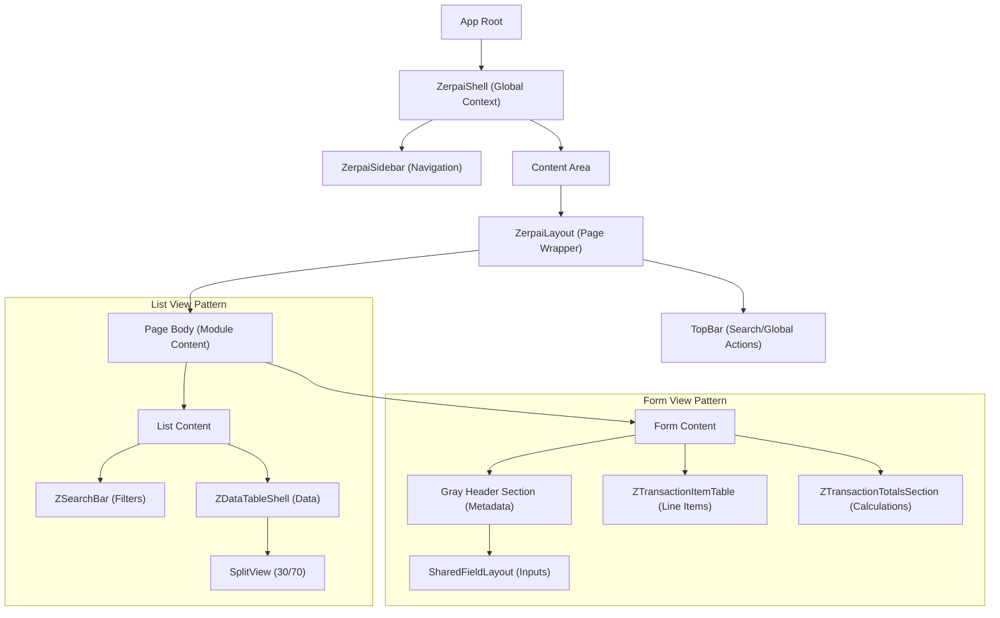
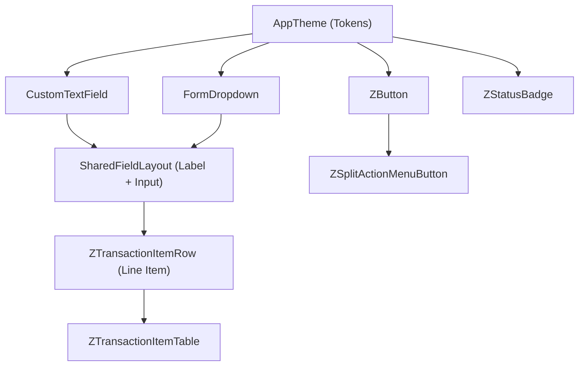
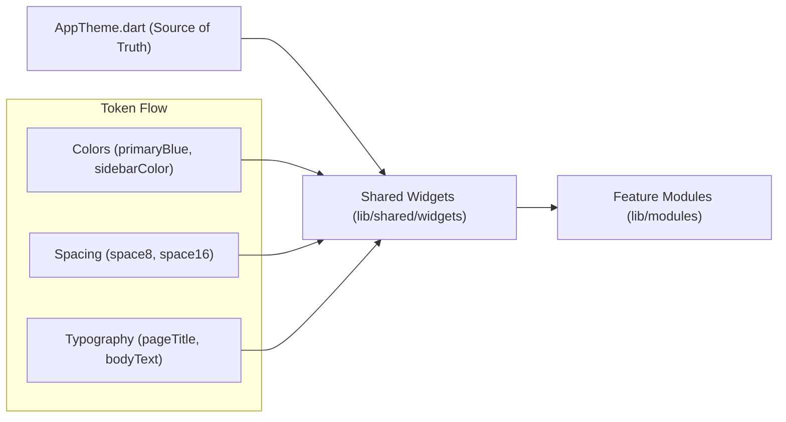
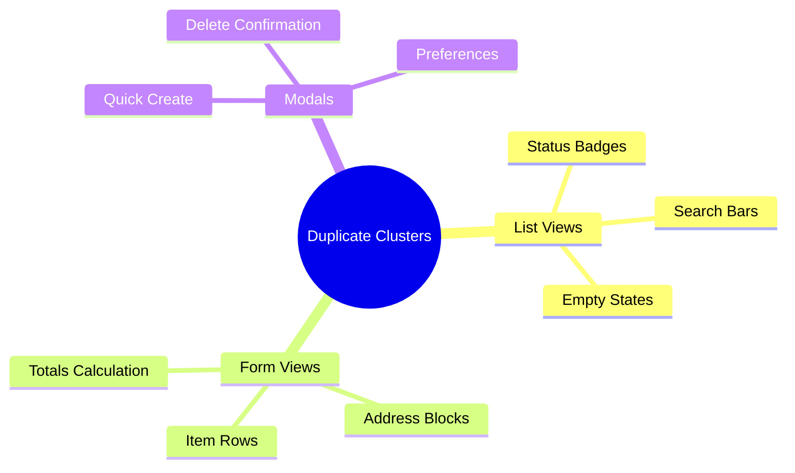

# 🏗️ Visual Architecture Mapping

This document provides a visual representation of the Zerpai ERP frontend architecture, documenting how layouts are composed, how components depend on each other, and how design tokens propagate through the system.

## 1. Layout Hierarchy
The following diagram illustrates the structural composition of a typical ERP screen.

## 2. Shared Widget Dependency Tree
This tree shows how core atomic widgets are composed into higher-order molecules and organisms.

## 3. Theme Dependency Flow
Tokens originate in the core and propagate outward to the presentation layer.

## 4. Reusable Component Usage Frequency
*Data based on architectural audit of `lib/modules`.*

| Component | Usage Frequency | Criticality |
| :--- | :--- | :--- |
| `ZButton` | **Extremely High** | Essential |
| `CustomTextField` | **Extremely High** | Essential |
| `FormDropdown` | **High** | Critical |
| `ZerpaiLayout` | **High** | Critical |
| `SharedFieldLayout`| **Medium** | Important |
| `ZerpaiDatePicker` | **Medium** | Important |
| `ZDataTableShell` | **High** | Critical |

## 5. Duplicate Component Clusters
These are areas where "clones" of logic exist across modules, representing prime refactoring targets.

## 6. Implementation Priorities
1. **Unify Status Badges**: Centralize the 5+ variants of status badges into `ZStatusBadge`.
2. **Abstract Item Rows**: Extract `SalesOrderItemRow` and `PurchaseOrderItemRow` into a shared `ZTransactionItemRow`.
3. **Standardize Search**: Replace module-level search bars with the high-fidelity `ZSearchBar`.
