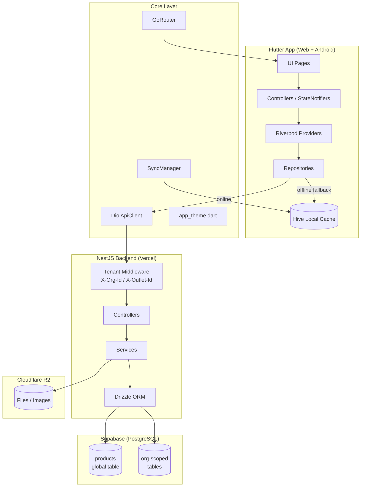
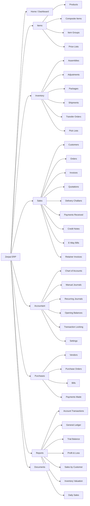
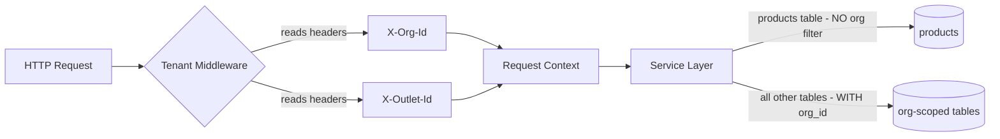
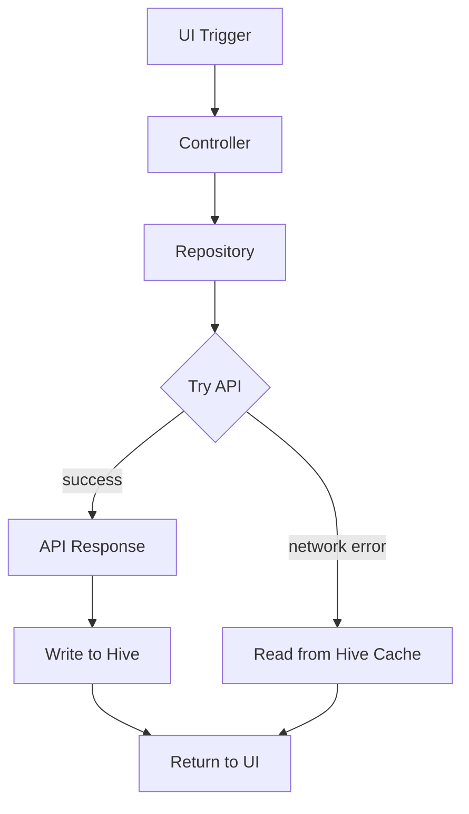

# System Overview — Zerpai ERP

## Full Architecture Flow

```mermaid
graph TD
    subgraph FLUTTER["Flutter App (Web + Android)"]
        UI[UI Pages]
        CTRL[Controllers / StateNotifiers]
        PROV[Riverpod Providers]
        REPO[Repositories]
        HIVE[(Hive Local Cache)]
    end

    subgraph CORE["Core Layer"]
        ROUTER[GoRouter]
        DIO[Dio ApiClient]
        THEME[app_theme.dart]
        SYNC[SyncManager]
    end

    subgraph BACKEND["NestJS Backend (Vercel)"]
        MW[Tenant Middleware\nX-Org-Id / X-Outlet-Id]
        CTRL_BE[Controllers]
        SVC[Services]
        DRIZZLE[Drizzle ORM]
    end

    subgraph DB["Supabase (PostgreSQL)"]
        GLOBAL[(products\nglobal table)]
        TENANT[(org-scoped\ntables)]
    end

    subgraph STORAGE["Cloudflare R2"]
        FILES[(Files / Images)]
    end

    UI --> CTRL
    CTRL --> PROV
    PROV --> REPO
    REPO -->|online| DIO
    REPO -->|offline fallback| HIVE
    DIO --> MW
    MW --> CTRL_BE
    CTRL_BE --> SVC
    SVC --> DRIZZLE
    DRIZZLE --> GLOBAL
    DRIZZLE --> TENANT
    SVC --> FILES
    SYNC --> HIVE
    ROUTER --> UI
```

## Module Tree

```mermaid
graph LR
    APP[Zerpai ERP]

    APP --> HOME[Home / Dashboard]
    APP --> ITEMS[Items]
    APP --> INVENTORY[Inventory]
    APP --> SALES[Sales]
    APP --> ACCOUNTANT[Accountant]
    APP --> PURCHASES[Purchases]
    APP --> REPORTS[Reports]
    APP --> DOCUMENTS[Documents]

    ITEMS --> ITEMS_P[Products]
    ITEMS --> ITEMS_C[Composite Items]
    ITEMS --> ITEMS_G[Item Groups]
    ITEMS --> ITEMS_PL[Price Lists]

    INVENTORY --> INV_A[Assemblies]
    INVENTORY --> INV_ADJ[Adjustments]
    INVENTORY --> INV_PKG[Packages]
    INVENTORY --> INV_SHP[Shipments]
    INVENTORY --> INV_TR[Transfer Orders]
    INVENTORY --> INV_PL[Pick Lists]

    SALES --> SALES_CX[Customers]
    SALES --> SALES_ORD[Orders]
    SALES --> SALES_INV[Invoices]
    SALES --> SALES_QT[Quotations]
    SALES --> SALES_DC[Delivery Challans]
    SALES --> SALES_PAY[Payments Received]
    SALES --> SALES_CN[Credit Notes]
    SALES --> SALES_EW[E-Way Bills]
    SALES --> SALES_RI[Retainer Invoices]

    ACCOUNTANT --> ACC_COA[Chart of Accounts]
    ACCOUNTANT --> ACC_MJ[Manual Journals]
    ACCOUNTANT --> ACC_RJ[Recurring Journals]
    ACCOUNTANT --> ACC_OB[Opening Balances]
    ACCOUNTANT --> ACC_TL[Transaction Locking]
    ACCOUNTANT --> ACC_SET[Settings]

    PURCHASES --> PUR_V[Vendors]
    PURCHASES --> PUR_PO[Purchase Orders]
    PURCHASES --> PUR_B[Bills]
    PURCHASES --> PUR_PAY[Payments Made]

    REPORTS --> RPT_AT[Account Transactions]
    REPORTS --> RPT_GL[General Ledger]
    REPORTS --> RPT_TB[Trial Balance]
    REPORTS --> RPT_PL[Profit & Loss]
    REPORTS --> RPT_SC[Sales by Customer]
    REPORTS --> RPT_IV[Inventory Valuation]
    REPORTS --> RPT_DS[Daily Sales]
```

## Multi-Tenancy Architecture

```mermaid
flowchart LR
    REQ[HTTP Request] --> MW{Tenant Middleware}
    MW -->|reads headers| ORG[X-Org-Id]
    MW -->|reads headers| OUT[X-Outlet-Id]
    ORG --> CTX[Request Context]
    OUT --> CTX
    CTX --> SVC[Service Layer]
    SVC -->|products table - NO org filter| GLOBAL[(products)]
    SVC -->|all other tables - WITH org_id| TENANT[(org-scoped tables)]
```

## Data Pattern — Online-First with Offline Fallback

```mermaid
flowchart TD
    UI[UI Trigger] --> CTRL[Controller]
    CTRL --> REPO[Repository]
    REPO --> TRY{Try API}
    TRY -->|success| API[API Response]
    API --> CACHE[Write to Hive]
    CACHE --> RETURN[Return to UI]
    TRY -->|network error| HIVE[Read from Hive Cache]
    HIVE --> RETURN
```
