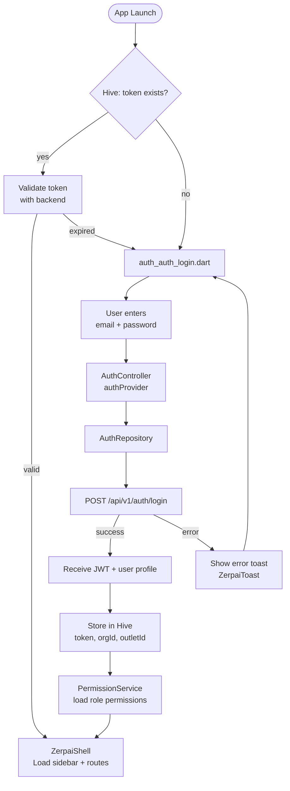
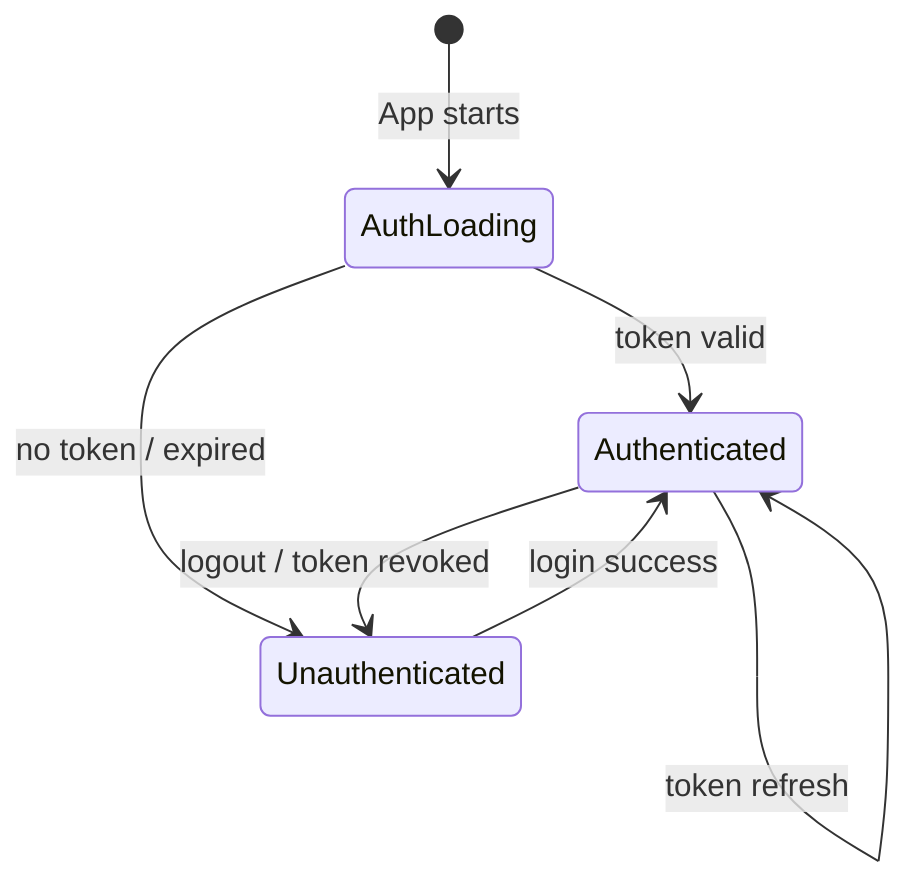
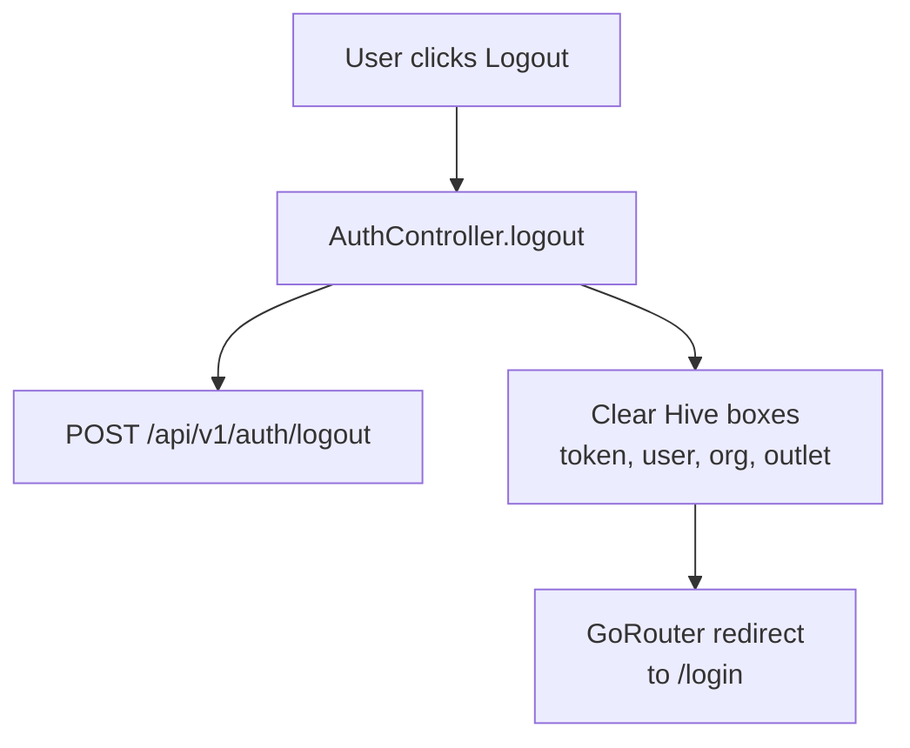
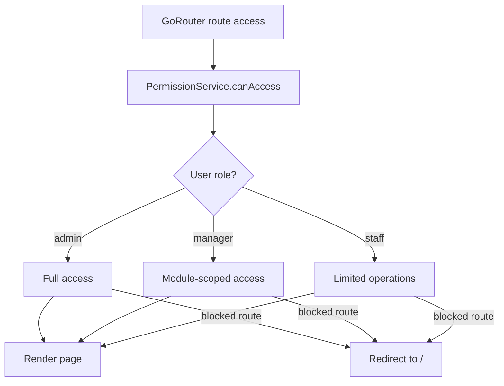
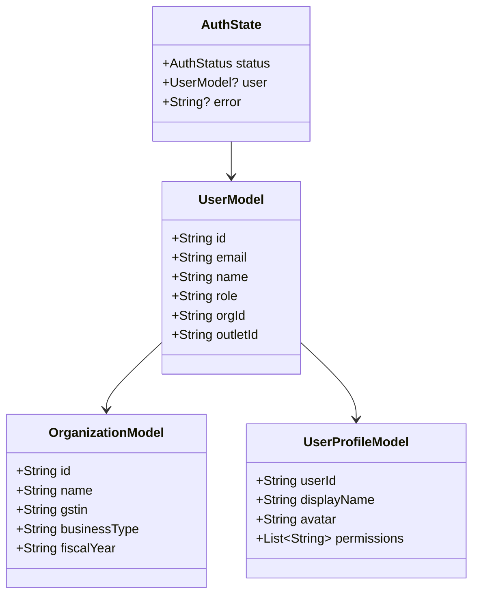

# Auth Module — Flow Diagrams

## Login Flow

```mermaid
flowchart TD
    START([App Launch]) --> CHECK{Hive: token exists?}
    CHECK -->|yes| VALIDATE[Validate token\nwith backend]
    CHECK -->|no| LOGIN_PAGE[auth_auth_login.dart]

    VALIDATE -->|valid| SHELL[ZerpaiShell\nLoad sidebar + routes]
    VALIDATE -->|expired| LOGIN_PAGE

    LOGIN_PAGE --> ENTER[User enters\nemail + password]
    ENTER --> AUTH_CTRL[AuthController\nauthProvider]
    AUTH_CTRL --> AUTH_REPO[AuthRepository]
    AUTH_REPO --> API[POST /api/v1/auth/login]
    API -->|success| JWT[Receive JWT + user profile]
    JWT --> STORE[Store in Hive\ntoken, orgId, outletId]
    STORE --> PERM[PermissionService\nload role permissions]
    PERM --> SHELL

    API -->|error| ERR[Show error toast\nZerpaiToast]
    ERR --> LOGIN_PAGE
```

## Auth State Machine

```mermaid
stateDiagram-v2
    [*] --> AuthLoading : App starts

    AuthLoading --> Authenticated : token valid
    AuthLoading --> Unauthenticated : no token / expired

    Unauthenticated --> Authenticated : login success
    Authenticated --> Unauthenticated : logout / token revoked

    Authenticated --> Authenticated : token refresh
```

## Logout Flow

```mermaid
flowchart TD
    USER[User clicks Logout] --> CTRL[AuthController.logout]
    CTRL --> API[POST /api/v1/auth/logout]
    CTRL --> HIVE[Clear Hive boxes\ntoken, user, org, outlet]
    HIVE --> NAV[GoRouter redirect\nto /login]
```

## Permission Guard Flow

```mermaid
flowchart TD
    ROUTE[GoRouter route access] --> GUARD[PermissionService.canAccess]
    GUARD --> ROLE{User role?}
    ROLE -->|admin| FULL[Full access]
    ROLE -->|manager| PARTIAL[Module-scoped access]
    ROLE -->|staff| LIMITED[Limited operations]
    FULL --> PAGE[Render page]
    PARTIAL --> PAGE
    LIMITED --> PAGE
    FULL -->|blocked route| REDIRECT[Redirect to /]
    PARTIAL -->|blocked route| REDIRECT
    LIMITED -->|blocked route| REDIRECT
```

## Data Models

```mermaid
classDiagram
    class AuthState {
        +AuthStatus status
        +UserModel? user
        +String? error
    }

    class UserModel {
        +String id
        +String email
        +String name
        +String role
        +String orgId
        +String outletId
    }

    class OrganizationModel {
        +String id
        +String name
        +String gstin
        +String businessType
        +String fiscalYear
    }

    class UserProfileModel {
        +String userId
        +String displayName
        +String avatar
        +List~String~ permissions
    }

    AuthState --> UserModel
    UserModel --> OrganizationModel
    UserModel --> UserProfileModel
```
