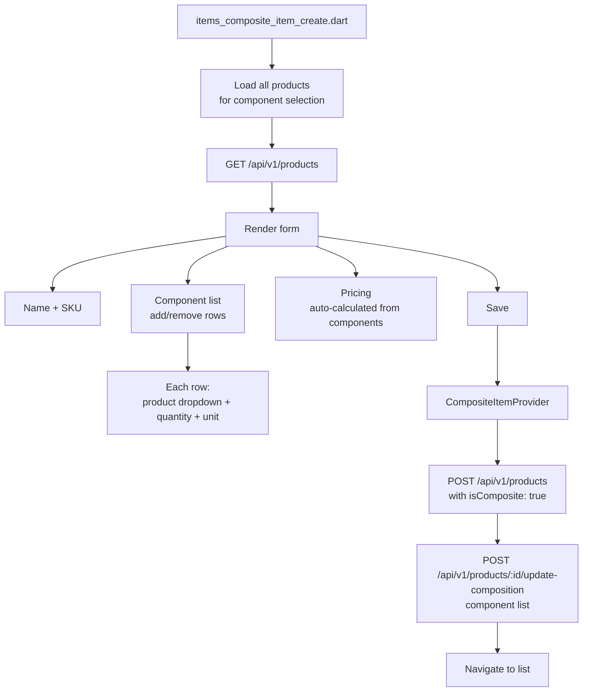
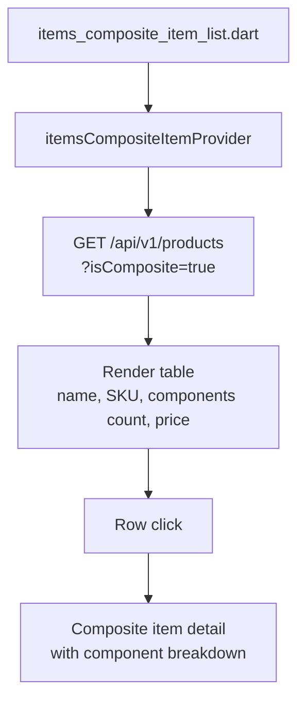
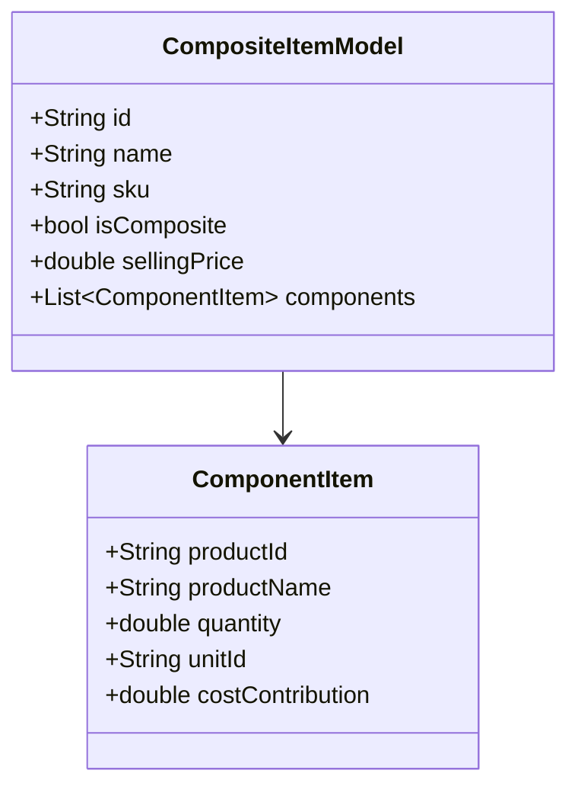

# Items — Composite Items Flow

## Composite Item Creation Flow

```mermaid
flowchart TD
    PAGE[items_composite_item_create.dart] --> LOAD[Load all products\nfor component selection]
    LOAD --> API_P[GET /api/v1/products]
    API_P --> FORM[Render form]

    FORM --> F1[Name + SKU]
    FORM --> F2[Component list\nadd/remove rows]
    F2 --> COMP[Each row:\nproduct dropdown + quantity + unit]
    FORM --> F3[Pricing\nauto-calculated from components]

    FORM --> SAVE[Save]
    SAVE --> CTRL[CompositeItemProvider]
    CTRL --> API[POST /api/v1/products\nwith isComposite: true]
    API --> COMP_API[POST /api/v1/products/:id/update-composition\ncomponent list]
    COMP_API --> NAV[Navigate to list]
```

## Composite Item List Flow

```mermaid
flowchart TD
    PAGE[items_composite_item_list.dart] --> PROV[itemsCompositeItemProvider]
    PROV --> API[GET /api/v1/products\n?isComposite=true]
    API --> TABLE[Render table\nname, SKU, components count, price]
    TABLE --> ROW_CLICK[Row click]
    ROW_CLICK --> DETAIL[Composite item detail\nwith component breakdown]
```

## Data Model

```mermaid
classDiagram
    class CompositeItemModel {
        +String id
        +String name
        +String sku
        +bool isComposite
        +double sellingPrice
        +List~ComponentItem~ components
    }

    class ComponentItem {
        +String productId
        +String productName
        +double quantity
        +String unitId
        +double costContribution
    }

    CompositeItemModel --> ComponentItem
```
