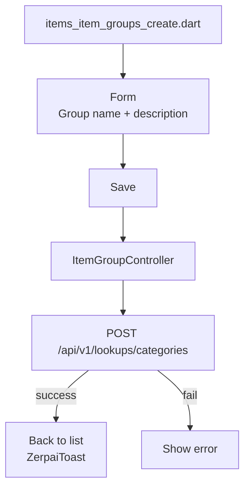
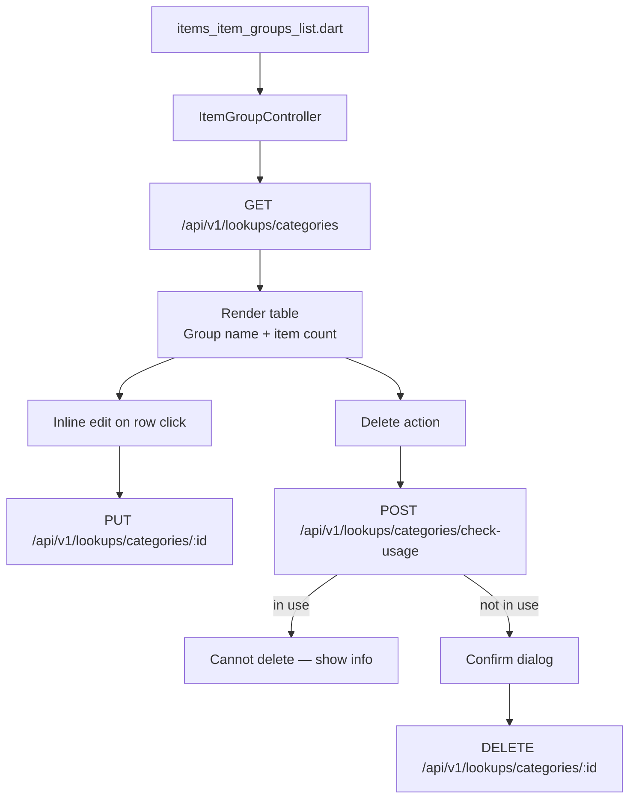
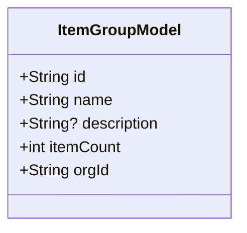

# Items — Item Groups Flow

## Item Group Create Flow

```mermaid
flowchart TD
    PAGE[items_item_groups_create.dart] --> FORM[Form\nGroup name + description]
    FORM --> SAVE[Save]
    SAVE --> CTRL[ItemGroupController]
    CTRL --> API[POST /api/v1/lookups/categories]
    API -->|success| LIST[Back to list\nZerpaiToast]
    API -->|fail| ERR[Show error]
```

## Item Group List Flow

```mermaid
flowchart TD
    PAGE[items_item_groups_list.dart] --> CTRL[ItemGroupController]
    CTRL --> API[GET /api/v1/lookups/categories]
    API --> TABLE[Render table\nGroup name + item count]
    TABLE --> INLINE[Inline edit on row click]
    INLINE --> UPDATE[PUT /api/v1/lookups/categories/:id]

    TABLE --> DELETE[Delete action]
    DELETE --> CHECK[POST /api/v1/lookups/categories/check-usage]
    CHECK -->|in use| BLOCK[Cannot delete — show info]
    CHECK -->|not in use| CONFIRM[Confirm dialog]
    CONFIRM --> DEL_API[DELETE /api/v1/lookups/categories/:id]
```

## Data Model

```mermaid
classDiagram
    class ItemGroupModel {
        +String id
        +String name
        +String? description
        +int itemCount
        +String orgId
    }
```
