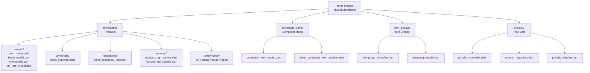
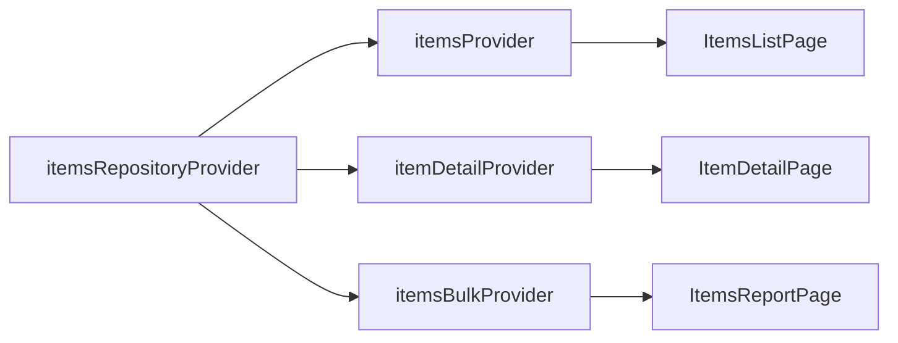

# Items Module — Overview

## Module Structure

```mermaid
graph TD
    ITEMS[Items Module\nlib/modules/items/]

    ITEMS --> PRODS[items/items/\nProducts]
    ITEMS --> COMP[composite_items/\nComposite Items]
    ITEMS --> GROUPS[item_groups/\nItem Groups]
    ITEMS --> PLIST[pricelist/\nPrice Lists]

    PRODS --> PRODS_M[models/\nitem_model.dart\nbatch_model.dart\nunit_model.dart\ntax_rate_model.dart]
    PRODS --> PRODS_C[controllers/\nitems_controller.dart]
    PRODS --> PRODS_R[repositories/\nitems_repository_impl.dart]
    PRODS --> PRODS_S[services/\nproducts_api_service.dart\nlookups_api_service.dart]
    PRODS --> PRODS_P[presentation/\nlist / create / detail / report]

    COMP --> COMP_M[composite_item_model.dart]
    COMP --> COMP_PR[items_composite_item_provider.dart]

    GROUPS --> GRP_C[itemgroup_controller.dart]
    GROUPS --> GRP_M[itemgroup_model.dart]

    PLIST --> PL_C[pricelist_controller.dart]
    PLIST --> PL_R[pricelist_repository.dart]
    PLIST --> PL_S[pricelist_service.dart]
```

## Riverpod Provider Graph

```mermaid
graph LR
    itemsRepositoryProvider --> itemsProvider
    itemsRepositoryProvider --> itemDetailProvider
    itemsRepositoryProvider --> itemsBulkProvider
    itemsProvider --> ItemsListPage
    itemDetailProvider --> ItemDetailPage
    itemsBulkProvider --> ItemsReportPage
```
