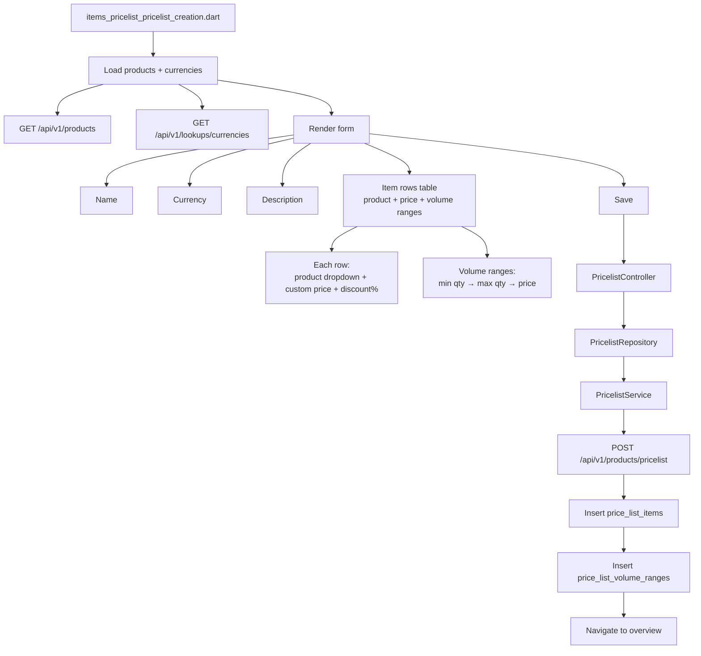
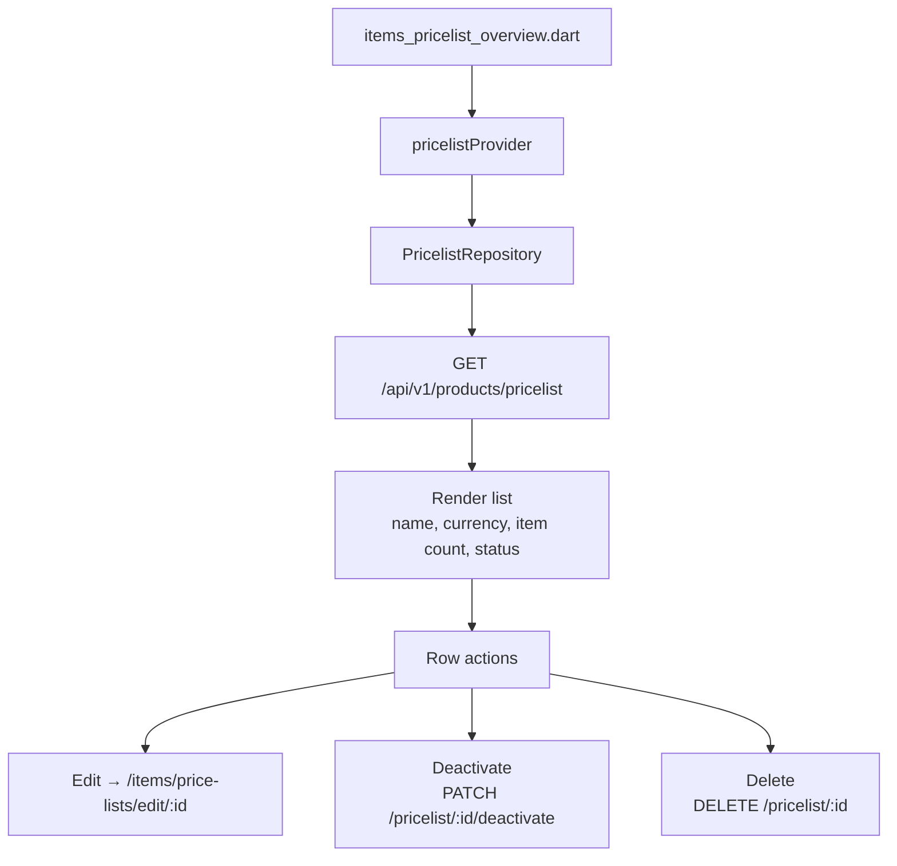
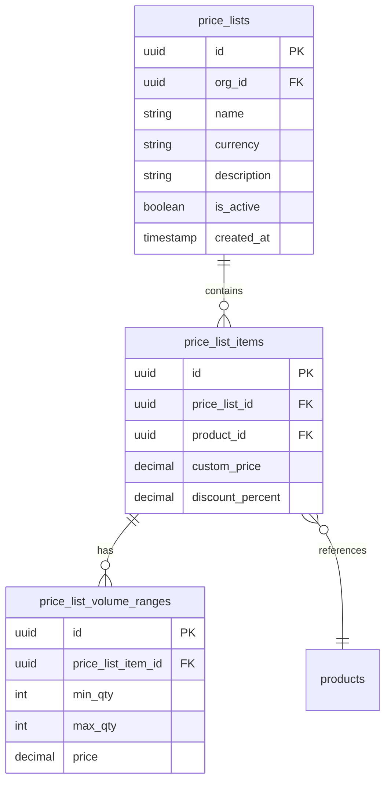

# Items — Price Lists Flow

## Price List Creation Flow

```mermaid
flowchart TD
    PAGE[items_pricelist_pricelist_creation.dart] --> LOAD[Load products + currencies]
    LOAD --> API1[GET /api/v1/products]
    LOAD --> API2[GET /api/v1/lookups/currencies]

    LOAD --> FORM[Render form]
    FORM --> F1[Name]
    FORM --> F2[Currency]
    FORM --> F3[Description]
    FORM --> F4[Item rows table\nproduct + price + volume ranges]
    F4 --> ROWS[Each row:\nproduct dropdown + custom price + discount%]
    F4 --> VOL[Volume ranges:\nmin qty → max qty → price]

    FORM --> SAVE[Save]
    SAVE --> CTRL[PricelistController]
    CTRL --> REPO[PricelistRepository]
    REPO --> SVC[PricelistService]
    SVC --> API[POST /api/v1/products/pricelist]
    API --> ITEMS_API[Insert price_list_items]
    ITEMS_API --> VOL_API[Insert price_list_volume_ranges]
    VOL_API --> DONE[Navigate to overview]
```

## Price List Overview Flow

```mermaid
flowchart TD
    PAGE[items_pricelist_overview.dart] --> PROV[pricelistProvider]
    PROV --> REPO[PricelistRepository]
    REPO --> API[GET /api/v1/products/pricelist]
    API --> TABLE[Render list\nname, currency, item count, status]

    TABLE --> ACTIONS[Row actions]
    ACTIONS --> EDIT[Edit → /items/price-lists/edit/:id]
    ACTIONS --> DEACT[Deactivate\nPATCH /pricelist/:id/deactivate]
    ACTIONS --> DEL[Delete\nDELETE /pricelist/:id]
```

## Database Schema

```mermaid
erDiagram
    price_lists {
        uuid id PK
        uuid org_id FK
        string name
        string currency
        string description
        boolean is_active
        timestamp created_at
    }

    price_list_items {
        uuid id PK
        uuid price_list_id FK
        uuid product_id FK
        decimal custom_price
        decimal discount_percent
    }

    price_list_volume_ranges {
        uuid id PK
        uuid price_list_item_id FK
        int min_qty
        int max_qty
        decimal price
    }

    price_lists ||--o{ price_list_items : contains
    price_list_items ||--o{ price_list_volume_ranges : has
    price_list_items }o--|| products : references
```
