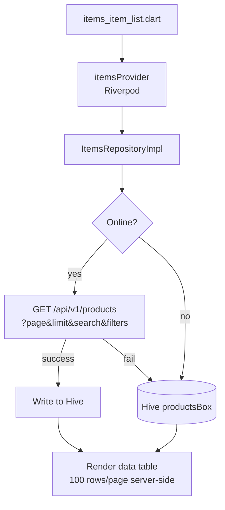
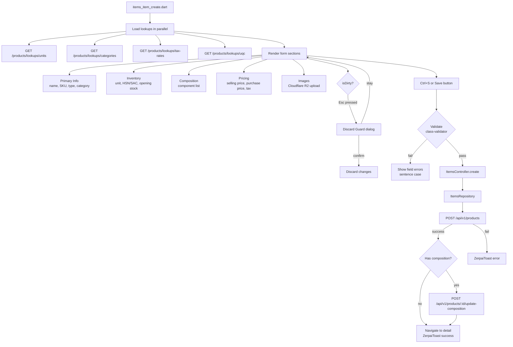
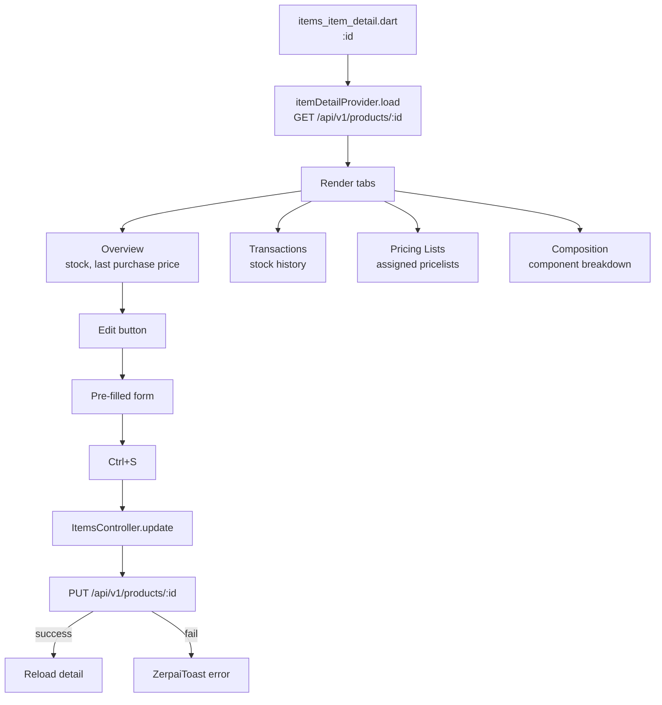
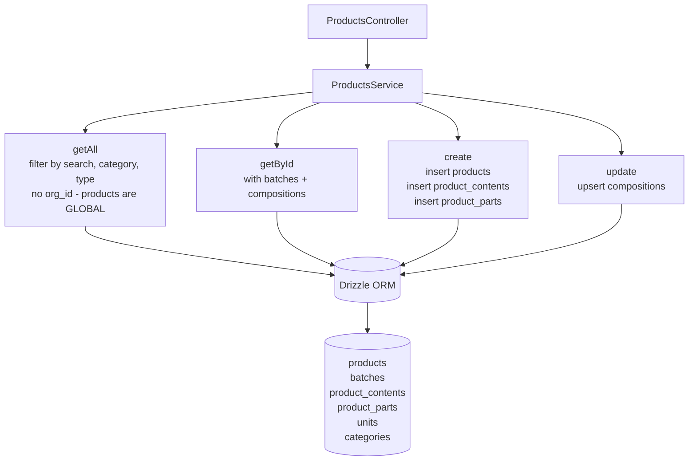
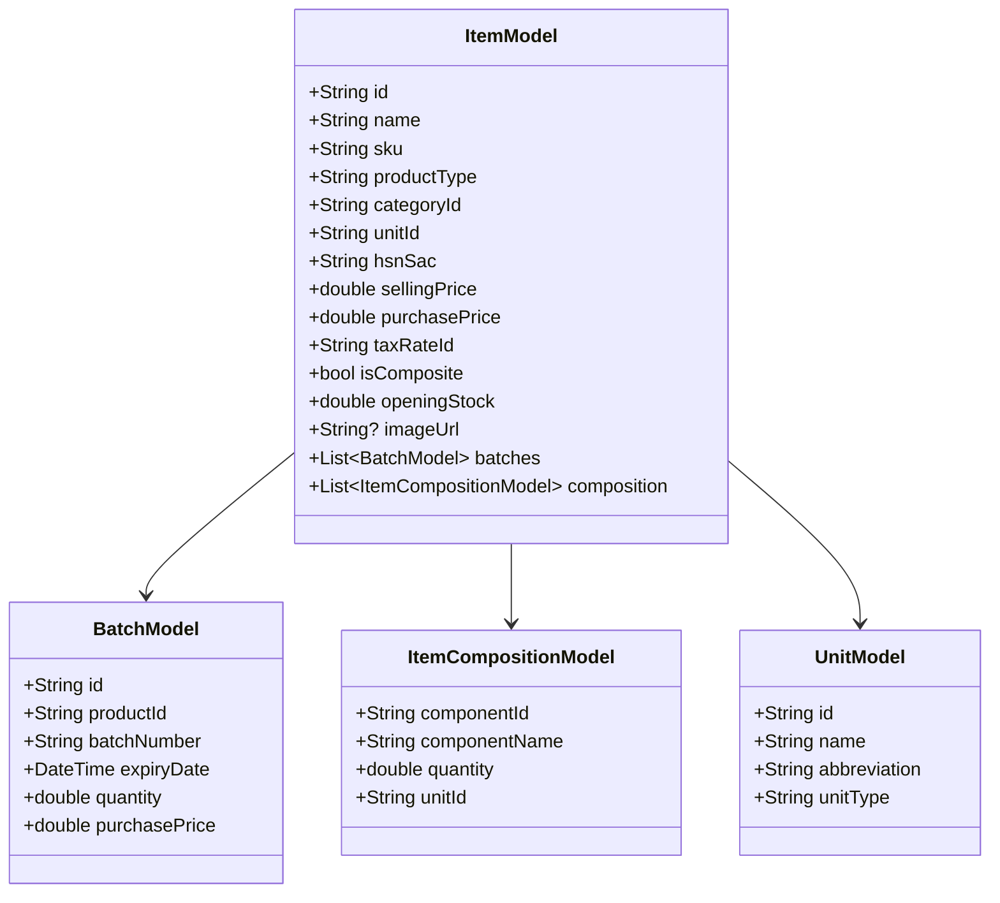
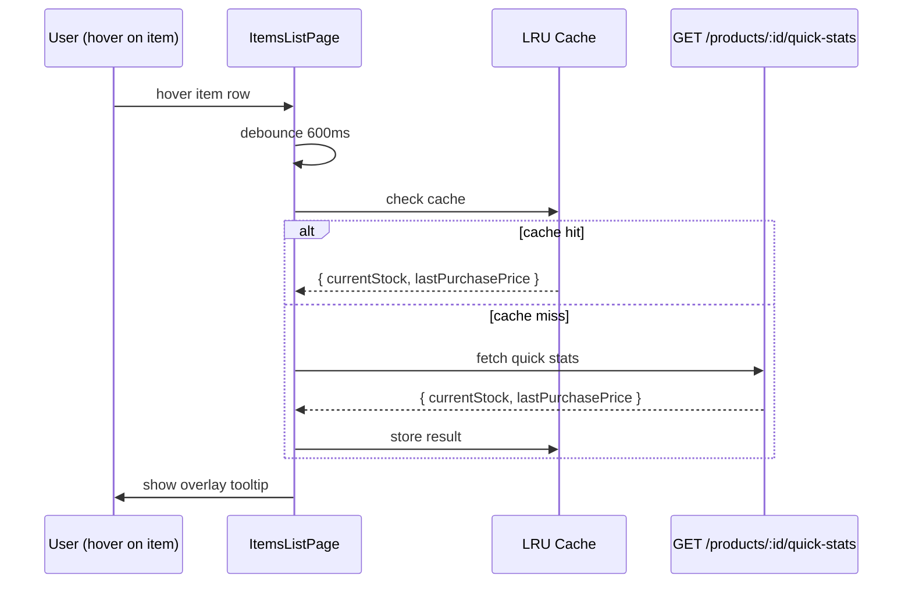

# Items — Products Flow

## Product List Flow

```mermaid
flowchart TD
    PAGE[items_item_list.dart] --> PROV[itemsProvider\nRiverpod]
    PROV --> REPO[ItemsRepositoryImpl]
    REPO --> TRY{Online?}
    TRY -->|yes| API[GET /api/v1/products\n?page&limit&search&filters]
    TRY -->|no| HIVE[(Hive productsBox)]
    API -->|success| CACHE[Write to Hive]
    CACHE --> UI_LIST[Render data table\n100 rows/page server-side]
    HIVE --> UI_LIST
    API -->|fail| HIVE
```

## Create Product Flow

```mermaid
flowchart TD
    START[items_item_create.dart] --> LOOKUPS[Load lookups in parallel]
    LOOKUPS --> L1[GET /products/lookups/units]
    LOOKUPS --> L2[GET /products/lookups/categories]
    LOOKUPS --> L3[GET /products/lookups/tax-rates]
    LOOKUPS --> L4[GET /products/lookups/uqc]

    LOOKUPS --> FORM[Render form sections]
    FORM --> S1[Primary Info\nname, SKU, type, category]
    FORM --> S2[Inventory\nunit, HSN/SAC, opening stock]
    FORM --> S3[Composition\ncomponent list]
    FORM --> S4[Pricing\nselling price, purchase price, tax]
    FORM --> S5[Images\nCloudflare R2 upload]

    FORM --> DIRTY{isDirty?}
    DIRTY -->|Esc pressed| GUARD[Discard Guard dialog]
    GUARD -->|confirm| CANCEL[Discard changes]
    GUARD -->|stay| FORM

    FORM --> SAVE[Ctrl+S or Save button]
    SAVE --> VALID{Validate\nclass-validator}
    VALID -->|fail| ERR[Show field errors\nsentence case]
    VALID -->|pass| CTRL[ItemsController.create]
    CTRL --> REPO[ItemsRepository]
    REPO --> API[POST /api/v1/products]
    API -->|success| COMP_CHECK{Has composition?}
    COMP_CHECK -->|yes| COMP_API[POST /api/v1/products/:id/update-composition]
    COMP_CHECK -->|no| DONE
    COMP_API --> DONE[Navigate to detail\nZerpaiToast success]
    API -->|fail| TOAST[ZerpaiToast error]
```

## Edit Product Flow

```mermaid
flowchart TD
    PAGE[items_item_detail.dart\n:id] --> LOAD[itemDetailProvider.load\nGET /api/v1/products/:id]
    LOAD --> TABS[Render tabs]
    TABS --> T1[Overview\nstock, last purchase price]
    TABS --> T2[Transactions\nstock history]
    TABS --> T3[Pricing Lists\nassigned pricelists]
    TABS --> T4[Composition\ncomponent breakdown]

    T1 --> EDIT_BTN[Edit button]
    EDIT_BTN --> FORM[Pre-filled form]
    FORM --> SAVE[Ctrl+S]
    SAVE --> CTRL[ItemsController.update]
    CTRL --> API[PUT /api/v1/products/:id]
    API -->|success| RELOAD[Reload detail]
    API -->|fail| TOAST[ZerpaiToast error]
```

## Backend — Products Service Flow

```mermaid
flowchart TD
    CTRL_BE[ProductsController] --> SVC[ProductsService]

    SVC --> GET_ALL[getAll\nfilter by search, category, type\nno org_id - products are GLOBAL]
    SVC --> GET_ONE[getById\nwith batches + compositions]
    SVC --> CREATE[create\ninsert products\ninsert product_contents\ninsert product_parts]
    SVC --> UPDATE[update\nupsert compositions]

    GET_ALL --> DRIZZLE[(Drizzle ORM)]
    GET_ONE --> DRIZZLE
    CREATE --> DRIZZLE
    UPDATE --> DRIZZLE

    DRIZZLE --> DB[(products\nbatches\nproduct_contents\nproduct_parts\nunits\ncategories)]
```

## Product Data Model

```mermaid
classDiagram
    class ItemModel {
        +String id
        +String name
        +String sku
        +String productType
        +String categoryId
        +String unitId
        +String hsnSac
        +double sellingPrice
        +double purchasePrice
        +String taxRateId
        +bool isComposite
        +double openingStock
        +String? imageUrl
        +List~BatchModel~ batches
        +List~ItemCompositionModel~ composition
    }

    class BatchModel {
        +String id
        +String productId
        +String batchNumber
        +DateTime expiryDate
        +double quantity
        +double purchasePrice
    }

    class ItemCompositionModel {
        +String componentId
        +String componentName
        +double quantity
        +String unitId
    }

    class UnitModel {
        +String id
        +String name
        +String abbreviation
        +String unitType
    }

    ItemModel --> BatchModel
    ItemModel --> ItemCompositionModel
    ItemModel --> UnitModel
```

## QuickStats Overlay Flow

```mermaid
sequenceDiagram
    participant U as User (hover on item)
    participant UI as ItemsListPage
    participant CACHE as LRU Cache
    participant API as GET /products/:id/quick-stats

    U->>UI: hover item row
    UI->>UI: debounce 600ms
    UI->>CACHE: check cache
    alt cache hit
        CACHE-->>UI: { currentStock, lastPurchasePrice }
    else cache miss
        UI->>API: fetch quick stats
        API-->>UI: { currentStock, lastPurchasePrice }
        UI->>CACHE: store result
    end
    UI->>U: show overlay tooltip
```
