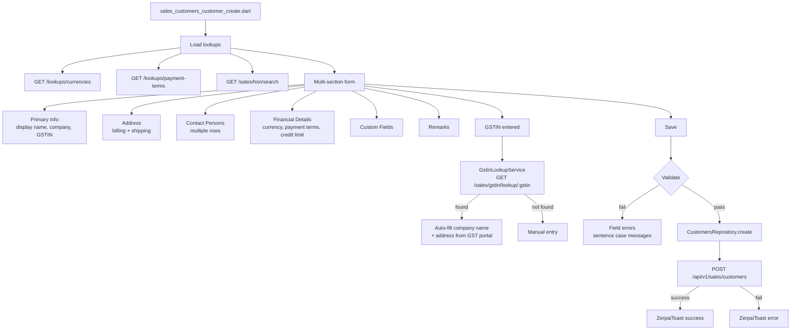
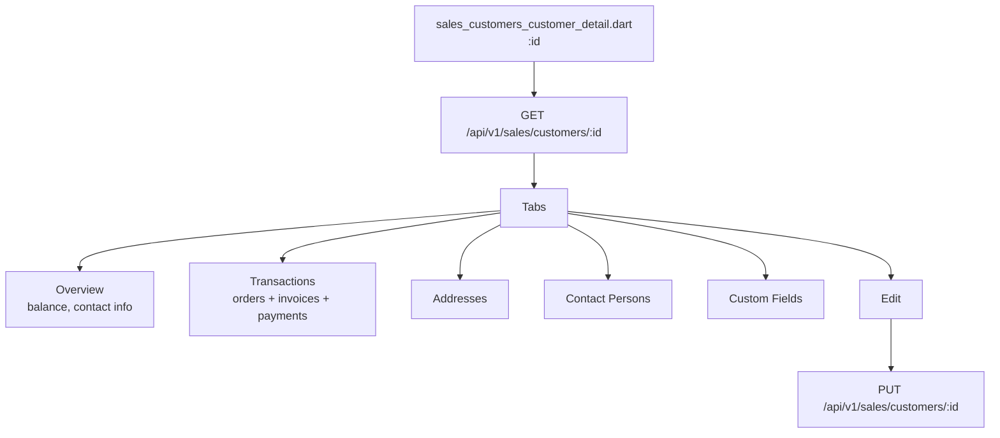
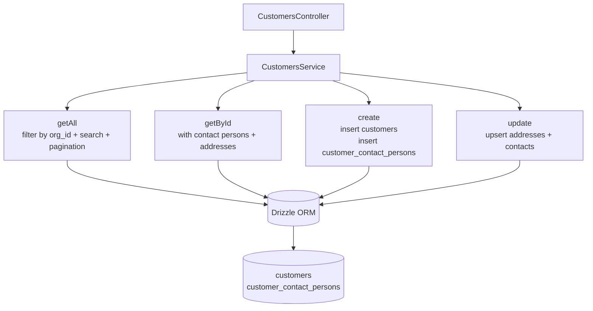
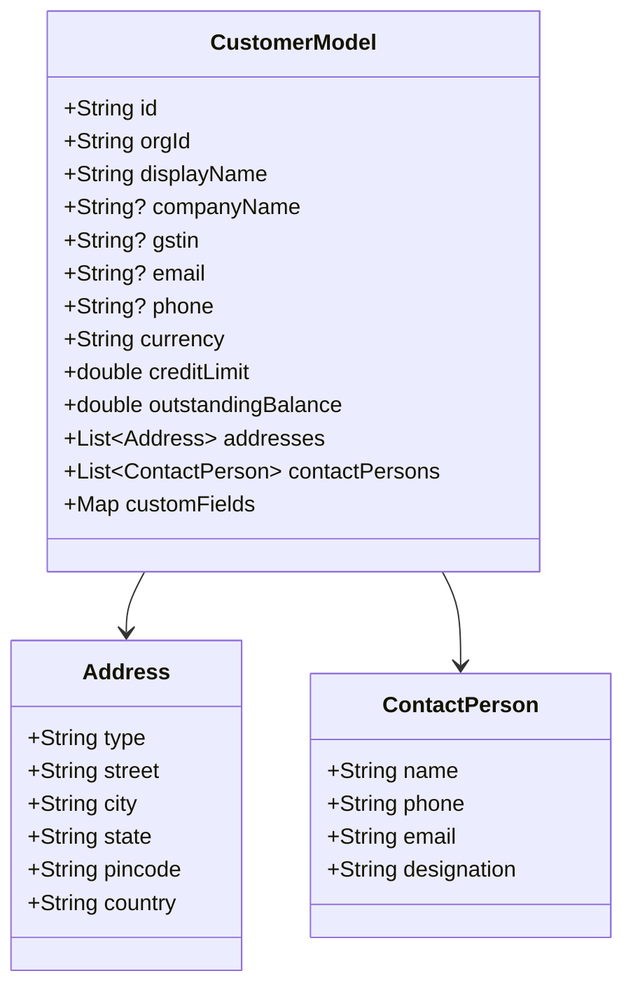

# Sales — Customers Flow

## Customer Create Flow



## Customer List Flow

```mermaid
flowchart TD
    PAGE[sales_customers_overview.dart] --> PROV[salesCustomersProvider]
    PROV --> REPO[CustomersRepository]
    REPO --> TRY{Online?}
    TRY -->|yes| API[GET /api/v1/sales/customers\n?page&limit&search]
    TRY -->|no| HIVE[(Hive cache)]
    API --> CACHE[Cache to Hive]
    CACHE --> TABLE[Render table]
    HIVE --> TABLE

    TABLE --> FILTER[Filters\nstatus, balance, created date]
    TABLE --> BULK[Bulk actions\nexport, delete]
    TABLE --> IMPORT[Import CSV]

    TABLE --> ROW[Row click]
    ROW --> DETAIL[/sales/customers/:id]
```

## Customer Detail Flow



## Backend Flow — Customers Service



## Customer Data Model


