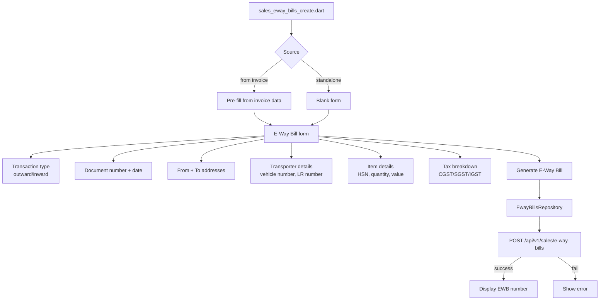
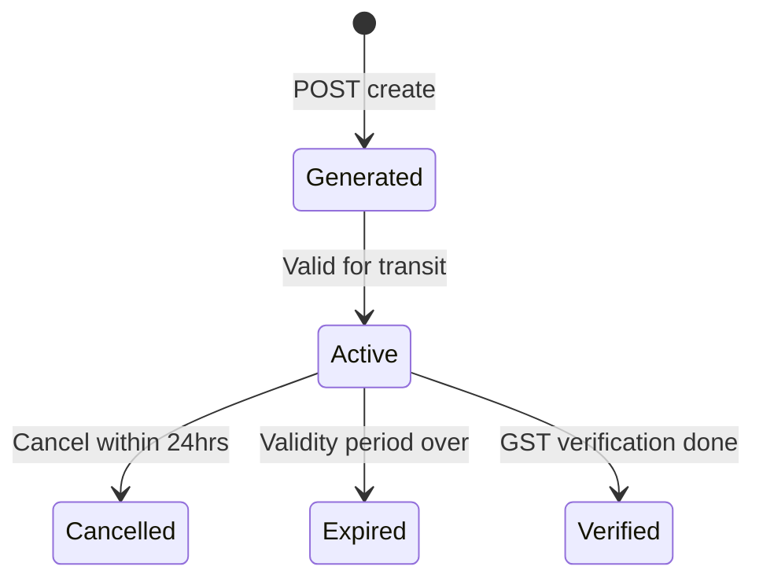
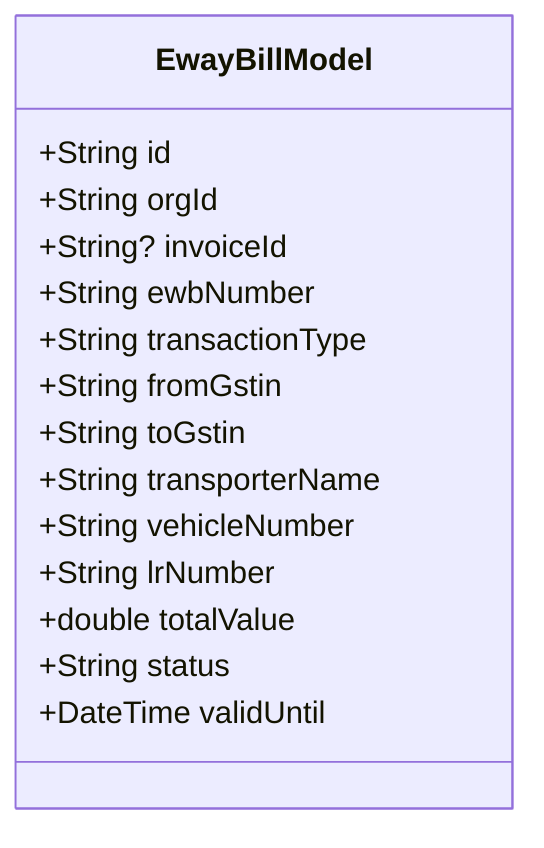

# Sales — E-Way Bills Flow

## E-Way Bill Creation Flow

```mermaid
flowchart TD
    PAGE[sales_eway_bills_create.dart] --> SOURCE{Source}
    SOURCE -->|from invoice| PREFILL[Pre-fill from invoice data]
    SOURCE -->|standalone| BLANK[Blank form]

    PREFILL --> FORM[E-Way Bill form]
    BLANK --> FORM

    FORM --> F1[Transaction type\noutward/inward]
    FORM --> F2[Document number + date]
    FORM --> F3[From + To addresses]
    FORM --> F4[Transporter details\nvehicle number, LR number]
    FORM --> F5[Item details\nHSN, quantity, value]
    FORM --> F6[Tax breakdown\nCGST/SGST/IGST]

    FORM --> SUBMIT[Generate E-Way Bill]
    SUBMIT --> REPO[EwayBillsRepository]
    REPO --> API[POST /api/v1/sales/e-way-bills]
    API -->|success| EWB_NUM[Display EWB number]
    API -->|fail| ERR[Show error]
```

## E-Way Bill Status Flow

```mermaid
stateDiagram-v2
    [*] --> Generated : POST create
    Generated --> Active : Valid for transit
    Active --> Cancelled : Cancel within 24hrs
    Active --> Expired : Validity period over
    Active --> Verified : GST verification done
```

## Data Model

```mermaid
classDiagram
    class EwayBillModel {
        +String id
        +String orgId
        +String? invoiceId
        +String ewbNumber
        +String transactionType
        +String fromGstin
        +String toGstin
        +String transporterName
        +String vehicleNumber
        +String lrNumber
        +double totalValue
        +String status
        +DateTime validUntil
    }
```
