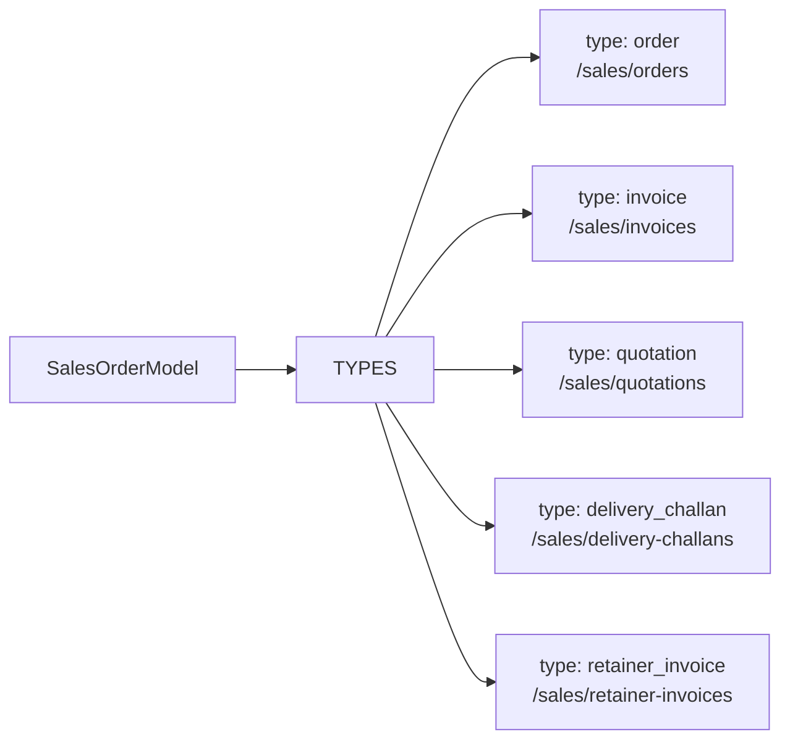
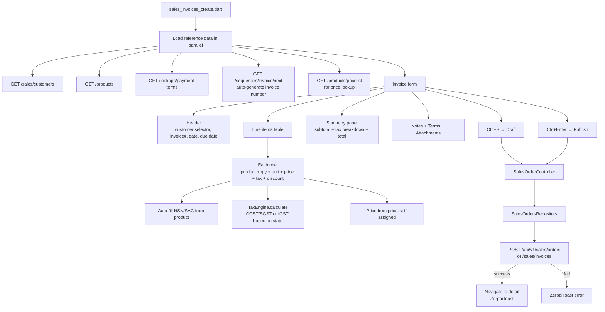
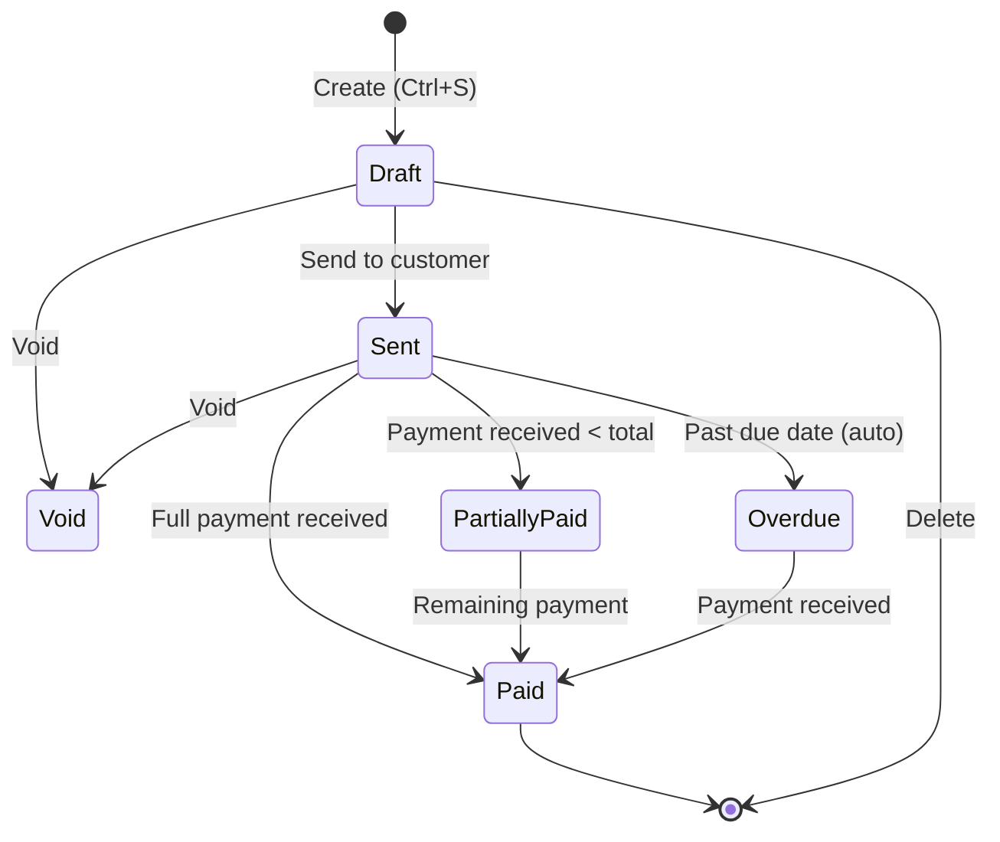
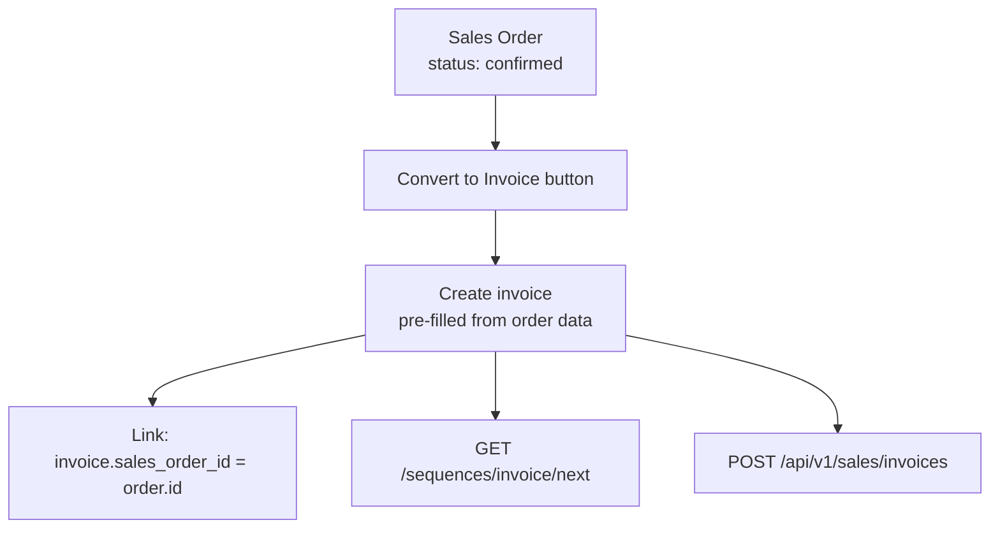
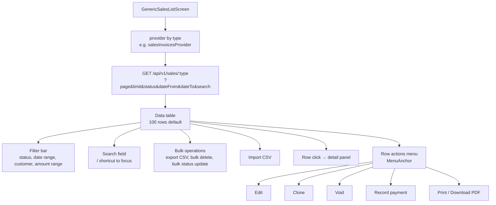
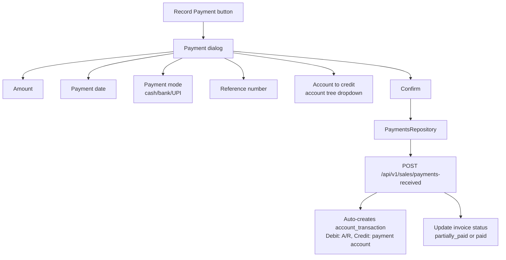
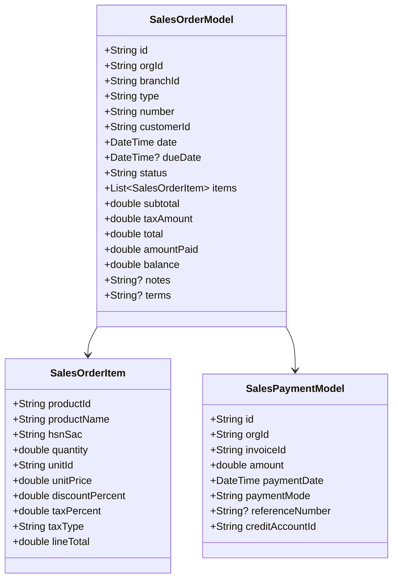

# Sales — Orders & Invoices Flow

## Document Type Shared Model

## Create Sales Invoice Flow

## Invoice Status State Machine

## Sales Order → Invoice Conversion

## Generic List Screen Flow (all doc types share this)

## Payment Recording Flow

## Data Model

