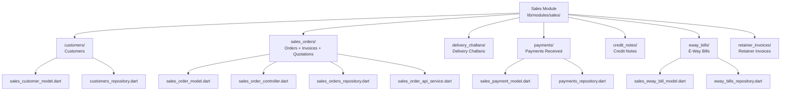
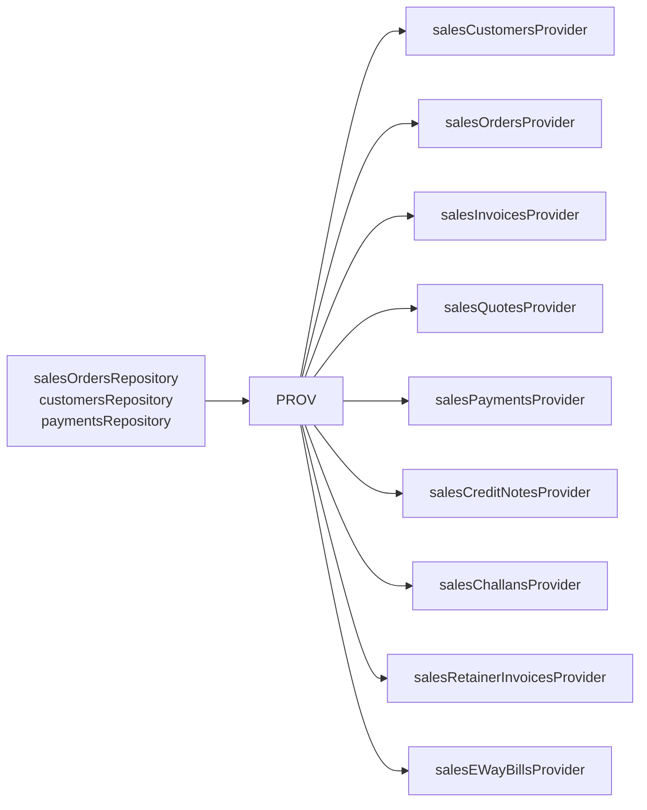

# Sales Module — Overview

## Sub-Module Map



## Route Map

```mermaid
graph LR
    SALES_BASE[/sales]

    SALES_BASE --> CX[/customers]
    SALES_BASE --> ORD[/orders]
    SALES_BASE --> INV[/invoices]
    SALES_BASE --> QT[/quotations]
    SALES_BASE --> DC[/delivery-challans]
    SALES_BASE --> PAY[/payments-received]
    SALES_BASE --> CN[/credit-notes]
    SALES_BASE --> EW[/e-way-bills]
    SALES_BASE --> RI[/retainer-invoices]

    CX --> CX_LIST[list]
    CX --> CX_NEW[/create]
    CX --> CX_ID[/:id]

    ORD --> ORD_LIST[list]
    ORD --> ORD_NEW[/create]
    INV --> INV_LIST[list]
    INV --> INV_NEW[/create]
```

## Riverpod Providers


