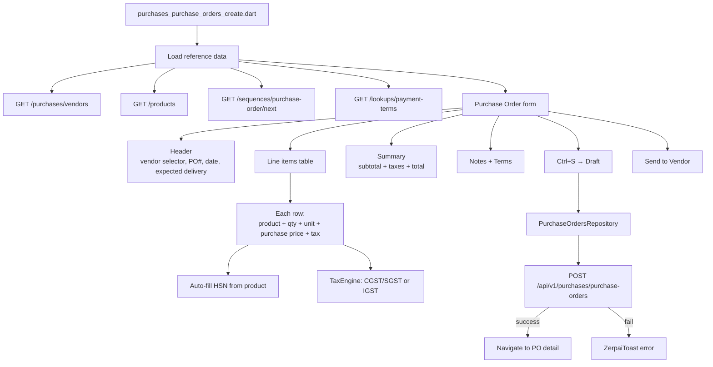
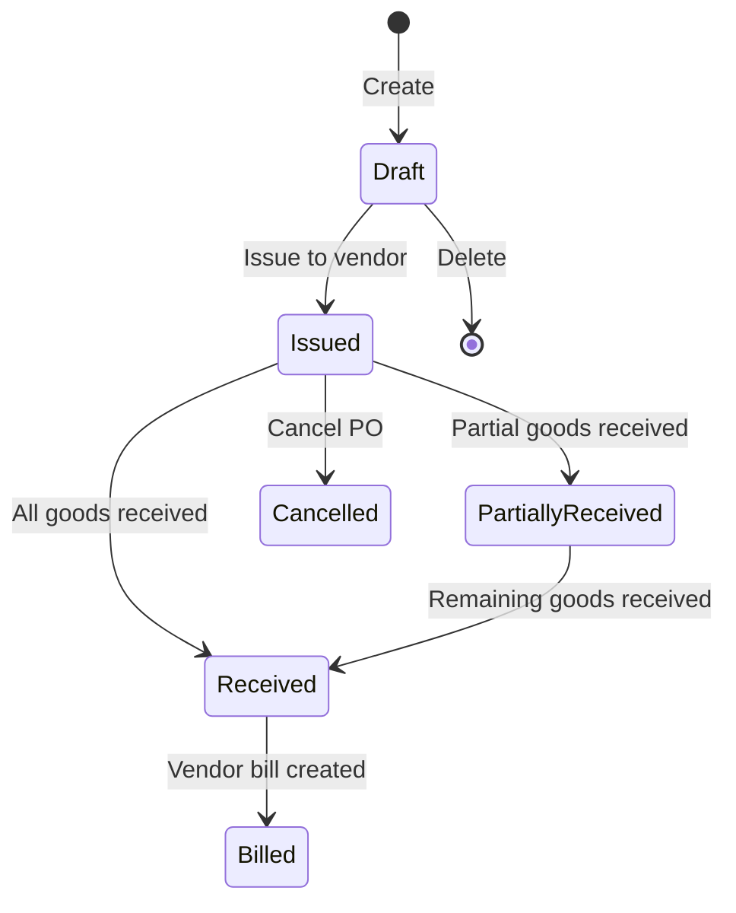
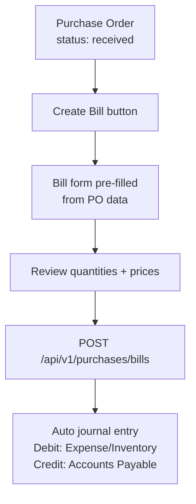
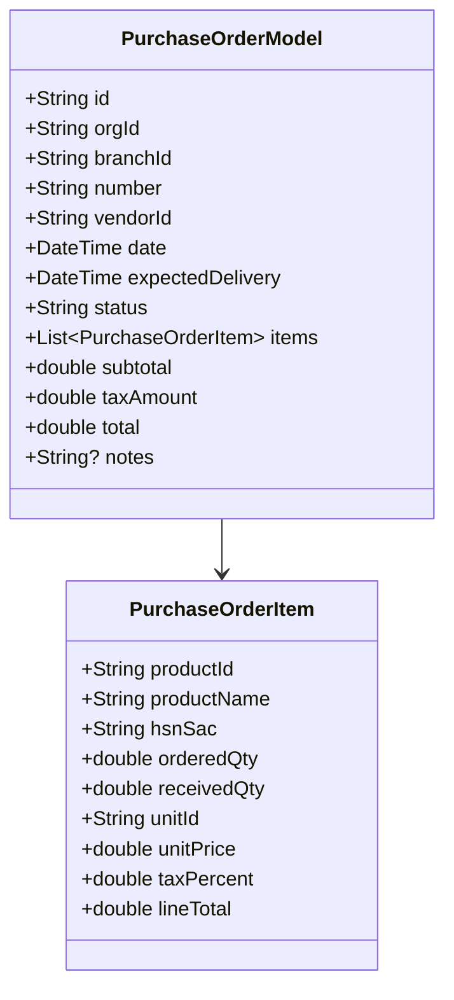

# Purchases — Purchase Orders Flow

## Purchase Order Create Flow

```mermaid
flowchart TD
    PAGE[purchases_purchase_orders_create.dart] --> LOAD[Load reference data]
    LOAD --> L1[GET /purchases/vendors]
    LOAD --> L2[GET /products]
    LOAD --> L3[GET /sequences/purchase-order/next]
    LOAD --> L4[GET /lookups/payment-terms]

    LOAD --> FORM[Purchase Order form]
    FORM --> H[Header\nvendor selector, PO#, date, expected delivery]
    FORM --> ITEMS_TBL[Line items table]
    ITEMS_TBL --> ROW[Each row:\nproduct + qty + unit + purchase price + tax]
    ROW --> HSN[Auto-fill HSN from product]
    ROW --> TAX[TaxEngine: CGST/SGST or IGST]

    FORM --> SUMMARY[Summary\nsubtotal + taxes + total]
    FORM --> NOTES[Notes + Terms]

    FORM --> SAVE[Ctrl+S → Draft]
    FORM --> SEND[Send to Vendor]

    SAVE --> REPO[PurchaseOrdersRepository]
    REPO --> API[POST /api/v1/purchases/purchase-orders]
    API -->|success| DETAIL[Navigate to PO detail]
    API -->|fail| ERR[ZerpaiToast error]
```

## Purchase Order Status State Machine

```mermaid
stateDiagram-v2
    [*] --> Draft : Create
    Draft --> Issued : Issue to vendor
    Issued --> PartiallyReceived : Partial goods received
    Issued --> Received : All goods received
    PartiallyReceived --> Received : Remaining goods received
    Received --> Billed : Vendor bill created
    Issued --> Cancelled : Cancel PO
    Draft --> [*] : Delete
```

## PO → Bill Conversion Flow

```mermaid
flowchart TD
    PO[Purchase Order\nstatus: received] --> BILL_BTN[Create Bill button]
    BILL_BTN --> NEW_BILL[Bill form pre-filled\nfrom PO data]
    NEW_BILL --> VERIFY[Review quantities + prices]
    VERIFY --> POST[POST /api/v1/purchases/bills]
    POST --> COA[Auto journal entry\nDebit: Expense/Inventory\nCredit: Accounts Payable]
```

## Data Model

```mermaid
classDiagram
    class PurchaseOrderModel {
        +String id
        +String orgId
        +String branchId
        +String number
        +String vendorId
        +DateTime date
        +DateTime expectedDelivery
        +String status
        +List~PurchaseOrderItem~ items
        +double subtotal
        +double taxAmount
        +double total
        +String? notes
    }

    class PurchaseOrderItem {
        +String productId
        +String productName
        +String hsnSac
        +double orderedQty
        +double receivedQty
        +String unitId
        +double unitPrice
        +double taxPercent
        +double lineTotal
    }

    PurchaseOrderModel --> PurchaseOrderItem
```
