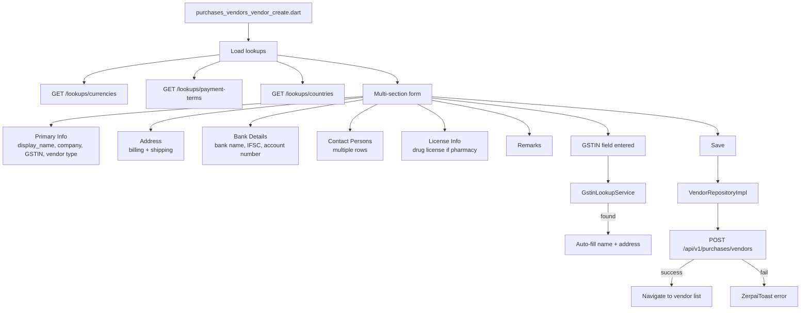
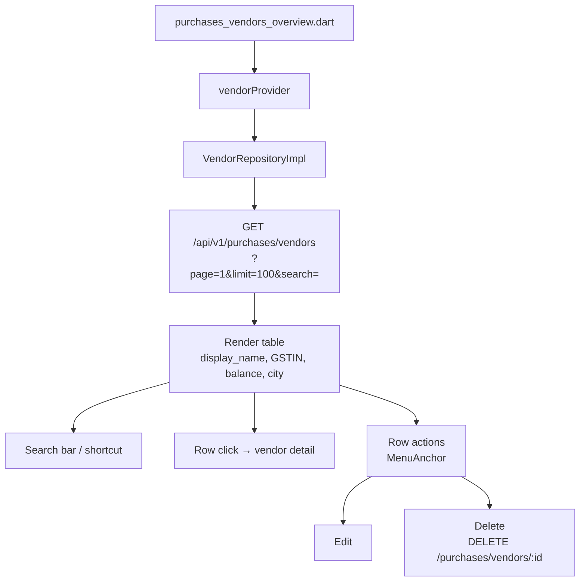
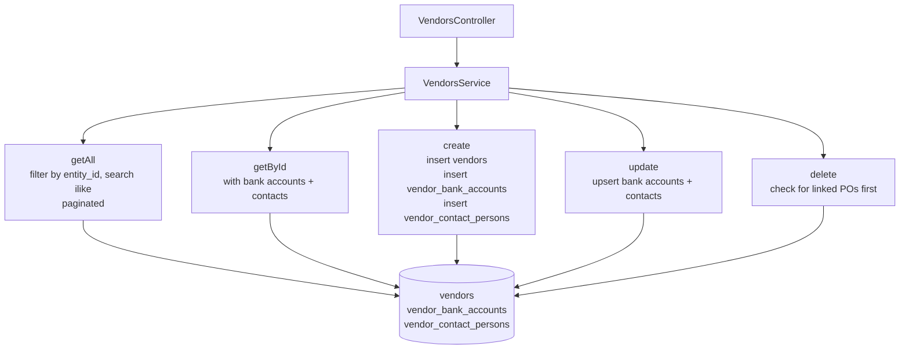
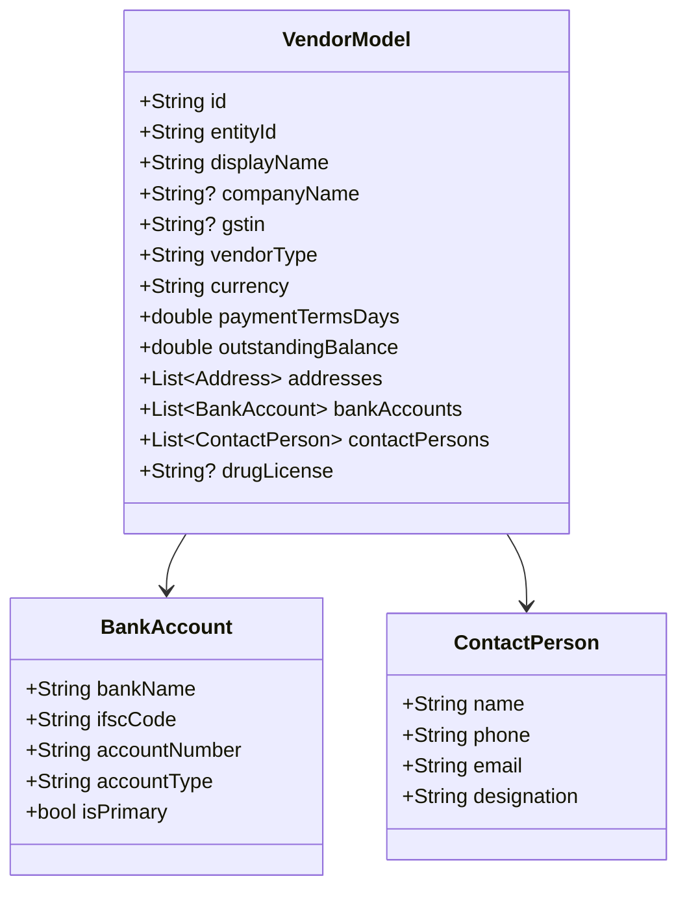
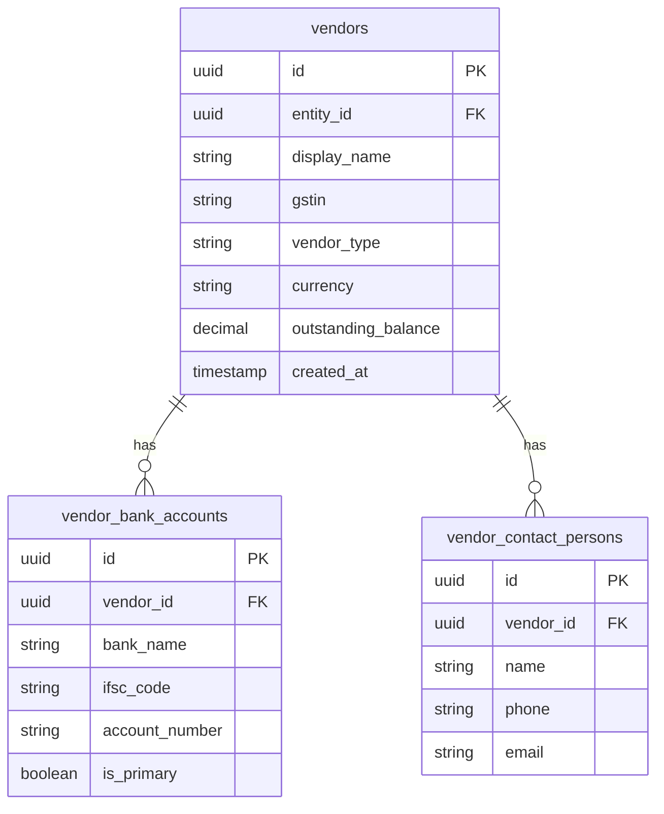

# Purchases — Vendors Flow

## Vendor Create Flow

```mermaid
flowchart TD
    PAGE[purchases_vendors_vendor_create.dart] --> LOAD[Load lookups]
    LOAD --> L1[GET /lookups/currencies]
    LOAD --> L2[GET /lookups/payment-terms]
    LOAD --> L3[GET /lookups/countries]

    LOAD --> FORM[Multi-section form]
    FORM --> S1[Primary Info\ndisplay_name, company, GSTIN, vendor type]
    FORM --> S2[Address\nbilling + shipping]
    FORM --> S3[Bank Details\nbank name, IFSC, account number]
    FORM --> S4[Contact Persons\nmultiple rows]
    FORM --> S5[License Info\ndrug license if pharmacy]
    FORM --> S6[Remarks]

    FORM --> GSTIN[GSTIN field entered]
    GSTIN --> LOOKUP[GstinLookupService]
    LOOKUP -->|found| AUTO[Auto-fill name + address]

    FORM --> SAVE[Save]
    SAVE --> CTRL[VendorRepositoryImpl]
    CTRL --> API[POST /api/v1/purchases/vendors]
    API -->|success| LIST[Navigate to vendor list]
    API -->|fail| TOAST[ZerpaiToast error]
```

## Vendor List Flow

```mermaid
flowchart TD
    PAGE[purchases_vendors_overview.dart] --> PROV[vendorProvider]
    PROV --> REPO[VendorRepositoryImpl]
    REPO --> API[GET /api/v1/purchases/vendors\n?page=1&limit=100&search=]
    API --> TABLE[Render table\ndisplay_name, GSTIN, balance, city]

    TABLE --> SEARCH[Search bar / shortcut]
    TABLE --> ROW[Row click → vendor detail]
    TABLE --> ACTIONS[Row actions\nMenuAnchor]
    ACTIONS --> EDIT[Edit]
    ACTIONS --> DELETE[Delete\nDELETE /purchases/vendors/:id]
```

## Backend — Vendors Service

```mermaid
flowchart TD
    CTRL[VendorsController] --> SVC[VendorsService]

    SVC --> GET_ALL[getAll\nfilter by entity_id, search ilike\npaginated]
    SVC --> GET_ONE[getById\nwith bank accounts + contacts]
    SVC --> CREATE[create\ninsert vendors\ninsert vendor_bank_accounts\ninsert vendor_contact_persons]
    SVC --> UPDATE[update\nupsert bank accounts + contacts]
    SVC --> DELETE[delete\ncheck for linked POs first]

    GET_ALL --> DB[(vendors\nvendor_bank_accounts\nvendor_contact_persons)]
    GET_ONE --> DB
    CREATE --> DB
    UPDATE --> DB
    DELETE --> DB
```

## Vendor Data Model

```mermaid
classDiagram
    class VendorModel {
        +String id
        +String entityId
        +String displayName
        +String? companyName
        +String? gstin
        +String vendorType
        +String currency
        +double paymentTermsDays
        +double outstandingBalance
        +List~Address~ addresses
        +List~BankAccount~ bankAccounts
        +List~ContactPerson~ contactPersons
        +String? drugLicense
    }

    class BankAccount {
        +String bankName
        +String ifscCode
        +String accountNumber
        +String accountType
        +bool isPrimary
    }

    class ContactPerson {
        +String name
        +String phone
        +String email
        +String designation
    }

    VendorModel --> BankAccount
    VendorModel --> ContactPerson
```

## Database Schema

```mermaid
erDiagram
    vendors {
        uuid id PK
        uuid entity_id FK
        string display_name
        string gstin
        string vendor_type
        string currency
        decimal outstanding_balance
        timestamp created_at
    }

    vendor_bank_accounts {
        uuid id PK
        uuid vendor_id FK
        string bank_name
        string ifsc_code
        string account_number
        boolean is_primary
    }

    vendor_contact_persons {
        uuid id PK
        uuid vendor_id FK
        string name
        string phone
        string email
    }

    vendors ||--o{ vendor_bank_accounts : has
    vendors ||--o{ vendor_contact_persons : has
```
