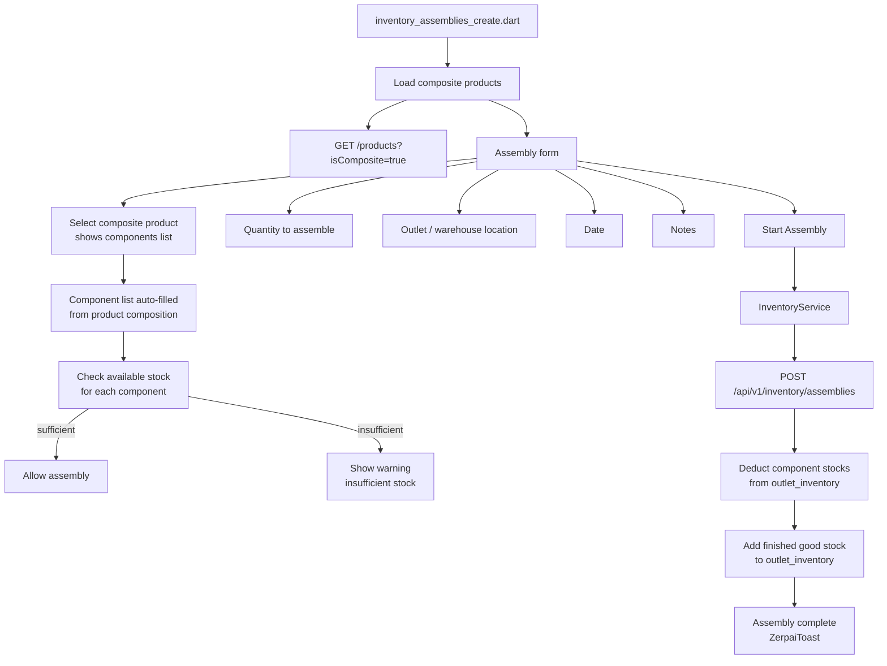
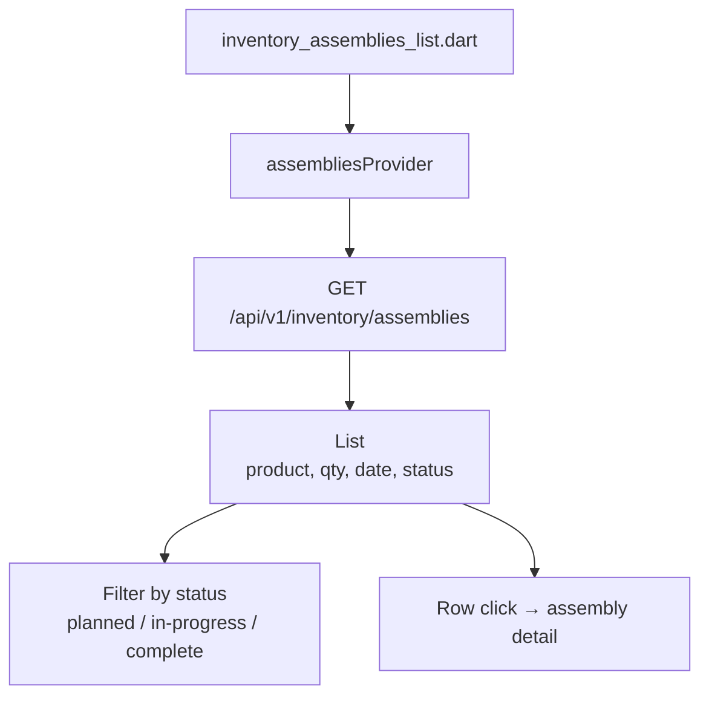
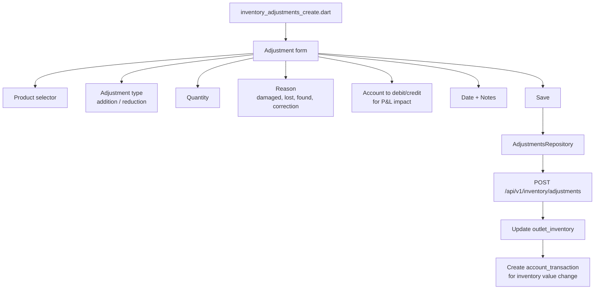
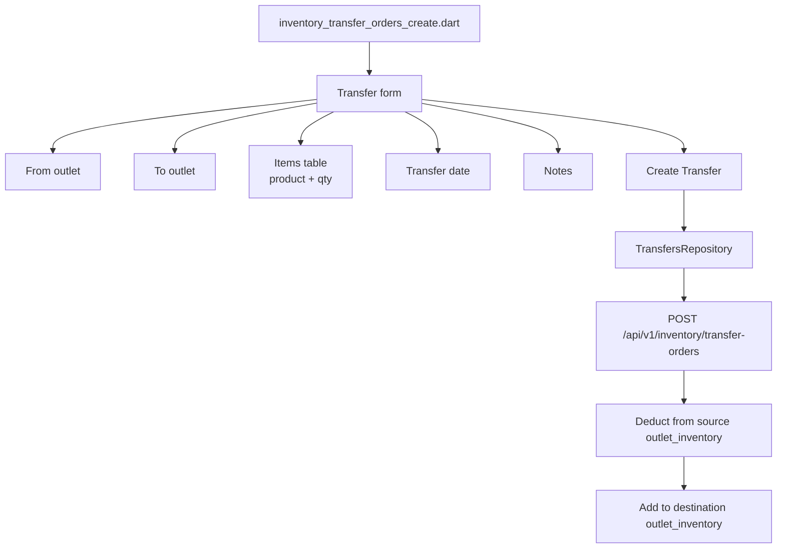
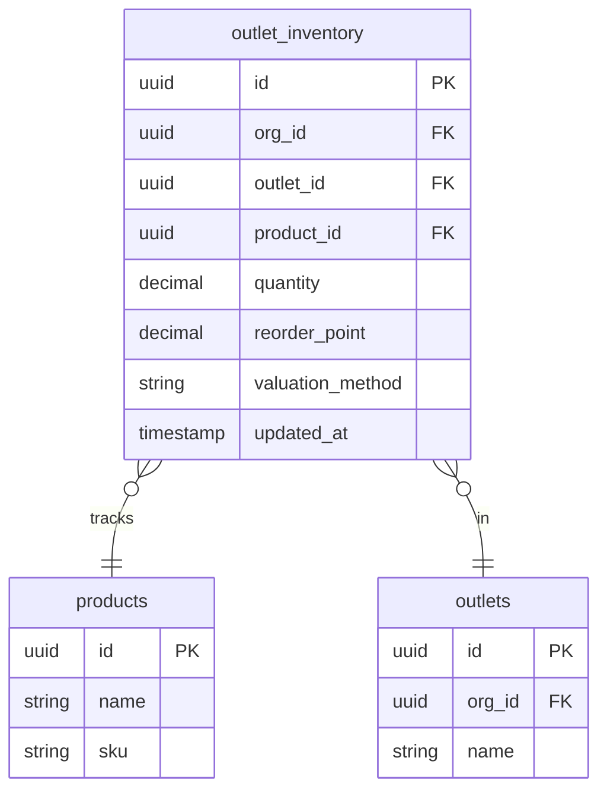

# Inventory — Assemblies Flow

## Assembly Creation Flow

```mermaid
flowchart TD
    PAGE[inventory_assemblies_create.dart] --> LOAD[Load composite products]
    LOAD --> API1[GET /products?isComposite=true]

    LOAD --> FORM[Assembly form]
    FORM --> F1[Select composite product\nshows components list]
    F1 --> COMP_LIST[Component list auto-filled\nfrom product composition]
    FORM --> F2[Quantity to assemble]
    FORM --> F3[Outlet / warehouse location]
    FORM --> F4[Date]
    FORM --> F5[Notes]

    COMP_LIST --> STOCK_CHECK[Check available stock\nfor each component]
    STOCK_CHECK -->|sufficient| PROCEED[Allow assembly]
    STOCK_CHECK -->|insufficient| WARN[Show warning\ninsufficient stock]

    FORM --> SAVE[Start Assembly]
    SAVE --> CTRL[InventoryService]
    CTRL --> API[POST /api/v1/inventory/assemblies]
    API --> DEDUCT[Deduct component stocks\nfrom outlet_inventory]
    DEDUCT --> ADD[Add finished good stock\nto outlet_inventory]
    ADD --> DONE[Assembly complete\nZerpaiToast]
```

## Assembly List Flow

```mermaid
flowchart TD
    PAGE[inventory_assemblies_list.dart] --> PROV[assembliesProvider]
    PROV --> API[GET /api/v1/inventory/assemblies]
    API --> TABLE[List\nproduct, qty, date, status]

    TABLE --> STATUS_FILTER[Filter by status\nplanned / in-progress / complete]
    TABLE --> ROW[Row click → assembly detail]
```

## Stock Adjustment Flow

```mermaid
flowchart TD
    PAGE[inventory_adjustments_create.dart] --> FORM[Adjustment form]
    FORM --> F1[Product selector]
    FORM --> F2[Adjustment type\naddition / reduction]
    FORM --> F3[Quantity]
    FORM --> F4[Reason\ndamaged, lost, found, correction]
    FORM --> F5[Account to debit/credit\nfor P&L impact]
    FORM --> F6[Date + Notes]

    FORM --> SAVE[Save]
    SAVE --> REPO[AdjustmentsRepository]
    REPO --> API[POST /api/v1/inventory/adjustments]
    API --> STOCK_UPDATE[Update outlet_inventory]
    STOCK_UPDATE --> JOURNAL[Create account_transaction\nfor inventory value change]
```

## Transfer Order Flow

```mermaid
flowchart TD
    PAGE[inventory_transfer_orders_create.dart] --> FORM[Transfer form]
    FORM --> F1[From outlet]
    FORM --> F2[To outlet]
    FORM --> F3[Items table\nproduct + qty]
    FORM --> F4[Transfer date]
    FORM --> F5[Notes]

    FORM --> SAVE[Create Transfer]
    SAVE --> REPO[TransfersRepository]
    REPO --> API[POST /api/v1/inventory/transfer-orders]
    API --> DEDUCT[Deduct from source outlet_inventory]
    DEDUCT --> ADD[Add to destination outlet_inventory]
```

## Database Schema

```mermaid
erDiagram
    outlet_inventory {
        uuid id PK
        uuid org_id FK
        uuid outlet_id FK
        uuid product_id FK
        decimal quantity
        decimal reorder_point
        string valuation_method
        timestamp updated_at
    }

    products {
        uuid id PK
        string name
        string sku
    }

    outlets {
        uuid id PK
        uuid org_id FK
        string name
    }

    outlet_inventory }o--|| products : tracks
    outlet_inventory }o--|| outlets : in
```
