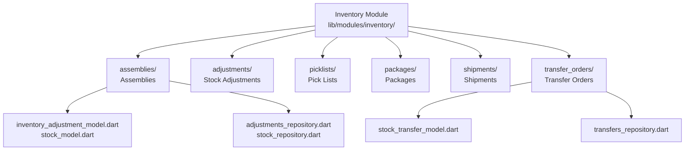
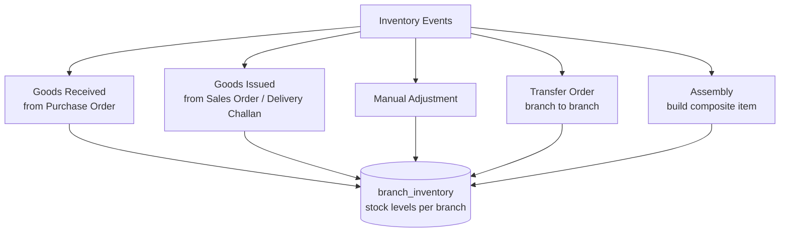

# Inventory Module — Overview

## Module Structure



## Inventory Data Flow



## Route Map

```mermaid
graph LR
    BASE[/inventory]

    BASE --> A[/assemblies]
    BASE --> B[/adjustments]
    BASE --> C[/picklists]
    BASE --> D[/packages]
    BASE --> E[/shipments]
    BASE --> F[/transfer-orders]

    A --> A1[list]
    A --> A2[/create]
    F --> F1[list]
    F --> F2[/create]
```
