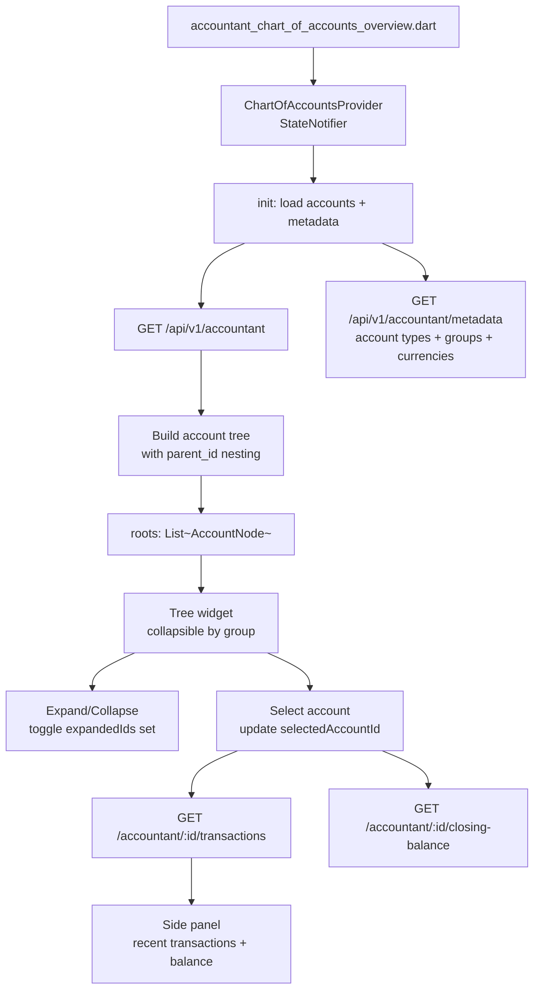
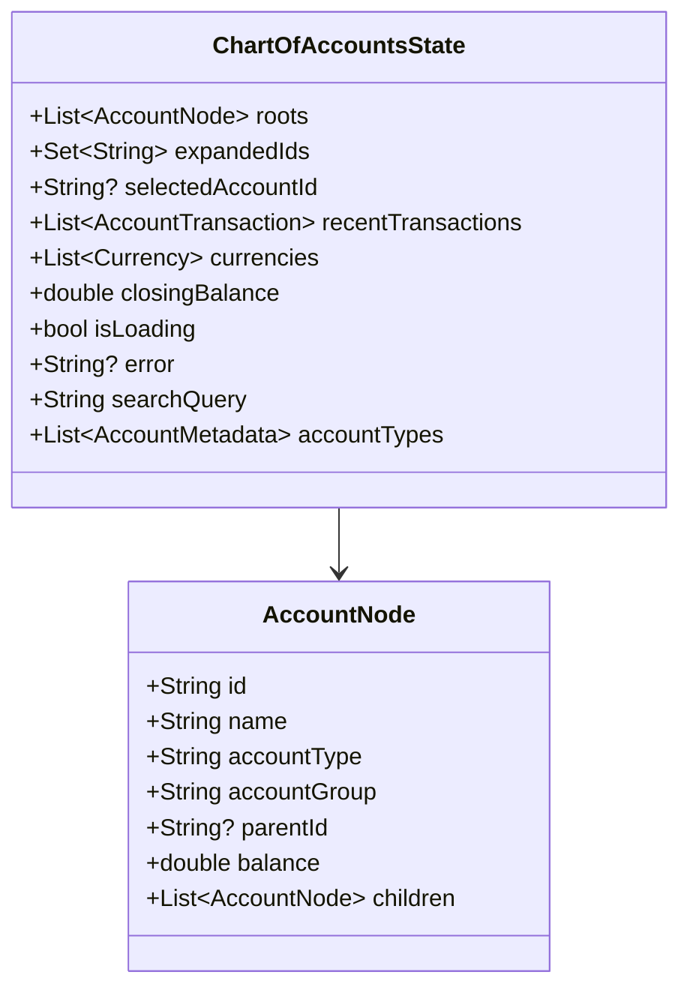
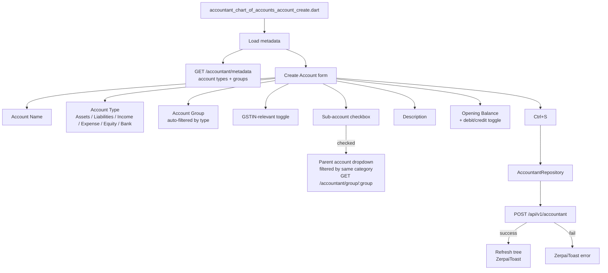
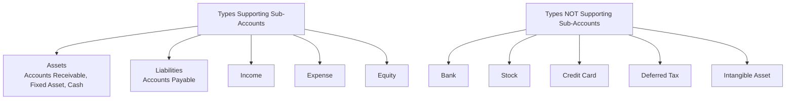
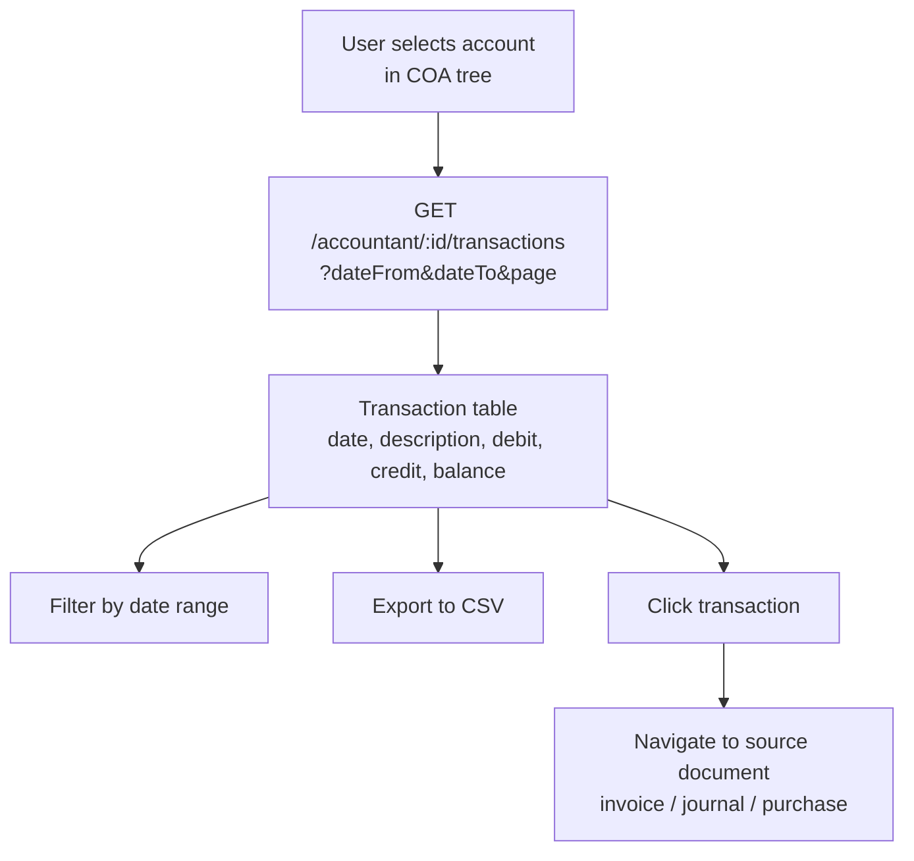
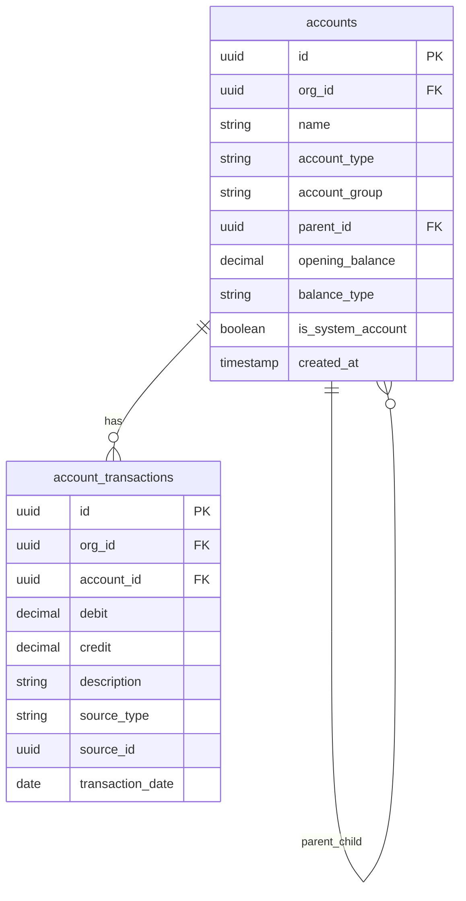

# Accountant — Chart of Accounts Flow

## COA Overview Load Flow

## COA State

## Create Account Flow

## Sub-Account Types Reference

## Account Transaction — Ledger View

## Database Schema

