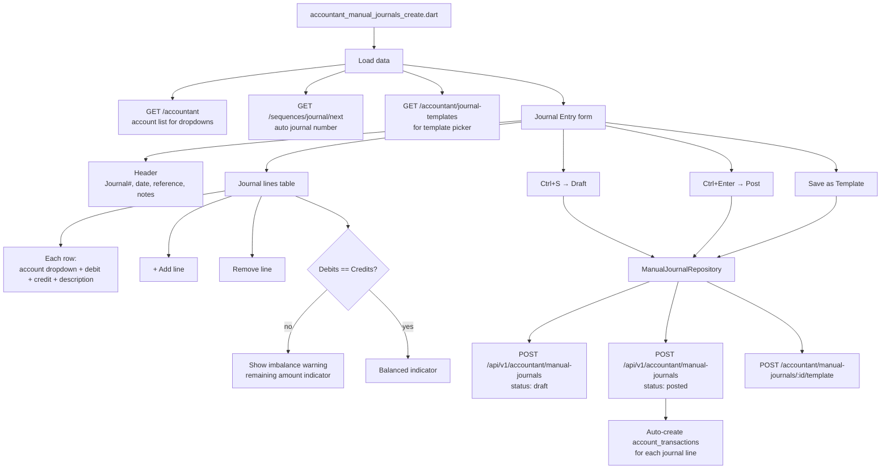
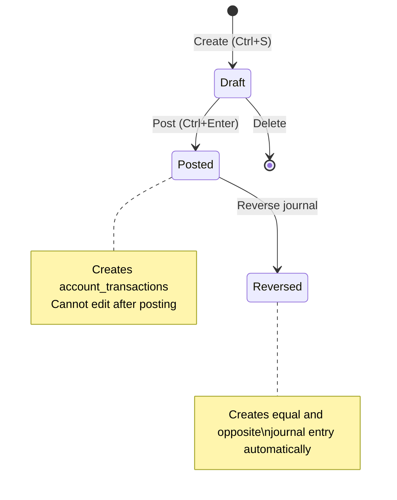
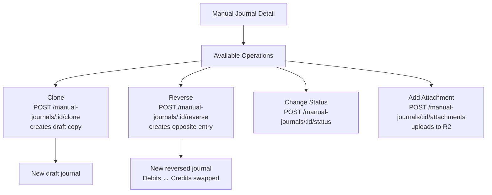
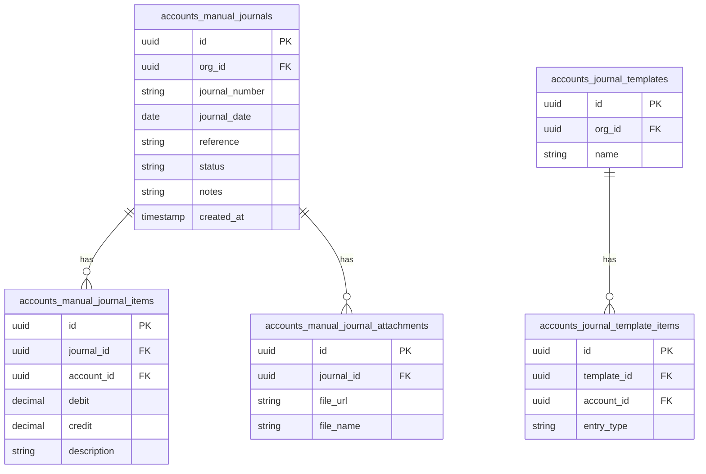

# Accountant — Manual Journals Flow

## Manual Journal Create Flow



## Manual Journal Status State Machine



## Journal Operations Flow



## Journal Templates Flow

```mermaid
flowchart TD
    TMPL_LIST[accountant_manual_journals_templates.dart] --> PROV[manualJournalTemplateProvider]
    PROV --> API[GET /accountant/journal-templates]
    API --> TABLE[Template list\nname, line count, created]

    TABLE --> USE[Use Template button]
    USE --> PRE_FILL[Pre-fill create form\nwith template lines]
    PRE_FILL --> CREATE_PAGE[Manual journal create\nwith account rows populated]

    TABLE --> NEW_TMPL[New Template]
    NEW_TMPL --> TMPL_FORM[/journal-template-creation]
    TMPL_FORM --> TMPL_ROWS[Template lines\naccount + debit/credit side]
    TMPL_FORM --> SAVE[POST /accountant/journal-templates]
```

## Database Schema


