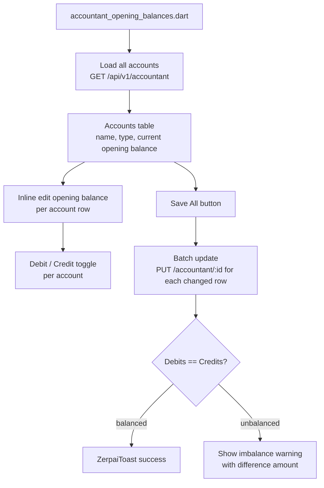
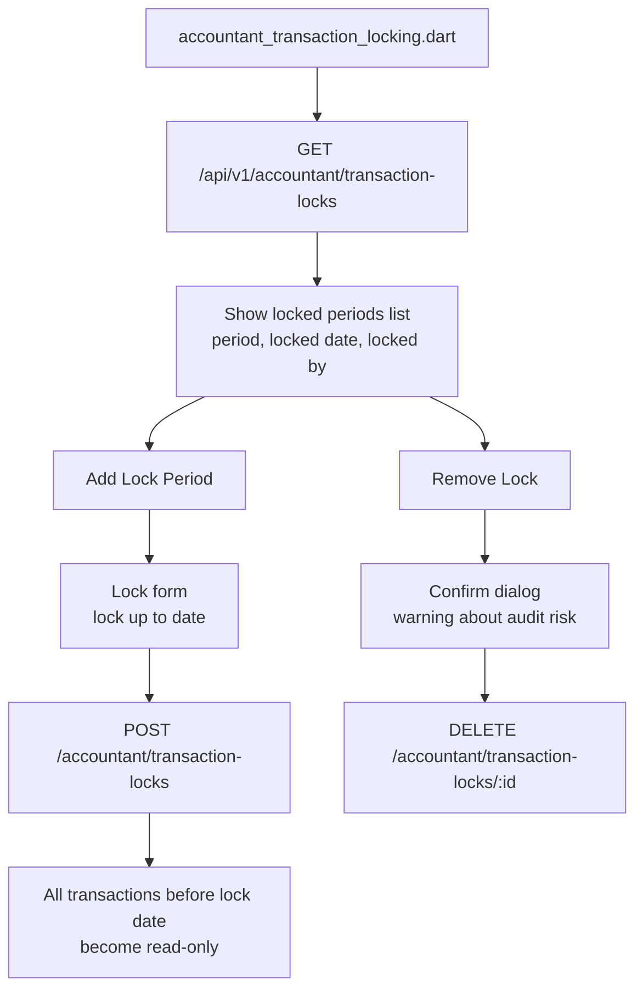
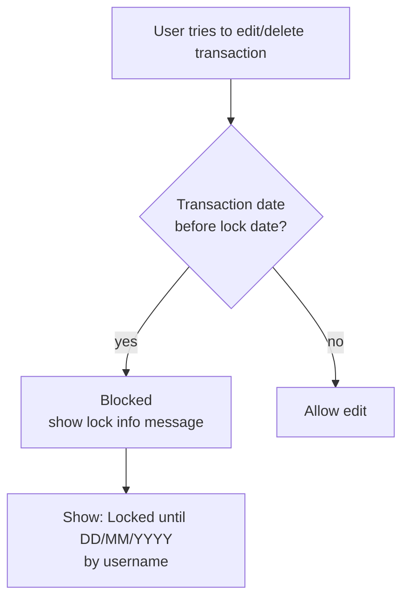
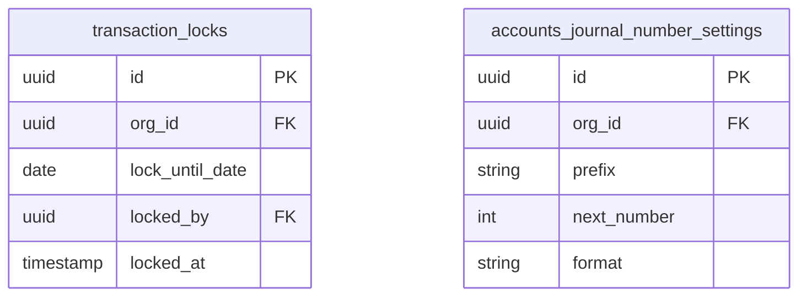

# Accountant — Opening Balances & Transaction Locking

## Opening Balances Flow

```mermaid
flowchart TD
    PAGE[accountant_opening_balances.dart] --> LOAD[Load all accounts\nGET /api/v1/accountant]

    LOAD --> TABLE[Accounts table\nname, type, current opening balance]
    TABLE --> EDIT[Inline edit opening balance\nper account row]
    EDIT --> DEBIT_CREDIT[Debit / Credit toggle\nper account]

    TABLE --> SAVE[Save All button]
    SAVE --> BATCH[Batch update\nPUT /accountant/:id for each changed row]
    BATCH --> VERIFY{Debits == Credits?}
    VERIFY -->|balanced| SUCCESS[ZerpaiToast success]
    VERIFY -->|unbalanced| WARN[Show imbalance warning\nwith difference amount]
```

## Transaction Locking Flow

```mermaid
flowchart TD
    PAGE[accountant_transaction_locking.dart] --> LOAD[GET /api/v1/accountant/transaction-locks]

    LOAD --> LOCKS[Show locked periods list\nperiod, locked date, locked by]

    LOCKS --> ADD[Add Lock Period]
    ADD --> FORM[Lock form\nlock up to date]
    FORM --> SAVE[POST /accountant/transaction-locks]
    SAVE --> EFFECT[All transactions before lock date\nbecome read-only]

    LOCKS --> UNLOCK[Remove Lock]
    UNLOCK --> CONFIRM[Confirm dialog\nwarning about audit risk]
    CONFIRM --> DEL[DELETE /accountant/transaction-locks/:id]
```

## Lock Enforcement

```mermaid
flowchart TD
    USER[User tries to edit/delete transaction] --> CHECK{Transaction date\nbefore lock date?}
    CHECK -->|yes| BLOCK[Blocked\nshow lock info message]
    CHECK -->|no| ALLOW[Allow edit]

    BLOCK --> SHOW[Show: Locked until DD/MM/YYYY\nby username]
```

## Database Schema

```mermaid
erDiagram
    transaction_locks {
        uuid id PK
        uuid org_id FK
        date lock_until_date
        uuid locked_by FK
        timestamp locked_at
    }

    accounts_journal_number_settings {
        uuid id PK
        uuid org_id FK
        string prefix
        int next_number
        string format
    }
```
