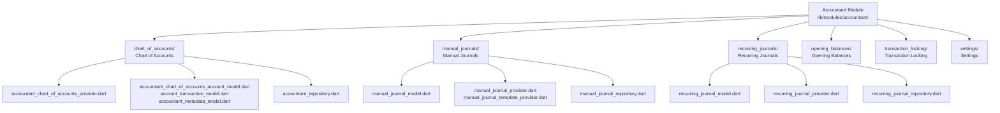
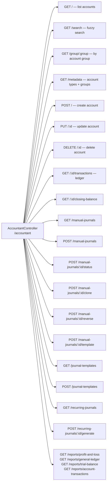

# Accountant Module — Overview

## Module Structure



## Route Map

```mermaid
graph LR
    BASE[/accountant]

    BASE --> COA[/accounts]
    BASE --> MJ[/manual-journals]
    BASE --> RJ[/recurring-journals]
    BASE --> OB[/opening-balances]
    BASE --> TL[/transaction-locking]
    BASE --> BU[/bulk-update]
    BASE --> SET[/settings]

    COA --> COA_NEW[/create]
    COA --> COA_ID[/:id]

    MJ --> MJ_NEW[/create]
    MJ --> MJ_TMPL[/templates]
    MJ --> MJ_TMPL_NEW[/journal-template-creation]

    RJ --> RJ_NEW[/create]
```

## Backend API Summary


