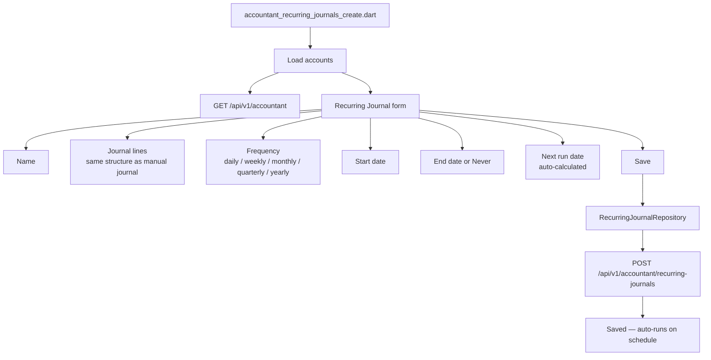
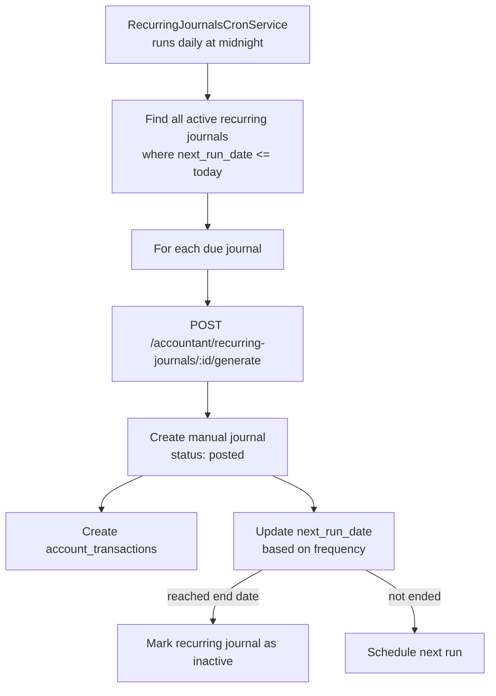
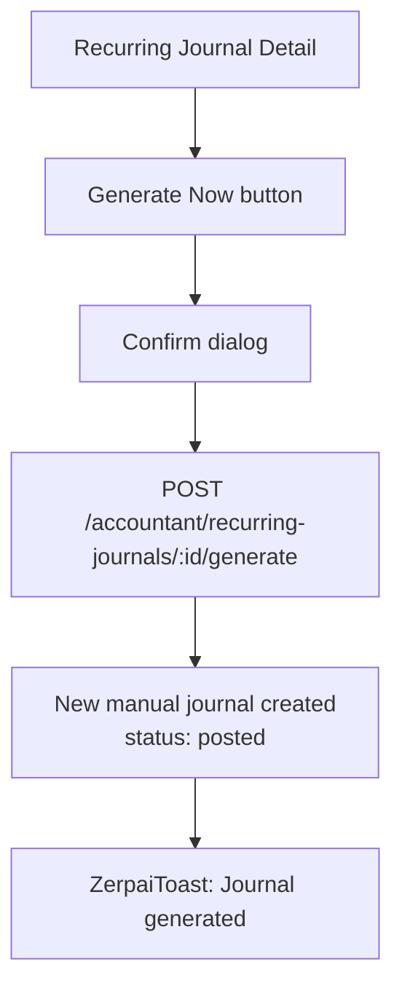
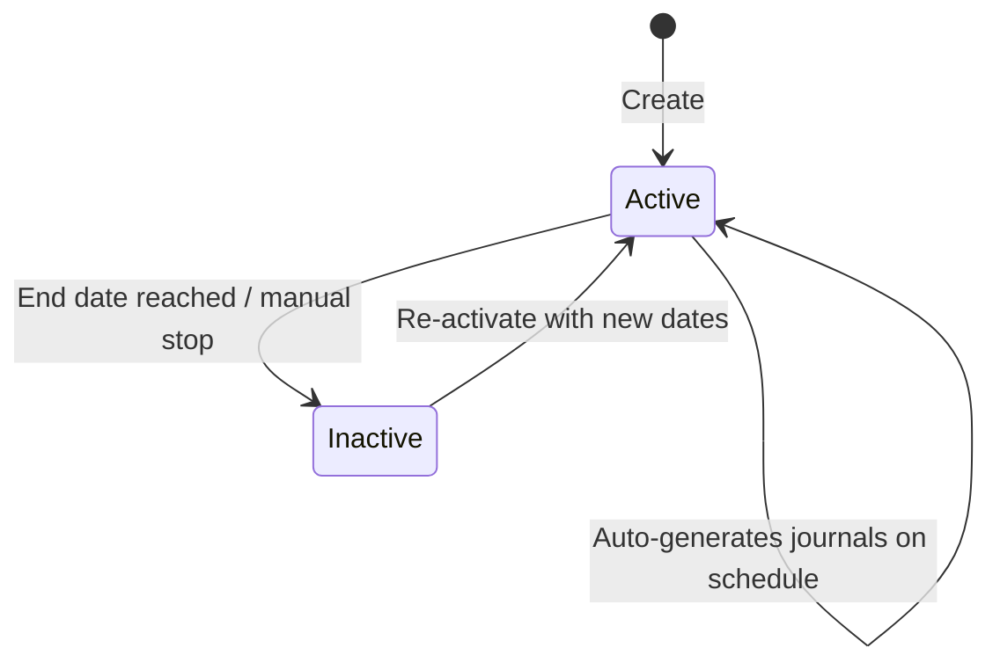
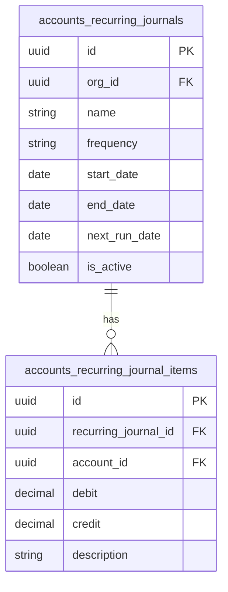

# Accountant — Recurring Journals Flow

## Recurring Journal Create Flow

## Recurring Journal Auto-Run Flow (Cron)

## Manual Trigger Flow

## Recurring Journal Status Machine

## Database Schema

