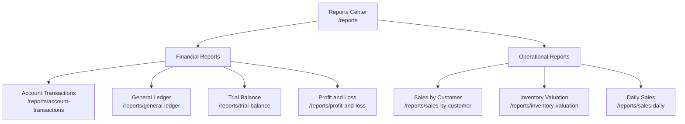
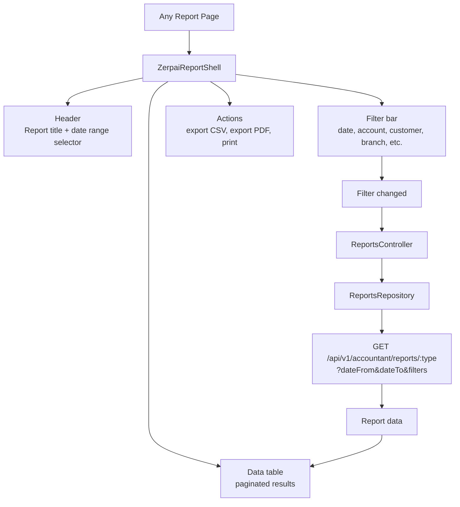
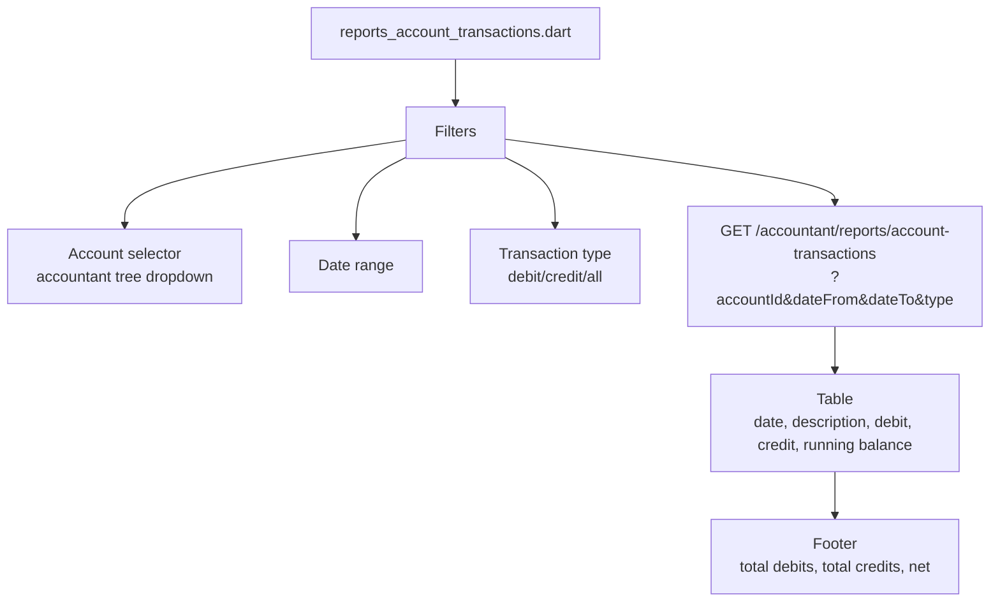
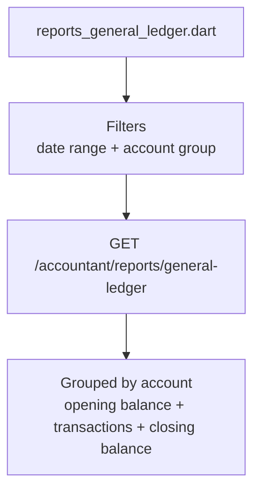
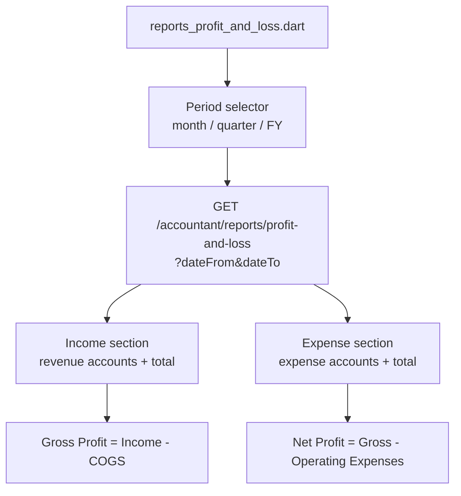
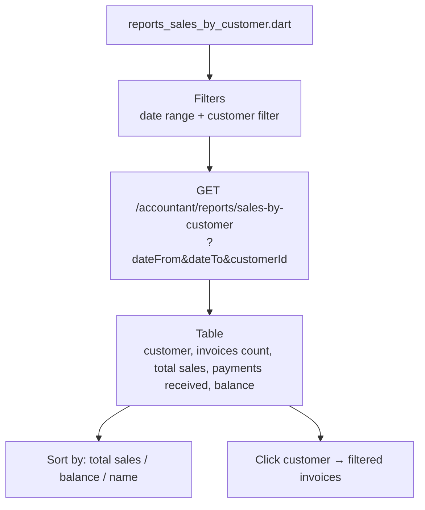
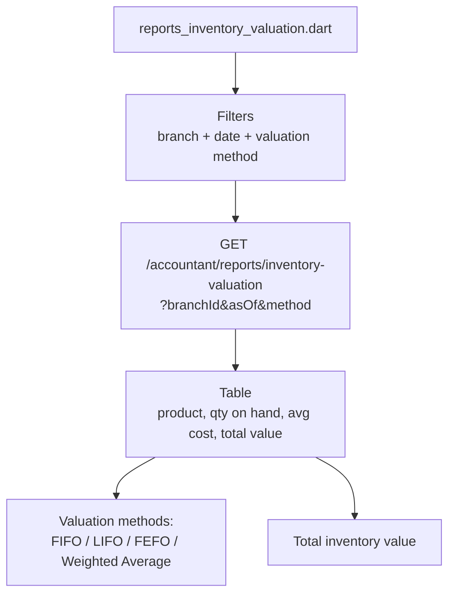
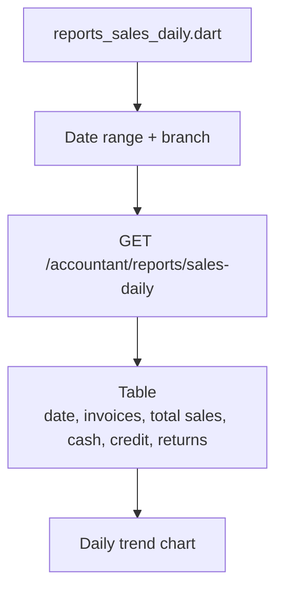

# Reports Module — Overview & Flows

## Report Center



## Shared Report Shell Flow



## Account Transactions Report



## General Ledger Report



## Trial Balance Report

```mermaid
flowchart TD
    PAGE[reports_trial_balance.dart] --> DATE[As-of date picker]
    DATE --> API[GET /accountant/reports/trial-balance\n?asOf=date]
    API --> TABLE[Two-column table\nAccount | Debit | Credit]
    TABLE --> TOTALS[Total row\nmust balance]
    TOTALS --> CHECK{Debits == Credits?}
    CHECK -->|yes| BALANCED[Balanced indicator]
    CHECK -->|no| ERROR[Data error alert]
```

## Profit & Loss Report



## Sales by Customer Report



## Inventory Valuation Report



## Daily Sales Report


