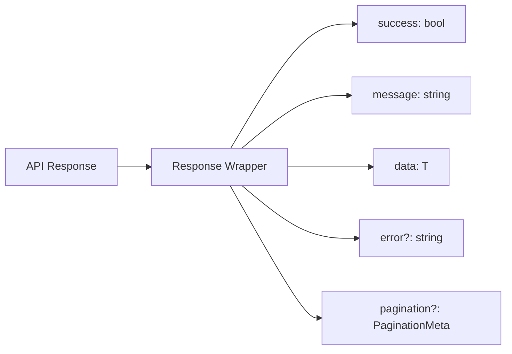
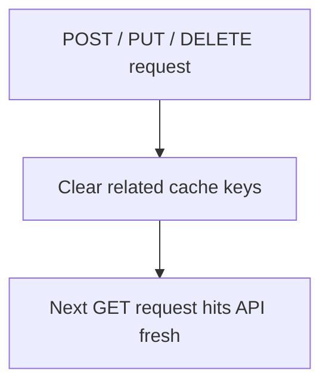
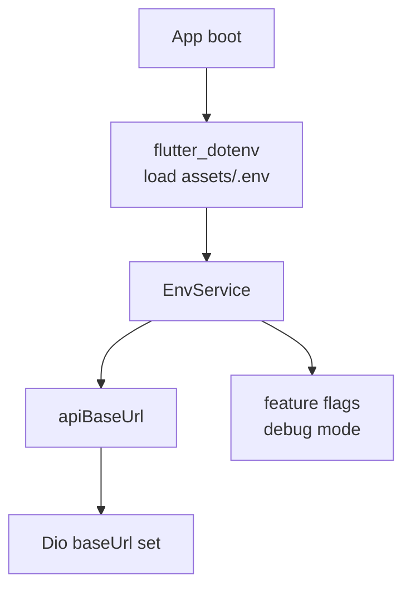

# Core — API Client & Caching Flow

## Dio ApiClient Architecture

```mermaid
flowchart TD
    CALLER[Repository / Service] --> CLIENT[ApiClient\nlib/shared/services/api_client.dart]

    CLIENT --> CACHE_CHECK{In 30s\nin-memory cache?}
    CACHE_CHECK -->|GET hit| CACHED[Return cached response]
    CACHE_CHECK -->|miss| DIO[Dio HTTP request]

    DIO --> HEADERS[Inject headers\nAuthorization: Bearer token\nX-Org-Id\nX-Outlet-Id\nContent-Type: application/json]

    HEADERS --> ENV{Environment?}
    ENV -->|dev| DEV_URL[http://localhost:3001/api/v1/]
    ENV -->|prod| PROD_URL[https://zabnix-backend.vercel.app/api/v1/]

    DEV_URL --> BACKEND[NestJS Backend]
    PROD_URL --> BACKEND

    BACKEND --> RESP[Response]
    RESP -->|2xx| PARSE[Parse response body\n{ success, message, data }]
    PARSE --> STORE_CACHE[Store in 30s cache\nGET requests only]
    STORE_CACHE --> RETURN[Return data]

    RESP -->|4xx/5xx| ERR_HANDLER[ErrorHandler\nparse backend error message]
    ERR_HANDLER --> APP_EX[Throw AppException]
    APP_EX --> UI_ERR[ZerpaiToast error\nor ErrorHandler.handle]
```

## Standard Response Format



## Cache Invalidation



## Environment Config


