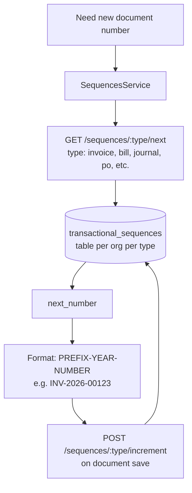
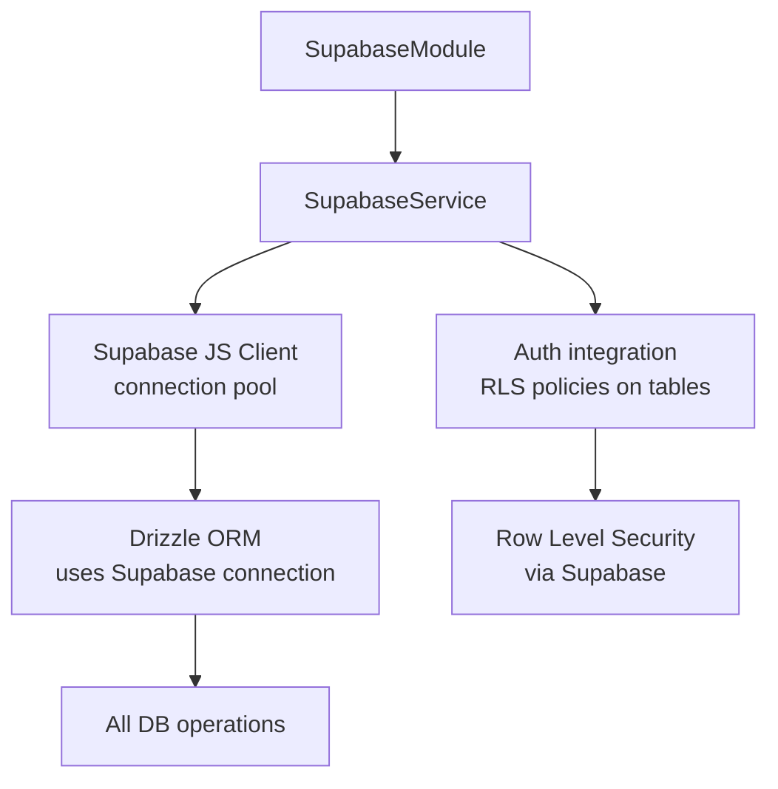

# Core — Backend Middleware & Infrastructure

## Request Lifecycle (NestJS)

```mermaid
flowchart TD
    REQ[Incoming HTTP Request] --> CORS[CORS Middleware\ncors_config.json]
    CORS --> TENANT[TenantMiddleware\nExtract x-entity-id\nResolve entity_id via organisation_branch_master\nAttach to Request context]
    TENANT --> AUTH_GUARD[AuthGuard\nJWT validation]
    AUTH_GUARD -->|invalid token| 401[401 Unauthorized]
    AUTH_GUARD -->|valid| INTERCEPT[StandardResponseInterceptor\nWrap response in { data, meta }]
    INTERCEPT --> CTRL[Route Controller]
    CTRL --> SVC[Service Layer]
    SVC --> DRIZZLE[Drizzle ORM]
    DRIZZLE --> DB[(Supabase PostgreSQL)]
    DB --> RESP[Response]
    RESP --> AUDIT[AuditInterceptor\nLog operation]
    AUDIT --> INTERCEPT2[Wrap in { data, meta }]
    INTERCEPT2 --> CLIENT[Return to client]

    CTRL -->|exception| FILTER[GlobalExceptionFilter\nFormat error response]
    FILTER --> ERR_RESP[{ success: false, message, error }]
```

## Standard Response Wrapper

```mermaid
graph TD
    SRI[StandardResponseInterceptor] --> FORMAT[Wraps all responses]
    FORMAT --> SUCCESS[Success:\n{ data: T, meta: { message, code } }]
    FORMAT --> PAGED[Paginated:\n{ data: T[], meta: { total, page, limit } }]
    FORMAT --> FAIL[Error:\n{ meta: { message, error, success: false } }]
```

## Tenant Context

```mermaid
    MW[TenantMiddleware] --> H[req.headers['x-entity-id']]
    H --> CTX[req.tenantContext]
    CTX --> SVC[Injected into controllers\nvia @Tenant() decorator]
    SVC --> QUERY[All DB queries include\nWHERE entity_id = tenantContext.entityId]
```

## Sequence / Document Numbering



## Supabase Connection


