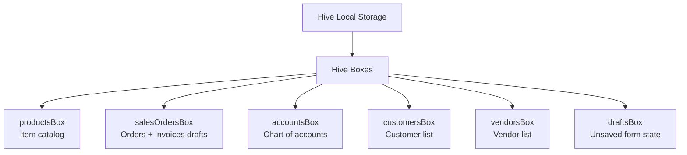
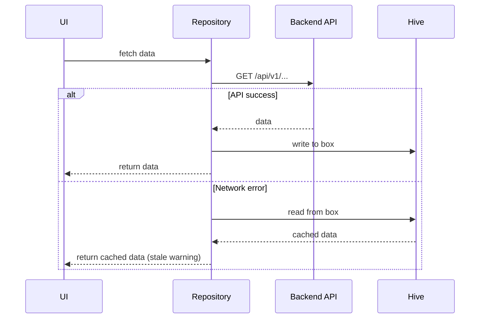
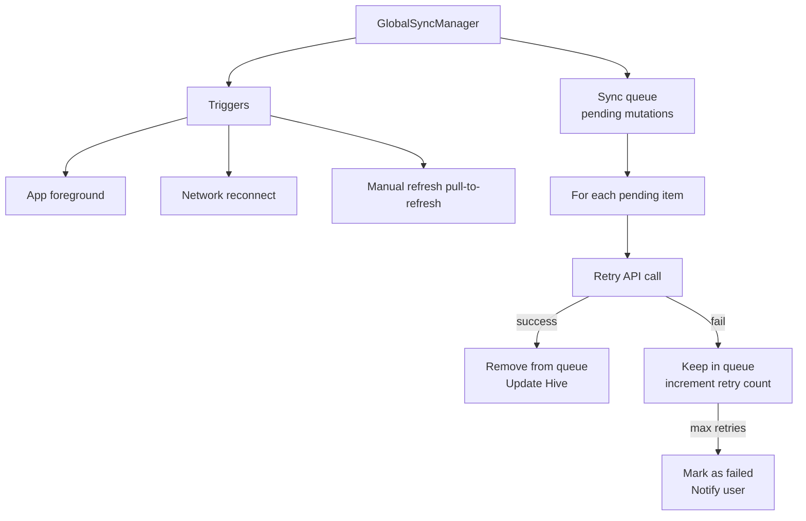
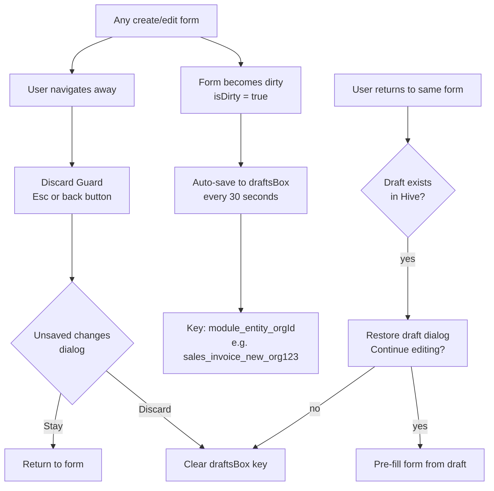

# Core — Offline & Sync Flow

## Hive Offline Architecture

```mermaid
graph TD
    HIVE[Hive Local Storage] --> BOXES[Hive Boxes]

    BOXES --> PB[productsBox\nItem catalog]
    BOXES --> SOB[salesOrdersBox\nOrders + Invoices drafts]
    BOXES --> AB[accountsBox\nChart of accounts]
    BOXES --> CB[customersBox\nCustomer list]
    BOXES --> VB[vendorsBox\nVendor list]
    BOXES --> DRAFT[draftsBox\nUnsaved form state]
```

## Online-First with Offline Fallback Pattern

```mermaid
sequenceDiagram
    participant UI
    participant Repo as Repository
    participant API as Backend API
    participant Hive

    UI->>Repo: fetch data
    Repo->>API: GET /api/v1/...
    alt API success
        API-->>Repo: data
        Repo->>Hive: write to box
        Repo-->>UI: return data
    else Network error
        Repo->>Hive: read from box
        Hive-->>Repo: cached data
        Repo-->>UI: return cached data (stale warning)
    end
```

## Background Sync Manager

```mermaid
flowchart TD
    SYNC[GlobalSyncManager] --> TRIGGER[Triggers]
    TRIGGER --> T1[App foreground]
    TRIGGER --> T2[Network reconnect]
    TRIGGER --> T3[Manual refresh pull-to-refresh]

    SYNC --> QUEUE[Sync queue\npending mutations]
    QUEUE --> ITEM[For each pending item]
    ITEM --> RETRY[Retry API call]
    RETRY -->|success| REMOVE[Remove from queue\nUpdate Hive]
    RETRY -->|fail| KEEP[Keep in queue\nincrement retry count]
    KEEP -->|max retries| FLAG[Mark as failed\nNotify user]
```

## Draft Auto-Save Flow

```mermaid
flowchart TD
    FORM[Any create/edit form] --> DIRTY[Form becomes dirty\nisDirty = true]
    DIRTY --> AUTO[Auto-save to draftsBox\nevery 30 seconds]
    AUTO --> KEY[Key: module_entity_orgId\ne.g. sales_invoice_new_org123]

    FORM --> ABANDON[User navigates away]
    ABANDON --> GUARD[Discard Guard\nEsc or back button]
    GUARD --> DIALOG{Unsaved changes\ndialog}
    DIALOG -->|Discard| CLEAR[Clear draftsBox key]
    DIALOG -->|Stay| RESUME[Return to form]

    NEXT_VISIT[User returns to same form] --> CHECK_DRAFT{Draft exists\nin Hive?}
    CHECK_DRAFT -->|yes| RESTORE_DIALOG[Restore draft dialog\nContinue editing?]
    RESTORE_DIALOG -->|yes| RESTORE[Pre-fill form from draft]
    RESTORE_DIALOG -->|no| CLEAR
```
