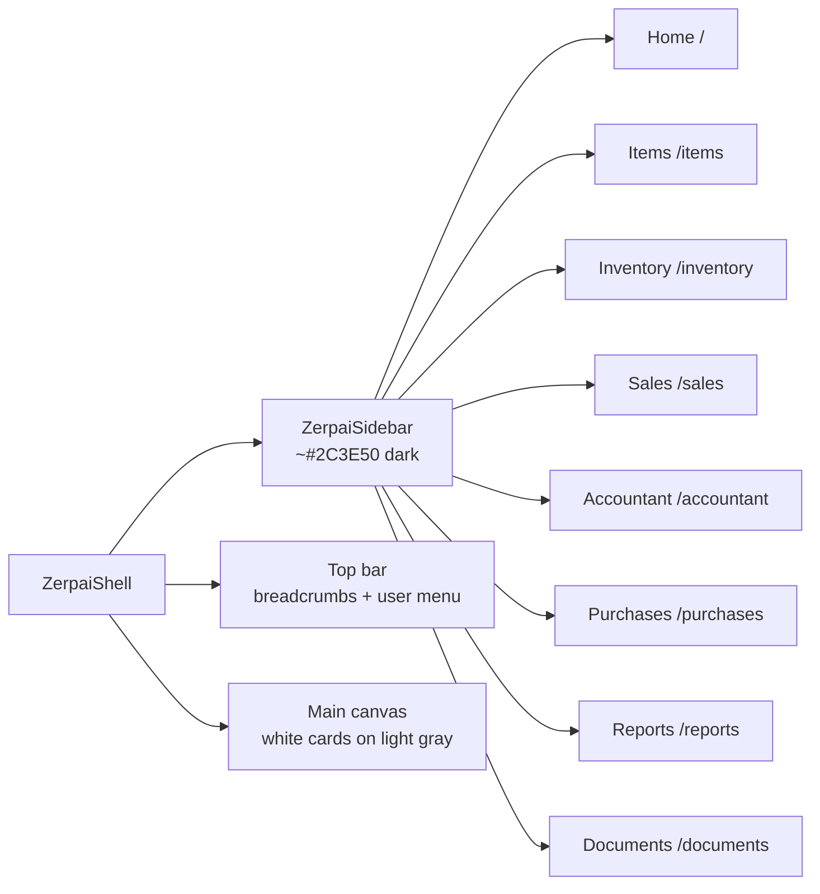
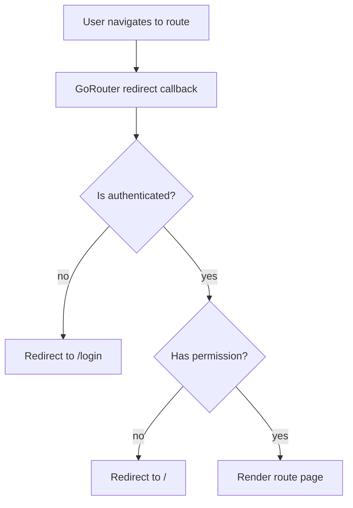
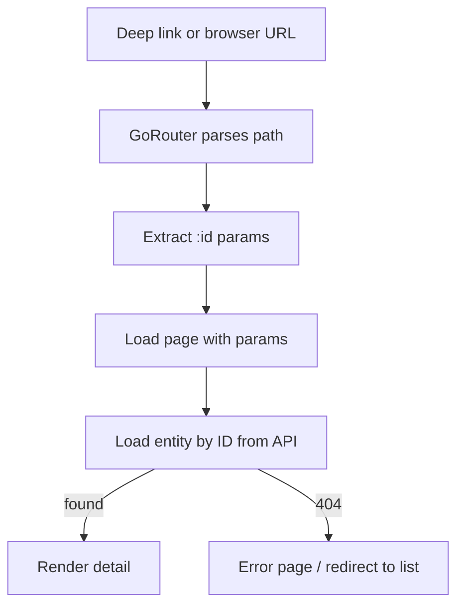

# Core — Routing & Navigation Flow

## GoRouter Boot Flow

```mermaid
flowchart TD
    APP[main.dart] --> ROUTER[GoRouter\nlib/core/routing/app_router.dart]
    ROUTER --> REDIRECT{authProvider state?}
    REDIRECT -->|Authenticated| SHELL[ZerpaiShell\nlayout with sidebar]
    REDIRECT -->|Unauthenticated| LOGIN[/login]
    REDIRECT -->|Loading| SPLASH[/splash]

    SHELL --> SIDEBAR[ZerpaiSidebar\n8 nav items]
    SIDEBAR --> CONTENT[Route content area]
```

## Shell Layout



## Route Guard Flow



## Deep Link Handling


