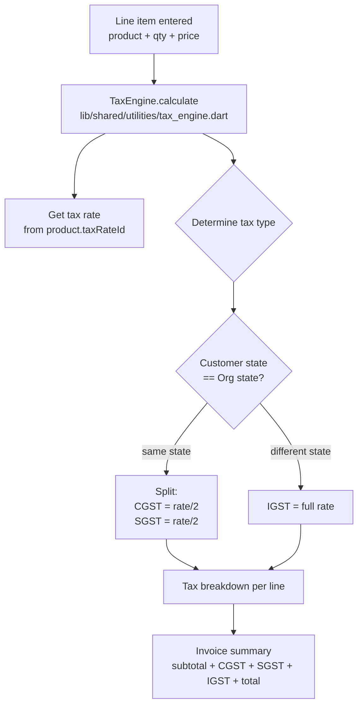
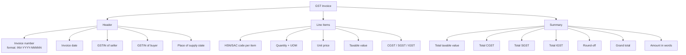
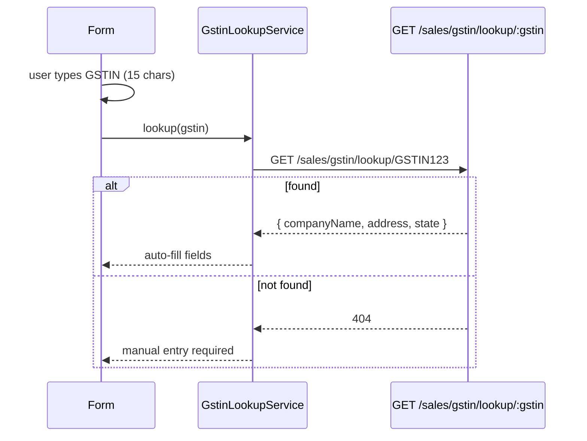
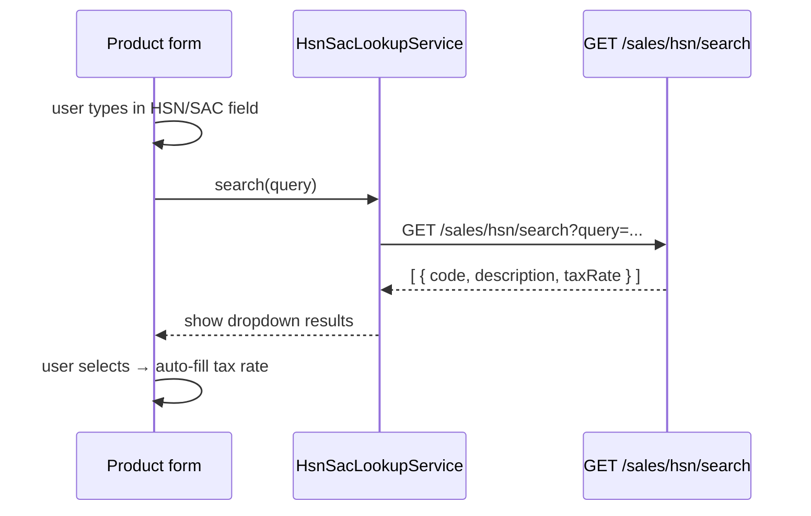

# Core — Tax Engine & GST Flow

## Tax Calculation Flow

```mermaid
flowchart TD
    LINE_ITEM[Line item entered\nproduct + qty + price] --> ENGINE[TaxEngine.calculate\nlib/shared/utilities/tax_engine.dart]

    ENGINE --> FETCH_RATE[Get tax rate\nfrom product.taxRateId]
    ENGINE --> DETECT_TYPE{Determine tax type}
    DETECT_TYPE --> CHECK_STATE{Customer state\n== Org state?}
    CHECK_STATE -->|same state| CGST_SGST[Split:\nCGST = rate/2\nSGST = rate/2]
    CHECK_STATE -->|different state| IGST[IGST = full rate]

    CGST_SGST --> RESULT[Tax breakdown per line]
    IGST --> RESULT
    RESULT --> SUMMARY[Invoice summary\nsubtotal + CGST + SGST + IGST + total]
```

## GST Invoice Structure

```mermaid
graph TD
    INV[GST Invoice]

    INV --> HEADER[Header]
    HEADER --> H1[Invoice number\nformat: INV-YYYY-NNNNN]
    HEADER --> H2[Invoice date]
    HEADER --> H3[GSTIN of seller]
    HEADER --> H4[GSTIN of buyer]
    HEADER --> H5[Place of supply state]

    INV --> ITEMS[Line Items]
    ITEMS --> I1[HSN/SAC code per item]
    ITEMS --> I2[Quantity + UOM]
    ITEMS --> I3[Unit price]
    ITEMS --> I4[Taxable value]
    ITEMS --> I5[CGST / SGST / IGST]

    INV --> SUMMARY[Summary]
    SUMMARY --> S1[Total taxable value]
    SUMMARY --> S2[Total CGST]
    SUMMARY --> S3[Total SGST]
    SUMMARY --> S4[Total IGST]
    SUMMARY --> S5[Round-off]
    SUMMARY --> S6[Grand total]
    SUMMARY --> S7[Amount in words]
```

## GSTIN Lookup Flow

```mermaid
sequenceDiagram
    participant UI as Form
    participant SVC as GstinLookupService
    participant API as GET /sales/gstin/lookup/:gstin

    UI->>UI: user types GSTIN (15 chars)
    UI->>SVC: lookup(gstin)
    SVC->>API: GET /sales/gstin/lookup/GSTIN123
    alt found
        API-->>SVC: { companyName, address, state }
        SVC-->>UI: auto-fill fields
    else not found
        API-->>SVC: 404
        SVC-->>UI: manual entry required
    end
```

## HSN/SAC Lookup Flow

```mermaid
sequenceDiagram
    participant UI as Product form
    participant SVC as HsnSacLookupService
    participant API as GET /sales/hsn/search

    UI->>UI: user types in HSN/SAC field
    UI->>SVC: search(query)
    SVC->>API: GET /sales/hsn/search?query=...
    API-->>SVC: [ { code, description, taxRate } ]
    SVC-->>UI: show dropdown results
    UI->>UI: user selects → auto-fill tax rate
```
