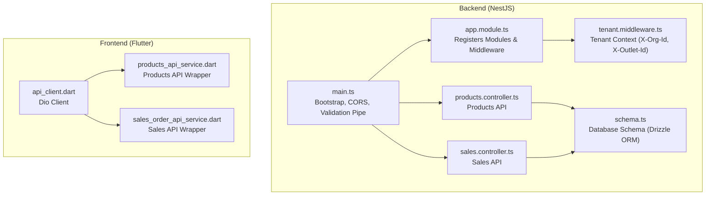
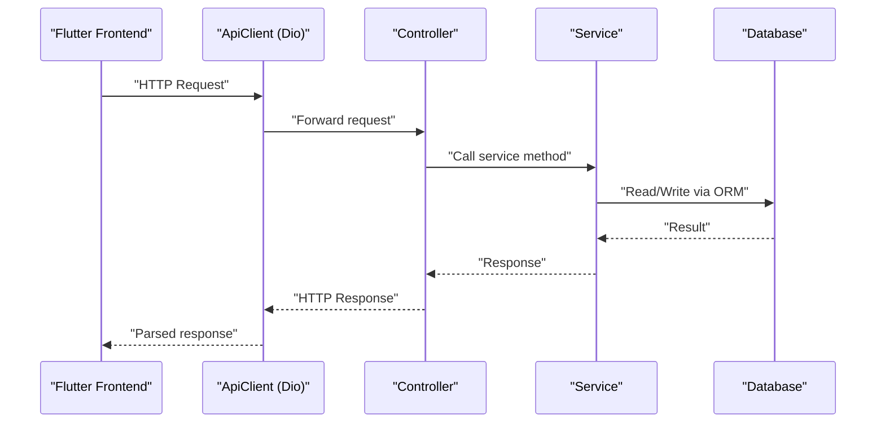
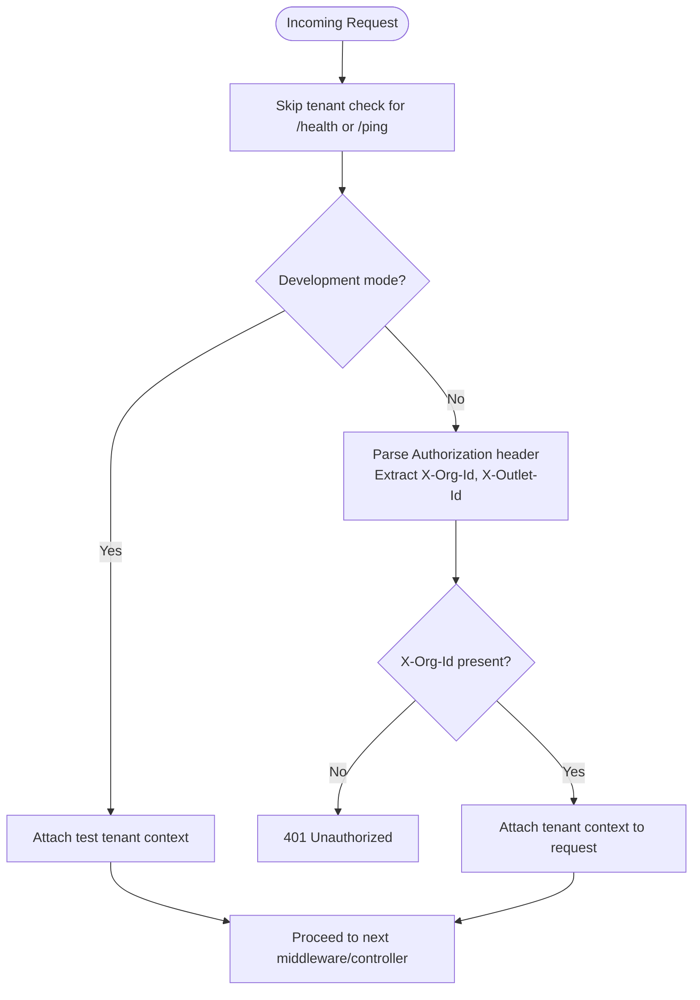
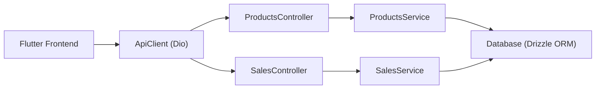
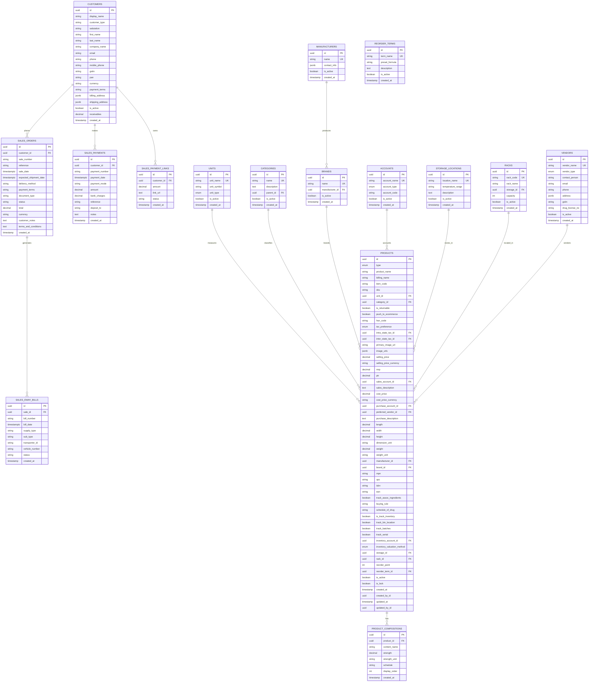

# API Reference

<cite>
**Referenced Files in This Document**
- [backend/src/main.ts](file://backend/src/main.ts)
- [backend/src/app.module.ts](file://backend/src/app.module.ts)
- [backend/src/common/middleware/tenant.middleware.ts](file://backend/src/common/middleware/tenant.middleware.ts)
- [backend/src/products/products.controller.ts](file://backend/src/products/products.controller.ts)
- [backend/src/products/dto/create-product.dto.ts](file://backend/src/products/dto/create-product.dto.ts)
- [backend/src/products/dto/update-product.dto.ts](file://backend/src/products/dto/update-product.dto.ts)
- [backend/src/products/products.service.ts](file://backend/src/products/products.service.ts)
- [backend/src/sales/sales.controller.ts](file://backend/src/sales/sales.controller.ts)
- [backend/src/sales/sales.service.ts](file://backend/src/sales/sales.service.ts)
- [backend/src/db/schema.ts](file://backend/src/db/schema.ts)
- [backend/.env.example](file://backend/.env.example)
- [cors_config.json](file://cors_config.json)
- [lib/shared/services/api_client.dart](file://lib/shared/services/api_client.dart)
- [lib/modules/items/services/products_api_service.dart](file://lib/modules/items/services/products_api_service.dart)
- [lib/modules/sales/services/sales_order_api_service.dart](file://lib/modules/sales/services/sales_order_api_service.dart)
</cite>

## Table of Contents
1. [Introduction](#introduction)
2. [Project Structure](#project-structure)
3. [Core Components](#core-components)
4. [Architecture Overview](#architecture-overview)
5. [Detailed Component Analysis](#detailed-component-analysis)
6. [Dependency Analysis](#dependency-analysis)
7. [Performance Considerations](#performance-considerations)
8. [Troubleshooting Guide](#troubleshooting-guide)
9. [Conclusion](#conclusion)
10. [Appendices](#appendices)

## Introduction
This document describes the ZerpAI ERP REST API, covering endpoints for products management, sales operations, customer management, and related lookup synchronization. It also documents multi-tenant headers (X-Org-Id, X-Outlet-Id), authentication flow, CORS configuration, rate limiting, API versioning, and frontend client usage patterns. Where applicable, diagrams illustrate request flows and component interactions.

## Project Structure
The API is implemented as a NestJS backend with Supabase integration and a Flutter/Dart frontend client. The backend exposes REST endpoints under a base path and applies a tenant middleware to enforce multi-tenancy context. The frontend uses a shared API client built on Dio to communicate with the backend.

**Diagram sources**
- [backend/src/main.ts](file://backend/src/main.ts#L10-L56)
- [backend/src/app.module.ts](file://backend/src/app.module.ts#L9-L19)
- [backend/src/common/middleware/tenant.middleware.ts](file://backend/src/common/middleware/tenant.middleware.ts#L23-L68)
- [backend/src/products/products.controller.ts](file://backend/src/products/products.controller.ts#L19-L249)
- [backend/src/sales/sales.controller.ts](file://backend/src/sales/sales.controller.ts#L14-L101)
- [backend/src/db/schema.ts](file://backend/src/db/schema.ts#L116-L292)
- [lib/shared/services/api_client.dart](file://lib/shared/services/api_client.dart#L6-L43)
- [lib/modules/items/services/products_api_service.dart](file://lib/modules/items/services/products_api_service.dart#L7-L207)
- [lib/modules/sales/services/sales_order_api_service.dart](file://lib/modules/sales/services/sales_order_api_service.dart#L10-L191)

**Section sources**
- [backend/src/main.ts](file://backend/src/main.ts#L10-L56)
- [backend/src/app.module.ts](file://backend/src/app.module.ts#L9-L19)
- [backend/src/common/middleware/tenant.middleware.ts](file://backend/src/common/middleware/tenant.middleware.ts#L23-L68)
- [backend/src/products/products.controller.ts](file://backend/src/products/products.controller.ts#L19-L249)
- [backend/src/sales/sales.controller.ts](file://backend/src/sales/sales.controller.ts#L14-L101)
- [backend/src/db/schema.ts](file://backend/src/db/schema.ts#L116-L292)
- [lib/shared/services/api_client.dart](file://lib/shared/services/api_client.dart#L6-L43)
- [lib/modules/items/services/products_api_service.dart](file://lib/modules/items/services/products_api_service.dart#L7-L207)
- [lib/modules/sales/services/sales_order_api_service.dart](file://lib/modules/sales/services/sales_order_api_service.dart#L10-L191)

## Core Components
- Backend bootstrap and middleware:
  - CORS configuration allows selected origins and methods, including multi-tenant headers.
  - Global validation pipe enforces DTO constraints and logs detailed validation errors.
  - Tenant middleware attaches multi-tenant context to requests (currently bypassed for development).
- Controllers:
  - ProductsController: CRUD for products and lookup sync endpoints.
  - SalesController: Customer, payment, e-way bill, payment link, and sales order endpoints.
- Services:
  - ProductsService: Implements product CRUD, lookup retrieval, and metadata synchronization with conflict handling.
  - SalesService: Drizzle ORM-backed customer, sales order, payment, e-way bill, and payment link operations.
- Frontend API client:
  - Shared Dio client with base URL and interceptors.
  - Services wrapping endpoints for products and sales.

**Section sources**
- [backend/src/main.ts](file://backend/src/main.ts#L13-L42)
- [backend/src/common/middleware/tenant.middleware.ts](file://backend/src/common/middleware/tenant.middleware.ts#L23-L68)
- [backend/src/products/products.controller.ts](file://backend/src/products/products.controller.ts#L19-L249)
- [backend/src/sales/sales.controller.ts](file://backend/src/sales/sales.controller.ts#L14-L101)
- [backend/src/products/products.service.ts](file://backend/src/products/products.service.ts#L18-L194)
- [backend/src/sales/sales.service.ts](file://backend/src/sales/sales.service.ts#L6-L161)
- [lib/shared/services/api_client.dart](file://lib/shared/services/api_client.dart#L6-L43)
- [lib/modules/items/services/products_api_service.dart](file://lib/modules/items/services/products_api_service.dart#L7-L207)
- [lib/modules/sales/services/sales_order_api_service.dart](file://lib/modules/sales/services/sales_order_api_service.dart#L10-L191)

## Architecture Overview
The backend initializes CORS and validation globally, registers modules, and applies tenant middleware to all routes. Controllers delegate to services backed by database schemas. The frontend uses a shared client to call endpoints.

**Diagram sources**
- [backend/src/main.ts](file://backend/src/main.ts#L13-L42)
- [backend/src/app.module.ts](file://backend/src/app.module.ts#L9-L19)
- [backend/src/products/products.controller.ts](file://backend/src/products/products.controller.ts#L19-L249)
- [backend/src/sales/sales.controller.ts](file://backend/src/sales/sales.controller.ts#L14-L101)
- [backend/src/products/products.service.ts](file://backend/src/products/products.service.ts#L91-L118)
- [backend/src/sales/sales.service.ts](file://backend/src/sales/sales.service.ts#L30-L61)
- [lib/shared/services/api_client.dart](file://lib/shared/services/api_client.dart#L6-L43)

## Detailed Component Analysis

### Authentication and Multi-Tenant Headers
- Authentication flow:
  - Development mode: Tenant middleware currently attaches a test tenant context and skips production authentication logic.
  - Production-ready code is present but commented out; it expects Authorization header and reads X-Org-Id and X-Outlet-Id.
- Required headers:
  - X-Org-Id: Organization identifier.
  - X-Outlet-Id: Optional outlet identifier.
- Notes:
  - The current implementation does not enforce JWT verification in development.
  - Production deployment should uncomment and secure the tenant middleware logic.

**Diagram sources**
- [backend/src/common/middleware/tenant.middleware.ts](file://backend/src/common/middleware/tenant.middleware.ts#L24-L68)

**Section sources**
- [backend/src/common/middleware/tenant.middleware.ts](file://backend/src/common/middleware/tenant.middleware.ts#L23-L68)

### API Versioning and Base URL
- API prefix and version are configured via environment variables.
- Frontend client uses a configurable base URL with defaults.

Key configuration:
- API_PREFIX and API_VERSION in environment.
- Frontend base URL default fallback.

**Section sources**
- [backend/.env.example](file://backend/.env.example#L25-L27)
- [lib/shared/services/api_client.dart](file://lib/shared/services/api_client.dart#L12-L14)

### CORS Configuration
- Backend enables CORS with allowed origins, methods, and headers including multi-tenant headers.
- Additional CORS policy is provided as a separate configuration file.

**Section sources**
- [backend/src/main.ts](file://backend/src/main.ts#L19-L24)
- [cors_config.json](file://cors_config.json#L1-L21)

### Products Management Endpoints
- Base path: /products
- Endpoints:
  - GET /products
  - GET /products/:id
  - POST /products
  - PUT /products/:id
  - DELETE /products/:id
  - GET /products/lookups/units
  - POST /products/lookups/units/sync
  - POST /products/lookups/units/check-usage
  - POST /products/lookups/:lookup/check-usage
  - GET /products/lookups/content-units
  - POST /products/lookups/content-units/sync
  - GET /products/lookups/categories
  - POST /products/lookups/categories/sync
  - GET /products/lookups/tax-rates
  - GET /products/lookups/manufacturers
  - POST /products/lookups/manufacturers/sync
  - GET /products/lookups/brands
  - POST /products/lookups/brands/sync
  - GET /products/lookups/vendors
  - POST /products/lookups/vendors/sync
  - GET /products/lookups/storage-locations
  - POST /products/lookups/storage-locations/sync
  - GET /products/lookups/racks
  - POST /products/lookups/racks/sync
  - GET /products/lookups/reorder-terms
  - POST /products/lookups/reorder-terms/sync
  - GET /products/lookups/accounts
  - POST /products/lookups/accounts/sync
  - GET /products/lookups/contents
  - POST /products/lookups/contents/sync
  - GET /products/lookups/strengths
  - POST /products/lookups/strengths/sync
  - GET /products/lookups/buying-rules
  - POST /products/lookups/buying-rules/sync
  - GET /products/lookups/drug-schedules
  - POST /products/lookups/drug-schedules/sync

Request/response characteristics:
- Validation: DTOs define strict field constraints and optional fields.
- Synchronization endpoints accept arrays and perform upserts with conflict resolution.
- Usage-check endpoints return whether a lookup value is still referenced.

Common usage patterns:
- Use GET /products/lookups/* to populate dropdowns and forms.
- Use POST /products/lookups/*/sync to keep master data in sync.
- Use POST /products/lookups/*/check-usage before deletion to avoid breaking references.

**Section sources**
- [backend/src/products/products.controller.ts](file://backend/src/products/products.controller.ts#L19-L249)
- [backend/src/products/dto/create-product.dto.ts](file://backend/src/products/dto/create-product.dto.ts#L21-L245)
- [backend/src/products/dto/update-product.dto.ts](file://backend/src/products/dto/update-product.dto.ts#L6-L7)
- [backend/src/products/products.service.ts](file://backend/src/products/products.service.ts#L18-L194)
- [backend/src/db/schema.ts](file://backend/src/db/schema.ts#L116-L207)

### Sales Operations Endpoints
- Base path: /sales
- Endpoints:
  - GET /sales/customers
  - GET /sales/customers/:id
  - POST /sales/customers
  - GET /sales/gstin/lookup?gstin={gstin}
  - GET /sales/payments
  - POST /sales/payments
  - GET /sales/eway-bills
  - POST /sales/eway-bills
  - GET /sales/payment-links
  - POST /sales/payment-links
  - GET /sales?type={type}
  - GET /sales/:id
  - POST /sales
  - DELETE /sales/:id

Notes:
- GSTIN lookup is currently mocked; in production, integrate with an external GST registry API.
- Sales orders support filtering by type via query parameter.

**Section sources**
- [backend/src/sales/sales.controller.ts](file://backend/src/sales/sales.controller.ts#L14-L101)
- [backend/src/sales/sales.service.ts](file://backend/src/sales/sales.service.ts#L8-L161)
- [backend/src/db/schema.ts](file://backend/src/db/schema.ts#L213-L292)

### Request and Response Examples
- Example: Create a product
  - Method: POST /products
  - Content-Type: application/json
  - Request body: JSON matching CreateProductDto fields (e.g., type, product_name, item_code, unit_id, pricing, inventory settings).
  - Response: Created product object (fields match database schema).
- Example: Get sales orders filtered by type
  - Method: GET /sales?type=order
  - Response: Array of sales orders with fields from the sales_orders table.
- Example: Sync units
  - Method: POST /products/lookups/units/sync
  - Request body: Array of unit objects with fields mapped to units table.
  - Response: Upserted unit records.

Note: For exact field names and types, refer to the DTOs and schema.

**Section sources**
- [backend/src/products/dto/create-product.dto.ts](file://backend/src/products/dto/create-product.dto.ts#L21-L245)
- [backend/src/db/schema.ts](file://backend/src/db/schema.ts#L116-L195)
- [backend/src/sales/sales.controller.ts](file://backend/src/sales/sales.controller.ts#L78-L95)
- [backend/src/db/schema.ts](file://backend/src/db/schema.ts#L236-L253)

### Error Codes and Status Handling
- Validation failures:
  - Global ValidationPipe returns structured error messages with field, constraints, and value.
- Product creation/update conflicts:
  - Duplicate item codes trigger a conflict error.
- Not found:
  - Sales and customer endpoints return not found when records are missing.
- Development tenant bypass:
  - Requests proceed without enforcing tenant context in development.

Typical HTTP statuses:
- 200 OK (success)
- 201 Created (resource created)
- 400 Bad Request (validation errors)
- 401 Unauthorized (missing or invalid tenant context)
- 404 Not Found (resource not found)
- 409 Conflict (duplicate item code)
- 500 Internal Server Error (unexpected server errors)

**Section sources**
- [backend/src/main.ts](file://backend/src/main.ts#L26-L42)
- [backend/src/products/products.service.ts](file://backend/src/products/products.service.ts#L45-L51)
- [backend/src/sales/sales.service.ts](file://backend/src/sales/sales.service.ts#L34-L40)

### Rate Limiting
- No explicit rate limiting is implemented in the backend code reviewed.
- Consider adding rate limiting at the reverse proxy or API gateway level for production deployments.

[No sources needed since this section provides general guidance]

### API Client Implementation (Frontend)
- ApiClient:
  - Singleton Dio client with base URL from environment.
  - Global interceptors for logging requests, responses, and errors.
  - Helper methods for GET, POST, PUT, DELETE.
- ProductsApiService:
  - Wraps /products endpoints, maps responses to Item model, and formats validation errors.
- SalesOrderApiService:
  - Wraps /sales endpoints for customers, payments, e-way bills, payment links, and sales orders.

Common usage patterns:
- Call getProducts/getProductById/createProduct/updateProduct/deleteProduct.
- Use getCustomers/getPayments/getEWayBills/getPaymentLinks and create variants.
- Handle DioException to surface user-friendly error messages.

**Section sources**
- [lib/shared/services/api_client.dart](file://lib/shared/services/api_client.dart#L6-L61)
- [lib/modules/items/services/products_api_service.dart](file://lib/modules/items/services/products_api_service.dart#L51-L136)
- [lib/modules/sales/services/sales_order_api_service.dart](file://lib/modules/sales/services/sales_order_api_service.dart#L14-L132)

### Security Considerations
- Multi-tenant headers:
  - Always set X-Org-Id and optionally X-Outlet-Id on requests.
- Authentication:
  - Development mode bypasses production auth; enable production-ready tenant middleware before deploying to production.
- CORS:
  - Configure allowed origins carefully; restrict methods and headers to the minimum required.
- Data validation:
  - DTO validation prevents malformed payloads; ensure clients honor returned validation errors.

**Section sources**
- [backend/src/common/middleware/tenant.middleware.ts](file://backend/src/common/middleware/tenant.middleware.ts#L41-L67)
- [backend/src/main.ts](file://backend/src/main.ts#L19-L24)

### API Testing Strategies
- Unit tests:
  - Backend uses Jest; DTOs and services are covered by unit tests.
- End-to-end tests:
  - Backend includes an e2e test target; use it to validate controller flows.
- Manual testing:
  - Use curl to exercise endpoints; include multi-tenant headers and appropriate content types.

Example curl commands:
- Get products: curl -H "X-Org-Id: YOUR_ORG_ID" http://localhost:3001/products
- Create product: curl -X POST -H "X-Org-Id: YOUR_ORG_ID" -H "Content-Type: application/json" -d '{...}' http://localhost:3001/products
- Sync units: curl -X POST -H "X-Org-Id: YOUR_ORG_ID" -H "Content-Type: application/json" -d '[{...}]' http://localhost:3001/products/lookups/units/sync
- Get sales orders: curl -H "X-Org-Id: YOUR_ORG_ID" "http://localhost:3001/sales?type=order"
- Create sales order: curl -X POST -H "X-Org-Id: YOUR_ORG_ID" -H "Content-Type: application/json" -d '{...}' http://localhost:3001/sales

**Section sources**
- [backend/package.json](file://backend/package.json#L16-L20)

## Dependency Analysis

**Diagram sources**
- [lib/shared/services/api_client.dart](file://lib/shared/services/api_client.dart#L6-L43)
- [lib/modules/items/services/products_api_service.dart](file://lib/modules/items/services/products_api_service.dart#L7-L207)
- [lib/modules/sales/services/sales_order_api_service.dart](file://lib/modules/sales/services/sales_order_api_service.dart#L10-L191)
- [backend/src/products/products.controller.ts](file://backend/src/products/products.controller.ts#L19-L249)
- [backend/src/sales/sales.controller.ts](file://backend/src/sales/sales.controller.ts#L14-L101)
- [backend/src/products/products.service.ts](file://backend/src/products/products.service.ts#L91-L118)
- [backend/src/sales/sales.service.ts](file://backend/src/sales/sales.service.ts#L30-L61)

**Section sources**
- [backend/src/db/schema.ts](file://backend/src/db/schema.ts#L116-L292)

## Performance Considerations
- DTO validation occurs before service logic; keep payloads minimal to reduce validation overhead.
- Use lookup sync endpoints to batch updates and minimize repeated writes.
- Pagination and filtering should be implemented on the client side for large datasets.

[No sources needed since this section provides general guidance]

## Troubleshooting Guide
- Validation errors:
  - Inspect the structured error payload returned by the ValidationPipe for field-level constraints.
- Product creation conflicts:
  - Duplicate item codes cause a conflict; change the item_code and retry.
- Not found resources:
  - Ensure IDs exist before GET/PUT/DELETE operations.
- Tenant context issues:
  - Confirm X-Org-Id is set; in development, tenant middleware attaches a test context.

**Section sources**
- [backend/src/main.ts](file://backend/src/main.ts#L26-L42)
- [backend/src/products/products.service.ts](file://backend/src/products/products.service.ts#L45-L51)
- [backend/src/sales/sales.service.ts](file://backend/src/sales/sales.service.ts#L34-L40)

## Conclusion
ZerpAI ERP provides a modular REST API for products and sales with robust DTO validation and multi-tenant headers. The frontend client integrates seamlessly with the backend. For production, enable the production-ready tenant middleware, tighten CORS, and consider adding rate limiting and comprehensive error handling.

[No sources needed since this section summarizes without analyzing specific files]

## Appendices

### Endpoint Catalog

- Products
  - GET /products
  - GET /products/:id
  - POST /products
  - PUT /products/:id
  - DELETE /products/:id
  - GET /products/lookups/units
  - POST /products/lookups/units/sync
  - POST /products/lookups/units/check-usage
  - POST /products/lookups/:lookup/check-usage
  - GET /products/lookups/content-units
  - POST /products/lookups/content-units/sync
  - GET /products/lookups/categories
  - POST /products/lookups/categories/sync
  - GET /products/lookups/tax-rates
  - GET /products/lookups/manufacturers
  - POST /products/lookups/manufacturers/sync
  - GET /products/lookups/brands
  - POST /products/lookups/brands/sync
  - GET /products/lookups/vendors
  - POST /products/lookups/vendors/sync
  - GET /products/lookups/storage-locations
  - POST /products/lookups/storage-locations/sync
  - GET /products/lookups/racks
  - POST /products/lookups/racks/sync
  - GET /products/lookups/reorder-terms
  - POST /products/lookups/reorder-terms/sync
  - GET /products/lookups/accounts
  - POST /products/lookups/accounts/sync
  - GET /products/lookups/contents
  - POST /products/lookups/contents/sync
  - GET /products/lookups/strengths
  - POST /products/lookups/strengths/sync
  - GET /products/lookups/buying-rules
  - POST /products/lookups/buying-rules/sync
  - GET /products/lookups/drug-schedules
  - POST /products/lookups/drug-schedules/sync

- Sales
  - GET /sales/customers
  - GET /sales/customers/:id
  - POST /sales/customers
  - GET /sales/gstin/lookup?gstin={gstin}
  - GET /sales/payments
  - POST /sales/payments
  - GET /sales/eway-bills
  - POST /sales/eway-bills
  - GET /sales/payment-links
  - POST /sales/payment-links
  - GET /sales?type={type}
  - GET /sales/:id
  - POST /sales
  - DELETE /sales/:id

**Section sources**
- [backend/src/products/products.controller.ts](file://backend/src/products/products.controller.ts#L19-L249)
- [backend/src/sales/sales.controller.ts](file://backend/src/sales/sales.controller.ts#L14-L101)

### Data Models Overview

**Diagram sources**
- [backend/src/db/schema.ts](file://backend/src/db/schema.ts#L116-L292)