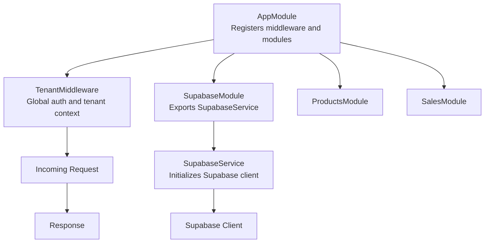
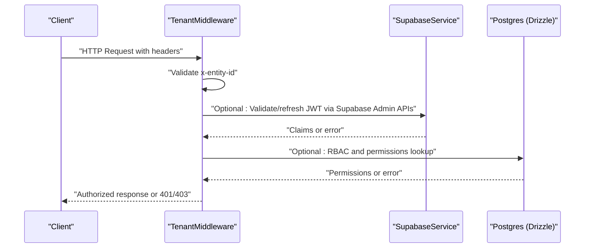
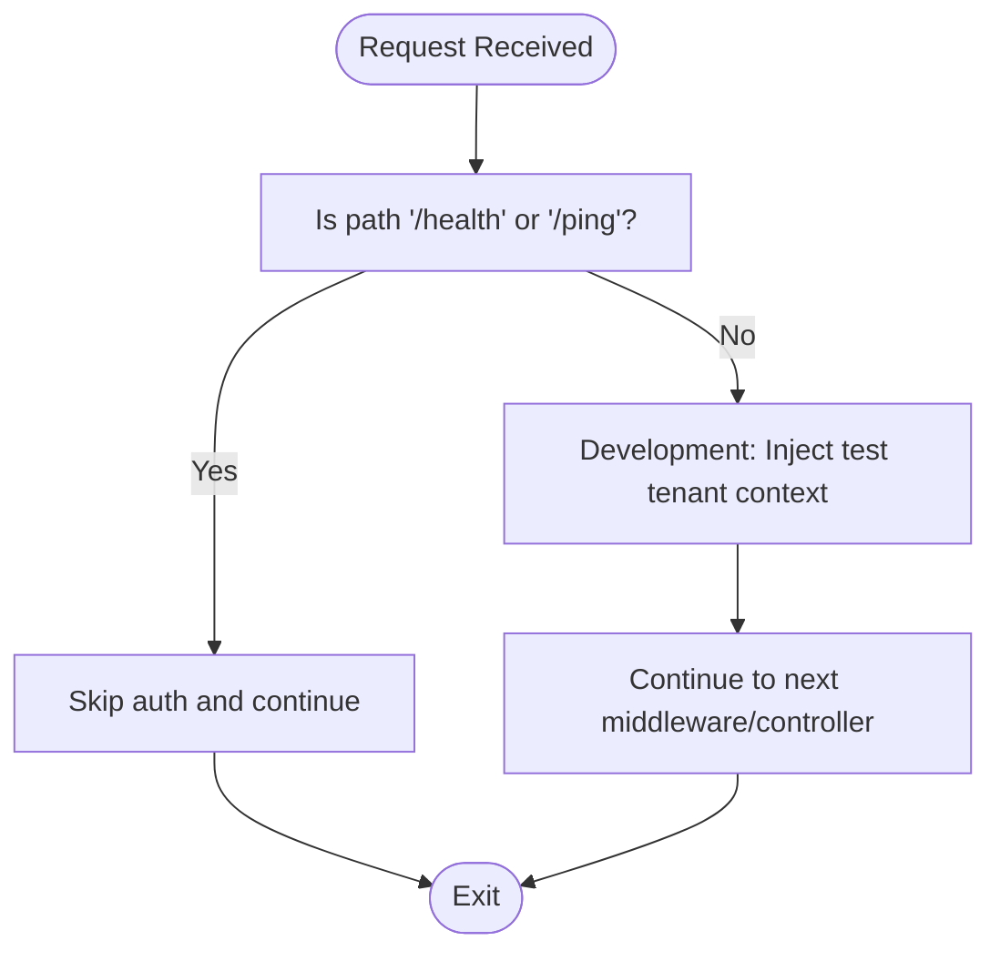
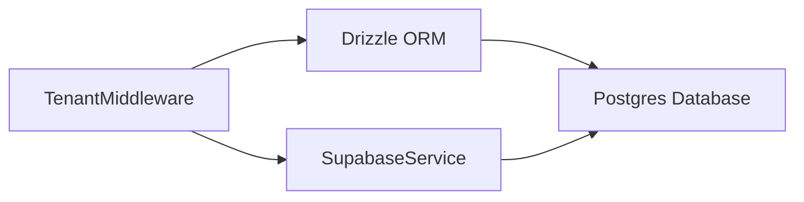

# Authentication API

<cite>
**Referenced Files in This Document**
- [app.module.ts](file://backend/src/app.module.ts)
- [tenant.middleware.ts](file://backend/src/common/middleware/tenant.middleware.ts)
- [supabase.module.ts](file://backend/src/supabase/supabase.module.ts)
- [supabase.service.ts](file://backend/src/supabase/supabase.service.ts)
- [db.ts](file://backend/src/db/db.ts)
- [schema.ts](file://backend/src/db/schema.ts)
- [cors_config.json](file://cors_config.json)
- [vercel.json](file://vercel.json)
</cite>

## Table of Contents
1. [Introduction](#introduction)
2. [Project Structure](#project-structure)
3. [Core Components](#core-components)
4. [Architecture Overview](#architecture-overview)
5. [Detailed Component Analysis](#detailed-component-analysis)
6. [Dependency Analysis](#dependency-analysis)
7. [Performance Considerations](#performance-considerations)
8. [Troubleshooting Guide](#troubleshooting-guide)
9. [Conclusion](#conclusion)
10. [Appendices](#appendices)

## Introduction
This document provides comprehensive API documentation for ZerpAI ERP authentication and authorization endpoints. It focuses on the multi-tenant authentication flow, including the usage of the x-entity-id header, JWT token generation and validation, and tenant isolation. It also documents RBAC, permission checking, session management, middleware implementation, token expiration handling, and security considerations. Where applicable, curl examples and integration patterns for frontend applications are included.

## Project Structure
ZerpAI ERP’s backend is a NestJS application with a modular structure. Authentication and tenant context are enforced via middleware applied globally to all routes. Supabase is configured as the identity provider and is used for administrative tasks. Database access is handled via Drizzle ORM connected to Postgres.

**Diagram sources**
- [app.module.ts](file://backend/src/app.module.ts#L9-L19)
- [tenant.middleware.ts](file://backend/src/common/middleware/tenant.middleware.ts#L22-L69)
- [supabase.module.ts](file://backend/src/supabase/supabase.module.ts#L6-L11)
- [supabase.service.ts](file://backend/src/supabase/supabase.service.ts#L6-L31)

**Section sources**
- [app.module.ts](file://backend/src/app.module.ts#L1-L20)
- [tenant.middleware.ts](file://backend/src/common/middleware/tenant.middleware.ts#L1-L70)
- [supabase.module.ts](file://backend/src/supabase/supabase.module.ts#L1-L12)
- [supabase.service.ts](file://backend/src/supabase/supabase.service.ts#L1-L32)

## Core Components
- TenantMiddleware: Enforces tenant context on all requests, validates required headers, and attaches a TenantContext object to the request. Includes placeholder logic for JWT verification and production-ready auth flow.
- SupabaseService: Initializes the Supabase client with environment variables and disables automatic token refresh and session persistence.
- SupabaseModule: Exports the Supabase service globally for use across the application.
- Database Layer: Drizzle ORM connects to Postgres using DATABASE_URL and exposes typed tables for application models.

**Section sources**
- [tenant.middleware.ts](file://backend/src/common/middleware/tenant.middleware.ts#L22-L69)
- [supabase.service.ts](file://backend/src/supabase/supabase.service.ts#L6-L31)
- [supabase.module.ts](file://backend/src/supabase/supabase.module.ts#L6-L11)
- [db.ts](file://backend/src/db/db.ts#L1-L13)
- [schema.ts](file://backend/src/db/schema.ts#L1-L293)

## Architecture Overview
The authentication and authorization architecture centers around a global middleware that enforces tenant context and validates incoming requests. Supabase is used for identity administration and can be extended to handle JWT issuance and validation. The database schema defines entities used for multi-tenancy and user roles.

**Diagram sources**
- [tenant.middleware.ts](file://backend/src/common/middleware/tenant.middleware.ts#L24-L66)
- [supabase.service.ts](file://backend/src/supabase/supabase.service.ts#L18-L23)
- [db.ts](file://backend/src/db/db.ts#L7-L12)

## Detailed Component Analysis

### Tenant Authentication Flow
The middleware enforces tenant context on all routes except health endpoints. It currently injects a test context for development but includes commented production logic for JWT verification and header parsing.

**Diagram sources**
- [tenant.middleware.ts](file://backend/src/common/middleware/tenant.middleware.ts#L24-L66)

**Section sources**
- [tenant.middleware.ts](file://backend/src/common/middleware/tenant.middleware.ts#L22-L69)

### Multi-Tenant Headers
- x-entity-id: Required header identifying the organization or branch context. Requests missing this header receive an unauthorized response.

The header is validated in the middleware and attached to the request’s tenant context.

**Section sources**
- [tenant.middleware.ts](file://backend/src/common/middleware/tenant.middleware.ts#L51-L56)
- [tenant.middleware.ts](file://backend/src/common/middleware/tenant.middleware.ts#L59-L64)

### JWT Token Generation, Validation, and Refresh
- Supabase client is initialized with autoRefreshToken and persistSession disabled, indicating manual token lifecycle management is expected elsewhere.
- The middleware includes commented production logic to verify JWTs and extract claims (userId, role) from the token. This is the intended place to integrate JWT validation and refresh.

Recommendations:
- Integrate Supabase Admin APIs to validate tokens and refresh sessions when needed.
- Store tokens securely on the client and attach Authorization headers on protected requests.
- Implement token refresh prior to expiration to avoid interruptions.

**Section sources**
- [supabase.service.ts](file://backend/src/supabase/supabase.service.ts#L18-L23)
- [tenant.middleware.ts](file://backend/src/common/middleware/tenant.middleware.ts#L41-L66)

### Login/Logout Endpoints
- Current implementation: No explicit login/logout endpoints are present in the backend code reviewed. Authentication relies on middleware enforcing tenant context and optional JWT validation.
- Recommended approach:
  - Use Supabase Auth to issue access and refresh tokens upon successful authentication.
  - Implement logout by revoking tokens via Supabase Admin APIs or clearing client-side tokens.
  - Enforce Authorization header usage on protected routes.

[No sources needed since this section provides recommended implementation guidance]

### User Registration and Password Reset
- Current implementation: Not found in the backend code reviewed.
- Recommended approach:
  - Use Supabase Auth for user registration and password reset workflows.
  - Trigger email confirmations and magic links through Supabase.
  - Protect sensitive endpoints with rate limiting and CSRF considerations.

[No sources needed since this section provides recommended implementation guidance]

### Session Management
- Supabase client initialization disables automatic token refresh and session persistence. This implies:
  - Manual session lifecycle management is required.
  - Frontend should store tokens securely and refresh them proactively.
  - Backend middleware should validate tokens per-request.

**Section sources**
- [supabase.service.ts](file://backend/src/supabase/supabase.service.ts#L18-L23)

### Role-Based Access Control (RBAC) and Permission Checking
- Current implementation: RBAC and permission checks are not visible in the backend code reviewed.
- Recommended approach:
  - Define roles and permissions in the database schema.
  - Enforce RBAC in middleware or controllers using the tenant context (entityId/role).
  - Use database policies (e.g., RLS) to enforce tenant isolation and row-level permissions.

[No sources needed since this section provides recommended implementation guidance]

### Tenant Isolation
- Tenant context is attached to each request with the entityId. Controllers and services can use this context to scope queries and operations to the correct tenant.
- Combine tenant context with database policies to prevent cross-tenant data leakage.

**Section sources**
- [tenant.middleware.ts](file://backend/src/common/middleware/tenant.middleware.ts#L59-L64)

### Authentication Middleware Implementation Details
- Applied globally to all routes via AppModule.
- Skips auth for health endpoints (/health, /ping).
- Currently injects a test tenant context during development; production logic is commented and ready for activation.

**Section sources**
- [app.module.ts](file://backend/src/app.module.ts#L14-L18)
- [tenant.middleware.ts](file://backend/src/common/middleware/tenant.middleware.ts#L24-L39)

### Token Expiration Handling
- Supabase client is configured to not auto-refresh tokens. Implement proactive refresh in the client before expiration.
- Backend middleware should validate tokens on each request and return appropriate errors when tokens are expired or invalid.

**Section sources**
- [supabase.service.ts](file://backend/src/supabase/supabase.service.ts#L20-L21)
- [tenant.middleware.ts](file://backend/src/common/middleware/tenant.middleware.ts#L41-L66)

### Security Considerations
- Use HTTPS in production to protect tokens and headers.
- Validate and sanitize the x-entity-id header server-side.
- Implement rate limiting and IP allowlists for authentication endpoints.
- Rotate secrets and regularly audit Supabase credentials.

[No sources needed since this section provides general security guidance]

### CORS Configuration for Authentication Endpoints
- Configure CORS to allow authentication-related origins and headers.
- Ensure credentials are handled properly if using cookies or Authorization headers.

**Section sources**
- [cors_config.json](file://cors_config.json)

### Security Headers
- Add security headers such as Content-Security-Policy, Strict-Transport-Security, and X-Frame-Options at the edge or reverse proxy level.
- Ensure authentication endpoints are served over HTTPS only.

[No sources needed since this section provides general security guidance]

## Dependency Analysis
The authentication and authorization stack depends on:
- TenantMiddleware for enforcing tenant context and optional JWT validation.
- SupabaseService for identity administration and potential token validation.
- Drizzle ORM and Postgres for storing user, role, and tenant data.

**Diagram sources**
- [tenant.middleware.ts](file://backend/src/common/middleware/tenant.middleware.ts#L22-L69)
- [supabase.service.ts](file://backend/src/supabase/supabase.service.ts#L6-L31)
- [db.ts](file://backend/src/db/db.ts#L1-L13)

**Section sources**
- [tenant.middleware.ts](file://backend/src/common/middleware/tenant.middleware.ts#L22-L69)
- [supabase.service.ts](file://backend/src/supabase/supabase.service.ts#L6-L31)
- [db.ts](file://backend/src/db/db.ts#L1-L13)

## Performance Considerations
- Minimize database calls in middleware by caching frequently accessed tenant and role data.
- Use efficient token validation strategies and avoid unnecessary network calls to identity providers.
- Monitor latency of authentication endpoints and apply load balancing as needed.

[No sources needed since this section provides general guidance]

## Troubleshooting Guide
Common issues and resolutions:
- Missing x-entity-id header: Ensure clients always send x-entity-id. The middleware throws an unauthorized error if missing.
- Health endpoint access: /health and /ping bypass authentication; verify these endpoints work without headers.
- Supabase environment variables: Ensure SUPABASE_URL and SUPABASE_SERVICE_ROLE_KEY are set; otherwise, the Supabase client fails to initialize.
- Token validation failures: Confirm Authorization header format and token validity. Implement proactive refresh to avoid expiration-related errors.

**Section sources**
- [tenant.middleware.ts](file://backend/src/common/middleware/tenant.middleware.ts#L24-L56)
- [supabase.service.ts](file://backend/src/supabase/supabase.service.ts#L14-L16)

## Conclusion
ZerpAI ERP’s current backend enforces tenant context via a global middleware and integrates Supabase for identity administration. While explicit login/logout endpoints and comprehensive RBAC are not present in the reviewed code, the foundation is in place to implement secure, multi-tenant authentication and authorization. By integrating JWT validation, adding RBAC checks, and implementing robust session and security controls, the system can achieve production-grade authentication and authorization.

[No sources needed since this section summarizes without analyzing specific files]

## Appendices

### Curl Examples
Note: Replace placeholders with actual values and ensure HTTPS in production.

- Authenticate and fetch tenant context:
  - curl -H "x-entity-id: YOUR_ENTITY_ID" https://your-domain.com/protected-endpoint

- Health check (no auth):
  - curl https://your-domain.com/health

- Supabase Admin API (example pattern):
  - curl -X POST -H "Authorization: Bearer SERVICE_ROLE_KEY" https://your-project.supabase.co/auth/v1/token -H "Content-Type: application/json" -d '{"grant_type":"password","email":"user@example.com","password":"password"}'

[No sources needed since this section provides general usage guidance]

### Frontend Integration Patterns
- Store tokens securely (HttpOnly cookies or secure storage) and attach Authorization headers on requests.
- Implement token refresh before expiration and handle 401 responses by prompting re-authentication.
- Use x-entity-id consistently across all authenticated requests.

[No sources needed since this section provides general integration guidance]