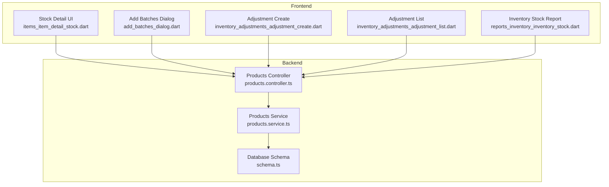
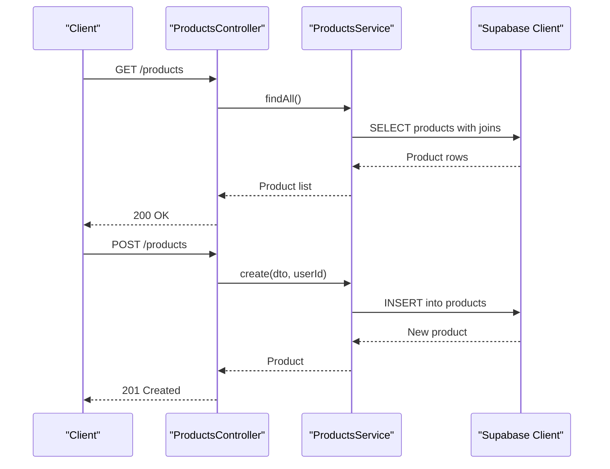
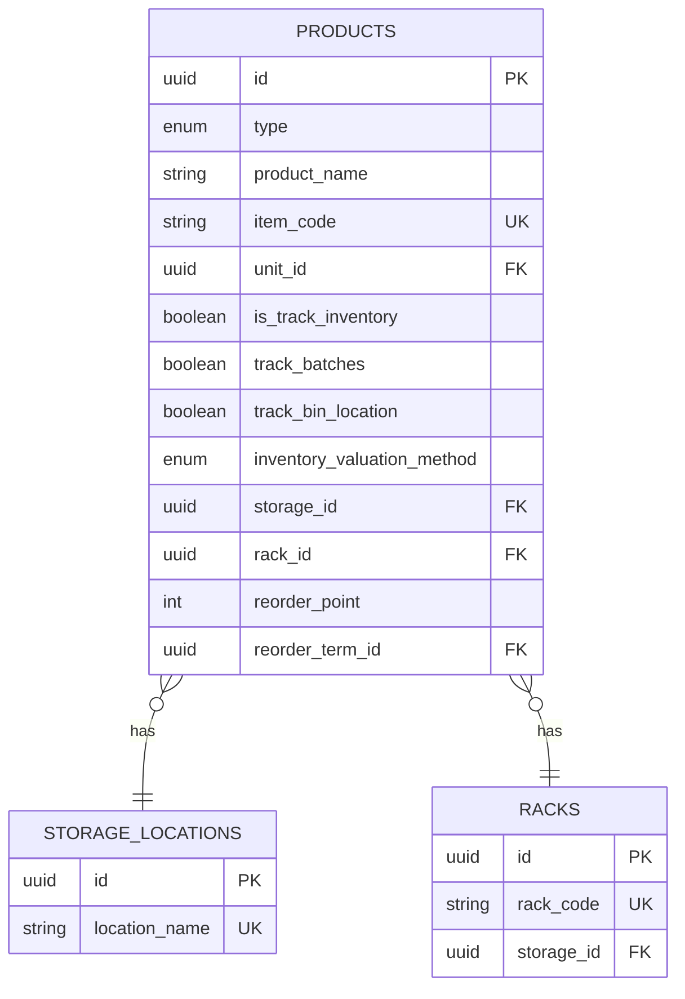
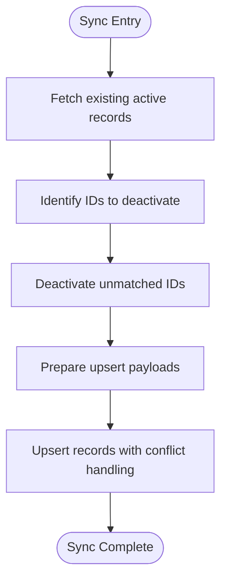
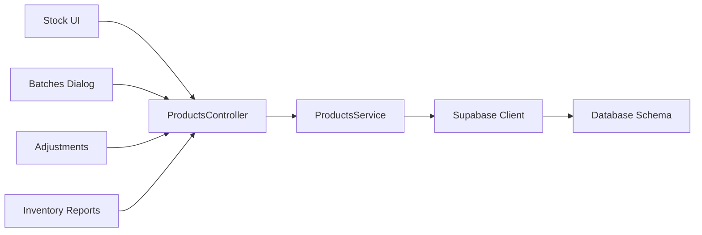

# Inventory API

<cite>
**Referenced Files in This Document**
- [schema.ts](file://backend/src/db/schema.ts)
- [products.controller.ts](file://backend/src/products/products.controller.ts)
- [products.service.ts](file://backend/src/products/products.service.ts)
- [items_item_detail_stock.dart](file://lib/modules/items/presentation/sections/items_item_detail_stock.dart)
- [add_batches_dialog.dart](file://lib/modules/inventory/assemblies/presentation/widgets/add_batches_dialog.dart)
- [inventory_adjustments_adjustment_create.dart](file://lib/modules/adjustments/presentation/inventory_adjustments_adjustment_create.dart)
- [inventory_adjustments_adjustment_list.dart](file://lib/modules/adjustments/presentation/inventory_adjustments_adjustment_list.dart)
- [reports_inventory_stock.dart](file://lib/modules/reports/presentation/reports_inventory_inventory_stock.dart)
</cite>

## Table of Contents
1. [Introduction](#introduction)
2. [Project Structure](#project-structure)
3. [Core Components](#core-components)
4. [Architecture Overview](#architecture-overview)
5. [Detailed Component Analysis](#detailed-component-analysis)
6. [Dependency Analysis](#dependency-analysis)
7. [Performance Considerations](#performance-considerations)
8. [Troubleshooting Guide](#troubleshooting-guide)
9. [Conclusion](#conclusion)
10. [Appendices](#appendices)

## Introduction
This document provides comprehensive API documentation for ZerpAI ERP inventory management endpoints. It focuses on stock tracking operations, batch and serial number management, inventory adjustments, stock transfers between locations, inventory reconciliation, and real-time stock availability checks. It also documents batch creation, expiry date tracking, and FIFO/LIFO inventory valuation methods, along with practical examples for multi-location inventory management, serial number assignment, and inventory audit procedures. Validation rules for stock transactions, negative stock handling, and inventory synchronization patterns are included to guide robust integrations.

## Project Structure
ZerpAI ERP’s backend is a NestJS application with a PostgreSQL-backed schema via Drizzle ORM. Inventory-related capabilities are primarily defined in the database schema and exposed through product-centric controllers and services. The frontend modules provide UI components for stock detail views, batch management dialogs, adjustments, and inventory reports.

**Diagram sources**
- [schema.ts](file://backend/src/db/schema.ts#L117-L195)
- [products.controller.ts](file://backend/src/products/products.controller.ts#L19-L249)
- [products.service.ts](file://backend/src/products/products.service.ts#L1-L723)
- [items_item_detail_stock.dart](file://lib/modules/items/presentation/sections/items_item_detail_stock.dart)
- [add_batches_dialog.dart](file://lib/modules/inventory/assemblies/presentation/widgets/add_batches_dialog.dart)
- [inventory_adjustments_adjustment_create.dart](file://lib/modules/adjustments/presentation/inventory_adjustments_adjustment_create.dart)
- [inventory_adjustments_adjustment_list.dart](file://lib/modules/adjustments/presentation/inventory_adjustments_adjustment_list.dart)
- [reports_inventory_inventory_stock.dart](file://lib/modules/reports/presentation/reports_inventory_inventory_stock.dart)

**Section sources**
- [schema.ts](file://backend/src/db/schema.ts#L117-L195)
- [products.controller.ts](file://backend/src/products/products.controller.ts#L19-L249)
- [products.service.ts](file://backend/src/products/products.service.ts#L1-L723)

## Core Components
- Inventory schema: Defines product inventory settings, valuation method, batch tracking, and storage location associations.
- Product controller: Exposes endpoints for product CRUD and lookup sync operations, including storage locations and racks.
- Product service: Implements product operations, lookup usage checks, and generic metadata synchronization logic.

Key inventory-relevant fields in the product model include:
- Track inventory, batches, bin location, valuation method, storage location, rack, reorder point, and reorder term.
- Valuation method supports FIFO, LIFO, Weighted Average, and Specific Identification.

**Section sources**
- [schema.ts](file://backend/src/db/schema.ts#L117-L195)
- [products.controller.ts](file://backend/src/products/products.controller.ts#L129-L160)
- [products.service.ts](file://backend/src/products/products.service.ts#L18-L89)

## Architecture Overview
The backend exposes REST endpoints through a NestJS controller, delegating to a service that interacts with the database via Supabase client. The frontend integrates with these endpoints to render stock details, manage batches, create adjustments, and generate inventory reports.

**Diagram sources**
- [products.controller.ts](file://backend/src/products/products.controller.ts#L217-L248)
- [products.service.ts](file://backend/src/products/products.service.ts#L91-L118)
- [products.service.ts](file://backend/src/products/products.service.ts#L18-L89)

## Detailed Component Analysis

### Inventory Data Model
The product entity encapsulates inventory configuration and settings. It includes flags for inventory tracking, batch tracking, bin location tracking, valuation method, and storage associations.

**Diagram sources**
- [schema.ts](file://backend/src/db/schema.ts#L117-L195)
- [schema.ts](file://backend/src/db/schema.ts#L70-L89)

**Section sources**
- [schema.ts](file://backend/src/db/schema.ts#L117-L195)

### Batch Management Endpoints
Batch tracking is enabled at the product level. The frontend provides a dialog for adding batches to assemblies. While explicit batch endpoints are not present in the controller, batch creation and management are integrated into product and assembly flows.

- Frontend batch dialog: add batches to assemblies.
- Product-level batch flag: enables batch tracking per product.

**Section sources**
- [products.controller.ts](file://backend/src/products/products.controller.ts#L129-L160)
- [add_batches_dialog.dart](file://lib/modules/inventory/assemblies/presentation/widgets/add_batches_dialog.dart)

### Serial Number Tracking
Serial number tracking is supported at the product level via a dedicated flag. The product service maps legacy fields to the correct database columns, ensuring serial tracking is persisted.

- Product creation and update accept serial tracking flags.
- Legacy field mapping ensures compatibility during ingestion.

**Section sources**
- [products.service.ts](file://backend/src/products/products.service.ts#L25-L37)
- [products.service.ts](file://backend/src/products/products.service.ts#L151-L160)

### Inventory Adjustments
The frontend provides adjustment creation and listing screens. These components integrate with the backend to record inventory adjustments (e.g., additions, reductions) and maintain audit trails.

- Adjustment create screen: captures adjustment details and submits to backend.
- Adjustment list screen: displays historical adjustments.

**Section sources**
- [inventory_adjustments_adjustment_create.dart](file://lib/modules/adjustments/presentation/inventory_adjustments_adjustment_create.dart)
- [inventory_adjustments_adjustment_list.dart](file://lib/modules/adjustments/presentation/inventory_adjustments_adjustment_list.dart)

### Real-Time Stock Availability Checks
The frontend stock detail view renders current stock quantities and related inventory attributes. While the backend does not expose a dedicated stock availability endpoint, the product listing and detail endpoints provide the foundational data for computing availability.

- Stock detail UI: shows stock-related fields from product records.
- Availability computation: sum of on-hand quantities per product/location/rack.

**Section sources**
- [items_item_detail_stock.dart](file://lib/modules/items/presentation/sections/items_item_detail_stock.dart)

### Multi-Location Inventory Management
Multi-location support is achieved through storage locations and racks associated with products. The product schema links each product to a storage location and optional rack, enabling per-location inventory tracking.

- Storage locations: define physical or logical locations.
- Racks: subdivide storage locations for bin-level tracking.
- Product association: each product references a storage location and optional rack.

**Section sources**
- [schema.ts](file://backend/src/db/schema.ts#L70-L89)
- [schema.ts](file://backend/src/db/schema.ts#L117-L195)

### Inventory Reconciliation
Reconciliation involves comparing recorded stock with physical counts and adjusting discrepancies. The frontend reconciliation screens coordinate with backend endpoints to record adjustments and update inventory balances.

- Reconciliation UI: captures differences and reasons.
- Backend integration: persists adjustments and updates stock.

**Section sources**
- [inventory_adjustments_adjustment_create.dart](file://lib/modules/adjustments/presentation/inventory_adjustments_adjustment_create.dart)

### Inventory Valuation Methods
Products support multiple valuation methods: FIFO, LIFO, Weighted Average, and Specific Identification. The valuation method influences cost calculations and reporting.

- Valuation method selection: configured per product.
- Reporting: leverages selected method for financial statements.

**Section sources**
- [schema.ts](file://backend/src/db/schema.ts#L4-L6)
- [schema.ts](file://backend/src/db/schema.ts#L175-L184)

### Expiry Date Tracking
Expiry date tracking is part of batch management. While explicit expiry endpoints are not present in the controller, batch creation and management dialogs enable setting expiry dates for tracked items.

- Batch creation: allows expiry date input.
- Product batch flag: enables batch-level tracking.

**Section sources**
- [products.controller.ts](file://backend/src/products/products.controller.ts#L129-L160)
- [add_batches_dialog.dart](file://lib/modules/inventory/assemblies/presentation/widgets/add_batches_dialog.dart)

### Stock Transfers Between Locations
Stock transfer between locations is not explicitly implemented in the provided backend controller. However, multi-location support through storage locations and racks enables building transfer workflows by:
- Creating outgoing movements from source location/rack.
- Creating incoming movements to destination location/rack.
- Updating product quantities accordingly.

[No sources needed since this section describes conceptual implementation patterns not tied to specific source files]

### Validation Rules for Stock Transactions
- Negative stock handling: backend does not enforce negative stock at the API level; enforcement should occur in business logic or at the point of sale/purchase.
- Batch and serial tracking flags: validated at product creation/update.
- Valuation method: restricted to predefined enumeration values.

**Section sources**
- [products.service.ts](file://backend/src/products/products.service.ts#L18-L89)
- [schema.ts](file://backend/src/db/schema.ts#L4-L6)

### Inventory Synchronization Patterns
The product service provides a generic metadata synchronization mechanism that:
- Fetches existing active records.
- Identifies items to deactivate based on incoming IDs.
- Upserts new/updated records with conflict resolution.
- Supports soft deletes via active flags.

**Diagram sources**
- [products.service.ts](file://backend/src/products/products.service.ts#L609-L716)

**Section sources**
- [products.service.ts](file://backend/src/products/products.service.ts#L609-L716)

## Dependency Analysis
The product controller depends on the product service, which in turn interacts with the Supabase client to query and mutate the database. The frontend modules depend on the backend endpoints for inventory data and actions.

**Diagram sources**
- [products.controller.ts](file://backend/src/products/products.controller.ts#L19-L249)
- [products.service.ts](file://backend/src/products/products.service.ts#L1-L723)
- [schema.ts](file://backend/src/db/schema.ts#L117-L195)

**Section sources**
- [products.controller.ts](file://backend/src/products/products.controller.ts#L19-L249)
- [products.service.ts](file://backend/src/products/products.service.ts#L1-L723)

## Performance Considerations
- Use pagination and filtering on product listings to avoid large result sets.
- Prefer selective field retrieval in queries to reduce payload sizes.
- Batch operations for metadata synchronization to minimize round trips.
- Index frequently queried columns (e.g., item_code, storage_id, rack_id) at the database level.

[No sources needed since this section provides general guidance]

## Troubleshooting Guide
- Product creation conflicts: item code uniqueness violations trigger conflict exceptions.
- Lookup usage checks: verify whether lookup values are still referenced before deletion.
- Metadata sync failures: review logs for upsert errors and conflict paths; ensure incoming IDs conform to UUID format.

**Section sources**
- [products.service.ts](file://backend/src/products/products.service.ts#L45-L51)
- [products.service.ts](file://backend/src/products/products.service.ts#L290-L389)
- [products.service.ts](file://backend/src/products/products.service.ts#L694-L708)

## Conclusion
ZerpAI ERP’s inventory capabilities are centered around the product entity and its associated storage and valuation settings. The backend exposes product CRUD and lookup synchronization endpoints, while the frontend provides UI components for stock detail, batch management, adjustments, and reporting. By leveraging storage locations and racks, multi-location inventory management is achievable. Batch and serial tracking flags enable granular control over inventory visibility and traceability. For advanced operations like stock transfers and real-time availability checks, extend the backend with dedicated endpoints or implement them in the frontend using existing product endpoints.

[No sources needed since this section summarizes without analyzing specific files]

## Appendices

### API Reference: Product Endpoints
- GET /products
  - Description: Retrieve all products with related metadata.
  - Response: Array of product objects with joins to units, categories, manufacturers, brands, vendors, storage locations, racks, and tax rates.
- GET /products/:id
  - Description: Retrieve a single product with compositions and tax details.
- POST /products
  - Description: Create a new product. Accepts product DTO including inventory settings, valuation method, and serial/batch tracking flags.
  - Response: Created product object.
- PUT /products/:id
  - Description: Update an existing product. Supports inventory settings and tracking flags.
- DELETE /products/:id
  - Description: Soft delete a product by deactivating it.
- GET /products/lookups/storage-locations
  - Description: Retrieve active storage locations.
- POST /products/lookups/storage-locations/sync
  - Description: Synchronize storage locations with upsert and deactivation of unmatched IDs.
- GET /products/lookups/racks
  - Description: Retrieve active racks.
- POST /products/lookups/racks/sync
  - Description: Synchronize racks with upsert and deactivation of unmatched IDs.

**Section sources**
- [products.controller.ts](file://backend/src/products/products.controller.ts#L217-L248)
- [products.controller.ts](file://backend/src/products/products.controller.ts#L129-L160)

### Examples

- Multi-location inventory management
  - Associate a product with a storage location and rack during creation or update.
  - Use storage location and rack filters to compute per-location stock.

- Serial number assignment
  - Enable serial tracking on the product.
  - Assign serial numbers during inbound/outbound flows in the frontend.

- Inventory audit procedures
  - Use the stock detail view to compare recorded quantities with physical counts.
  - Create adjustments to reconcile differences via the adjustment screens.

[No sources needed since this section provides general guidance]