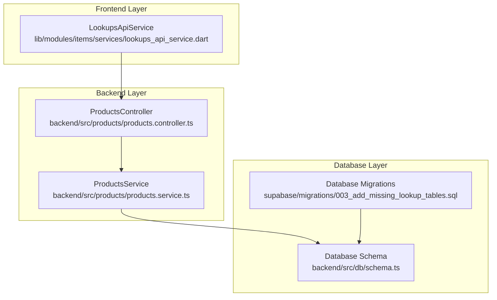
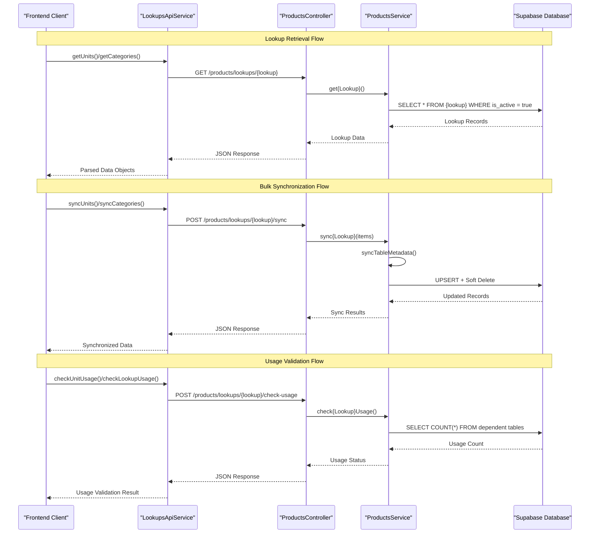
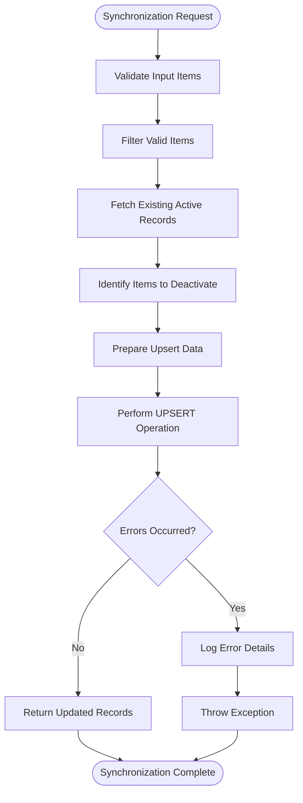
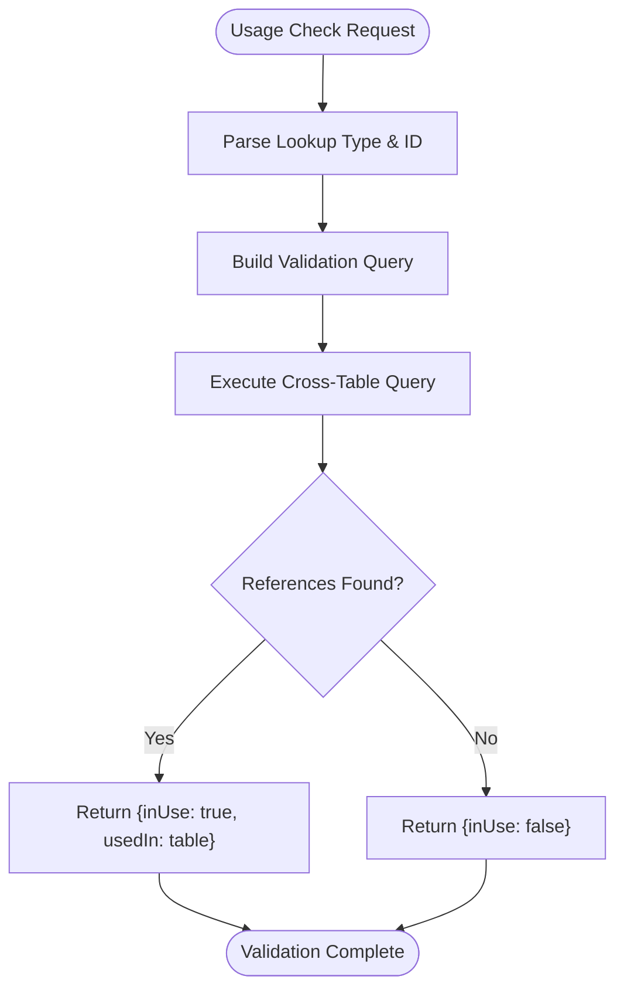

# Lookup & Master Data Endpoints

<cite>
**Referenced Files in This Document**
- [lookups_api_service.dart](file://lib/modules/items/services/lookups_api_service.dart)
- [products.controller.ts](file://backend/src/products/products.controller.ts)
- [products.service.ts](file://backend/src/products/products.service.ts)
- [schema.ts](file://backend/src/db/schema.ts)
- [003_add_missing_lookup_tables.sql](file://supabase/migrations/003_add_missing_lookup_tables.sql)
- [insert-dummy-data.ts](file://backend/scripts/insert-dummy-data.ts)
- [README.md](file://README.md)
</cite>

## Table of Contents
1. [Introduction](#introduction)
2. [Project Structure](#project-structure)
3. [Core Components](#core-components)
4. [Architecture Overview](#architecture-overview)
5. [Detailed Component Analysis](#detailed-component-analysis)
6. [Dependency Analysis](#dependency-analysis)
7. [Performance Considerations](#performance-considerations)
8. [Troubleshooting Guide](#troubleshooting-guide)
9. [Conclusion](#conclusion)

## Introduction
This document provides comprehensive documentation for the product lookup and master data endpoints in the ZERPAI ERP system. It covers all lookup retrieval endpoints, their corresponding check-usage endpoints, and bulk synchronization endpoints designed for master data operations. The documentation explains the complete flow from frontend API calls to backend controllers, services, and database operations, ensuring both technical and non-technical stakeholders can understand and utilize these endpoints effectively.

## Project Structure
The lookup and master data functionality spans three main layers:
- Frontend API service: Provides typed methods for retrieving and synchronizing lookup data
- Backend controllers: Expose REST endpoints for lookup retrieval, synchronization, and usage validation
- Database layer: Maintains lookup tables with active/inactive status and relationships to products

**Diagram sources**
- [lookups_api_service.dart](file://lib/modules/items/services/lookups_api_service.dart#L1-L363)
- [products.controller.ts](file://backend/src/products/products.controller.ts#L1-L250)
- [products.service.ts](file://backend/src/products/products.service.ts#L1-L723)
- [schema.ts](file://backend/src/db/schema.ts#L1-L293)
- [003_add_missing_lookup_tables.sql](file://supabase/migrations/003_add_missing_lookup_tables.sql#L1-L78)

**Section sources**
- [README.md](file://README.md#L1-L122)
- [lookups_api_service.dart](file://lib/modules/items/services/lookups_api_service.dart#L1-L363)
- [products.controller.ts](file://backend/src/products/products.controller.ts#L1-L250)

## Core Components
The lookup system consists of three primary components:

### Frontend API Service
The `LookupsApiService` provides a centralized interface for all lookup operations:
- Individual lookup retrieval methods for each lookup type
- Bulk synchronization methods for master data updates
- Usage validation methods for safe deletion operations
- Generic synchronization helper for consistent data handling

### Backend Controllers
The `ProductsController` exposes REST endpoints organized by functional groups:
- Lookup retrieval endpoints (`GET /products/lookups/{lookup}`)
- Bulk synchronization endpoints (`POST /products/lookups/{lookup}/sync`)
- Usage validation endpoints (`POST /products/lookups/{lookup}/check-usage`)
- Generic usage validation endpoint (`POST /products/lookups/:lookup/check-usage`)

### Database Layer
The database maintains lookup tables with standardized structure:
- Active/inactive status tracking for soft deletion support
- Unique constraints on key fields
- Foreign key relationships to products
- Indexes for performance optimization

**Section sources**
- [lookups_api_service.dart](file://lib/modules/items/services/lookups_api_service.dart#L7-L363)
- [products.controller.ts](file://backend/src/products/products.controller.ts#L19-L250)
- [schema.ts](file://backend/src/db/schema.ts#L1-L293)

## Architecture Overview
The lookup system follows a layered architecture with clear separation of concerns:

**Diagram sources**
- [lookups_api_service.dart](file://lib/modules/items/services/lookups_api_service.dart#L10-L363)
- [products.controller.ts](file://backend/src/products/products.controller.ts#L24-L215)
- [products.service.ts](file://backend/src/products/products.service.ts#L197-L389)

## Detailed Component Analysis

### Lookup Retrieval Endpoints
All lookup retrieval endpoints follow a consistent pattern:
- HTTP Method: GET
- Base Path: `/products/lookups/{lookup}`
- Response: Array of lookup objects filtered by active status
- Authentication: Requires valid tenant context

#### Endpoint Catalog
The system provides retrieval endpoints for the following lookup types:

| Endpoint | Purpose | Response Format |
|----------|---------|----------------|
| `/products/lookups/units` | Unit of measurement definitions | Array of unit objects |
| `/products/lookups/categories` | Product category hierarchy | Array of category objects |
| `/products/lookups/tax-rates` | Tax rate configurations | Array of tax rate objects |
| `/products/lookups/manufacturers` | Manufacturer information | Array of manufacturer objects |
| `/products/lookups/brands` | Brand definitions | Array of brand objects |
| `/products/lookups/vendors` | Vendor information | Array of vendor objects |
| `/products/lookups/storage-locations` | Storage facility locations | Array of storage location objects |
| `/products/lookups/racks` | Storage rack definitions | Array of rack objects |
| `/products/lookups/reorder-terms` | Reorder policy definitions | Array of reorder term objects |
| `/products/lookups/accounts` | Accounting ledger accounts | Array of account objects |
| `/products/lookups/contents` | Product composition ingredients | Array of content objects |
| `/products/lookups/strengths` | Strength measurement units | Array of strength objects |
| `/products/lookups/buying-rules` | Purchase regulation rules | Array of buying rule objects |
| `/products/lookups/drug-schedules` | Drug scheduling classifications | Array of drug schedule objects |
| `/products/lookups/content-units` | Content measurement units | Array of content unit objects |

**Section sources**
- [products.controller.ts](file://backend/src/products/products.controller.ts#L24-L215)
- [products.service.ts](file://backend/src/products/products.service.ts#L197-L606)

### Bulk Synchronization Endpoints
Bulk synchronization endpoints enable efficient master data management:

#### Endpoint Pattern
- HTTP Method: POST
- Base Path: `/products/lookups/{lookup}/sync`
- Request Body: Array of lookup objects
- Response: Array of synchronized lookup objects
- Validation: Automatic validation pipeline applied

#### Synchronization Logic
The synchronization process follows a comprehensive workflow:

**Diagram sources**
- [products.service.ts](file://backend/src/products/products.service.ts#L609-L716)

#### Synchronization Features
- **Soft Deletion**: Automatically deactivates records not present in the sync payload
- **Upsert Operations**: Inserts new records and updates existing ones
- **Conflict Resolution**: Uses unique identifiers to resolve conflicts
- **Validation Pipeline**: Built-in request validation with transformation
- **Error Handling**: Comprehensive error logging and reporting

**Section sources**
- [products.controller.ts](file://backend/src/products/products.controller.ts#L29-L215)
- [products.service.ts](file://backend/src/products/products.service.ts#L609-L716)

### Usage Validation Endpoints
Usage validation endpoints prevent accidental deletion of lookup items currently referenced by products:

#### Specific Usage Checks
- **Single Item Validation**: Validates usage for a specific lookup item ID
- **Bulk Validation**: Validates usage for multiple unit IDs simultaneously
- **Generic Validation**: Supports validation for any lookup type via parameterized endpoint

#### Validation Logic
The usage validation system performs cross-table queries to detect references:

**Diagram sources**
- [products.service.ts](file://backend/src/products/products.service.ts#L290-L389)

#### Supported Lookup Types
Usage validation supports validation for all lookup tables:
- `manufacturers`: Products referencing manufacturer IDs
- `brands`: Products referencing brand IDs  
- `vendors`: Products referencing preferred vendor IDs
- `storage-locations`: Products and racks referencing storage locations
- `racks`: Products referencing rack IDs
- `reorder-terms`: Products referencing reorder term IDs
- `accounts`: Products referencing sales, purchase, and inventory account IDs
- `contents`: Product compositions referencing content IDs
- `strengths`: Product compositions referencing strength IDs
- `content-units`: Product compositions referencing content unit IDs
- `buying-rules`: Products referencing buying rule IDs
- `drug-schedules`: Products and compositions referencing drug schedule IDs
- `categories`: Products referencing category IDs
- `units`: Products referencing unit IDs

**Section sources**
- [products.controller.ts](file://backend/src/products/products.controller.ts#L47-L55)
- [products.service.ts](file://backend/src/products/products.service.ts#L290-L389)

### Database Schema Integration
The lookup system integrates seamlessly with the database schema:

#### Active/Inactive Status Management
All lookup tables support soft deletion through an `is_active` boolean field:
- Retrieval endpoints filter by `is_active = true`
- Synchronization operations preserve active status
- Usage validation considers active status for references

#### Relationship Mapping
Lookup tables maintain relationships with products through foreign keys:
- Units: `products.unit_id`
- Categories: `products.category_id`
- Manufacturers: `products.manufacturer_id`
- Brands: `products.brand_id`
- Vendors: `products.preferred_vendor_id`
- Storage Locations: `products.storage_id`
- Racks: `products.rack_id`
- Reorder Terms: `products.reorder_term_id`
- Accounts: Various account ID fields
- Contents: `product_compositions.content_id`
- Strengths: `product_compositions.strength_id`
- Content Units: `product_compositions.content_unit_id`
- Buying Rules: `products.buying_rule_id`
- Drug Schedules: `products.schedule_of_drug_id` and `product_compositions.shedule_id`

**Section sources**
- [schema.ts](file://backend/src/db/schema.ts#L13-L114)
- [products.service.ts](file://backend/src/products/products.service.ts#L197-L606)

## Dependency Analysis
The lookup system exhibits well-structured dependencies:

```mermaid
graph TB
subgraph "Frontend Dependencies"
FE_API["LookupsApiService"]
FE_MODELS["Unit, TaxRate Models"]
end
subgraph "Backend Dependencies"
CTRL["ProductsController"]
SVC["ProductsService"]
SUPABASE["SupabaseService"]
VALIDATION["ValidationPipe"]
end
subgraph "Database Dependencies"
SCHEMA["Database Schema"]
MIGRATIONS["Database Migrations"]
end
FE_API --> CTRL
FE_MODELS --> FE_API
CTRL --> SVC
SVC --> SUPABASE
CTRL --> VALIDATION
SVC --> SCHEMA
SCHEMA --> MIGRATIONS
```

**Diagram sources**
- [lookups_api_service.dart](file://lib/modules/items/services/lookups_api_service.dart#L3-L8)
- [products.controller.ts](file://backend/src/products/products.controller.ts#L1-L18)
- [products.service.ts](file://backend/src/products/products.service.ts#L1-L9)
- [schema.ts](file://backend/src/db/schema.ts#L1-L11)

### Component Coupling
- **Frontend**: Loose coupling through API service abstraction
- **Backend**: Clear separation between controllers and services
- **Database**: Strong typing through Drizzle ORM schema definitions

### External Dependencies
- **Supabase**: PostgreSQL database with Row Level Security
- **Drizzle ORM**: Type-safe database operations
- **NestJS**: REST framework with validation and middleware
- **Flutter**: Frontend client with Dio HTTP client

**Section sources**
- [products.controller.ts](file://backend/src/products/products.controller.ts#L1-L18)
- [products.service.ts](file://backend/src/products/products.service.ts#L1-L9)
- [schema.ts](file://backend/src/db/schema.ts#L1-L11)

## Performance Considerations
The lookup system incorporates several performance optimizations:

### Database Indexing
- Active status indexes on lookup tables for fast filtering
- Unique constraint indexes on key fields for efficient lookups
- Composite indexes for frequently queried relationships

### Query Optimization
- Selective field retrieval using database views
- Efficient JOIN operations with LEFT joins for product lookups
- Batch operations for synchronization to minimize database round trips

### Caching Strategies
- Frontend caching of frequently accessed lookup data
- Smart refresh mechanisms for stale data detection
- Local storage persistence for offline scenarios

### Scalability Features
- Pagination support for large lookup datasets
- Lazy loading of dependent lookup data
- Asynchronous processing for bulk operations

## Troubleshooting Guide

### Common Issues and Solutions

#### Lookup Retrieval Failures
**Symptoms**: Empty arrays returned from lookup endpoints
**Causes**: 
- Lookup tables not populated with data
- Active status filtering excluding records
- Database connection issues

**Solutions**:
- Verify lookup table contents using database queries
- Check active status of lookup records
- Validate database connectivity and credentials

#### Synchronization Errors
**Symptoms**: Bulk sync operations failing with validation errors
**Causes**:
- Invalid or missing unique identifiers
- Data type mismatches in payload
- Constraint violations in database

**Solutions**:
- Validate payload structure against expected schema
- Ensure unique identifiers are properly formatted UUIDs
- Check database constraints and relationships

#### Usage Validation Failures
**Symptoms**: Usage validation returning unexpected results
**Causes**:
- Database query timeouts for large datasets
- Missing foreign key relationships
- Inconsistent active status across tables

**Solutions**:
- Optimize database queries with proper indexing
- Verify foreign key constraints in database schema
- Ensure consistent active status management

### Debugging Tools
The system provides comprehensive logging capabilities:
- Detailed request/response logging in controllers
- Error stack traces with contextual information
- Database query execution logs
- Synchronization operation audit trails

**Section sources**
- [products.controller.ts](file://backend/src/products/products.controller.ts#L30-L45)
- [products.service.ts](file://backend/src/products/products.service.ts#L208-L253)

## Conclusion
The ZERPAI ERP lookup and master data system provides a comprehensive, scalable solution for managing product-related reference data. The system's architecture ensures maintainability, performance, and reliability through:

- **Consistent API Design**: Standardized endpoints for all lookup types
- **Robust Synchronization**: Efficient bulk operations with conflict resolution
- **Safety Mechanisms**: Comprehensive usage validation preventing orphaned data
- **Database Integration**: Strong typing and relationship management
- **Performance Optimization**: Indexing, caching, and query optimization strategies

The modular design allows for easy extension to additional lookup types while maintaining system integrity. The combination of frontend API services and backend controllers provides a seamless developer experience while ensuring data consistency and referential integrity across the entire system.