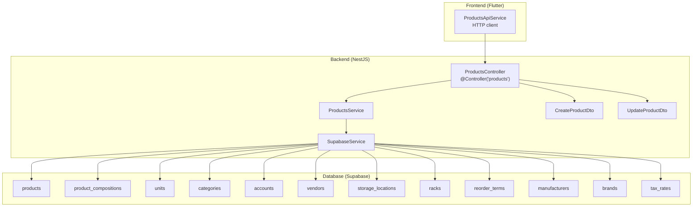
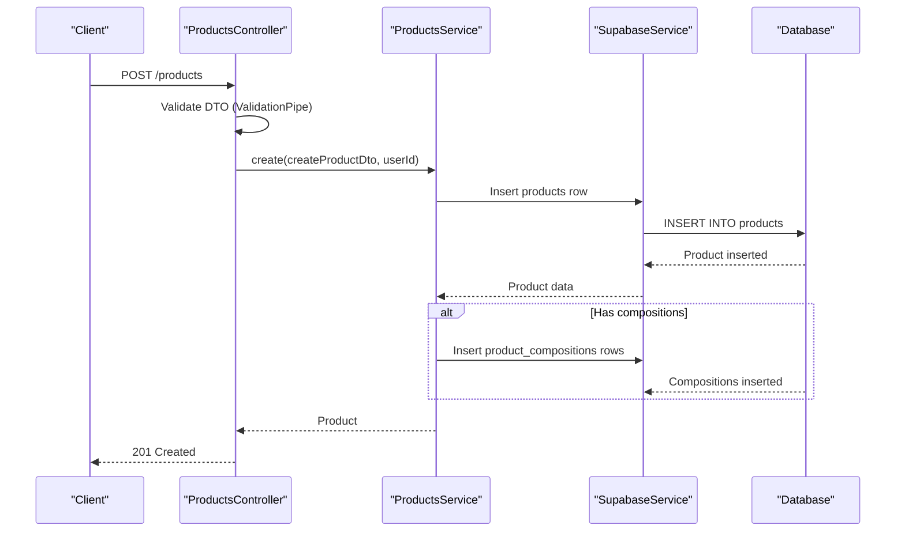
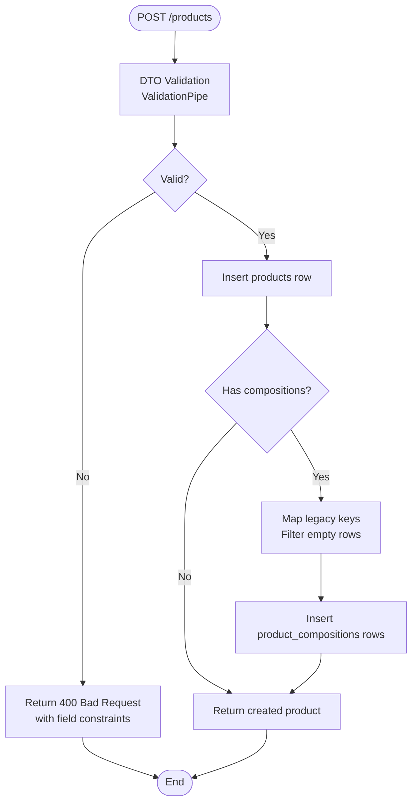
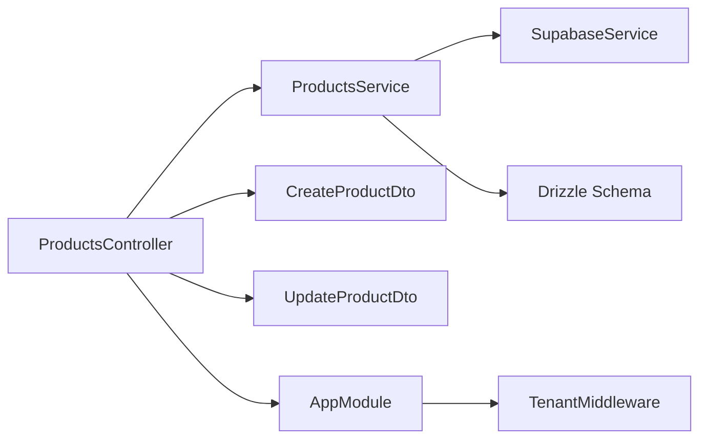

# Product CRUD Endpoints

<cite>
**Referenced Files in This Document**
- [products.controller.ts](file://backend/src/products/products.controller.ts)
- [products.service.ts](file://backend/src/products/products.service.ts)
- [create-product.dto.ts](file://backend/src/products/dto/create-product.dto.ts)
- [update-product.dto.ts](file://backend/src/products/dto/update-product.dto.ts)
- [schema.ts](file://backend/src/db/schema.ts)
- [002_products_complete.sql](file://supabase/migrations/002_products_complete.sql)
- [products_api_service.dart](file://lib/modules/items/services/products_api_service.dart)
- [main.ts](file://backend/src/main.ts)
- [tenant.middleware.ts](file://backend/src/common/middleware/tenant.middleware.ts)
</cite>

## Table of Contents
1. [Introduction](#introduction)
2. [Project Structure](#project-structure)
3. [Core Components](#core-components)
4. [Architecture Overview](#architecture-overview)
5. [Detailed Component Analysis](#detailed-component-analysis)
6. [Dependency Analysis](#dependency-analysis)
7. [Performance Considerations](#performance-considerations)
8. [Troubleshooting Guide](#troubleshooting-guide)
9. [Conclusion](#conclusion)

## Introduction
This document provides comprehensive documentation for Product CRUD operations in ZerpAI ERP. It covers the backend API endpoints for listing, retrieving, creating, updating, and deleting products, along with detailed validation rules, request/response schemas, and business rule validations. The documentation includes practical examples for product composition, pricing details, tax rates, and inventory settings, and explains the complete product creation workflow.

## Project Structure
The product functionality is implemented in the backend NestJS application with DTOs, a controller, and a service layer. The frontend Dart client communicates with the backend via HTTP requests. The database schema is defined using Drizzle ORM and migrated via Supabase migrations.

**Diagram sources**
- [products.controller.ts](file://backend/src/products/products.controller.ts#L19-L249)
- [products.service.ts](file://backend/src/products/products.service.ts#L1-L723)
- [create-product.dto.ts](file://backend/src/products/dto/create-product.dto.ts#L21-L245)
- [update-product.dto.ts](file://backend/src/products/dto/update-product.dto.ts#L1-L7)
- [schema.ts](file://backend/src/db/schema.ts#L116-L207)
- [002_products_complete.sql](file://supabase/migrations/002_products_complete.sql#L132-L241)

**Section sources**
- [products.controller.ts](file://backend/src/products/products.controller.ts#L1-L250)
- [products.service.ts](file://backend/src/products/products.service.ts#L1-L723)
- [create-product.dto.ts](file://backend/src/products/dto/create-product.dto.ts#L1-L265)
- [update-product.dto.ts](file://backend/src/products/dto/update-product.dto.ts#L1-L7)
- [schema.ts](file://backend/src/db/schema.ts#L1-L293)
- [002_products_complete.sql](file://supabase/migrations/002_products_complete.sql#L1-L381)

## Core Components
- ProductsController: Exposes REST endpoints for product operations and delegates to ProductsService.
- ProductsService: Implements business logic, handles database operations, and manages product composition inserts.
- CreateProductDto and UpdateProductDto: Define validation rules and request schemas for product creation and updates.
- SupabaseService: Provides database client access for CRUD operations.
- Frontend ProductsApiService: Client-side service that performs HTTP requests to the backend.

Key endpoint coverage:
- GET /products: Lists products with joined lookup data and ordering.
- GET /products/:id: Retrieves a single product with compositions and joined lookup data.
- POST /products: Creates a product with composition handling and validation.
- PUT /products/:id: Updates a product with validation.
- DELETE /products/:id: Soft-deletes a product by setting is_active to false.

**Section sources**
- [products.controller.ts](file://backend/src/products/products.controller.ts#L217-L248)
- [products.service.ts](file://backend/src/products/products.service.ts#L91-L194)
- [create-product.dto.ts](file://backend/src/products/dto/create-product.dto.ts#L21-L245)
- [update-product.dto.ts](file://backend/src/products/dto/update-product.dto.ts#L1-L7)

## Architecture Overview
The product CRUD flow follows a layered architecture:
- HTTP requests are handled by ProductsController.
- Validation is enforced by class-validator decorators and a global ValidationPipe.
- Business logic resides in ProductsService, which interacts with SupabaseService for database operations.
- Database schema is defined in Drizzle ORM and migrated via SQL migrations.

**Diagram sources**
- [products.controller.ts](file://backend/src/products/products.controller.ts#L227-L233)
- [products.service.ts](file://backend/src/products/products.service.ts#L18-L89)
- [main.ts](file://backend/src/main.ts#L26-L42)

**Section sources**
- [products.controller.ts](file://backend/src/products/products.controller.ts#L1-L250)
- [products.service.ts](file://backend/src/products/products.service.ts#L1-L723)
- [main.ts](file://backend/src/main.ts#L1-L56)

## Detailed Component Analysis

### Endpoint: GET /products
Purpose: Retrieve a paginated list of products with joined lookup data and ordering.

Behavior:
- Performs a SELECT on the products table with LEFT JOINs to units, categories, manufacturers, brands, vendors, storage locations, racks, and tax rates.
- Orders by created_at descending.
- Returns an array of product objects with embedded lookup data.

Response schema highlights:
- Embedded unit, category, manufacturer, brand, vendor, storage, rack, intra_tax, inter_tax.
- Optional compositions array for detailed product retrieval.

Example response structure:
- Array of product objects with nested lookup fields and optional compositions.

Notes:
- Filtering and pagination are handled on the frontend; the backend returns all active products ordered by creation date.

**Section sources**
- [products.controller.ts](file://backend/src/products/products.controller.ts#L217-L220)
- [products.service.ts](file://backend/src/products/products.service.ts#L91-L118)
- [schema.ts](file://backend/src/db/schema.ts#L116-L195)

### Endpoint: GET /products/:id
Purpose: Retrieve a specific product by ID with detailed information.

Behavior:
- SELECTs the product with joined lookup data and includes the compositions array.
- Throws NotFoundException if the product does not exist.

Response schema highlights:
- Same as GET /products plus compositions array.
- Embedded tax rate details for intra-state and inter-state taxes.

Example response structure:
- Single product object with nested lookup fields and compositions.

**Section sources**
- [products.controller.ts](file://backend/src/products/products.controller.ts#L222-L225)
- [products.service.ts](file://backend/src/products/products.service.ts#L120-L146)
- [schema.ts](file://backend/src/db/schema.ts#L116-L195)

### Endpoint: POST /products
Purpose: Create a new product with optional composition entries.

Request schema (CreateProductDto):
- Basic Information: type, product_name, item_code, unit_id, optional category_id, is_returnable, push_to_ecommerce.
- Tax & Regulatory: optional hsn_code, tax_preference, intra_state_tax_id, inter_state_tax_id, primary_image_url, image_urls.
- Sales Information: optional selling_price, selling_price_currency, mrp, ptr, sales_account_id, sales_description.
- Purchase Information: optional cost_price, cost_price_currency, purchase_account_id, preferred_vendor_id, purchase_description.
- Formulation: optional length, width, height, dimension_unit, weight, weight_unit, manufacturer_id, brand_id, mpn, upc, isbn, ean.
- Composition: optional track_assoc_ingredients, buying_rule_id, schedule_of_drug_id, compositions array.
- Inventory Settings: optional is_track_inventory, track_bin_location, track_batches, track_serial_number, inventory_account_id, inventory_valuation_method, storage_id, rack_id, reorder_point, reorder_term_id.
- Status Flags: optional is_active, is_lock.
- compositions: array of CompositionDto with optional content_id, strength_id, content_unit_id, shedule_id.

Validation rules:
- Enum constraints for type, tax_preference, inventory_valuation_method.
- UUID constraints for foreign keys.
- Numeric constraints for prices and dimensions.
- Optional vs required fields clearly defined.

Business rule validations:
- Item code uniqueness enforced at database level (unique constraint).
- ConflictException thrown when attempting to create a product with an existing item_code.
- Legacy key mapping: buying_rule_id accepts buying_rule; schedule_of_drug_id accepts schedule_of_drug; track_serial_number accepts track_serial.
- Composition rows with empty content/unit/schedule are skipped during insertion.

Request example:
{
  "type": "goods",
  "product_name": "Paracetamol Tablets",
  "item_code": "PARA-001",
  "unit_id": "uuid-of-unit",
  "category_id": "uuid-of-category",
  "selling_price": 25.00,
  "cost_price": 20.00,
  "manufacturer_id": "uuid-of-manufacturer",
  "brand_id": "uuid-of-brand",
  "track_serial_number": true,
  "compositions": [
    {
      "content_id": "uuid-of-content",
      "strength_id": "uuid-of-strength",
      "content_unit_id": "uuid-of-content-unit",
      "shedule_id": "uuid-of-schedule"
    }
  ]
}

Response example:
- Full product object with embedded lookup data and compositions.

**Section sources**
- [create-product.dto.ts](file://backend/src/products/dto/create-product.dto.ts#L21-L265)
- [products.controller.ts](file://backend/src/products/products.controller.ts#L227-L233)
- [products.service.ts](file://backend/src/products/products.service.ts#L18-L89)
- [schema.ts](file://backend/src/db/schema.ts#L116-L195)
- [002_products_complete.sql](file://supabase/migrations/002_products_complete.sql#L132-L241)

### Endpoint: PUT /products/:id
Purpose: Update an existing product.

Request schema:
- Uses UpdateProductDto which is a partial version of CreateProductDto.
- Allows selective updates of any fields.

Validation rules:
- Same as CreateProductDto but with optional fields only.

Business rule validations:
- Item code uniqueness enforced at database level.
- ConflictException thrown on duplicate item_code.
- Legacy key mapping applies similarly to create.

Request example:
{
  "selling_price": 27.50,
  "track_serial_number": true
}

Response example:
- Updated product object.

**Section sources**
- [update-product.dto.ts](file://backend/src/products/dto/update-product.dto.ts#L1-L7)
- [products.controller.ts](file://backend/src/products/products.controller.ts#L235-L243)
- [products.service.ts](file://backend/src/products/products.service.ts#L148-L179)

### Endpoint: DELETE /products/:id
Purpose: Soft-delete a product by setting is_active to false.

Behavior:
- Updates the product record to set is_active to false.
- Returns a success message.

Response example:
{
  "message": "Product deleted successfully"
}

**Section sources**
- [products.controller.ts](file://backend/src/products/products.controller.ts#L245-L248)
- [products.service.ts](file://backend/src/products/products.service.ts#L181-L194)

### Product Creation Workflow
End-to-end flow:
1. Client sends POST /products with CreateProductDto payload.
2. Global ValidationPipe validates DTO fields and throws structured error messages on validation failures.
3. Controller extracts user context (userId) from request and calls ProductsService.create.
4. Service maps legacy keys and sets created_by_id and updated_by_id.
5. Service inserts the product row and handles composition rows if provided.
6. Composition rows are filtered to skip completely empty entries and inserted with display_order.
7. Service returns the created product.

**Diagram sources**
- [main.ts](file://backend/src/main.ts#L26-L42)
- [products.controller.ts](file://backend/src/products/products.controller.ts#L227-L233)
- [products.service.ts](file://backend/src/products/products.service.ts#L18-L89)

**Section sources**
- [main.ts](file://backend/src/main.ts#L26-L42)
- [products.controller.ts](file://backend/src/products/products.controller.ts#L227-L233)
- [products.service.ts](file://backend/src/products/products.service.ts#L18-L89)

### Request/Response Examples

GET /products
- Request: GET /products
- Response: Array of product objects with embedded lookup data and optional compositions.

GET /products/:id
- Request: GET /products/{id}
- Response: Single product object with embedded lookup data and compositions.

POST /products
- Request: CreateProductDto payload
- Response: Created product object

PUT /products/:id
- Request: UpdateProductDto payload
- Response: Updated product object

DELETE /products/:id
- Request: DELETE /products/{id}
- Response: {
  "message": "Product deleted successfully"
}

**Section sources**
- [products.controller.ts](file://backend/src/products/products.controller.ts#L217-L248)
- [products.service.ts](file://backend/src/products/products.service.ts#L91-L194)

## Dependency Analysis
The product module depends on:
- SupabaseService for database operations.
- Drizzle ORM schema definitions for type safety.
- Global ValidationPipe for DTO validation.
- TenantMiddleware for request context (userId injection).

**Diagram sources**
- [products.controller.ts](file://backend/src/products/products.controller.ts#L1-L250)
- [products.service.ts](file://backend/src/products/products.service.ts#L1-L723)
- [schema.ts](file://backend/src/db/schema.ts#L1-L293)
- [app.module.ts](file://backend/src/app.module.ts#L14-L19)

**Section sources**
- [products.controller.ts](file://backend/src/products/products.controller.ts#L1-L250)
- [products.service.ts](file://backend/src/products/products.service.ts#L1-L723)
- [schema.ts](file://backend/src/db/schema.ts#L1-L293)
- [app.module.ts](file://backend/src/app.module.ts#L1-L20)

## Performance Considerations
- Indexes on products table (type, item_code, sku, category_id, unit_id, manufacturer_id, brand_id, preferred_vendor_id, is_active, push_to_ecommerce, hsn_code) improve query performance.
- LEFT JOINs in list and detail queries avoid hiding inactive items and ensure lookup data availability.
- Composition data is fetched separately to keep response sizes manageable.

[No sources needed since this section provides general guidance]

## Troubleshooting Guide
Common validation errors:
- Field constraints returned as structured messages with field, constraints, and value.
- Example: {
  "error": "Validation failed",
  "message": [
    {
      "field": "product_name",
      "constraints": {
        "isNotEmpty": "product_name should not be empty"
      },
      "value": ""
    }
  ]
}

Conflict exceptions:
- Item code already exists triggers ConflictException with message indicating duplication.

Error handling in frontend:
- ProductsApiService formats DioException responses with readable messages including HTTP status and field-level constraints.

**Section sources**
- [main.ts](file://backend/src/main.ts#L32-L42)
- [products.service.ts](file://backend/src/products/products.service.ts#L45-L51)
- [products_api_service.dart](file://lib/modules/items/services/products_api_service.dart#L10-L49)

## Conclusion
The Product CRUD implementation in ZerpAI ERP provides a robust, validated, and extensible API for managing product data. The backend enforces strict validation rules, handles product composition, and integrates seamlessly with lookup tables for units, categories, accounts, vendors, and tax rates. The frontend client consumes these endpoints reliably, with comprehensive error handling and user-friendly messaging.