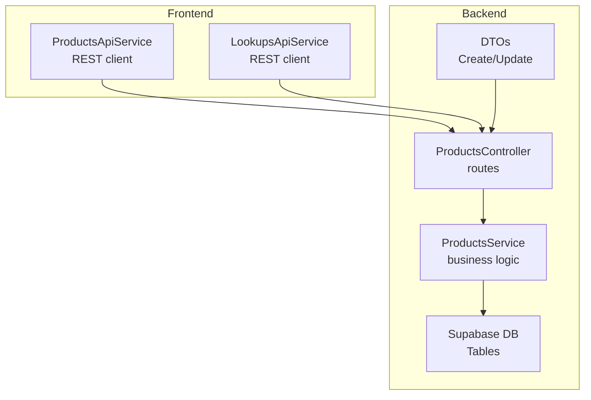
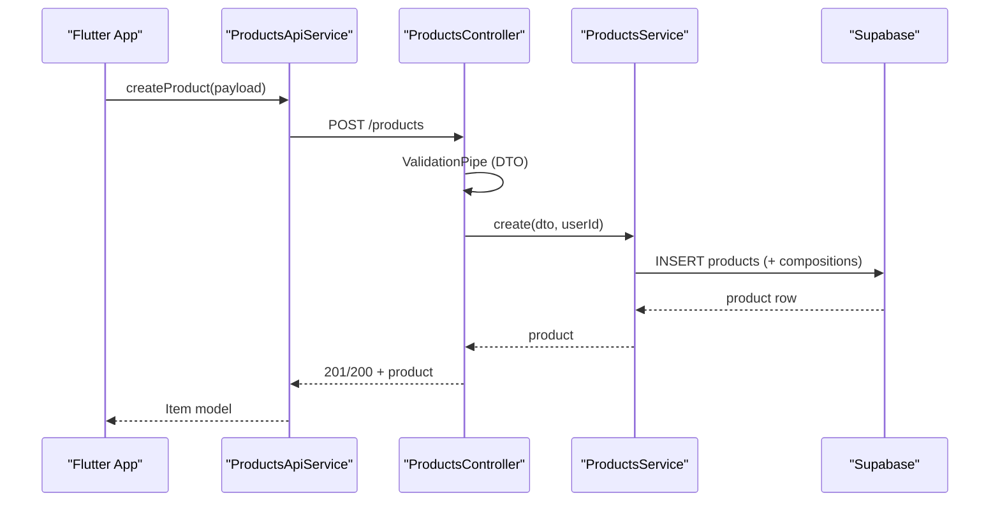
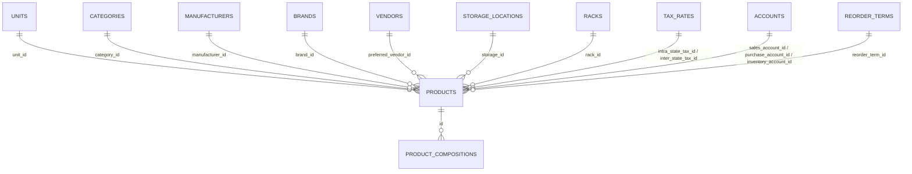
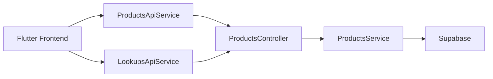

# Products API

<cite>
**Referenced Files in This Document**
- [products.controller.ts](file://backend/src/products/products.controller.ts)
- [products.service.ts](file://backend/src/products/products.service.ts)
- [create-product.dto.ts](file://backend/src/products/dto/create-product.dto.ts)
- [update-product.dto.ts](file://backend/src/products/dto/update-product.dto.ts)
- [schema.ts](file://backend/src/db/schema.ts)
- [002_products_complete.sql](file://supabase/migrations/002_products_complete.sql)
- [003_add_missing_lookup_tables.sql](file://supabase/migrations/003_add_missing_lookup_tables.sql)
- [004_add_track_serial_number.sql](file://supabase/migrations/004_add_track_serial_number.sql)
- [products_api_service.dart](file://lib/modules/items/services/products_api_service.dart)
- [lookups_api_service.dart](file://lib/modules/items/services/lookups_api_service.dart)
</cite>

## Table of Contents
1. [Introduction](#introduction)
2. [Project Structure](#project-structure)
3. [Core Components](#core-components)
4. [Architecture Overview](#architecture-overview)
5. [Detailed Component Analysis](#detailed-component-analysis)
6. [Dependency Analysis](#dependency-analysis)
7. [Performance Considerations](#performance-considerations)
8. [Troubleshooting Guide](#troubleshooting-guide)
9. [Conclusion](#conclusion)

## Introduction
This document provides comprehensive API documentation for ZerpAI ERP’s Products module. It covers:
- CRUD endpoints for products: GET /products, GET /products/:id, POST /products, PUT /products/:id, DELETE /products/:id
- Request/response schemas for product creation and updates, including required/optional fields and validation rules
- Extensive lookup endpoints for units, categories, tax rates, manufacturers, brands, vendors, storage locations, racks, reorder terms, accounts, contents, strengths, buying rules, and drug schedules
- Bulk synchronization endpoints for master data with validation examples
- Usage-check endpoints to validate lookup usage and prevent cascade deletions
- Practical usage patterns for product composition and pricing

## Project Structure
The Products API is implemented in the backend NestJS application and consumed by the Flutter frontend via dedicated services.

**Diagram sources**
- [products.controller.ts](file://backend/src/products/products.controller.ts#L1-L250)
- [products.service.ts](file://backend/src/products/products.service.ts#L1-L723)
- [products_api_service.dart](file://lib/modules/items/services/products_api_service.dart#L1-L208)
- [lookups_api_service.dart](file://lib/modules/items/services/lookups_api_service.dart#L1-L363)

**Section sources**
- [products.controller.ts](file://backend/src/products/products.controller.ts#L1-L250)
- [products.service.ts](file://backend/src/products/products.service.ts#L1-L723)
- [products_api_service.dart](file://lib/modules/items/services/products_api_service.dart#L1-L208)
- [lookups_api_service.dart](file://lib/modules/items/services/lookups_api_service.dart#L1-L363)

## Core Components
- ProductsController: Exposes REST endpoints for products and lookup sync/usage-check.
- ProductsService: Implements product CRUD, composition persistence, and generic lookup sync logic.
- DTOs: Strongly typed request schemas for create and update operations.
- Frontend Services: ProductsApiService and LookupsApiService wrap HTTP calls and error formatting.

**Section sources**
- [products.controller.ts](file://backend/src/products/products.controller.ts#L1-L250)
- [products.service.ts](file://backend/src/products/products.service.ts#L1-L723)
- [create-product.dto.ts](file://backend/src/products/dto/create-product.dto.ts#L1-L265)
- [update-product.dto.ts](file://backend/src/products/dto/update-product.dto.ts#L1-L7)
- [products_api_service.dart](file://lib/modules/items/services/products_api_service.dart#L1-L208)
- [lookups_api_service.dart](file://lib/modules/items/services/lookups_api_service.dart#L1-L363)

## Architecture Overview
The Products API follows a layered architecture:
- Controllers define routes and apply ValidationPipe for DTOs
- Services encapsulate business logic and database operations
- DTOs enforce validation rules
- Frontend services consume REST endpoints and handle errors

**Diagram sources**
- [products.controller.ts](file://backend/src/products/products.controller.ts#L227-L233)
- [products.service.ts](file://backend/src/products/products.service.ts#L18-L89)
- [products_api_service.dart](file://lib/modules/items/services/products_api_service.dart#L80-L101)

**Section sources**
- [products.controller.ts](file://backend/src/products/products.controller.ts#L1-L250)
- [products.service.ts](file://backend/src/products/products.service.ts#L1-L723)
- [products_api_service.dart](file://lib/modules/items/services/products_api_service.dart#L1-L208)

## Detailed Component Analysis

### Product CRUD Endpoints

- GET /products
  - Purpose: Retrieve paginated and filtered product list with joined lookup metadata.
  - Response: Array of product objects with nested unit/category/manufacturer/brand/vendor/storage/rack/tax details and compositions.
  - Notes: Uses left joins to avoid hiding inactive lookups; ordering by created_at descending.

- GET /products/:id
  - Purpose: Retrieve a single product by ID with full metadata and compositions.
  - Response: Single product object or 404 Not Found.

- POST /products
  - Purpose: Create a new product and optional compositions.
  - Request: CreateProductDto (see schema below).
  - Response: Created product object (201/200).
  - Behavior: Persists product, maps legacy keys to DB columns, persists compositions if provided.

- PUT /products/:id
  - Purpose: Update an existing product.
  - Request: UpdateProductDto (partial fields accepted).
  - Response: Updated product object (200).

- DELETE /products/:id
  - Purpose: Soft-delete product by setting is_active=false.
  - Response: Success message.

Validation and error handling:
- DTO validation enforced via ValidationPipe.
- Duplicate item_code triggers ConflictException.
- NotFound exceptions returned when product not found.

**Section sources**
- [products.controller.ts](file://backend/src/products/products.controller.ts#L217-L248)
- [products.service.ts](file://backend/src/products/products.service.ts#L91-L194)
- [create-product.dto.ts](file://backend/src/products/dto/create-product.dto.ts#L21-L245)
- [update-product.dto.ts](file://backend/src/products/dto/update-product.dto.ts#L1-L7)

### Product Creation and Update Request Schemas

Required fields (CreateProductDto):
- type: Enum goods/service
- product_name: String
- item_code: String (unique)
- unit_id: UUID (foreign key to units)
- compositions: Array of CompositionDto (optional)

CompositionDto (optional):
- content_id: UUID
- strength_id: UUID
- content_unit_id: UUID
- shedule_id: UUID

Optional fields (selected):
- billing_name, sku, category_id, is_returnable, push_to_ecommerce
- hsn_code, tax_preference, intra_state_tax_id, inter_state_tax_id, primary_image_url, image_urls[]
- selling_price, selling_price_currency, mrp, ptr, sales_account_id, sales_description
- cost_price, cost_price_currency, purchase_account_id, preferred_vendor_id, purchase_description
- length, width, height, dimension_unit, weight, weight_unit, manufacturer_id, brand_id, mpn, upc, isbn, ean
- track_assoc_ingredients, buying_rule_id, schedule_of_drug_id
- is_track_inventory, track_bin_location, track_batches, track_serial_number, inventory_account_id, inventory_valuation_method
- storage_id, rack_id, reorder_point, reorder_term_id
- is_active, is_lock

Validation rules:
- Enum fields constrained to allowed values.
- Numeric fields validated as numbers.
- UUID fields validated as UUID strings.
- Arrays validated as arrays.
- Optional fields may be omitted.

Usage patterns:
- Compositions array enables multi-ingredient products; empty rows are skipped.
- Legacy keys buying_rule and schedule_of_drug are normalized to buying_rule_id and schedule_of_drug_id.
- Serial tracking is persisted under track_serial.

**Section sources**
- [create-product.dto.ts](file://backend/src/products/dto/create-product.dto.ts#L21-L265)
- [update-product.dto.ts](file://backend/src/products/dto/update-product.dto.ts#L1-L7)
- [products.service.ts](file://backend/src/products/products.service.ts#L18-L89)

### Lookup Endpoints

All lookup endpoints:
- GET /products/lookups/units
- GET /products/lookups/categories
- GET /products/lookups/tax-rates
- GET /products/lookups/manufacturers
- GET /products/lookups/brands
- GET /products/lookups/vendors
- GET /products/lookups/storage-locations
- GET /products/lookups/racks
- GET /products/lookups/reorder-terms
- GET /products/lookups/accounts
- GET /products/lookups/contents
- GET /products/lookups/strengths
- GET /products/lookups/buying-rules
- GET /products/lookups/drug-schedules
- GET /products/lookups/content-units

Bulk sync endpoints:
- POST /products/lookups/:lookup/sync
  - Request: Array of items; each item mapped to DB fields based on endpoint.
  - Behavior: Upserts records, deactivates missing active records, supports is_active override, generates UUIDs for missing IDs.
  - Validation: Filters invalid items and logs warnings; falls back to alternate fields when needed.

Usage-check endpoints:
- POST /products/lookups/units/check-usage
  - Request: { unitIds: string[] }
  - Response: { unitsInUse: string[] }
- POST /products/lookups/:lookup/check-usage
  - Request: { id: string }
  - Response: { inUse: boolean, usedIn?: string }

Validation examples:
- syncUnits validates unit_name presence and trims/slices unit_symbol or unique_quantity_code fallback.
- syncManufacturers validates name and auto-generates IDs for items without valid UUIDs.
- syncContents/syncStrengths/syncBuyingRules/syncDrugSchedules map names and IDs appropriately.

**Section sources**
- [products.controller.ts](file://backend/src/products/products.controller.ts#L24-L215)
- [products.service.ts](file://backend/src/products/products.service.ts#L196-L389)
- [products.service.ts](file://backend/src/products/products.service.ts#L208-L270)
- [products.service.ts](file://backend/src/products/products.service.ts#L428-L456)

### Database Schema and Relationships

Core tables and relationships:
- products → units, categories, manufacturers, brands, vendors, storage_locations, racks, tax_rates, accounts, reorder_terms
- product_compositions → products (on delete cascade)

**Diagram sources**
- [schema.ts](file://backend/src/db/schema.ts#L13-L207)
- [002_products_complete.sql](file://supabase/migrations/002_products_complete.sql#L26-L241)
- [003_add_missing_lookup_tables.sql](file://supabase/migrations/003_add_missing_lookup_tables.sql#L4-L39)

**Section sources**
- [schema.ts](file://backend/src/db/schema.ts#L1-L293)
- [002_products_complete.sql](file://supabase/migrations/002_products_complete.sql#L1-L381)
- [003_add_missing_lookup_tables.sql](file://supabase/migrations/003_add_missing_lookup_tables.sql#L1-L78)
- [004_add_track_serial_number.sql](file://supabase/migrations/004_add_track_serial_number.sql#L1-L15)

### Frontend Integration

- ProductsApiService
  - Methods: getProducts, getProductById, createProduct, updateProduct, deleteProduct
  - Error handling: Formats validation errors from backend into readable messages.

- LookupsApiService
  - Methods: get/sync/check for all lookup endpoints
  - Usage-check helpers: checkUnitUsage and checkLookupUsage return structured results.

**Section sources**
- [products_api_service.dart](file://lib/modules/items/services/products_api_service.dart#L1-L208)
- [lookups_api_service.dart](file://lib/modules/items/services/lookups_api_service.dart#L1-L363)

## Dependency Analysis

**Diagram sources**
- [products.controller.ts](file://backend/src/products/products.controller.ts#L1-L250)
- [products.service.ts](file://backend/src/products/products.service.ts#L1-L723)
- [products_api_service.dart](file://lib/modules/items/services/products_api_service.dart#L1-L208)
- [lookups_api_service.dart](file://lib/modules/items/services/lookups_api_service.dart#L1-L363)

**Section sources**
- [products.controller.ts](file://backend/src/products/products.controller.ts#L1-L250)
- [products.service.ts](file://backend/src/products/products.service.ts#L1-L723)
- [products_api_service.dart](file://lib/modules/items/services/products_api_service.dart#L1-L208)
- [lookups_api_service.dart](file://lib/modules/items/services/lookups_api_service.dart#L1-L363)

## Performance Considerations
- Indexes on products (type, item_code, sku, category_id, unit_id, manufacturer_id, brand_id, preferred_vendor_id, is_active, push_to_ecommerce, hsn_code) improve query performance.
- Left joins in product queries prevent missing lookup data for inactive records.
- Bulk sync uses upsert with conflict resolution and selective deactivation of missing records.

[No sources needed since this section provides general guidance]

## Troubleshooting Guide

Common validation failures and resolutions:
- Duplicate item_code: Ensure unique item_code across products.
- Invalid UUIDs: Verify foreign key fields match existing lookup IDs.
- Missing required fields: Ensure type, product_name, item_code, unit_id are present for creation.
- Invalid enums: Use allowed values for type, tax_preference, inventory_valuation_method, unit_type, tax_type, account_type, vendor_type.

Usage-check failures:
- check-usage endpoints return inUse flag and usedIn context; resolve by removing or changing references before deletion.

Bulk sync issues:
- Filter invalid items; ensure required fields are present.
- For units, provide unit_name; fallback to unique_quantity_code if unit_symbol is missing.

**Section sources**
- [products.service.ts](file://backend/src/products/products.service.ts#L45-L51)
- [products.service.ts](file://backend/src/products/products.service.ts#L208-L253)
- [products.service.ts](file://backend/src/products/products.service.ts#L272-L288)
- [products.service.ts](file://backend/src/products/products.service.ts#L290-L389)

## Conclusion
The Products API provides robust CRUD and lookup management capabilities with strong validation, flexible composition handling, and safe bulk synchronization. The frontend services offer convenient wrappers for common operations, while usage-check endpoints help prevent accidental deletions. The documented schemas and patterns enable reliable integration and maintenance.