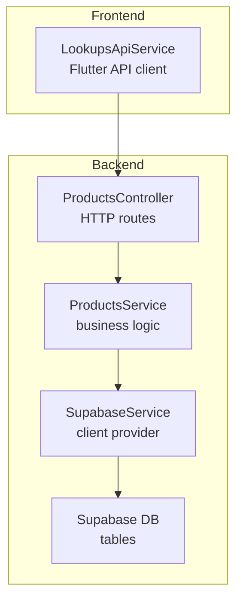
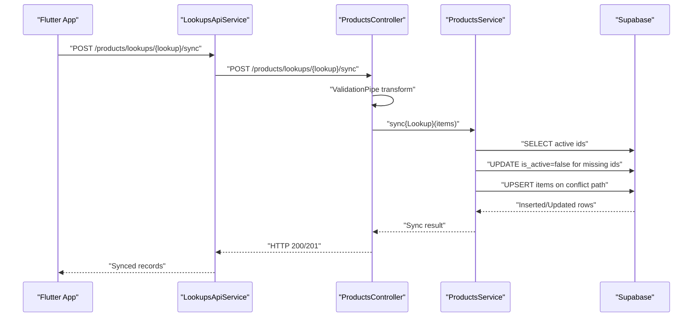
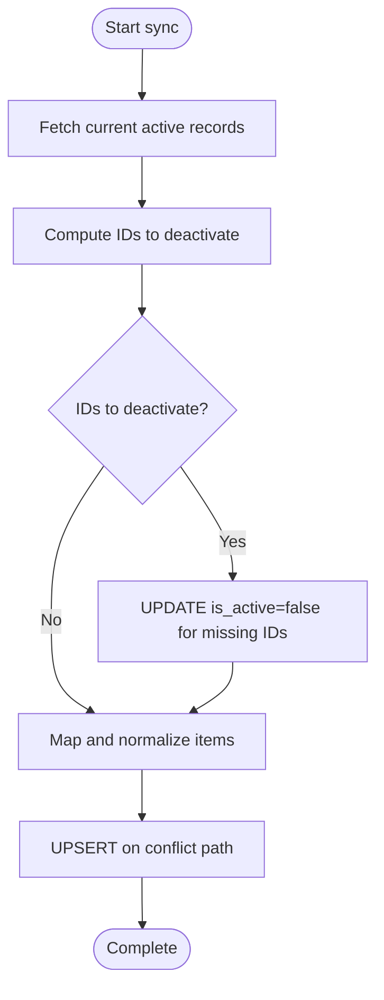

# Sync & Bulk Operations

<cite>
**Referenced Files in This Document**
- [products.controller.ts](file://backend/src/products/products.controller.ts)
- [products.service.ts](file://backend/src/products/products.service.ts)
- [lookups_api_service.dart](file://lib/modules/items/services/lookups_api_service.dart)
- [schema.ts](file://backend/src/db/schema.ts)
- [003_add_missing_lookup_tables.sql](file://supabase/migrations/003_add_missing_lookup_tables.sql)
- [supabase.service.ts](file://backend/src/supabase/supabase.service.ts)
- [tenant.middleware.ts](file://backend/src/common/middleware/tenant.middleware.ts)
- [create-product.dto.ts](file://backend/src/products/dto/create-product.dto.ts)
- [update-product.dto.ts](file://backend/src/products/dto/update-product.dto.ts)
</cite>

## Table of Contents
1. [Introduction](#introduction)
2. [Project Structure](#project-structure)
3. [Core Components](#core-components)
4. [Architecture Overview](#architecture-overview)
5. [Detailed Component Analysis](#detailed-component-analysis)
6. [Dependency Analysis](#dependency-analysis)
7. [Performance Considerations](#performance-considerations)
8. [Troubleshooting Guide](#troubleshooting-guide)
9. [Conclusion](#conclusion)

## Introduction
This document describes the bulk data synchronization and validation endpoints for ZerpAI ERP’s products module. It covers:
- Lookup sync endpoints for units, categories, manufacturers, brands, storage-locations, racks, reorder-terms, accounts, contents, strengths, buying-rules, and drug-schedules
- Reference validation endpoints to check usage before bulk operations
- Payload formats, validation rules, error handling, and batch processing patterns

These endpoints enable efficient synchronization of master data while preserving referential integrity and minimizing downtime.

## Project Structure
The sync and validation capabilities are implemented in the backend NestJS application and consumed by the Flutter frontend via an API client service.

**Diagram sources**
- [products.controller.ts](file://backend/src/products/products.controller.ts#L19-L250)
- [products.service.ts](file://backend/src/products/products.service.ts#L1-L723)
- [supabase.service.ts](file://backend/src/supabase/supabase.service.ts#L1-L32)
- [lookups_api_service.dart](file://lib/modules/items/services/lookups_api_service.dart#L1-L363)

**Section sources**
- [products.controller.ts](file://backend/src/products/products.controller.ts#L19-L250)
- [products.service.ts](file://backend/src/products/products.service.ts#L1-L723)
- [lookups_api_service.dart](file://lib/modules/items/services/lookups_api_service.dart#L1-L363)
- [supabase.service.ts](file://backend/src/supabase/supabase.service.ts#L1-L32)

## Core Components
- ProductsController: Exposes HTTP endpoints for lookups and sync operations, including validation pipes and usage checks.
- ProductsService: Implements generic sync logic and lookup-specific mapping, including deactivation of removed records and upsert behavior.
- LookupsApiService: Frontend client that invokes backend endpoints for sync and usage checks.
- SupabaseService: Provides a configured Supabase client for database operations.
- Drizzle schema and migrations: Define table structures and constraints for lookup tables.

Key responsibilities:
- Validate and normalize incoming payloads
- Upsert records with conflict resolution
- Soft-deactivate stale records not present in the incoming batch
- Provide usage validation for safe bulk updates/deletes

**Section sources**
- [products.controller.ts](file://backend/src/products/products.controller.ts#L24-L215)
- [products.service.ts](file://backend/src/products/products.service.ts#L208-L253)
- [products.service.ts](file://backend/src/products/products.service.ts#L402-L404)
- [products.service.ts](file://backend/src/products/products.service.ts#L609-L716)
- [lookups_api_service.dart](file://lib/modules/items/services/lookups_api_service.dart#L31-L49)
- [lookups_api_service.dart](file://lib/modules/items/services/lookups_api_service.dart#L69-L87)
- [supabase.service.ts](file://backend/src/supabase/supabase.service.ts#L28-L30)
- [schema.ts](file://backend/src/db/schema.ts#L13-L114)
- [003_add_missing_lookup_tables.sql](file://supabase/migrations/003_add_missing_lookup_tables.sql#L4-L39)

## Architecture Overview
The sync flow follows a standard request-response pattern with validation, normalization, and database upsert.

**Diagram sources**
- [lookups_api_service.dart](file://lib/modules/items/services/lookups_api_service.dart#L324-L345)
- [products.controller.ts](file://backend/src/products/products.controller.ts#L29-L45)
- [products.service.ts](file://backend/src/products/products.service.ts#L609-L716)

## Detailed Component Analysis

### Endpoint Catalog
All endpoints are under the base path /products.

- Units
  - GET /lookups/units
  - POST /lookups/units/sync
  - POST /lookups/units/check-usage
- Categories
  - GET /lookups/categories
  - POST /lookups/categories/sync
- Manufacturers
  - GET /lookups/manufacturers
  - POST /lookups/manufacturers/sync
- Brands
  - GET /lookups/brands
  - POST /lookups/brands/sync
- Vendors
  - GET /lookups/vendors
  - POST /lookups/vendors/sync
- Storage locations
  - GET /lookups/storage-locations
  - POST /lookups/storage-locations/sync
- Racks
  - GET /lookups/racks
  - POST /lookups/racks/sync
- Reorder terms
  - GET /lookups/reorder-terms
  - POST /lookups/reorder-terms/sync
- Accounts
  - GET /lookups/accounts
  - POST /lookups/accounts/sync
- Contents
  - GET /lookups/contents
  - POST /lookups/contents/sync
- Strengths
  - GET /lookups/strengths
  - POST /lookups/strengths/sync
- Content units
  - GET /lookups/content-units
  - POST /lookups/content-units/sync
- Buying rules
  - GET /lookups/buying-rules
  - POST /lookups/buying-rules/sync
- Drug schedules
  - GET /lookups/drug-schedules
  - POST /lookups/drug-schedules/sync

Validation endpoints:
- POST /lookups/units/check-usage
- POST /lookups/:lookup/check-usage

**Section sources**
- [products.controller.ts](file://backend/src/products/products.controller.ts#L24-L215)

### Sync Payload Formats
- Array of objects representing lookup records
- Each object may include:
  - id (optional UUID string; if omitted or invalid, a new UUID is generated)
  - is_active (optional; defaults to true)
  - Other fields mapped per lookup (see Mapping Rules below)

Examples (descriptive):
- Units: unit_name (required), unit_symbol (optional), unit_type (optional)
- Categories: name (required), description (optional)
- Manufacturers: name (required)
- Brands: name (required)
- Vendors: vendor_name (required)
- Storage locations: location_name (required)
- Racks: rack_code (required)
- Reorder terms: term_name (required)
- Accounts: account_name (required)
- Contents: content_name (required)
- Strengths: strength_name (required)
- Content units: name (required)
- Buying rules: buying_rule (required)
- Drug schedules: shedule_name (required)

Mapping rules are implemented in ProductsService and vary by lookup.

**Section sources**
- [products.service.ts](file://backend/src/products/products.service.ts#L208-L253)
- [products.service.ts](file://backend/src/products/products.service.ts#L402-L404)
- [products.service.ts](file://backend/src/products/products.service.ts#L428-L456)
- [products.service.ts](file://backend/src/products/products.service.ts#L469-L471)
- [products.service.ts](file://backend/src/products/products.service.ts#L484-L485)
- [products.service.ts](file://backend/src/products/products.service.ts#L499-L501)
- [products.service.ts](file://backend/src/products/products.service.ts#L514-L516)
- [products.service.ts](file://backend/src/products/products.service.ts#L529-L531)
- [products.service.ts](file://backend/src/products/products.service.ts#L544-L546)
- [products.service.ts](file://backend/src/products/products.service.ts#L559-L561)
- [products.service.ts](file://backend/src/products/products.service.ts#L574-L576)
- [products.service.ts](file://backend/src/products/products.service.ts#L589-L591)
- [products.service.ts](file://backend/src/products/products.service.ts#L604-L606)

### Validation Rules
- ValidationPipe is applied to sync endpoints to transform and normalize payloads.
- ValidationPipe options:
  - transform: true
  - whitelist: false
  - forbidNonWhitelisted: false
- Additional runtime validation:
  - Units: require unit_name; trim and sanitize fields; fallback handling for unit_symbol vs unique_quantity_code
  - Manufacturers: require name; generate UUIDs for items without valid IDs
  - Others: require unique identifiers per lookup (e.g., name, location_name, rack_code, account_name, etc.)

**Section sources**
- [products.controller.ts](file://backend/src/products/products.controller.ts#L29-L45)
- [products.controller.ts](file://backend/src/products/products.controller.ts#L62-L66)
- [products.controller.ts](file://backend/src/products/products.controller.ts#L73-L78)
- [products.controller.ts](file://backend/src/products/products.controller.ts#L90-L105)
- [products.controller.ts](file://backend/src/products/products.controller.ts#L112-L116)
- [products.controller.ts](file://backend/src/products/products.controller.ts#L124-L127)
- [products.controller.ts](file://backend/src/products/products.controller.ts#L134-L138)
- [products.controller.ts](file://backend/src/products/products.controller.ts#L145-L149)
- [products.controller.ts](file://backend/src/products/products.controller.ts#L156-L160)
- [products.controller.ts](file://backend/src/products/products.controller.ts#L167-L171)
- [products.controller.ts](file://backend/src/products/products.controller.ts#L178-L182)
- [products.controller.ts](file://backend/src/products/products.controller.ts#L189-L193)
- [products.controller.ts](file://backend/src/products/products.controller.ts#L200-L204)
- [products.controller.ts](file://backend/src/products/products.controller.ts#L211-L215)
- [products.service.ts](file://backend/src/products/products.service.ts#L208-L253)
- [products.service.ts](file://backend/src/products/products.service.ts#L428-L456)

### Batch Processing Pattern
- Fetch current active records and compute IDs to deactivate
- Upsert incoming items with conflict resolution on the lookup-specific unique column
- Preserve is_active flag from incoming payload for soft deletes
- Generate UUIDs for rows missing a valid ID to avoid database constraint violations

**Diagram sources**
- [products.service.ts](file://backend/src/products/products.service.ts#L609-L716)

**Section sources**
- [products.service.ts](file://backend/src/products/products.service.ts#L609-L716)

### Usage Validation Endpoints
- POST /lookups/units/check-usage: Validates whether unit IDs are referenced by active products
- POST /lookups/:lookup/check-usage: Generic validator for any lookup key; returns inUse and usedIn details

Behavior:
- Returns unitsInUse array for units
- Returns inUse boolean and usedIn description for generic lookups
- Performs targeted queries against related tables and applies is_active filtering where applicable

**Section sources**
- [products.controller.ts](file://backend/src/products/products.controller.ts#L47-L55)
- [products.service.ts](file://backend/src/products/products.service.ts#L272-L288)
- [products.service.ts](file://backend/src/products/products.service.ts#L290-L389)

### Error Handling
- Controller logs fatal errors and rethrows them
- Service throws descriptive errors during upsert failures
- ValidationPipe transforms invalid payloads into structured validation errors
- Generic error logging includes error code, message, and hints

Recommendations:
- Catch and surface user-friendly messages in the frontend
- Log upstream errors with correlation IDs for tracing

**Section sources**
- [products.controller.ts](file://backend/src/products/products.controller.ts#L38-L44)
- [products.controller.ts](file://backend/src/products/products.controller.ts#L98-L104)
- [products.service.ts](file://backend/src/products/products.service.ts#L699-L708)

### Frontend Integration
- Flutter service encapsulates all sync and usage-check calls
- Uses ApiClient to send arrays of lookup objects to /products/lookups/{lookup}/sync
- Handles responses and converts to domain models where applicable

**Section sources**
- [lookups_api_service.dart](file://lib/modules/items/services/lookups_api_service.dart#L31-L49)
- [lookups_api_service.dart](file://lib/modules/items/services/lookups_api_service.dart#L69-L87)
- [lookups_api_service.dart](file://lib/modules/items/services/lookups_api_service.dart#L324-L345)

## Dependency Analysis
- ProductsController depends on ProductsService for business logic
- ProductsService depends on SupabaseService for database access
- Frontend LookupsApiService depends on backend endpoints
- Database schema defines constraints and unique indexes for each lookup table

**Diagram sources**
- [lookups_api_service.dart](file://lib/modules/items/services/lookups_api_service.dart#L1-L363)
- [products.controller.ts](file://backend/src/products/products.controller.ts#L19-L250)
- [products.service.ts](file://backend/src/products/products.service.ts#L1-L723)
- [supabase.service.ts](file://backend/src/supabase/supabase.service.ts#L1-L32)
- [schema.ts](file://backend/src/db/schema.ts#L13-L114)

**Section sources**
- [schema.ts](file://backend/src/db/schema.ts#L13-L114)
- [003_add_missing_lookup_tables.sql](file://supabase/migrations/003_add_missing_lookup_tables.sql#L4-L39)

## Performance Considerations
- Upserts are performed in a single operation per batch; consider batching large payloads to reduce transaction time
- Unique indexes on lookup tables (e.g., unit_name, location_name, rack_code, account_name) optimize conflict resolution
- Soft-deactivation avoids costly cascading deletes and preserves audit trails
- Logging statements can be tuned in production to reduce overhead

[No sources needed since this section provides general guidance]

## Troubleshooting Guide
Common issues and resolutions:
- Validation failures: Ensure required fields are present and formatted correctly (e.g., unit_name, name variants)
- UUID mismatches: Provide valid UUID strings for id; otherwise, new IDs are generated automatically
- Constraint violations: Confirm uniqueness constraints (e.g., unit_name, location_name) and adjust payloads accordingly
- Usage conflicts: Use check-usage endpoints to identify dependent records before attempting deletions or updates

Operational tips:
- Enable logging around syncTableMetadata for visibility into upserts and deactivations
- Monitor error codes and hints returned by the database for precise failure diagnosis

**Section sources**
- [products.service.ts](file://backend/src/products/products.service.ts#L699-L708)
- [products.service.ts](file://backend/src/products/products.service.ts#L618-L628)

## Conclusion
The ZerpAI ERP products module provides robust, scalable endpoints for bulk synchronization and validation of lookup data. By leveraging upsert semantics, soft-deactivation, and usage checks, the system ensures data integrity and operational safety during large-scale updates. The frontend integrates seamlessly via a dedicated API service, enabling efficient maintenance of master data across units, categories, manufacturers, brands, storage, racks, reorder terms, accounts, contents, strengths, buying rules, and drug schedules.