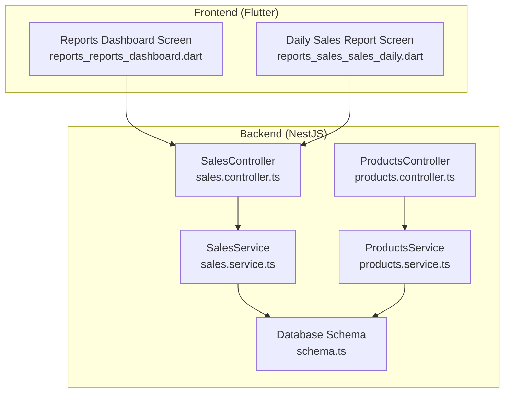
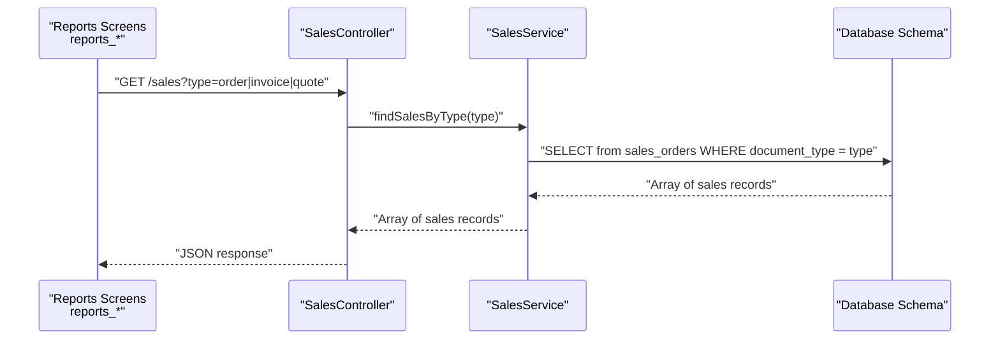
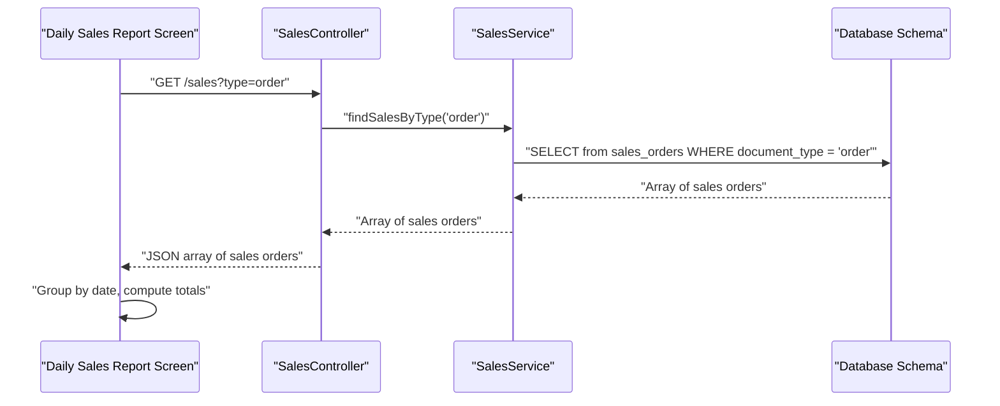
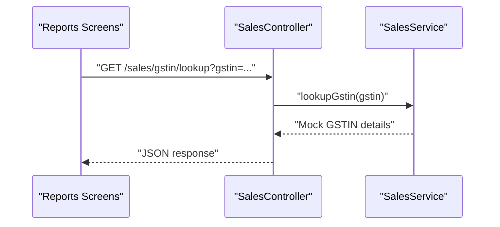
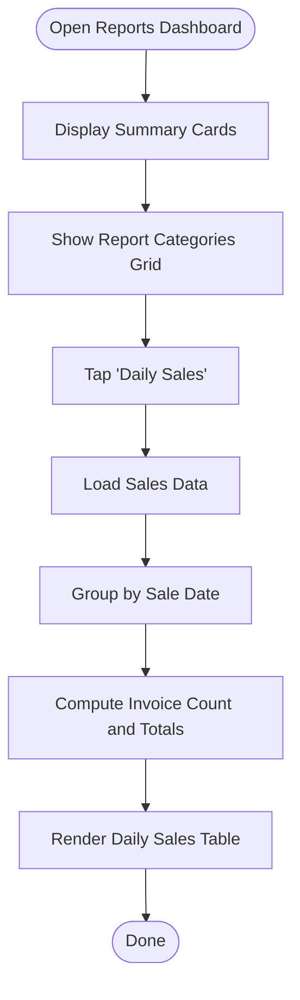
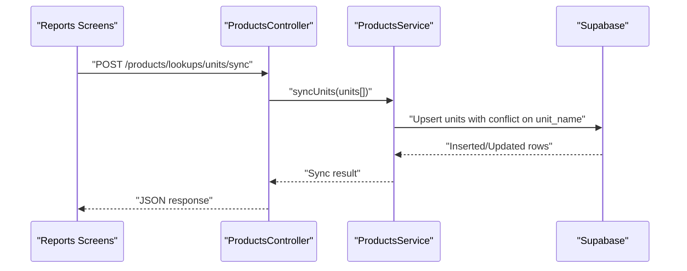
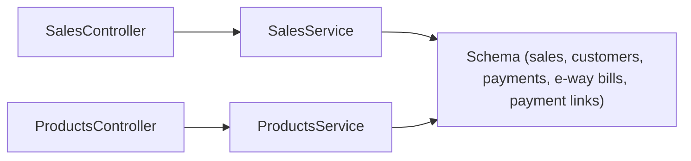

# Reporting API

<cite>
**Referenced Files in This Document**
- [reports_reports_dashboard.dart](file://lib/modules/reports/presentation/reports_reports_dashboard.dart)
- [reports_sales_sales_daily.dart](file://lib/modules/reports/presentation/reports_sales_sales_daily.dart)
- [sales.controller.ts](file://backend/src/sales/sales.controller.ts)
- [sales.service.ts](file://backend/src/sales/sales.service.ts)
- [products.controller.ts](file://backend/src/products/products.controller.ts)
- [products.service.ts](file://backend/src/products/products.service.ts)
- [schema.ts](file://backend/src/db/schema.ts)
</cite>

## Table of Contents
1. [Introduction](#introduction)
2. [Project Structure](#project-structure)
3. [Core Components](#core-components)
4. [Architecture Overview](#architecture-overview)
5. [Detailed Component Analysis](#detailed-component-analysis)
6. [Dependency Analysis](#dependency-analysis)
7. [Performance Considerations](#performance-considerations)
8. [Troubleshooting Guide](#troubleshooting-guide)
9. [Conclusion](#conclusion)
10. [Appendices](#appendices)

## Introduction
This document provides comprehensive API documentation for ZerpAI ERP reporting and analytics endpoints. It covers dashboard data endpoints, sales reports, inventory analytics, GST compliance reports, and financial dashboards. The documentation includes filtering options, date range parameters, data aggregation patterns, examples of report generation endpoints, export functionality, real-time analytics queries, KPI calculation endpoints, trend analysis, and custom report creation. It also outlines performance considerations for large datasets, caching strategies, and report scheduling capabilities.

## Project Structure
The reporting functionality spans both the frontend and backend:
- Frontend: Flutter screens under the reports module present dashboard summaries and daily sales reports.
- Backend: NestJS controllers and services expose endpoints for sales, payments, e-way bills, payment links, and product-related lookups.

**Diagram sources**
- [reports_reports_dashboard.dart](file://lib/modules/reports/presentation/reports_reports_dashboard.dart#L1-L214)
- [reports_sales_sales_daily.dart](file://lib/modules/reports/presentation/reports_sales_sales_daily.dart#L1-L213)
- [sales.controller.ts](file://backend/src/sales/sales.controller.ts#L1-L102)
- [sales.service.ts](file://backend/src/sales/sales.service.ts#L1-L162)
- [products.controller.ts](file://backend/src/products/products.controller.ts#L1-L250)
- [products.service.ts](file://backend/src/products/products.service.ts#L1-L723)
- [schema.ts](file://backend/src/db/schema.ts#L1-L293)

**Section sources**
- [reports_reports_dashboard.dart](file://lib/modules/reports/presentation/reports_reports_dashboard.dart#L1-L214)
- [reports_sales_sales_daily.dart](file://lib/modules/reports/presentation/reports_sales_sales_daily.dart#L1-L213)
- [sales.controller.ts](file://backend/src/sales/sales.controller.ts#L1-L102)
- [sales.service.ts](file://backend/src/sales/sales.service.ts#L1-L162)
- [products.controller.ts](file://backend/src/products/products.controller.ts#L1-L250)
- [products.service.ts](file://backend/src/products/products.service.ts#L1-L723)
- [schema.ts](file://backend/src/db/schema.ts#L1-L293)

## Core Components
- SalesController: Exposes endpoints for retrieving sales orders, customers, payments, e-way bills, payment links, and GSTIN lookup. Supports optional type filtering for sales documents.
- SalesService: Implements business logic for sales data retrieval and creation, including mock GSTIN lookup.
- ProductsController: Provides lookup endpoints for units, categories, tax rates, manufacturers, brands, vendors, storage locations, racks, reorder terms, accounts, contents, strengths, buying rules, and drug schedules. Includes synchronization endpoints for metadata.
- ProductsService: Handles product CRUD operations and metadata synchronization with Supabase, including usage checks for lookups.
- Database Schema: Defines tables for sales, customers, payments, e-way bills, payment links, and product-related entities with appropriate enums and relationships.

**Section sources**
- [sales.controller.ts](file://backend/src/sales/sales.controller.ts#L1-L102)
- [sales.service.ts](file://backend/src/sales/sales.service.ts#L1-L162)
- [products.controller.ts](file://backend/src/products/products.controller.ts#L1-L250)
- [products.service.ts](file://backend/src/products/products.service.ts#L1-L723)
- [schema.ts](file://backend/src/db/schema.ts#L1-L293)

## Architecture Overview
The reporting architecture integrates frontend screens with backend controllers and services. Controllers define REST endpoints, services encapsulate data access and business logic, and the database schema defines the underlying data model.

**Diagram sources**
- [reports_sales_sales_daily.dart](file://lib/modules/reports/presentation/reports_sales_sales_daily.dart#L1-L213)
- [sales.controller.ts](file://backend/src/sales/sales.controller.ts#L77-L84)
- [sales.service.ts](file://backend/src/sales/sales.service.ts#L64-L78)
- [schema.ts](file://backend/src/db/schema.ts#L236-L253)

## Detailed Component Analysis

### Sales Reports Endpoint
- Purpose: Retrieve sales data for reporting and analytics.
- Endpoints:
  - GET /sales?type={type}
  - GET /sales/:id
  - POST /sales
  - DELETE /sales/:id
- Filtering Options:
  - type: Filters sales documents by document type (e.g., order, invoice, quote).
- Date Range Parameters:
  - The sales service does not currently implement explicit date-range filtering in the controller or service. Date filtering can be applied client-side after retrieving sales records.
- Data Aggregation Patterns:
  - The frontend daily sales report aggregates sales by date, grouping invoices by saleDate and computing counts and totals.
- Real-Time Analytics Queries:
  - The frontend computes KPIs (e.g., total sales, pending invoices) by iterating through retrieved sales data and applying simple aggregations.

**Diagram sources**
- [reports_sales_sales_daily.dart](file://lib/modules/reports/presentation/reports_sales_sales_daily.dart#L13-L50)
- [sales.controller.ts](file://backend/src/sales/sales.controller.ts#L77-L84)
- [sales.service.ts](file://backend/src/sales/sales.service.ts#L64-L78)
- [schema.ts](file://backend/src/db/schema.ts#L236-L253)

**Section sources**
- [sales.controller.ts](file://backend/src/sales/sales.controller.ts#L77-L100)
- [sales.service.ts](file://backend/src/sales/sales.service.ts#L64-L106)
- [reports_sales_sales_daily.dart](file://lib/modules/reports/presentation/reports_sales_sales_daily.dart#L34-L50)

### GST Compliance Reports Endpoint
- Purpose: Provide GST-related lookup functionality for compliance reporting.
- Endpoints:
  - GET /sales/gstin/lookup?gstin={gstin}
- Implementation Notes:
  - The service currently returns mock data for demonstration. In production, integrate with an external GST registry API.

**Diagram sources**
- [sales.controller.ts](file://backend/src/sales/sales.controller.ts#L35-L39)
- [sales.service.ts](file://backend/src/sales/sales.service.ts#L9-L27)

**Section sources**
- [sales.controller.ts](file://backend/src/sales/sales.controller.ts#L35-L39)
- [sales.service.ts](file://backend/src/sales/sales.service.ts#L9-L27)

### Financial Dashboards and Summary Cards
- Purpose: Present high-level financial summaries and navigation to detailed reports.
- Features:
  - Summary cards for total sales, total customers, pending invoices, and escaped profits.
  - Grid of report categories (Sales, Inventory, Receivables, Tax) with clickable items.
- Navigation:
  - Daily Sales report navigates to a dedicated screen that groups and aggregates sales data by date.

**Diagram sources**
- [reports_reports_dashboard.dart](file://lib/modules/reports/presentation/reports_reports_dashboard.dart#L32-L156)
- [reports_sales_sales_daily.dart](file://lib/modules/reports/presentation/reports_sales_sales_daily.dart#L34-L50)

**Section sources**
- [reports_reports_dashboard.dart](file://lib/modules/reports/presentation/reports_reports_dashboard.dart#L32-L212)
- [reports_sales_sales_daily.dart](file://lib/modules/reports/presentation/reports_sales_sales_daily.dart#L34-L203)

### Inventory Analytics Endpoints
- Purpose: Provide inventory-related analytics via product lookups and metadata synchronization.
- Endpoints:
  - GET /products/lookups/units
  - GET /products/lookups/categories
  - GET /products/lookups/tax-rates
  - GET /products/lookups/manufacturers
  - GET /products/lookups/brands
  - GET /products/lookups/vendors
  - GET /products/lookups/storage-locations
  - GET /products/lookups/racks
  - GET /products/lookups/reorder-terms
  - GET /products/lookups/accounts
  - GET /products/lookups/contents
  - GET /products/lookups/strengths
  - GET /products/lookups/buying-rules
  - GET /products/lookups/drug-schedules
  - POST /products/lookups/:lookup/check-usage
  - POST /products/lookups/units/sync
  - POST /products/lookups/categories/sync
  - POST /products/lookups/manufacturers/sync
  - POST /products/lookups/brands/sync
  - POST /products/lookups/vendors/sync
  - POST /products/lookups/storage-locations/sync
  - POST /products/lookups/racks/sync
  - POST /products/lookups/reorder-terms/sync
  - POST /products/lookups/accounts/sync
  - POST /products/lookups/contents/sync
  - POST /products/lookups/strengths/sync
  - POST /products/lookups/buying-rules/sync
  - POST /products/lookups/drug-schedules/sync
- Usage Checks:
  - POST /products/lookups/:lookup/check-usage validates whether a lookup value is still in use before deletion.

**Diagram sources**
- [products.controller.ts](file://backend/src/products/products.controller.ts#L23-L45)
- [products.service.ts](file://backend/src/products/products.service.ts#L208-L252)

**Section sources**
- [products.controller.ts](file://backend/src/products/products.controller.ts#L23-L215)
- [products.service.ts](file://backend/src/products/products.service.ts#L196-L722)

### Export Functionality
- Current State: The frontend daily sales report renders a tabular summary but does not implement export to CSV/PDF.
- Recommended Approach:
  - Add export handlers in the frontend to serialize the computed daily statistics to CSV or PDF.
  - Alternatively, introduce server-side export endpoints that accept date range and aggregation parameters and return downloadable files.

[No sources needed since this section provides general guidance]

### KPI Calculation Endpoints
- Current State: KPIs (e.g., total sales, pending invoices) are computed client-side by iterating through retrieved sales data.
- Recommended Approach:
  - Introduce server-side KPI endpoints that accept date range and filters, pre-aggregating data to reduce client computation and improve performance.

[No sources needed since this section provides general guidance]

### Trend Analysis
- Current State: The daily sales report groups sales by date and displays totals. Trend analysis requires multi-day comparisons.
- Recommended Approach:
  - Extend the sales endpoint to support date range parameters and grouping by day/week/month.
  - Provide trend endpoints that return time-series data for charts.

[No sources needed since this section provides general guidance]

### Custom Report Creation
- Current State: The reports dashboard lists predefined categories and items. Custom report creation is not exposed as an API.
- Recommended Approach:
  - Add endpoints to define custom report templates with filters, aggregations, and export options.
  - Store templates and schedule periodic report generation.

[No sources needed since this section provides general guidance]

## Dependency Analysis
The reporting endpoints depend on the database schema and services as follows:

**Diagram sources**
- [sales.controller.ts](file://backend/src/sales/sales.controller.ts#L1-L102)
- [sales.service.ts](file://backend/src/sales/sales.service.ts#L1-L162)
- [products.controller.ts](file://backend/src/products/products.controller.ts#L1-L250)
- [products.service.ts](file://backend/src/products/products.service.ts#L1-L723)
- [schema.ts](file://backend/src/db/schema.ts#L210-L292)

**Section sources**
- [sales.controller.ts](file://backend/src/sales/sales.controller.ts#L1-L102)
- [sales.service.ts](file://backend/src/sales/sales.service.ts#L1-L162)
- [products.controller.ts](file://backend/src/products/products.controller.ts#L1-L250)
- [products.service.ts](file://backend/src/products/products.service.ts#L1-L723)
- [schema.ts](file://backend/src/db/schema.ts#L210-L292)

## Performance Considerations
- Large Datasets:
  - Pagination: Implement pagination for sales and product lists to avoid loading excessive data.
  - Filtering: Apply server-side filters for date ranges, statuses, and document types.
  - Indexing: Ensure database indexes on frequently queried columns (e.g., sale_date, document_type, customer_id).
- Caching Strategies:
  - Lookup Metadata: Cache product lookup data (units, categories, tax rates, etc.) in memory or Redis to reduce repeated database calls.
  - Report Snapshots: Cache aggregated report snapshots for common date ranges and KPIs.
- Report Scheduling:
  - Background Jobs: Use scheduled tasks to precompute and cache daily/weekly/monthly reports.
  - Incremental Updates: Update caches incrementally as new sales data arrives.

[No sources needed since this section provides general guidance]

## Troubleshooting Guide
- Missing or Empty Reports:
  - Verify that sales records exist and match the requested type and date range.
  - Confirm that the frontend is grouping and aggregating data correctly.
- GSTIN Lookup Failures:
  - Ensure the GSTIN parameter is provided and valid.
  - Check network connectivity and external API availability (mocked in current implementation).
- Product Lookup Usage Checks:
  - Use the usage-check endpoints to confirm whether a lookup value is still referenced before attempting deletions.

**Section sources**
- [sales.service.ts](file://backend/src/sales/sales.service.ts#L9-L27)
- [products.controller.ts](file://backend/src/products/products.controller.ts#L52-L55)
- [products.service.ts](file://backend/src/products/products.service.ts#L290-L389)

## Conclusion
ZerpAI ERP’s reporting and analytics endpoints currently provide foundational capabilities for sales data retrieval, GST compliance lookups, and product metadata management. To meet advanced reporting needs, extend endpoints with date-range filtering, server-side KPI calculations, trend analysis, export functionality, and scheduled report generation. Implement performance optimizations such as pagination, indexing, caching, and background job scheduling to handle large datasets efficiently.

[No sources needed since this section summarizes without analyzing specific files]

## Appendices

### API Definitions

- Sales
  - GET /sales?type={type}
    - Description: Retrieve sales orders filtered by document type.
    - Query Parameters:
      - type: String (optional). Values: order, invoice, quote.
    - Response: Array of sales records.
  - GET /sales/:id
    - Description: Retrieve a specific sales record by ID.
    - Response: Single sales record.
  - POST /sales
    - Description: Create a new sales record.
    - Request Body: Sales data payload.
    - Response: Created sales record.
  - DELETE /sales/:id
    - Description: Delete a sales record by ID.
    - Response: Deletion confirmation message.
  - GET /sales/gstin/lookup?gstin={gstin}
    - Description: Lookup GSTIN details.
    - Query Parameters:
      - gstin: String. GSTIN number.
    - Response: GSTIN details (mocked).

- Products Lookups
  - GET /products/lookups/units
  - GET /products/lookups/categories
  - GET /products/lookups/tax-rates
  - GET /products/lookups/manufacturers
  - GET /products/lookups/brands
  - GET /products/lookups/vendors
  - GET /products/lookups/storage-locations
  - GET /products/lookups/racks
  - GET /products/lookups/reorder-terms
  - GET /products/lookups/accounts
  - GET /products/lookups/contents
  - GET /products/lookups/strengths
  - GET /products/lookups/buying-rules
  - GET /products/lookups/drug-schedules
  - POST /products/lookups/:lookup/check-usage
    - Description: Check if a lookup value is still in use.
    - Path Parameters:
      - lookup: String. Lookup type (e.g., units, categories).
    - Request Body: { id: string }.
    - Response: { inUse: boolean, usedIn?: string }.
  - POST /products/lookups/units/sync
  - POST /products/lookups/categories/sync
  - POST /products/lookups/manufacturers/sync
  - POST /products/lookups/brands/sync
  - POST /products/lookups/vendors/sync
  - POST /products/lookups/storage-locations/sync
  - POST /products/lookups/racks/sync
  - POST /products/lookups/reorder-terms/sync
  - POST /products/lookups/accounts/sync
  - POST /products/lookups/contents/sync
  - POST /products/lookups/strengths/sync
  - POST /products/lookups/buying-rules/sync
  - POST /products/lookups/drug-schedules/sync
    - Description: Synchronize lookup metadata with the database.
    - Request Body: Array of lookup items.
    - Response: Upserted rows.

**Section sources**
- [sales.controller.ts](file://backend/src/sales/sales.controller.ts#L18-L100)
- [sales.service.ts](file://backend/src/sales/sales.service.ts#L64-L106)
- [products.controller.ts](file://backend/src/products/products.controller.ts#L23-L215)
- [products.service.ts](file://backend/src/products/products.service.ts#L196-L722)