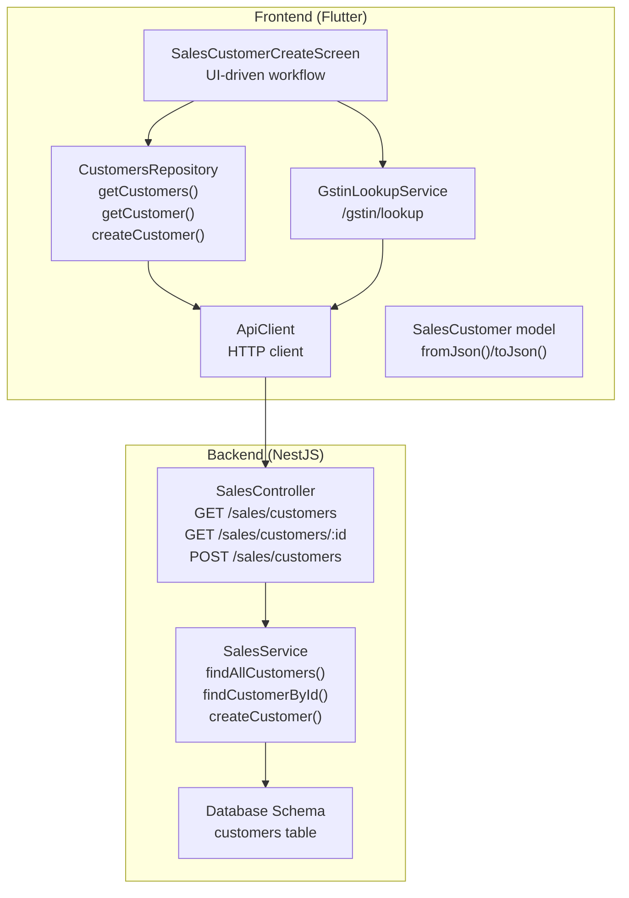
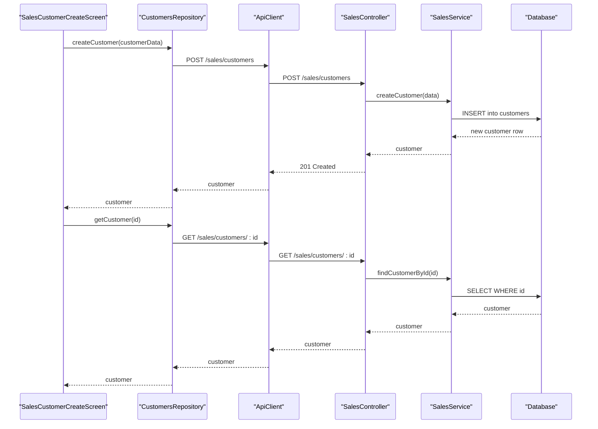
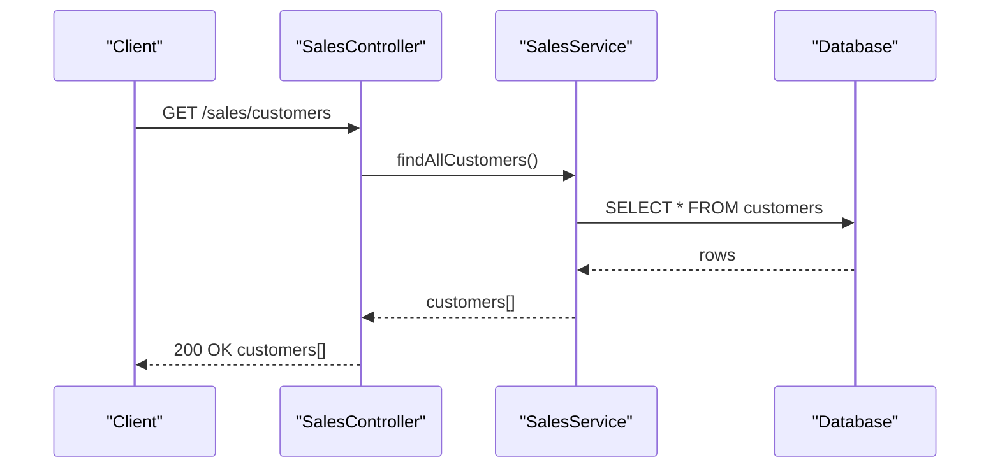
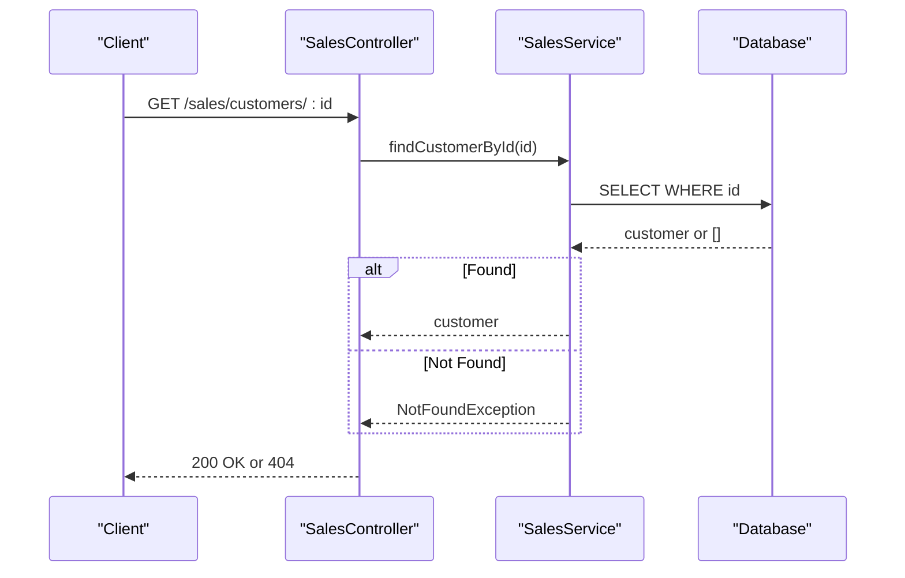
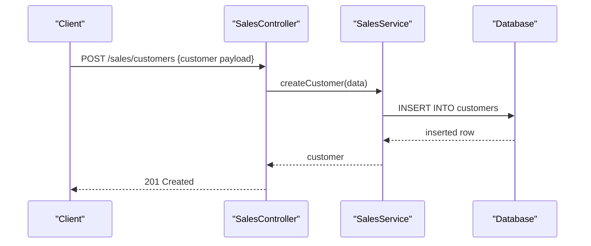
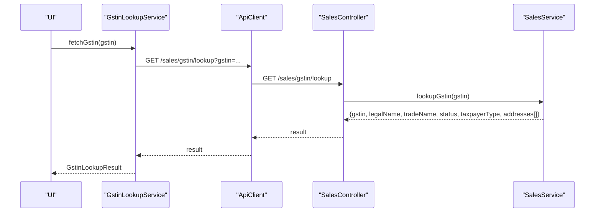
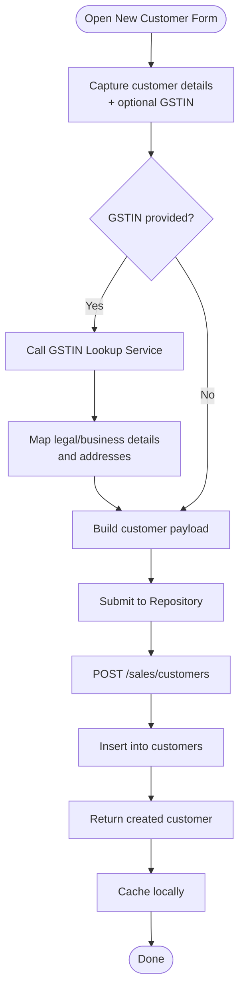
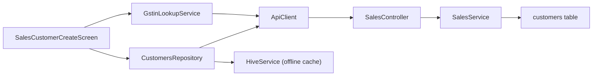

# Customer Management Endpoints

<cite>
**Referenced Files in This Document**
- [sales.controller.ts](file://backend/src/sales/sales.controller.ts)
- [sales.service.ts](file://backend/src/sales/sales.service.ts)
- [schema.ts](file://backend/src/db/schema.ts)
- [sales_customer_model.dart](file://lib/modules/sales/models/sales_customer_model.dart)
- [customers_repository.dart](file://lib/modules/sales/repositories/customers_repository.dart)
- [gstin_lookup_service.dart](file://lib/modules/sales/services/gstin_lookup_service.dart)
- [gstin_lookup_model.dart](file://lib/modules/sales/models/gstin_lookup_model.dart)
- [api_client.dart](file://lib/shared/services/api_client.dart)
- [sales_customer_customer_create.dart](file://lib/modules/sales/presentation/sales_customer_customer_create.dart)
</cite>

## Table of Contents
1. [Introduction](#introduction)
2. [Project Structure](#project-structure)
3. [Core Components](#core-components)
4. [Architecture Overview](#architecture-overview)
5. [Detailed Component Analysis](#detailed-component-analysis)
6. [Dependency Analysis](#dependency-analysis)
7. [Performance Considerations](#performance-considerations)
8. [Troubleshooting Guide](#troubleshooting-guide)
9. [Conclusion](#conclusion)
10. [Appendices](#appendices)

## Introduction
This document provides comprehensive API documentation for customer management endpoints in the ZerpAI ERP sales module. It covers:
- Listing customers with filtering and pagination options
- Retrieving individual customer details
- Creating customers with validation, GSTIN verification, and address management
- Complete request/response schemas for customer profiles, addresses, contacts, custom fields, and GST compliance data
- Examples of customer creation workflows, GSTIN validation integration, and search/filtering patterns

## Project Structure
The customer management feature spans both backend (NestJS) and frontend (Flutter) layers:
- Backend exposes REST endpoints via a controller and implements CRUD using a service and database schema
- Frontend integrates with the backend through an API client, repository pattern, and domain models

**Diagram sources**
- [sales.controller.ts](file://backend/src/sales/sales.controller.ts#L18-L33)
- [sales.service.ts](file://backend/src/sales/sales.service.ts#L29-L61)
- [schema.ts](file://backend/src/db/schema.ts#L213-L234)
- [customers_repository.dart](file://lib/modules/sales/repositories/customers_repository.dart#L16-L98)
- [api_client.dart](file://lib/shared/services/api_client.dart#L46-L60)
- [sales_customer_model.dart](file://lib/modules/sales/models/sales_customer_model.dart#L44-L91)
- [gstin_lookup_service.dart](file://lib/modules/sales/services/gstin_lookup_service.dart#L7-L26)
- [sales_customer_customer_create.dart](file://lib/modules/sales/presentation/sales_customer_customer_create.dart#L233-L269)

**Section sources**
- [sales.controller.ts](file://backend/src/sales/sales.controller.ts#L18-L33)
- [sales.service.ts](file://backend/src/sales/sales.service.ts#L29-L61)
- [schema.ts](file://backend/src/db/schema.ts#L213-L234)
- [customers_repository.dart](file://lib/modules/sales/repositories/customers_repository.dart#L16-L98)
- [api_client.dart](file://lib/shared/services/api_client.dart#L46-L60)
- [sales_customer_model.dart](file://lib/modules/sales/models/sales_customer_model.dart#L44-L91)
- [gstin_lookup_service.dart](file://lib/modules/sales/services/gstin_lookup_service.dart#L7-L26)
- [sales_customer_customer_create.dart](file://lib/modules/sales/presentation/sales_customer_customer_create.dart#L233-L269)

## Core Components
- SalesController: Exposes customer endpoints and delegates to SalesService
- SalesService: Implements business logic for customer CRUD and GSTIN lookup
- Database Schema: Defines the customers table structure
- Frontend Repository: Provides online-first caching and offline fallback for customer data
- Domain Model: Maps backend data to a strongly-typed Dart model
- GSTIN Lookup Service: Integrates with backend GSTIN lookup endpoint

Key responsibilities:
- GET /sales/customers: Returns all customer records
- GET /sales/customers/:id: Returns a single customer by ID
- POST /sales/customers: Creates a new customer with validation and persistence
- GET /sales/gstin/lookup: Validates GSTIN and returns legal/business details

**Section sources**
- [sales.controller.ts](file://backend/src/sales/sales.controller.ts#L18-L39)
- [sales.service.ts](file://backend/src/sales/sales.service.ts#L29-L61)
- [schema.ts](file://backend/src/db/schema.ts#L213-L234)
- [customers_repository.dart](file://lib/modules/sales/repositories/customers_repository.dart#L16-L98)
- [sales_customer_model.dart](file://lib/modules/sales/models/sales_customer_model.dart#L44-L91)
- [gstin_lookup_service.dart](file://lib/modules/sales/services/gstin_lookup_service.dart#L7-L26)

## Architecture Overview
The customer lifecycle flows from UI to repository, API, controller, service, and database, with optional GSTIN verification integrated into the workflow.

**Diagram sources**
- [sales.controller.ts](file://backend/src/sales/sales.controller.ts#L24-L33)
- [sales.service.ts](file://backend/src/sales/sales.service.ts#L34-L61)
- [schema.ts](file://backend/src/db/schema.ts#L213-L234)
- [customers_repository.dart](file://lib/modules/sales/repositories/customers_repository.dart#L78-L98)
- [api_client.dart](file://lib/shared/services/api_client.dart#L50-L51)

## Detailed Component Analysis

### Endpoint: GET /sales/customers
- Purpose: Retrieve all customers
- Implementation: Controller delegates to service; service queries the database
- Response: Array of customer objects
- Filtering/Pagination: Current implementation returns all records without query parameters

**Diagram sources**
- [sales.controller.ts](file://backend/src/sales/sales.controller.ts#L19-L22)
- [sales.service.ts](file://backend/src/sales/sales.service.ts#L30-L32)
- [schema.ts](file://backend/src/db/schema.ts#L213-L234)

**Section sources**
- [sales.controller.ts](file://backend/src/sales/sales.controller.ts#L19-L22)
- [sales.service.ts](file://backend/src/sales/sales.service.ts#L30-L32)
- [schema.ts](file://backend/src/db/schema.ts#L213-L234)

### Endpoint: GET /sales/customers/:id
- Purpose: Retrieve a specific customer by ID
- Implementation: Controller delegates to service; service queries by ID and throws NotFoundException if not found
- Response: Single customer object
- Validation: Throws 404 if customer does not exist

**Diagram sources**
- [sales.controller.ts](file://backend/src/sales/sales.controller.ts#L24-L27)
- [sales.service.ts](file://backend/src/sales/sales.service.ts#L34-L40)
- [schema.ts](file://backend/src/db/schema.ts#L213-L234)

**Section sources**
- [sales.controller.ts](file://backend/src/sales/sales.controller.ts#L24-L27)
- [sales.service.ts](file://backend/src/sales/sales.service.ts#L34-L40)

### Endpoint: POST /sales/customers
- Purpose: Create a new customer
- Implementation: Controller delegates to service; service inserts into customers table
- Validation: Service accepts arbitrary data and persists as provided; no explicit validation logic in service
- Response: Newly created customer object

**Diagram sources**
- [sales.controller.ts](file://backend/src/sales/sales.controller.ts#L29-L33)
- [sales.service.ts](file://backend/src/sales/sales.service.ts#L42-L61)
- [schema.ts](file://backend/src/db/schema.ts#L213-L234)

**Section sources**
- [sales.controller.ts](file://backend/src/sales/sales.controller.ts#L29-L33)
- [sales.service.ts](file://backend/src/sales/sales.service.ts#L42-L61)

### GSTIN Lookup Integration
- Endpoint: GET /sales/gstin/lookup?gstin={gstin}
- Purpose: Validate GSTIN and return legal/business details and addresses
- Implementation: Controller delegates to service; service returns mock data (placeholder for external API)
- Frontend integration: GstinLookupService calls backend and maps to GstinLookupResult/GstinAddress models

**Diagram sources**
- [gstin_lookup_service.dart](file://lib/modules/sales/services/gstin_lookup_service.dart#L7-L26)
- [api_client.dart](file://lib/shared/services/api_client.dart#L46-L48)
- [sales.controller.ts](file://backend/src/sales/sales.controller.ts#L36-L39)
- [sales.service.ts](file://backend/src/sales/sales.service.ts#L9-L27)
- [gstin_lookup_model.dart](file://lib/modules/sales/models/gstin_lookup_model.dart#L1-L105)

**Section sources**
- [sales.controller.ts](file://backend/src/sales/sales.controller.ts#L36-L39)
- [sales.service.ts](file://backend/src/sales/sales.service.ts#L9-L27)
- [gstin_lookup_service.dart](file://lib/modules/sales/services/gstin_lookup_service.dart#L7-L26)
- [gstin_lookup_model.dart](file://lib/modules/sales/models/gstin_lookup_model.dart#L1-L105)

### Request/Response Schemas

#### Customer Profile Fields
- id: UUID
- displayName: String
- customerType: String (default: Business)
- salutation: String
- firstName: String
- lastName: String
- companyName: String
- email: String
- phone: String
- mobilePhone: String
- gstin: String
- pan: String
- currency: String (default: INR)
- paymentTerms: String
- billingAddress: Text
- shippingAddress: Text
- isActive: Boolean (default: true)
- receivables: Decimal (default: 0.00)
- createdAt: Timestamp

Mapping in frontend model:
- Field aliases and defaults handled via SalesCustomer.fromJson()

**Section sources**
- [schema.ts](file://backend/src/db/schema.ts#L213-L234)
- [sales_customer_model.dart](file://lib/modules/sales/models/sales_customer_model.dart#L44-L91)

#### GSTIN Lookup Response
- gstin: String
- legalName: String
- tradeName: String
- status: String
- taxpayerType: String
- addresses: Array of GstinAddress
  - line1: String
  - line2: String
  - city: String
  - state: String
  - pinCode: String
  - country: String

**Section sources**
- [sales.service.ts](file://backend/src/sales/sales.service.ts#L9-L27)
- [gstin_lookup_model.dart](file://lib/modules/sales/models/gstin_lookup_model.dart#L1-L105)

### Customer Creation Workflow (End-to-End)
- UI captures customer details and optional GSTIN
- UI optionally validates GSTIN via GSTIN lookup service
- UI submits customer payload to repository
- Repository posts to backend customer endpoint
- Backend persists customer and returns created record
- Repository caches result for offline access

**Diagram sources**
- [sales_customer_customer_create.dart](file://lib/modules/sales/presentation/sales_customer_customer_create.dart#L233-L269)
- [gstin_lookup_service.dart](file://lib/modules/sales/services/gstin_lookup_service.dart#L7-L26)
- [customers_repository.dart](file://lib/modules/sales/repositories/customers_repository.dart#L78-L98)
- [sales.controller.ts](file://backend/src/sales/sales.controller.ts#L29-L33)
- [sales.service.ts](file://backend/src/sales/sales.service.ts#L42-L61)

**Section sources**
- [sales_customer_customer_create.dart](file://lib/modules/sales/presentation/sales_customer_customer_create.dart#L233-L269)
- [gstin_lookup_service.dart](file://lib/modules/sales/services/gstin_lookup_service.dart#L7-L26)
- [customers_repository.dart](file://lib/modules/sales/repositories/customers_repository.dart#L78-L98)
- [sales.controller.ts](file://backend/src/sales/sales.controller.ts#L29-L33)
- [sales.service.ts](file://backend/src/sales/sales.service.ts#L42-L61)

### Search and Filtering Patterns
- Backend current implementation: No query parameters for filtering or pagination on GET /sales/customers
- Recommended patterns (conceptual):
  - Query parameters: q=searchTerm, limit, offset, sort, order
  - Filtering by customerType, gstin, company name, email
  - Pagination via limit/offset or cursor-based pagination
- Frontend repository: Online-first with offline fallback; supports forced refresh and cache staleness checks

**Section sources**
- [sales.controller.ts](file://backend/src/sales/sales.controller.ts#L19-L22)
- [customers_repository.dart](file://lib/modules/sales/repositories/customers_repository.dart#L16-L50)

## Dependency Analysis
- Controller depends on SalesService
- SalesService depends on database schema and Drizzle ORM
- Frontend repository depends on ApiClient and HiveService for caching
- UI depends on SalesCustomer model and GSTIN lookup service

**Diagram sources**
- [sales.controller.ts](file://backend/src/sales/sales.controller.ts#L18-L39)
- [sales.service.ts](file://backend/src/sales/sales.service.ts#L1-L7)
- [schema.ts](file://backend/src/db/schema.ts#L213-L234)
- [customers_repository.dart](file://lib/modules/sales/repositories/customers_repository.dart#L8-L14)
- [api_client.dart](file://lib/shared/services/api_client.dart#L6-L43)
- [gstin_lookup_service.dart](file://lib/modules/sales/services/gstin_lookup_service.dart#L4-L5)

**Section sources**
- [sales.controller.ts](file://backend/src/sales/sales.controller.ts#L18-L39)
- [sales.service.ts](file://backend/src/sales/sales.service.ts#L1-L7)
- [schema.ts](file://backend/src/db/schema.ts#L213-L234)
- [customers_repository.dart](file://lib/modules/sales/repositories/customers_repository.dart#L8-L14)
- [api_client.dart](file://lib/shared/services/api_client.dart#L6-L43)
- [gstin_lookup_service.dart](file://lib/modules/sales/services/gstin_lookup_service.dart#L4-L5)

## Performance Considerations
- Current backend returns all customers without pagination; consider adding limit/offset or cursor-based pagination
- Frontend repository caches data locally; ensure cache invalidation and staleness thresholds are tuned for network conditions
- GSTIN lookup is currently mocked; integrate with external API and add retries/backoff for resilience

## Troubleshooting Guide
- 404 Not Found when retrieving customer by ID: Verify the ID exists in the database
- Creation failures: Ensure required fields are present; backend currently does not enforce validation
- GSTIN lookup returns empty: Confirm GSTIN format and backend integration is configured

**Section sources**
- [sales.service.ts](file://backend/src/sales/sales.service.ts#L34-L40)
- [sales.service.ts](file://backend/src/sales/sales.service.ts#L9-L27)
- [customers_repository.dart](file://lib/modules/sales/repositories/customers_repository.dart#L34-L49)

## Conclusion
The customer management endpoints provide a solid foundation for listing, retrieving, and creating customers. The backend currently lacks filtering/pagination and input validation, while the frontend offers robust offline-first caching and a structured model for customer data. Integrating GSTIN verification and adding server-side filtering/pagination will enhance usability and scalability.

## Appendices

### API Definitions

- GET /sales/customers
  - Description: List all customers
  - Response: Array of customer objects
  - Notes: No filtering or pagination supported yet

- GET /sales/customers/:id
  - Description: Retrieve a customer by ID
  - Path Parameters: id (UUID)
  - Response: Customer object
  - Errors: 404 if not found

- POST /sales/customers
  - Description: Create a new customer
  - Request Body: Customer fields (see schemas below)
  - Response: Created customer object
  - Status: 201 Created

- GET /sales/gstin/lookup?gstin={gstin}
  - Description: Validate GSTIN and return legal/business details
  - Query Parameters: gstin (String)
  - Response: GSTIN lookup result with addresses

### Request/Response Schemas

- Customer Request (POST /sales/customers)
  - Required: displayName
  - Optional: customerType, salutation, firstName, lastName, companyName, email, phone, mobilePhone, gstin, pan, currency, paymentTerms, billingAddress, shippingAddress

- Customer Response (GET /sales/customers, GET /sales/customers/:id, POST /sales/customers)
  - Fields: id, displayName, customerType, salutation, firstName, lastName, companyName, email, phone, mobilePhone, gstin, pan, currency, paymentTerms, billingAddress, shippingAddress, isActive, receivables, createdAt

- GSTIN Lookup Response
  - Fields: gstin, legalName, tradeName, status, taxpayerType, addresses[]
    - Address fields: line1, line2, city, state, pinCode, country

**Section sources**
- [sales.controller.ts](file://backend/src/sales/sales.controller.ts#L19-L39)
- [sales.service.ts](file://backend/src/sales/sales.service.ts#L29-L61)
- [schema.ts](file://backend/src/db/schema.ts#L213-L234)
- [sales_customer_model.dart](file://lib/modules/sales/models/sales_customer_model.dart#L44-L91)
- [gstin_lookup_model.dart](file://lib/modules/sales/models/gstin_lookup_model.dart#L1-L105)