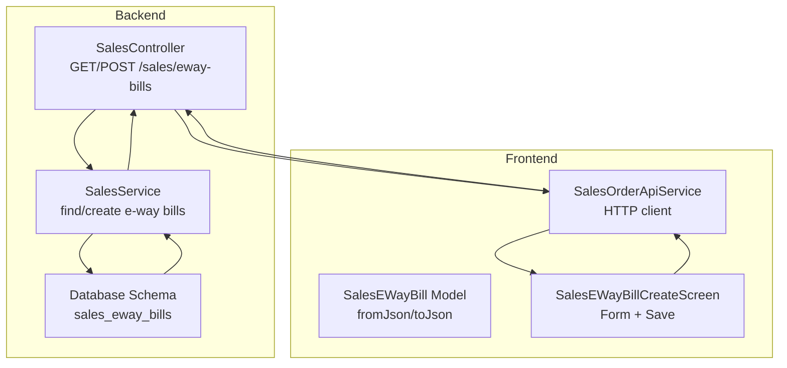
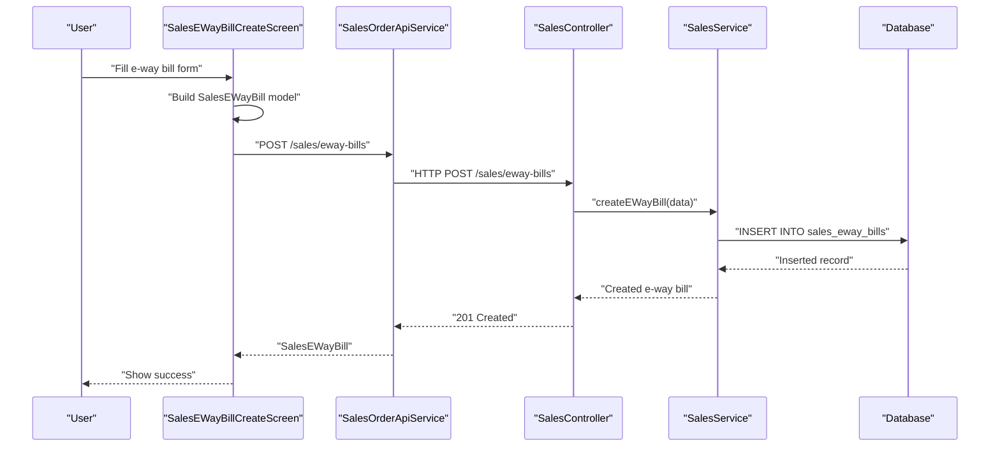
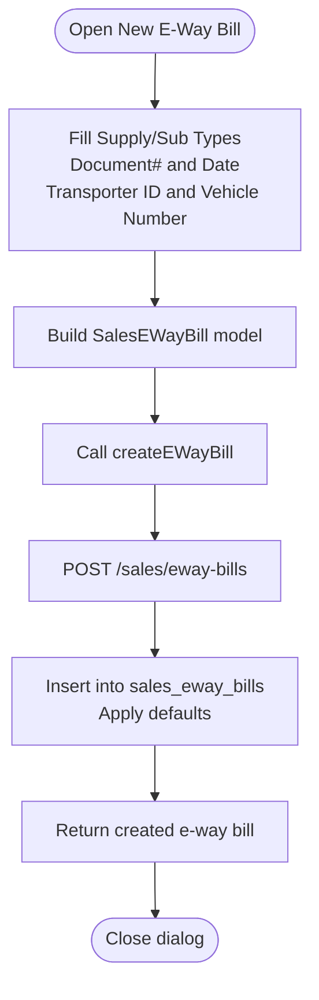

# E-Way Bill Endpoints

<cite>
**Referenced Files in This Document**
- [sales.controller.ts](file://backend/src/sales/sales.controller.ts)
- [sales.service.ts](file://backend/src/sales/sales.service.ts)
- [schema.ts](file://backend/src/db/schema.ts)
- [sales_eway_bill_model.dart](file://lib/modules/sales/models/sales_eway_bill_model.dart)
- [sales_eway_bill_create.dart](file://lib/modules/sales/presentation/sales_eway_bill_create.dart)
- [sales_order_api_service.dart](file://lib/modules/sales/services/sales_order_api_service.dart)
- [app_router.dart](file://lib/core/routing/app_router.dart)
- [sales_generic_list_table.dart](file://lib/modules/sales/presentation/sections/sales_generic_list_table.dart)
</cite>

## Table of Contents
1. [Introduction](#introduction)
2. [Project Structure](#project-structure)
3. [Core Components](#core-components)
4. [Architecture Overview](#architecture-overview)
5. [Detailed Component Analysis](#detailed-component-analysis)
6. [API Reference](#api-reference)
7. [Request/Response Schemas](#requestresponse-schemas)
8. [Examples and Workflows](#examples-and-workflows)
9. [Dependency Analysis](#dependency-analysis)
10. [Performance Considerations](#performance-considerations)
11. [Troubleshooting Guide](#troubleshooting-guide)
12. [Conclusion](#conclusion)

## Introduction
This document provides comprehensive API documentation for e-way bill generation and management endpoints in the ZerpAI ERP sales module. It covers:
- Retrieval of e-way bills via GET /sales/eway-bills
- Creation of e-way bills via POST /sales/eway-bills
- Request and response schemas for e-way bill models
- Frontend integration patterns for creating e-way bills
- Filtering and search capabilities
- Compliance considerations for different shipment scenarios

## Project Structure
The e-way bill feature spans both the backend NestJS API and the Flutter frontend:
- Backend: Controller and service expose endpoints and interact with the database schema
- Database: Strongly typed table schema defines e-way bill fields
- Frontend: Model, screen, and API service integrate with the backend

**Diagram sources**
- [sales.controller.ts](file://backend/src/sales/sales.controller.ts#L53-L63)
- [sales.service.ts](file://backend/src/sales/sales.service.ts#L128-L145)
- [schema.ts](file://backend/src/db/schema.ts#L269-L281)
- [sales_eway_bill_model.dart](file://lib/modules/sales/models/sales_eway_bill_model.dart#L1-L52)
- [sales_eway_bill_create.dart](file://lib/modules/sales/presentation/sales_eway_bill_create.dart#L193-L213)
- [sales_order_api_service.dart](file://lib/modules/sales/services/sales_order_api_service.dart#L135-L161)

**Section sources**
- [sales.controller.ts](file://backend/src/sales/sales.controller.ts#L53-L63)
- [sales.service.ts](file://backend/src/sales/sales.service.ts#L128-L145)
- [schema.ts](file://backend/src/db/schema.ts#L269-L281)
- [sales_eway_bill_model.dart](file://lib/modules/sales/models/sales_eway_bill_model.dart#L1-L52)
- [sales_eway_bill_create.dart](file://lib/modules/sales/presentation/sales_eway_bill_create.dart#L1-L215)
- [sales_order_api_service.dart](file://lib/modules/sales/services/sales_order_api_service.dart#L135-L161)
- [app_router.dart](file://lib/core/routing/app_router.dart#L224-L234)

## Core Components
- SalesController: Exposes GET /sales/eway-bills and POST /sales/eway-bills endpoints
- SalesService: Implements retrieval and creation of e-way bills using the database schema
- Database Schema: Defines sales_eway_bills table with UUID primary key, foreign key to sales orders, and core fields
- SalesEWayBill Model: Dart model with serialization/deserialization for frontend consumption
- SalesEWayBillCreateScreen: UI form for capturing e-way bill details and invoking the API
- SalesOrderApiService: HTTP client wrapper for /sales/eway-bills endpoints

Key responsibilities:
- Validation and defaults are applied in the backend service
- Frontend captures user inputs and sends structured payloads
- Database enforces referential integrity via foreign keys

**Section sources**
- [sales.controller.ts](file://backend/src/sales/sales.controller.ts#L53-L63)
- [sales.service.ts](file://backend/src/sales/sales.service.ts#L128-L145)
- [schema.ts](file://backend/src/db/schema.ts#L269-L281)
- [sales_eway_bill_model.dart](file://lib/modules/sales/models/sales_eway_bill_model.dart#L1-L52)
- [sales_eway_bill_create.dart](file://lib/modules/sales/presentation/sales_eway_bill_create.dart#L193-L213)
- [sales_order_api_service.dart](file://lib/modules/sales/services/sales_order_api_service.dart#L135-L161)

## Architecture Overview
The e-way bill workflow connects frontend UI, HTTP client, backend controller, service, and database.

**Diagram sources**
- [sales_eway_bill_create.dart](file://lib/modules/sales/presentation/sales_eway_bill_create.dart#L193-L213)
- [sales_order_api_service.dart](file://lib/modules/sales/services/sales_order_api_service.dart#L148-L161)
- [sales.controller.ts](file://backend/src/sales/sales.controller.ts#L59-L63)
- [sales.service.ts](file://backend/src/sales/sales.service.ts#L133-L145)
- [schema.ts](file://backend/src/db/schema.ts#L269-L281)

## Detailed Component Analysis

### Backend Controller: SalesController
- GET /sales/eway-bills delegates to service for listing e-way bills
- POST /sales/eway-bills delegates to service for creation

Operational notes:
- No query parameters or body validation are implemented in the controller; validation and defaults are handled in the service
- HTTP status codes align with NestJS conventions (201 for creation)

**Section sources**
- [sales.controller.ts](file://backend/src/sales/sales.controller.ts#L53-L63)

### Backend Service: SalesService
- findEWayBills: Selects all e-way bills from the sales_eway_bills table
- createEWayBill: Inserts a new e-way bill with defaults for supplyType, subType, and status

Validation and defaults:
- supplyType defaults to "Outward"
- subType defaults to "Supply"
- status defaults to "active"
- billDate defaults to current time if not provided

**Section sources**
- [sales.service.ts](file://backend/src/sales/sales.service.ts#L128-L145)

### Database Schema: sales_eway_bills
Fields:
- id: UUID, PK
- saleId: UUID, FK to sales_orders.id
- billNumber: unique string
- billDate: timestamp
- supplyType: string with default "Outward"
- subType: string with default "Supply"
- transporterId: optional string
- vehicleNumber: optional string
- status: string with default "active"
- createdAt: timestamp

Constraints:
- billNumber is unique
- saleId references sales_orders with ON DELETE behavior implied by service usage

**Section sources**
- [schema.ts](file://backend/src/db/schema.ts#L269-L281)

### Frontend Model: SalesEWayBill
- Properties: id, saleId, billNumber, billDate, supplyType, subType, transporterId, vehicleNumber, status
- Serialization: fromJson parses dates and applies defaults; toJson serializes with optional fields

Usage:
- Used by SalesEWayBillCreateScreen to capture inputs
- Consumed by SalesOrderApiService for HTTP requests

**Section sources**
- [sales_eway_bill_model.dart](file://lib/modules/sales/models/sales_eway_bill_model.dart#L1-L52)

### Frontend Screen: SalesEWayBillCreateScreen
- Captures Supply Type, Sub Type, Document#, Document Date, Transporter ID, Vehicle Number
- Builds SalesEWayBill and calls SalesOrderApiService.createEWayBill
- Handles save and error feedback

UI behavior:
- Uses radio groups for supply/sub types
- Date picker for bill date
- Custom text fields for identifiers

**Section sources**
- [sales_eway_bill_create.dart](file://lib/modules/sales/presentation/sales_eway_bill_create.dart#L193-L213)

### Frontend API Service: SalesOrderApiService
- getEWayBills: GET /sales/eway-bills
- createEWayBill: POST /sales/eway-bills with payload from model.toJson()

Integration:
- Wraps ApiClient for HTTP calls
- Converts responses to SalesEWayBill instances

**Section sources**
- [sales_order_api_service.dart](file://lib/modules/sales/services/sales_order_api_service.dart#L135-L161)

### Routing and Listing
- App routes define /sales/eway-bills and /sales/eway-bills/create
- Generic list screen displays e-way bills with columns for bill number, date, supply type, sub type, and status

**Section sources**
- [app_router.dart](file://lib/core/routing/app_router.dart#L61-L62)
- [app_router.dart](file://lib/core/routing/app_router.dart#L224-L234)
- [sales_generic_list_table.dart](file://lib/modules/sales/presentation/sections/sales_generic_list_table.dart#L203-L224)

## API Reference

### GET /sales/eway-bills
- Purpose: Retrieve all e-way bills
- Authentication: Not specified in controller
- Query parameters: None implemented
- Responses:
  - 200 OK: Array of e-way bill objects
  - 500 Internal Server Error: On failure

Current behavior:
- Returns all records without filtering or pagination

**Section sources**
- [sales.controller.ts](file://backend/src/sales/sales.controller.ts#L54-L57)
- [sales.service.ts](file://backend/src/sales/sales.service.ts#L129-L131)
- [sales_order_api_service.dart](file://lib/modules/sales/services/sales_order_api_service.dart#L135-L146)

### POST /sales/eway-bills
- Purpose: Create a new e-way bill
- Authentication: Not specified in controller
- Request body: E-way bill object (see Request Schema)
- Responses:
  - 201 Created: Created e-way bill object
  - 400 Bad Request: On invalid input
  - 500 Internal Server Error: On failure

Validation and defaults:
- supplyType defaults to "Outward"
- subType defaults to "Supply"
- status defaults to "active"
- billDate defaults to current time if omitted

**Section sources**
- [sales.controller.ts](file://backend/src/sales/sales.controller.ts#L59-L63)
- [sales.service.ts](file://backend/src/sales/sales.service.ts#L133-L145)
- [sales_order_api_service.dart](file://lib/modules/sales/services/sales_order_api_service.dart#L148-L161)

## Request/Response Schemas

### E-Way Bill Model
- id: string (optional)
- saleId: string (optional)
- billNumber: string (required)
- billDate: datetime (required)
- supplyType: string (optional, default "Outward")
- subType: string (optional, default "Supply")
- transporterId: string (optional)
- vehicleNumber: string (optional)
- status: string (optional, default "active")

Serialization:
- fromJson: Parses billDate and applies defaults
- toJson: Serializes with optional fields included when present

**Section sources**
- [sales_eway_bill_model.dart](file://lib/modules/sales/models/sales_eway_bill_model.dart#L24-L50)

### Database Table: sales_eway_bills
- id: uuid (PK)
- saleId: uuid (FK to sales_orders.id)
- billNumber: string (unique)
- billDate: timestamp
- supplyType: string (default "Outward")
- subType: string (default "Supply")
- transporterId: string (nullable)
- vehicleNumber: string (nullable)
- status: string (default "active")
- createdAt: timestamp

**Section sources**
- [schema.ts](file://backend/src/db/schema.ts#L269-L281)

### Example Request Payload (POST /sales/eway-bills)
- billNumber: "EWB-2025-001"
- billDate: "2025-01-15T09:30:00Z"
- supplyType: "Outward"
- subType: "Supply"
- transporterId: "TR-789"
- vehicleNumber: "KA03MJ1234"
- status: "active"

**Section sources**
- [sales_eway_bill_model.dart](file://lib/modules/sales/models/sales_eway_bill_model.dart#L12-L22)
- [sales.service.ts](file://backend/src/sales/sales.service.ts#L133-L145)

### Example Response Payload (GET /sales/eway-bills)
- Array of e-way bill objects with all fields present

**Section sources**
- [sales.service.ts](file://backend/src/sales/sales.service.ts#L129-L131)
- [sales_order_api_service.dart](file://lib/modules/sales/services/sales_order_api_service.dart#L135-L146)

## Examples and Workflows

### Workflow: Create an E-Way Bill
1. User navigates to New E-Way Bill screen
2. User selects Supply Type and Sub Type
3. User enters Document#, selects Document Date
4. User enters Transporter ID and Vehicle Number
5. User clicks Save
6. Frontend builds SalesEWayBill and calls SalesOrderApiService.createEWayBill
7. API posts to /sales/eway-bills
8. Backend inserts record with defaults and returns created object

**Diagram sources**
- [sales_eway_bill_create.dart](file://lib/modules/sales/presentation/sales_eway_bill_create.dart#L193-L213)
- [sales_order_api_service.dart](file://lib/modules/sales/services/sales_order_api_service.dart#L148-L161)
- [sales.service.ts](file://backend/src/sales/sales.service.ts#L133-L145)

### Filtering and Search Capabilities
- Current backend does not implement query parameters for filtering or search on GET /sales/eway-bills
- Frontend generic list supports sorting and column rendering for e-way bills

Recommendation:
- Extend GET /sales/eway-bills with query parameters (e.g., billNumber, supplyType, status, date range) for efficient client-side filtering

**Section sources**
- [sales.controller.ts](file://backend/src/sales/sales.controller.ts#L54-L57)
- [sales_generic_list_table.dart](file://lib/modules/sales/presentation/sections/sales_generic_list_table.dart#L203-L224)

### Compliance Requirements by Scenario
- Outward/Supply: Standard domestic movement
- Inward/Export: Cross-border movement requiring additional documentation
- Inward/Import: Import movement with customs-related fields
- Outward/Job Work: Goods sent for job work with specific transporter and vehicle details

Defaults in service:
- supplyType: "Outward"
- subType: "Supply"
- status: "active"

**Section sources**
- [sales.service.ts](file://backend/src/sales/sales.service.ts#L138-L142)
- [sales_eway_bill_model.dart](file://lib/modules/sales/models/sales_eway_bill_model.dart#L17-L21)

## Dependency Analysis

**Diagram sources**
- [sales_eway_bill_model.dart](file://lib/modules/sales/models/sales_eway_bill_model.dart#L1-L52)
- [sales_eway_bill_create.dart](file://lib/modules/sales/presentation/sales_eway_bill_create.dart#L193-L213)
- [sales_order_api_service.dart](file://lib/modules/sales/services/sales_order_api_service.dart#L135-L161)
- [sales.controller.ts](file://backend/src/sales/sales.controller.ts#L53-L63)
- [sales.service.ts](file://backend/src/sales/sales.service.ts#L128-L145)
- [schema.ts](file://backend/src/db/schema.ts#L269-L281)

**Section sources**
- [sales_eway_bill_model.dart](file://lib/modules/sales/models/sales_eway_bill_model.dart#L1-L52)
- [sales_eway_bill_create.dart](file://lib/modules/sales/presentation/sales_eway_bill_create.dart#L193-L213)
- [sales_order_api_service.dart](file://lib/modules/sales/services/sales_order_api_service.dart#L135-L161)
- [sales.controller.ts](file://backend/src/sales/sales.controller.ts#L53-L63)
- [sales.service.ts](file://backend/src/sales/sales.service.ts#L128-L145)
- [schema.ts](file://backend/src/db/schema.ts#L269-L281)

## Performance Considerations
- GET /sales/eway-bills currently returns all records; consider adding pagination and query parameters for large datasets
- Database queries should leverage appropriate indexes on frequently filtered columns (e.g., billNumber, status, createdAt)
- Frontend list rendering should support virtualization for large result sets

[No sources needed since this section provides general guidance]

## Troubleshooting Guide
Common issues and resolutions:
- Missing required fields: Ensure billNumber and billDate are provided; backend applies defaults for other fields
- Duplicate billNumber: Database enforces uniqueness; handle conflict gracefully
- Invalid saleId: Foreign key constraint requires a valid sales order ID
- Date parsing errors: Ensure billDate is a valid ISO 8601 datetime

Error handling:
- Controller returns generic 500 on failures; service throws exceptions on missing records
- Frontend shows error snack bar on API call failures

**Section sources**
- [sales.service.ts](file://backend/src/sales/sales.service.ts#L133-L145)
- [sales_order_api_service.dart](file://lib/modules/sales/services/sales_order_api_service.dart#L206-L212)

## Conclusion
The e-way bill endpoints in ZerpAI ERP provide a straightforward mechanism to list and create e-way bills. The backend service applies sensible defaults and integrates with the sales orders table via foreign keys. The frontend offers a dedicated form for capturing essential details and communicates with the backend through a typed model and API service. Extending the GET endpoint with filtering/search parameters would improve usability for large datasets.
