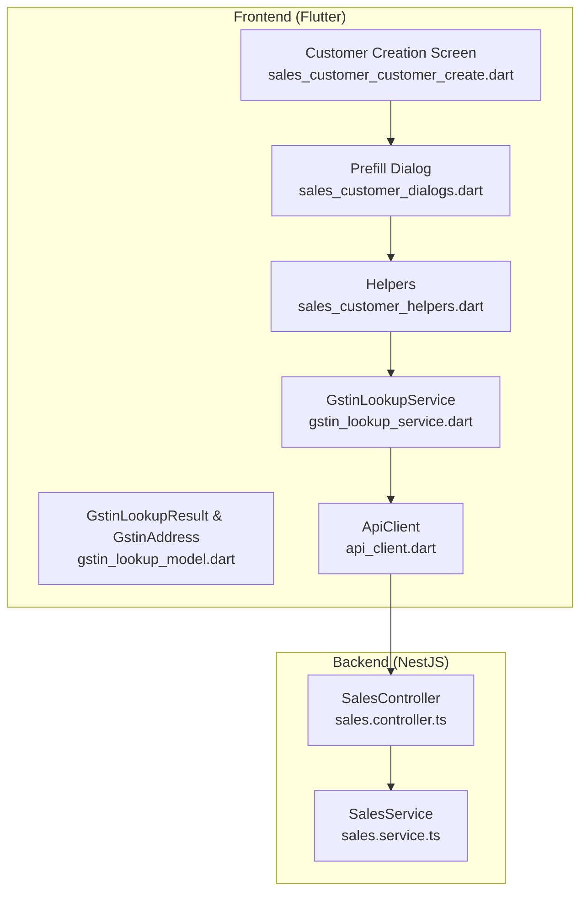
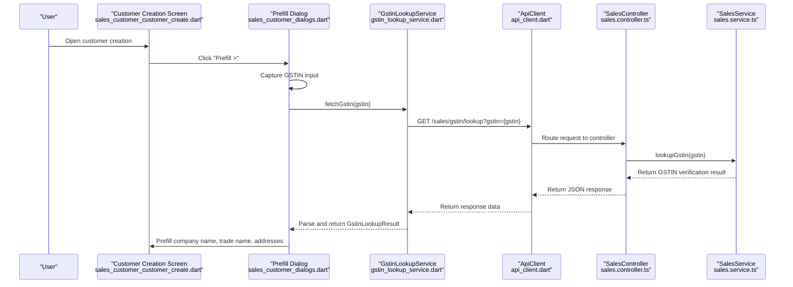
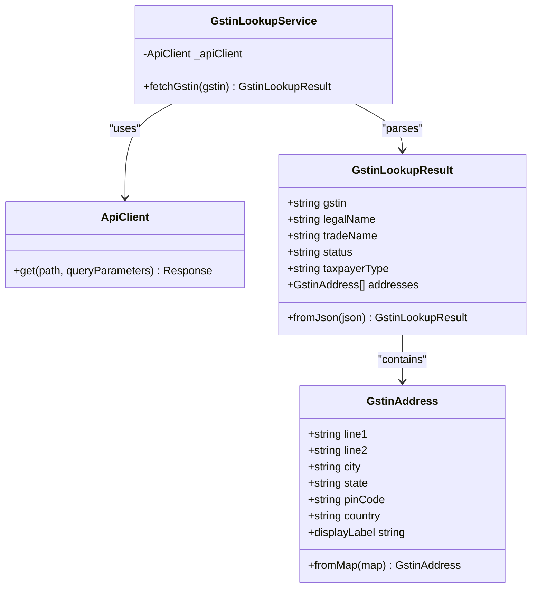
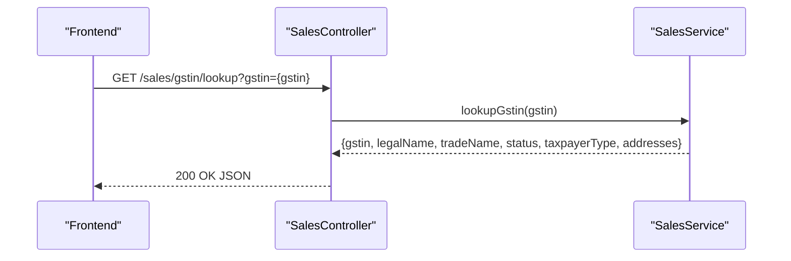
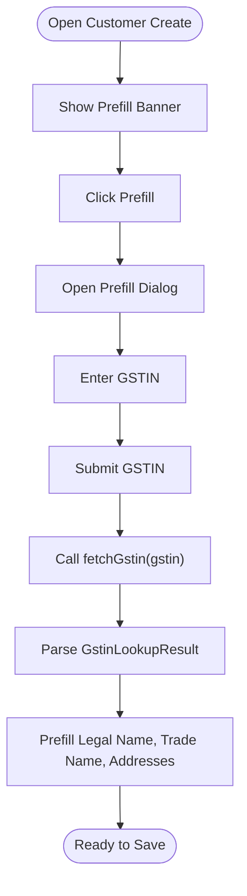
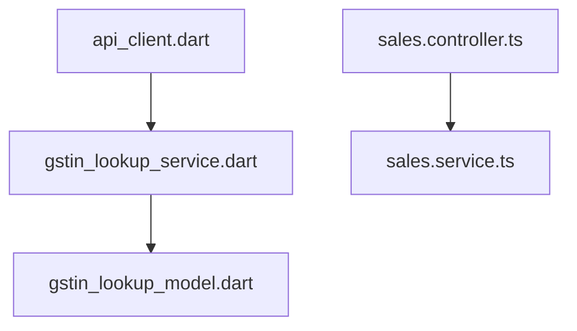

# GSTIN Validation Endpoint

<cite>
**Referenced Files in This Document**
- [gstin_lookup_service.dart](file://lib/modules/sales/services/gstin_lookup_service.dart)
- [gstin_lookup_model.dart](file://lib/modules/sales/models/gstin_lookup_model.dart)
- [api_client.dart](file://lib/shared/services/api_client.dart)
- [sales.controller.ts](file://backend/src/sales/sales.controller.ts)
- [sales.service.ts](file://backend/src/sales/sales.service.ts)
- [sales_customer_customer_create.dart](file://lib/modules/sales/presentation/sales_customer_customer_create.dart)
- [sales_customer_dialogs.dart](file://lib/modules/sales/presentation/sections/sales_customer_dialogs.dart)
- [sales_customer_helpers.dart](file://lib/modules/sales/presentation/sections/sales_customer_helpers.dart)
</cite>

## Table of Contents
1. [Introduction](#introduction)
2. [Project Structure](#project-structure)
3. [Core Components](#core-components)
4. [Architecture Overview](#architecture-overview)
5. [Detailed Component Analysis](#detailed-component-analysis)
6. [Dependency Analysis](#dependency-analysis)
7. [Performance Considerations](#performance-considerations)
8. [Troubleshooting Guide](#troubleshooting-guide)
9. [Conclusion](#conclusion)

## Introduction
This document provides comprehensive API documentation for the GSTIN validation endpoint in the ZerpAI ERP sales module. It covers the GET /sales/gstin/lookup endpoint, including request parameters, response schemas, integration patterns with customer creation workflows, validation rules, and error handling. The documentation also explains how the frontend integrates with the backend service to prefill customer details using GSTIN verification.

## Project Structure
The GSTIN validation feature spans both the frontend Flutter application and the NestJS backend service. The frontend constructs requests via an API client, while the backend exposes the endpoint and delegates GSTIN lookup logic to the sales service.

**Diagram sources**
- [sales_customer_customer_create.dart](file://lib/modules/sales/presentation/sales_customer_customer_create.dart#L1-L454)
- [sales_customer_dialogs.dart](file://lib/modules/sales/presentation/sections/sales_customer_dialogs.dart#L1-L120)
- [sales_customer_helpers.dart](file://lib/modules/sales/presentation/sections/sales_customer_helpers.dart#L140-L155)
- [gstin_lookup_service.dart](file://lib/modules/sales/services/gstin_lookup_service.dart#L1-L28)
- [gstin_lookup_model.dart](file://lib/modules/sales/models/gstin_lookup_model.dart#L1-L173)
- [api_client.dart](file://lib/shared/services/api_client.dart#L1-L62)
- [sales.controller.ts](file://backend/src/sales/sales.controller.ts#L35-L39)
- [sales.service.ts](file://backend/src/sales/sales.service.ts#L9-L27)

**Section sources**
- [sales.controller.ts](file://backend/src/sales/sales.controller.ts#L1-L102)
- [sales.service.ts](file://backend/src/sales/sales.service.ts#L1-L162)
- [gstin_lookup_service.dart](file://lib/modules/sales/services/gstin_lookup_service.dart#L1-L28)
- [gstin_lookup_model.dart](file://lib/modules/sales/models/gstin_lookup_model.dart#L1-L173)
- [api_client.dart](file://lib/shared/services/api_client.dart#L1-L62)
- [sales_customer_customer_create.dart](file://lib/modules/sales/presentation/sales_customer_customer_create.dart#L1-L454)
- [sales_customer_dialogs.dart](file://lib/modules/sales/presentation/sections/sales_customer_dialogs.dart#L1-L120)
- [sales_customer_helpers.dart](file://lib/modules/sales/presentation/sections/sales_customer_helpers.dart#L140-L155)

## Core Components
- Frontend API client: Builds and executes HTTP requests to the backend.
- GSTIN lookup service: Encapsulates the logic to call the GSTIN lookup endpoint and parse results.
- Data models: Define the structure for GSTIN lookup results and addresses.
- Backend controller: Exposes the GET /sales/gstin/lookup endpoint.
- Backend service: Implements the GSTIN lookup logic (currently mocked).

Key responsibilities:
- Validate query parameter gstin.
- Call external GST verification service (placeholder in current implementation).
- Return structured business and address details.
- Integrate with customer creation flow to prefill company and address information.

**Section sources**
- [api_client.dart](file://lib/shared/services/api_client.dart#L46-L48)
- [gstin_lookup_service.dart](file://lib/modules/sales/services/gstin_lookup_service.dart#L7-L26)
- [gstin_lookup_model.dart](file://lib/modules/sales/models/gstin_lookup_model.dart#L1-L173)
- [sales.controller.ts](file://backend/src/sales/sales.controller.ts#L35-L39)
- [sales.service.ts](file://backend/src/sales/sales.service.ts#L9-L27)

## Architecture Overview
The GSTIN validation workflow connects the frontend UI to the backend service. The frontend triggers a lookup, receives normalized data, and populates customer creation fields.

**Diagram sources**
- [sales_customer_customer_create.dart](file://lib/modules/sales/presentation/sales_customer_customer_create.dart#L281-L295)
- [sales_customer_dialogs.dart](file://lib/modules/sales/presentation/sections/sales_customer_dialogs.dart#L1-L120)
- [gstin_lookup_service.dart](file://lib/modules/sales/services/gstin_lookup_service.dart#L7-L26)
- [api_client.dart](file://lib/shared/services/api_client.dart#L46-L48)
- [sales.controller.ts](file://backend/src/sales/sales.controller.ts#L35-L39)
- [sales.service.ts](file://backend/src/sales/sales.service.ts#L9-L27)

## Detailed Component Analysis

### API Definition
- Endpoint: GET /sales/gstin/lookup
- Query Parameter:
  - gstin (required): GSTIN number to validate and lookup
- Response Schema:
  - Top-level fields:
    - gstin: string
    - legalName: string
    - tradeName: string
    - status: string
    - taxpayerType: string
    - addresses: array of address objects
  - Address object fields:
    - line1: string
    - line2: string
    - city: string
    - state: string
    - pinCode: string
    - country: string (default "India")

Validation rules:
- The gstin query parameter must be present and non-empty.
- The backend currently returns a mock response; in production, it will integrate with an external GST verification service.

Integration pattern with customer creation:
- The customer creation screen provides a "Prefill" banner and dialog to capture the GSTIN.
- On submission, the frontend calls the lookup endpoint and prefills company legal/trade names and addresses.

**Section sources**
- [sales.controller.ts](file://backend/src/sales/sales.controller.ts#L35-L39)
- [sales.service.ts](file://backend/src/sales/sales.service.ts#L9-L27)
- [gstin_lookup_model.dart](file://lib/modules/sales/models/gstin_lookup_model.dart#L1-L173)
- [sales_customer_customer_create.dart](file://lib/modules/sales/presentation/sales_customer_customer_create.dart#L262-L295)
- [sales_customer_dialogs.dart](file://lib/modules/sales/presentation/sections/sales_customer_dialogs.dart#L1-L120)

### Frontend Lookup Service
Responsibilities:
- Construct GET request to /sales/gstin/lookup with query parameter gstin.
- Parse response into GstinLookupResult model.
- Normalize various field names commonly returned by GST APIs.

Behavior:
- Accepts a GSTIN string.
- Returns a GstinLookupResult with default empty values if parsing fails.

**Diagram sources**
- [gstin_lookup_service.dart](file://lib/modules/sales/services/gstin_lookup_service.dart#L1-L28)
- [gstin_lookup_model.dart](file://lib/modules/sales/models/gstin_lookup_model.dart#L1-L173)
- [api_client.dart](file://lib/shared/services/api_client.dart#L46-L48)

**Section sources**
- [gstin_lookup_service.dart](file://lib/modules/sales/services/gstin_lookup_service.dart#L1-L28)
- [gstin_lookup_model.dart](file://lib/modules/sales/models/gstin_lookup_model.dart#L1-L173)
- [api_client.dart](file://lib/shared/services/api_client.dart#L1-L62)

### Backend Controller and Service
Responsibilities:
- Expose GET /sales/gstin/lookup endpoint.
- Delegate lookup logic to SalesService.
- Return standardized JSON response.

Current implementation:
- The SalesService performs a mock lookup and returns fixed business details and a single address.

**Diagram sources**
- [sales.controller.ts](file://backend/src/sales/sales.controller.ts#L35-L39)
- [sales.service.ts](file://backend/src/sales/sales.service.ts#L9-L27)

**Section sources**
- [sales.controller.ts](file://backend/src/sales/sales.controller.ts#L35-L39)
- [sales.service.ts](file://backend/src/sales/sales.service.ts#L9-L27)

### Customer Creation Integration
Workflow:
- User clicks "Prefill" in the customer creation screen.
- A dialog captures the GSTIN input.
- The lookup service is invoked to fetch business details.
- The UI prefills company legal/trade names and addresses.

**Diagram sources**
- [sales_customer_customer_create.dart](file://lib/modules/sales/presentation/sales_customer_customer_create.dart#L262-L295)
- [sales_customer_dialogs.dart](file://lib/modules/sales/presentation/sections/sales_customer_dialogs.dart#L1-L120)
- [sales_customer_helpers.dart](file://lib/modules/sales/presentation/sections/sales_customer_helpers.dart#L140-L155)
- [gstin_lookup_service.dart](file://lib/modules/sales/services/gstin_lookup_service.dart#L7-L26)

**Section sources**
- [sales_customer_customer_create.dart](file://lib/modules/sales/presentation/sales_customer_customer_create.dart#L262-L295)
- [sales_customer_dialogs.dart](file://lib/modules/sales/presentation/sections/sales_customer_dialogs.dart#L1-L120)
- [sales_customer_helpers.dart](file://lib/modules/sales/presentation/sections/sales_customer_helpers.dart#L140-L155)

## Dependency Analysis
- The frontend depends on ApiClient for HTTP requests and GstinLookupService for orchestration.
- GstinLookupService depends on GstinLookupResult and GstinAddress models for data representation.
- The backend controller depends on SalesService for business logic.
- SalesService currently returns mock data; in production, it will integrate with an external GST verification service.

**Diagram sources**
- [api_client.dart](file://lib/shared/services/api_client.dart#L1-L62)
- [gstin_lookup_service.dart](file://lib/modules/sales/services/gstin_lookup_service.dart#L1-L28)
- [gstin_lookup_model.dart](file://lib/modules/sales/models/gstin_lookup_model.dart#L1-L173)
- [sales.controller.ts](file://backend/src/sales/sales.controller.ts#L1-L102)
- [sales.service.ts](file://backend/src/sales/sales.service.ts#L1-L162)

**Section sources**
- [api_client.dart](file://lib/shared/services/api_client.dart#L1-L62)
- [gstin_lookup_service.dart](file://lib/modules/sales/services/gstin_lookup_service.dart#L1-L28)
- [gstin_lookup_model.dart](file://lib/modules/sales/models/gstin_lookup_model.dart#L1-L173)
- [sales.controller.ts](file://backend/src/sales/sales.controller.ts#L1-L102)
- [sales.service.ts](file://backend/src/sales/sales.service.ts#L1-L162)

## Performance Considerations
- Network latency: The lookup involves an external GST verification service. Consider adding timeouts and retry logic at the API client level.
- Parsing overhead: The model parser supports multiple field aliases to handle variations across GST APIs, which adds minimal overhead but improves robustness.
- Caching: Consider caching successful lookups for frequently used GSTIN numbers to reduce repeated network calls.
- UI responsiveness: Debounce GSTIN input in the dialog to avoid excessive requests during typing.

## Troubleshooting Guide
Common issues and resolutions:
- Invalid or missing gstin parameter:
  - Ensure the query parameter gstin is present and non-empty before invoking the lookup.
- Empty or malformed response:
  - The service returns default empty values when parsing fails. Verify the backend response format and adjust the model parser if needed.
- Network errors:
  - Inspect Dio interceptors for error logs. Confirm API_BASE_URL environment variable and network connectivity.
- Mock backend behavior:
  - The current backend returns a fixed response. Replace the mock implementation with a real GST verification service integration.

Error handling patterns:
- Frontend: Wrap lookup calls in try-catch blocks and display user-friendly messages.
- Backend: Validate input parameters and return appropriate HTTP status codes for errors.

**Section sources**
- [gstin_lookup_service.dart](file://lib/modules/sales/services/gstin_lookup_service.dart#L14-L26)
- [api_client.dart](file://lib/shared/services/api_client.dart#L27-L40)
- [sales.service.ts](file://backend/src/sales/sales.service.ts#L9-L27)

## Conclusion
The GSTIN validation endpoint enables seamless customer prefilling in the ZerpAI ERP sales module. The frontend integrates with the backend via a clean API contract, while the backend service encapsulates the lookup logic. The current implementation uses a mock response and should be extended to integrate with a real GST verification service. The provided models and service layer support flexible response formats and improve resilience against API variations.