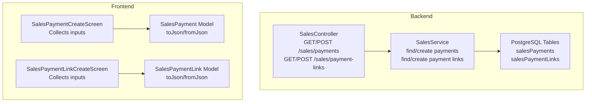
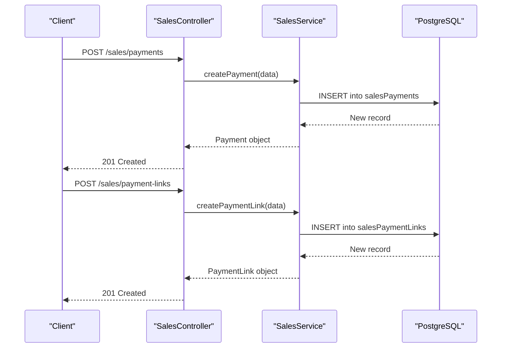
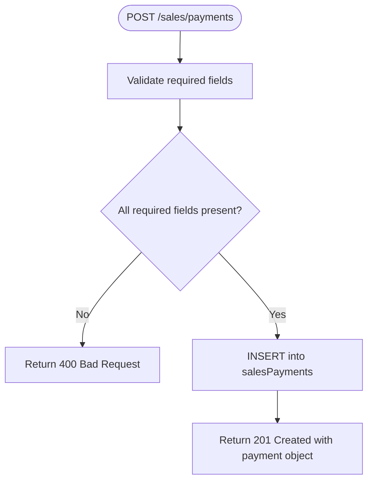
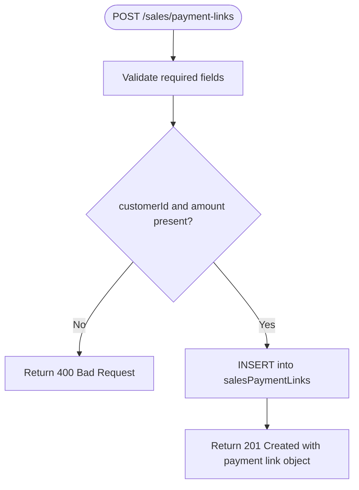
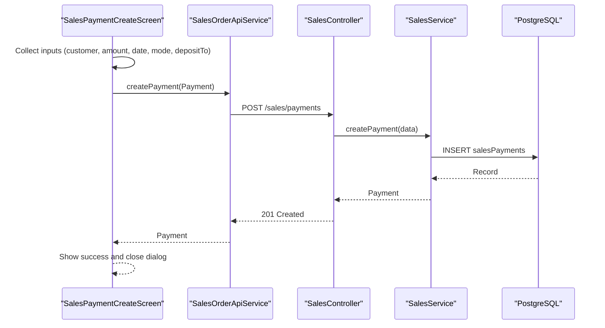
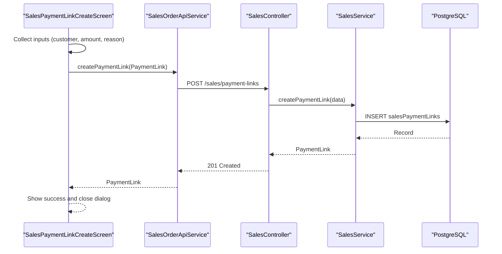
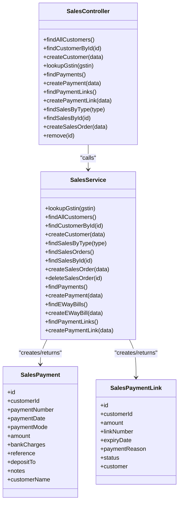

# Payment Processing Endpoints

<cite>
**Referenced Files in This Document**
- [sales.controller.ts](file://backend/src/sales/sales.controller.ts)
- [sales.service.ts](file://backend/src/sales/sales.service.ts)
- [schema.ts](file://backend/src/db/schema.ts)
- [sales_payment_model.dart](file://lib/modules/sales/models/sales_payment_model.dart)
- [sales_payment_link_model.dart](file://lib/modules/sales/models/sales_payment_link_model.dart)
- [sales_payment_create.dart](file://lib/modules/sales/presentation/sales_payment_create.dart)
- [sales_payment_link_create.dart](file://lib/modules/sales/presentation/sales_payment_link_create.dart)
</cite>

## Table of Contents
1. [Introduction](#introduction)
2. [Project Structure](#project-structure)
3. [Core Components](#core-components)
4. [Architecture Overview](#architecture-overview)
5. [Detailed Component Analysis](#detailed-component-analysis)
6. [Dependency Analysis](#dependency-analysis)
7. [Performance Considerations](#performance-considerations)
8. [Troubleshooting Guide](#troubleshooting-guide)
9. [Conclusion](#conclusion)

## Introduction
This document provides comprehensive API documentation for payment processing endpoints in the ZerpAI ERP sales module. It covers:
- Retrieving payment records via GET /sales/payments
- Creating payment entries via POST /sales/payments
- Retrieving payment link records via GET /sales/payment-links
- Generating payment links via POST /sales/payment-links

It also documents request/response schemas for payment and payment-link models, validation rules, amount matching, payment method integration, and reconciliation patterns. Examples illustrate payment creation workflows, payment link generation, amount allocation, and reconciliation.

## Project Structure
The payment processing functionality spans backend NestJS controllers/services and frontend Flutter models/presentations:
- Backend: Controller exposes endpoints; Service implements persistence and retrieval using Drizzle ORM against PostgreSQL tables
- Frontend: Dart models define serialization/deserialization; presentation screens orchestrate user input and API calls

**Diagram sources**
- [sales.controller.ts](file://backend/src/sales/sales.controller.ts#L41-L75)
- [sales.service.ts](file://backend/src/sales/sales.service.ts#L108-L160)
- [schema.ts](file://backend/src/db/schema.ts#L254-L291)
- [sales_payment_model.dart](file://lib/modules/sales/models/sales_payment_model.dart#L1-L61)
- [sales_payment_link_model.dart](file://lib/modules/sales/models/sales_payment_link_model.dart#L1-L49)
- [sales_payment_create.dart](file://lib/modules/sales/presentation/sales_payment_create.dart#L1-L280)
- [sales_payment_link_create.dart](file://lib/modules/sales/presentation/sales_payment_link_create.dart#L1-L141)

**Section sources**
- [sales.controller.ts](file://backend/src/sales/sales.controller.ts#L1-L102)
- [sales.service.ts](file://backend/src/sales/sales.service.ts#L1-L162)
- [schema.ts](file://backend/src/db/schema.ts#L254-L291)

## Core Components
- SalesController: Exposes four endpoints under /sales for payments and payment links
- SalesService: Implements CRUD operations backed by Drizzle ORM and PostgreSQL
- Database Schema: Defines salesPayments and salesPaymentLinks tables with typed columns
- Frontend Models: Dart models for serialization and deserialization of payment/link payloads
- Presentation Screens: Collect user inputs and trigger API calls

Key responsibilities:
- GET /sales/payments: Retrieve all payment records
- POST /sales/payments: Create a payment record with validation and persistence
- GET /sales/payment-links: Retrieve all payment link records
- POST /sales/payment-links: Generate a payment link with defaults and persistence

**Section sources**
- [sales.controller.ts](file://backend/src/sales/sales.controller.ts#L41-L75)
- [sales.service.ts](file://backend/src/sales/sales.service.ts#L108-L160)
- [schema.ts](file://backend/src/db/schema.ts#L254-L291)

## Architecture Overview
End-to-end flow for payment creation and payment link generation:

**Diagram sources**
- [sales.controller.ts](file://backend/src/sales/sales.controller.ts#L47-L74)
- [sales.service.ts](file://backend/src/sales/sales.service.ts#L113-L160)
- [schema.ts](file://backend/src/db/schema.ts#L254-L291)

## Detailed Component Analysis

### GET /sales/payments
Retrieves all payment records from the salesPayments table.

- Endpoint: GET /sales/payments
- Authentication: Not specified in controller; consult API gateway/security middleware
- Response: Array of payment objects (see schema below)

Request
- Path parameters: None
- Query parameters: None
- Headers: Authorization and content-type as per API contract
- Body: None

Response
- 200 OK: Array of payment objects
- 500 Internal Server Error: On database failure

Notes
- The endpoint currently returns all records without filtering or pagination

**Section sources**
- [sales.controller.ts](file://backend/src/sales/sales.controller.ts#L42-L45)
- [sales.service.ts](file://backend/src/sales/sales.service.ts#L109-L111)
- [schema.ts](file://backend/src/db/schema.ts#L254-L267)

### POST /sales/payments
Creates a new payment entry.

- Endpoint: POST /sales/payments
- Authentication: Not specified in controller
- Request body: Payment object (see schema below)
- Response: 201 Created with the created payment object

Validation rules
- Required fields: customerId, paymentNumber, paymentDate, paymentMode, amount
- Amount must be a positive numeric value
- paymentDate defaults to current timestamp if omitted
- bankCharges defaults to zero if omitted
- reference, depositTo, notes are optional

Amount matching and reconciliation
- The amount field represents the received amount
- Bank charges can be recorded separately
- Reconciliation can be performed by matching received amounts to outstanding invoices/accounts receivable

Payment method integration
- paymentMode supports common modes: Cash, Check, Credit Card, Bank Transfer, Other
- depositTo indicates where funds are recorded (e.g., Petty Cash, Undeposited Funds, Bank Account)

Example workflow
- Customer pays via Bank Transfer
- Enter amount, select payment mode, set depositTo, optionally add reference
- Submit; backend persists and returns the created payment

**Diagram sources**
- [sales.controller.ts](file://backend/src/sales/sales.controller.ts#L47-L51)
- [sales.service.ts](file://backend/src/sales/sales.service.ts#L113-L126)
- [schema.ts](file://backend/src/db/schema.ts#L254-L267)

**Section sources**
- [sales.controller.ts](file://backend/src/sales/sales.controller.ts#L47-L51)
- [sales.service.ts](file://backend/src/sales/sales.service.ts#L113-L126)
- [sales_payment_model.dart](file://lib/modules/sales/models/sales_payment_model.dart#L1-L61)
- [sales_payment_create.dart](file://lib/modules/sales/presentation/sales_payment_create.dart#L254-L278)

### GET /sales/payment-links
Retrieves all payment link records from the salesPaymentLinks table.

- Endpoint: GET /sales/payment-links
- Authentication: Not specified in controller
- Response: Array of payment link objects (see schema below)

Request
- Path parameters: None
- Query parameters: None
- Headers: Authorization and content-type as per API contract
- Body: None

Response
- 200 OK: Array of payment link objects
- 500 Internal Server Error: On database failure

**Section sources**
- [sales.controller.ts](file://backend/src/sales/sales.controller.ts#L66-L69)
- [sales.service.ts](file://backend/src/sales/sales.service.ts#L148-L150)
- [schema.ts](file://backend/src/db/schema.ts#L283-L291)

### POST /sales/payment-links
Generates a new payment link.

- Endpoint: POST /sales/payment-links
- Authentication: Not specified in controller
- Request body: Payment link object (see schema below)
- Response: 201 Created with the created payment link object

Validation rules
- Required fields: customerId, amount
- amount must be a positive numeric value
- linkUrl defaults to a generated URL pattern if omitted
- status defaults to active if omitted

Payment link generation
- linkNumber follows a date-based pattern
- expiryDate defaults to seven days from creation
- paymentReason describes the purpose (optional)

Example workflow
- Select customer, enter amount, optionally add reason
- Submit; backend persists and returns the created payment link

**Diagram sources**
- [sales.controller.ts](file://backend/src/sales/sales.controller.ts#L71-L75)
- [sales.service.ts](file://backend/src/sales/sales.service.ts#L152-L160)
- [schema.ts](file://backend/src/db/schema.ts#L283-L291)

**Section sources**
- [sales.controller.ts](file://backend/src/sales/sales.controller.ts#L71-L75)
- [sales.service.ts](file://backend/src/sales/sales.service.ts#L152-L160)
- [sales_payment_link_model.dart](file://lib/modules/sales/models/sales_payment_link_model.dart#L1-L49)
- [sales_payment_link_create.dart](file://lib/modules/sales/presentation/sales_payment_link_create.dart#L118-L139)

### Payment Model Schemas

#### Payment Object
Fields
- id: string (UUID)
- customerId: string (UUID)
- paymentNumber: string
- paymentDate: datetime
- paymentMode: string
- amount: number (decimal)
- bankCharges: number (decimal, default 0)
- reference: string (optional)
- depositTo: string (optional)
- notes: string (optional)
- customerName: string (optional, derived from customer display name)

JSON example
{
  "id": "a1b2c3d4-e5f6-7890-abcd-ef1234567890",
  "customerId": "f0e9d8c7-b6a5-4321-fedc-ba9876543210",
  "paymentNumber": "PAY-20251001-1234",
  "paymentDate": "2025-10-01T12:34:56Z",
  "paymentMode": "Bank Transfer",
  "amount": 50000.00,
  "bankCharges": 0.00,
  "reference": "REF-ABC123",
  "depositTo": "Bank Account",
  "notes": "Received advance payment",
  "customerName": "Global Solutions Pvt Ltd"
}

Validation rules
- Required: customerId, paymentNumber, paymentDate, paymentMode, amount
- amount must be >= 0
- bankCharges must be >= 0

Reconciliation pattern
- Match payment amount against outstanding invoices
- Adjust accounts receivable accordingly
- Record bank charges as expenses if applicable

**Section sources**
- [schema.ts](file://backend/src/db/schema.ts#L254-L267)
- [sales_payment_model.dart](file://lib/modules/sales/models/sales_payment_model.dart#L1-L61)

#### Payment Link Object
Fields
- id: string (UUID)
- customerId: string (UUID)
- amount: number (decimal)
- linkNumber: string
- expiryDate: datetime (optional)
- paymentReason: string (optional)
- status: string (default active)
- customer: object (optional, embedded customer info)

JSON example
{
  "id": "b2c3d4e5-f6a7-8901-cdef-1234567890ab",
  "customerId": "f0e9d8c7-b6a5-4321-fedc-ba9876543210",
  "amount": 25000.00,
  "linkNumber": "PL-202510011234",
  "expiryDate": "2025-10-08T12:34:56Z",
  "paymentReason": "Project Advance",
  "status": "active",
  "customer": {
    "id": "f0e9d8c7-b6a5-4321-fedc-ba9876543210",
    "display_name": "Global Solutions Pvt Ltd"
  }
}

Validation rules
- Required: customerId, amount
- amount must be > 0
- status default: active

**Section sources**
- [schema.ts](file://backend/src/db/schema.ts#L283-L291)
- [sales_payment_link_model.dart](file://lib/modules/sales/models/sales_payment_link_model.dart#L1-L49)

### Payment Creation Workflow Example
Steps
- User selects customer from dropdown
- Enters amount, sets payment date, selects payment mode, chooses deposit account
- Optionally adds reference and notes
- Submits form; frontend serializes to Payment object and calls POST /sales/payments
- Backend validates, persists, and returns created payment

**Diagram sources**
- [sales_payment_create.dart](file://lib/modules/sales/presentation/sales_payment_create.dart#L254-L278)
- [sales.controller.ts](file://backend/src/sales/sales.controller.ts#L47-L51)
- [sales.service.ts](file://backend/src/sales/sales.service.ts#L113-L126)
- [schema.ts](file://backend/src/db/schema.ts#L254-L267)

**Section sources**
- [sales_payment_create.dart](file://lib/modules/sales/presentation/sales_payment_create.dart#L1-L280)
- [sales_payment_model.dart](file://lib/modules/sales/models/sales_payment_model.dart#L1-L61)

### Payment Link Generation Workflow Example
Steps
- User selects customer, enters amount, optionally adds reason
- Generates linkNumber and sets expiryDate (default 7 days)
- Submits form; frontend serializes to PaymentLink object and calls POST /sales/payment-links
- Backend validates, persists, and returns created payment link

**Diagram sources**
- [sales_payment_link_create.dart](file://lib/modules/sales/presentation/sales_payment_link_create.dart#L118-L139)
- [sales.controller.ts](file://backend/src/sales/sales.controller.ts#L71-L75)
- [sales.service.ts](file://backend/src/sales/sales.service.ts#L152-L160)
- [schema.ts](file://backend/src/db/schema.ts#L283-L291)

**Section sources**
- [sales_payment_link_create.dart](file://lib/modules/sales/presentation/sales_payment_link_create.dart#L1-L141)
- [sales_payment_link_model.dart](file://lib/modules/sales/models/sales_payment_link_model.dart#L1-L49)

## Dependency Analysis
Relationships among components:

**Diagram sources**
- [sales.controller.ts](file://backend/src/sales/sales.controller.ts#L14-L101)
- [sales.service.ts](file://backend/src/sales/sales.service.ts#L6-L161)
- [sales_payment_model.dart](file://lib/modules/sales/models/sales_payment_model.dart#L1-L61)
- [sales_payment_link_model.dart](file://lib/modules/sales/models/sales_payment_link_model.dart#L1-L49)

**Section sources**
- [sales.controller.ts](file://backend/src/sales/sales.controller.ts#L1-L102)
- [sales.service.ts](file://backend/src/sales/sales.service.ts#L1-L162)

## Performance Considerations
- Pagination: Current GET endpoints return all records; consider adding pagination and filtering for large datasets
- Indexing: Ensure UUID foreign keys and frequently queried fields (e.g., paymentDate, customerId) are indexed
- Validation: Move validation to DTOs or pipes in NestJS to centralize and improve performance
- Caching: Cache customer and lookup data to reduce repeated network calls
- Batch operations: For high-volume scenarios, batch inserts and updates

## Troubleshooting Guide
Common issues and resolutions
- Missing required fields on POST /sales/payments: Ensure customerId, paymentNumber, paymentDate, paymentMode, and amount are provided
- Invalid amount: Verify amount is a positive number
- Duplicate paymentNumber: Ensure uniqueness of paymentNumber
- Payment link amount <= 0: Validate amount > 0
- Customer not found: Confirm customerId exists in the customers table

Error handling patterns
- 404 Not Found: Occurs when querying non-existent resources (e.g., customer lookup)
- 500 Internal Server Error: Database failures during insert/update

**Section sources**
- [sales.service.ts](file://backend/src/sales/sales.service.ts#L34-L40)
- [sales.service.ts](file://backend/src/sales/sales.service.ts#L109-L126)
- [sales.service.ts](file://backend/src/sales/sales.service.ts#L152-L160)

## Conclusion
The ZerpAI ERP sales module provides essential payment processing endpoints for recording payments and generating payment links. The backend implements straightforward CRUD operations backed by PostgreSQL, while the frontend offers intuitive forms for data entry. Extending the API with filtering/search, pagination, robust validation, and reconciliation workflows will further enhance usability and reliability.