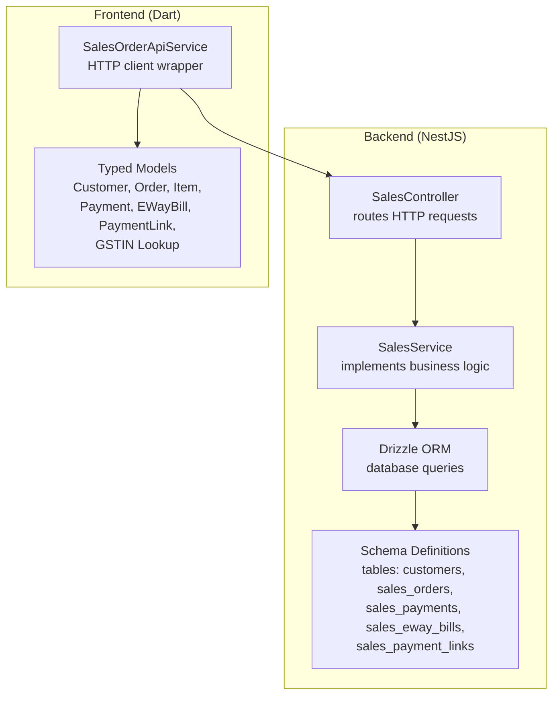
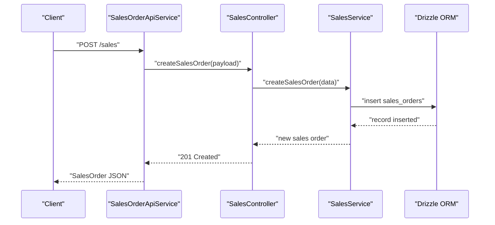
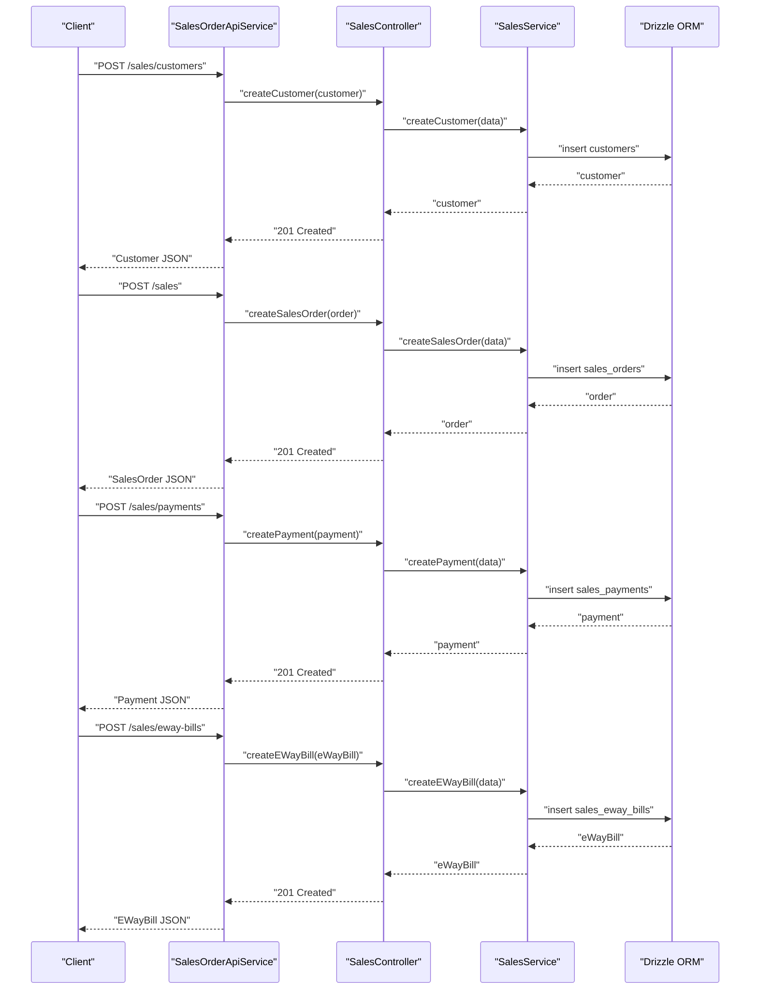
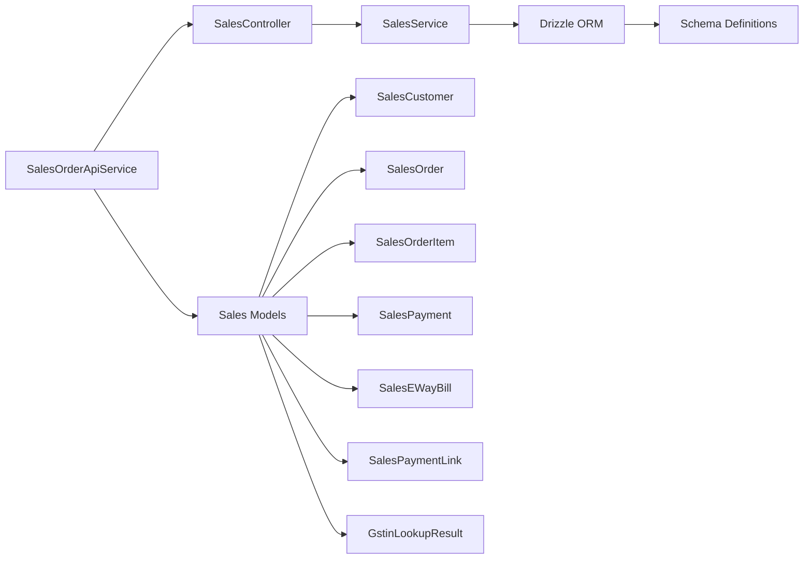

# Sales API

<cite>
**Referenced Files in This Document**
- [sales.controller.ts](file://backend/src/sales/sales.controller.ts)
- [sales.service.ts](file://backend/src/sales/sales.service.ts)
- [schema.ts](file://backend/src/db/schema.ts)
- [sales_order_api_service.dart](file://lib/modules/sales/services/sales_order_api_service.dart)
- [sales_customer_model.dart](file://lib/modules/sales/models/sales_customer_model.dart)
- [sales_order_model.dart](file://lib/modules/sales/models/sales_order_model.dart)
- [sales_order_item_model.dart](file://lib/modules/sales/models/sales_order_item_model.dart)
- [sales_payment_model.dart](file://lib/modules/sales/models/sales_payment_model.dart)
- [sales_eway_bill_model.dart](file://lib/modules/sales/models/sales_eway_bill_model.dart)
- [sales_payment_link_model.dart](file://lib/modules/sales/models/sales_payment_link_model.dart)
- [gstin_lookup_model.dart](file://lib/modules/sales/models/gstin_lookup_model.dart)
- [gstin_lookup_service.dart](file://lib/modules/sales/services/gstin_lookup_service.dart)
</cite>

## Table of Contents
1. [Introduction](#introduction)
2. [Project Structure](#project-structure)
3. [Core Components](#core-components)
4. [Architecture Overview](#architecture-overview)
5. [Detailed Component Analysis](#detailed-component-analysis)
6. [Dependency Analysis](#dependency-analysis)
7. [Performance Considerations](#performance-considerations)
8. [Troubleshooting Guide](#troubleshooting-guide)
9. [Conclusion](#conclusion)

## Introduction
This document provides comprehensive API documentation for ZerpAI ERP sales operations. It covers all sales-related endpoints for customer management, quotations, sales orders, invoices, payments, returns, credit notes, and e-way bills. It also documents the complete sales workflow from customer creation to document generation, including payment processing integration and GST lookup capabilities. The documentation includes request/response schemas for each sales document type with line items, taxes, discounts, and payment details, along with validation rules, business logic constraints, and error handling patterns.

## Project Structure
The sales module is implemented across two layers:
- Backend NestJS service exposing REST endpoints for sales operations and interacting with the database via Drizzle ORM.
- Frontend Dart service layer that consumes the backend APIs and maps responses to typed models.

**Diagram sources**
- [sales.controller.ts](file://backend/src/sales/sales.controller.ts#L14-L101)
- [sales.service.ts](file://backend/src/sales/sales.service.ts#L1-L162)
- [schema.ts](file://backend/src/db/schema.ts#L213-L291)
- [sales_order_api_service.dart](file://lib/modules/sales/services/sales_order_api_service.dart#L10-L191)

**Section sources**
- [sales.controller.ts](file://backend/src/sales/sales.controller.ts#L1-L102)
- [sales.service.ts](file://backend/src/sales/sales.service.ts#L1-L162)
- [schema.ts](file://backend/src/db/schema.ts#L213-L291)
- [sales_order_api_service.dart](file://lib/modules/sales/services/sales_order_api_service.dart#L1-L192)

## Core Components
- SalesController: Exposes REST endpoints for customers, GSTIN lookup, payments, e-way bills, payment links, and sales documents.
- SalesService: Implements CRUD operations against the database using Drizzle ORM and includes mock GSTIN lookup.
- Typed Models: Define request/response schemas for all sales entities and support serialization/deserialization.
- SalesOrderApiService: Frontend HTTP client that calls backend endpoints and maps responses to typed models.

Key responsibilities:
- Customer lifecycle: create, list, and retrieve customer records.
- Sales documents: create, list, retrieve, and delete sales orders/invoices/quotation-like entries.
- Payments: create and list customer payments.
- E-way bills: create and list e-way bills linked to sales.
- Payment links: create and list payment links for customers.
- GSTIN lookup: mock endpoint returning standardized GSTIN details.

**Section sources**
- [sales.controller.ts](file://backend/src/sales/sales.controller.ts#L14-L101)
- [sales.service.ts](file://backend/src/sales/sales.service.ts#L1-L162)
- [sales_order_api_service.dart](file://lib/modules/sales/services/sales_order_api_service.dart#L10-L191)

## Architecture Overview
The backend follows a layered architecture:
- Controller layer handles HTTP routing and delegates to the service layer.
- Service layer encapsulates business logic and performs database operations.
- Database layer uses Drizzle ORM with Supabase Postgres.

**Diagram sources**
- [sales_order_api_service.dart](file://lib/modules/sales/services/sales_order_api_service.dart#L104-L121)
- [sales.controller.ts](file://backend/src/sales/sales.controller.ts#L91-L95)
- [sales.service.ts](file://backend/src/sales/sales.service.ts#L80-L97)

## Detailed Component Analysis

### Endpoints Overview
- Base path: /sales
- Additional GSTIN lookup endpoint: /gstin/lookup

Endpoints:
- GET /sales/customers
- GET /sales/customers/:id
- POST /sales/customers
- GET /gstin/lookup?gstin=...
- GET /sales/payments
- POST /sales/payments
- GET /sales/eway-bills
- POST /sales/eway-bills
- GET /sales/payment-links
- POST /sales/payment-links
- GET /sales?type=...
- GET /sales/:id
- POST /sales
- DELETE /sales/:id

Response status codes:
- 200 OK for successful GETs and POSTs (when applicable)
- 201 Created for newly created resources
- 204 No Content for successful deletions
- 404 Not Found when resources are missing

Validation and constraints:
- Required fields are enforced by database schema and DTOs.
- Defaults applied server-side for optional fields.
- Deletion returns a success message or throws NotFoundException.

**Section sources**
- [sales.controller.ts](file://backend/src/sales/sales.controller.ts#L18-L100)
- [sales.service.ts](file://backend/src/sales/sales.service.ts#L30-L106)

### Customer Management
- Retrieve all customers
- Retrieve a customer by ID
- Create a new customer

Request body fields (create):
- displayName (required)
- customerType (optional, default Business)
- salutation, firstName, lastName, companyName
- email, phone, mobilePhone
- gstin, pan
- currency (default INR)
- paymentTerms
- billingAddress, shippingAddress
- isActive (default true)
- receivables (default 0)

Response body mirrors request body fields.

Business logic:
- ID is auto-generated UUID.
- Receivables initialized to zero.
- Currency defaults to INR.

Error handling:
- GET by ID returns NotFoundException if not found.

**Section sources**
- [sales.controller.ts](file://backend/src/sales/sales.controller.ts#L18-L33)
- [sales.service.ts](file://backend/src/sales/sales.service.ts#L29-L61)
- [schema.ts](file://backend/src/db/schema.ts#L213-L234)
- [sales_customer_model.dart](file://lib/modules/sales/models/sales_customer_model.dart#L1-L93)

### GSTIN Lookup
- Endpoint: GET /gstin/lookup?gstin={number}

Response fields:
- gstin (input)
- legalName
- tradeName
- status
- taxpayerType
- addresses: array of address objects with fields:
  - addressLine1, addressLine2, city, state, pincode

Note: Current implementation is mocked and does not call an external API.

**Section sources**
- [sales.controller.ts](file://backend/src/sales/sales.controller.ts#L35-L39)
- [sales.service.ts](file://backend/src/sales/sales.service.ts#L8-L27)
- [gstin_lookup_model.dart](file://lib/modules/sales/models/gstin_lookup_model.dart#L1-L173)
- [gstin_lookup_service.dart](file://lib/modules/sales/services/gstin_lookup_service.dart#L1-L28)

### Payments
- Retrieve all payments
- Create a payment

Request body fields (create):
- customerId (required)
- paymentNumber (required)
- paymentDate (optional, defaults to current date)
- paymentMode (required)
- amount (required)
- bankCharges (optional, default 0)
- reference
- depositTo
- notes

Response body mirrors request body fields.

Business logic:
- ID auto-generated.
- Amount and bankCharges are numeric.
- Defaults applied for optional fields.

**Section sources**
- [sales.controller.ts](file://backend/src/sales/sales.controller.ts#L41-L51)
- [sales.service.ts](file://backend/src/sales/sales.service.ts#L108-L126)
- [schema.ts](file://backend/src/db/schema.ts#L254-L267)
- [sales_payment_model.dart](file://lib/modules/sales/models/sales_payment_model.dart#L1-L61)

### E-Way Bills
- Retrieve all e-way bills
- Create an e-way bill

Request body fields (create):
- saleId (optional)
- billNumber (required)
- billDate (optional, defaults to current date)
- supplyType (optional, default Outward)
- subType (optional, default Supply)
- transporterId
- vehicleNumber
- status (optional, default active)

Response body mirrors request body fields.

**Section sources**
- [sales.controller.ts](file://backend/src/sales/sales.controller.ts#L53-L63)
- [sales.service.ts](file://backend/src/sales/sales.service.ts#L128-L145)
- [schema.ts](file://backend/src/db/schema.ts#L269-L281)
- [sales_eway_bill_model.dart](file://lib/modules/sales/models/sales_eway_bill_model.dart#L1-L52)

### Payment Links
- Retrieve all payment links
- Create a payment link

Request body fields (create):
- customerId (required)
- amount (required)
- linkUrl (optional, auto-generated if omitted)
- status (optional, default active)

Response body mirrors request body fields.

**Section sources**
- [sales.controller.ts](file://backend/src/sales/sales.controller.ts#L65-L75)
- [sales.service.ts](file://backend/src/sales/sales.service.ts#L147-L160)
- [schema.ts](file://backend/src/db/schema.ts#L283-L291)
- [sales_payment_link_model.dart](file://lib/modules/sales/models/sales_payment_link_model.dart#L1-L49)

### Sales Documents (Quotations, Orders, Invoices)
- Retrieve all sales documents or filter by type
- Retrieve a sales document by ID
- Create a sales document (supports quotations, orders, invoices via documentType)
- Delete a sales document

Query parameters:
- type: filter by documentType (e.g., quote, order, invoice)

Request body fields (create):
- customerId (required)
- saleNumber (required)
- reference
- saleDate (optional, defaults to current date)
- expectedShipmentDate (optional)
- deliveryMethod
- paymentTerms
- documentType (optional, default order)
- status (optional, default draft)
- total (optional, default 0)
- currency (optional, default INR)
- customerNotes
- termsAndConditions

Response body mirrors request body fields.

Business logic:
- ID auto-generated.
- Defaults applied for optional fields.
- Deletion returns success message or throws NotFoundException.

**Section sources**
- [sales.controller.ts](file://backend/src/sales/sales.controller.ts#L77-L100)
- [sales.service.ts](file://backend/src/sales/sales.service.ts#L63-L106)
- [schema.ts](file://backend/src/db/schema.ts#L236-L253)
- [sales_order_model.dart](file://lib/modules/sales/models/sales_order_model.dart#L1-L118)

### Sales Document Line Items
SalesOrder supports line items with the following structure:
- itemId (required)
- description
- quantity (required)
- rate (required)
- discount (optional, default 0)
- taxId
- taxAmount
- itemTotal
- item (optional nested product model)

Serialization:
- Items are serialized as an array in the sales document payload.

**Section sources**
- [sales_order_item_model.dart](file://lib/modules/sales/models/sales_order_item_model.dart#L1-L62)
- [sales_order_model.dart](file://lib/modules/sales/models/sales_order_model.dart#L24-L26)

### Request/Response Schemas

#### Customer
- Request: All fields except id and createdAt
- Response: All fields including id, isActive, receivables, createdAt

**Section sources**
- [sales_customer_model.dart](file://lib/modules/sales/models/sales_customer_model.dart#L22-L91)
- [schema.ts](file://backend/src/db/schema.ts#L213-L234)

#### Sales Order
- Request: customerId, saleNumber, reference, saleDate, expectedShipmentDate, deliveryMethod, paymentTerms, documentType, status, total, currency, customerNotes, termsAndConditions, items[]
- Response: Same as request plus computed totals and timestamps

**Section sources**
- [sales_order_model.dart](file://lib/modules/sales/models/sales_order_model.dart#L28-L116)
- [schema.ts](file://backend/src/db/schema.ts#L236-L253)

#### Sales Order Item
- Request: itemId, description, quantity, rate, discount, taxId
- Response: Same as request plus calculated taxAmount, itemTotal

**Section sources**
- [sales_order_item_model.dart](file://lib/modules/sales/models/sales_order_item_model.dart#L15-L60)

#### Payment
- Request: customerId, paymentNumber, paymentDate, paymentMode, amount, bankCharges, reference, depositTo, notes
- Response: Same as request

**Section sources**
- [sales_payment_model.dart](file://lib/modules/sales/models/sales_payment_model.dart#L14-L60)
- [schema.ts](file://backend/src/db/schema.ts#L254-L267)

#### E-Way Bill
- Request: saleId, billNumber, billDate, supplyType, subType, transporterId, vehicleNumber, status
- Response: Same as request

**Section sources**
- [sales_eway_bill_model.dart](file://lib/modules/sales/models/sales_eway_bill_model.dart#L12-L50)
- [schema.ts](file://backend/src/db/schema.ts#L269-L281)

#### Payment Link
- Request: customerId, amount, linkUrl, status
- Response: Same as request

**Section sources**
- [sales_payment_link_model.dart](file://lib/modules/sales/models/sales_payment_link_model.dart#L11-L48)
- [schema.ts](file://backend/src/db/schema.ts#L283-L291)

### Validation Rules and Business Logic Constraints
- Required fields enforced by backend DTOs and database schema.
- Optional fields receive sensible defaults (e.g., currency, status, dates).
- Deletion operations return a success message or raise NotFoundException.
- GSTIN lookup is currently mocked; production integration requires an external API call.
- Payment links auto-generate a URL if not provided.

**Section sources**
- [sales.service.ts](file://backend/src/sales/sales.service.ts#L42-L61)
- [sales.service.ts](file://backend/src/sales/sales.service.ts#L113-L126)
- [sales.service.ts](file://backend/src/sales/sales.service.ts#L133-L145)
- [sales.service.ts](file://backend/src/sales/sales.service.ts#L152-L160)
- [sales.service.ts](file://backend/src/sales/sales.service.ts#L80-L97)

### Error Handling Patterns
- NotFoundException raised when retrieving non-existent resources.
- HTTP status codes returned per operation (200, 201, 204, 404).
- Frontend service layer wraps responses and throws exceptions on failure.

**Section sources**
- [sales.service.ts](file://backend/src/sales/sales.service.ts#L34-L40)
- [sales.service.ts](file://backend/src/sales/sales.service.ts#L72-L78)
- [sales.service.ts](file://backend/src/sales/sales.service.ts#L100-L106)
- [sales_order_api_service.dart](file://lib/modules/sales/services/sales_order_api_service.dart#L14-L25)
- [sales_order_api_service.dart](file://lib/modules/sales/services/sales_order_api_service.dart#L77-L90)
- [sales_order_api_service.dart](file://lib/modules/sales/services/sales_order_api_service.dart#L123-L132)

### Multi-Document Workflow Examples
Example: From customer to sales order to payment to e-way bill
1. Create customer
2. Create sales order (documentType: order)
3. Create payment against the customer
4. Optionally create e-way bill referencing the sale

**Diagram sources**
- [sales_order_api_service.dart](file://lib/modules/sales/services/sales_order_api_service.dart#L27-L40)
- [sales_order_api_service.dart](file://lib/modules/sales/services/sales_order_api_service.dart#L104-L121)
- [sales_order_api_service.dart](file://lib/modules/sales/services/sales_order_api_service.dart#L77-L90)
- [sales_order_api_service.dart](file://lib/modules/sales/services/sales_order_api_service.dart#L148-L161)
- [sales.controller.ts](file://backend/src/sales/sales.controller.ts#L29-L33)
- [sales.controller.ts](file://backend/src/sales/sales.controller.ts#L91-L95)
- [sales.controller.ts](file://backend/src/sales/sales.controller.ts#L47-L51)
- [sales.controller.ts](file://backend/src/sales/sales.controller.ts#L59-L63)

### Payment Processing Integration
- Create a payment against a customer.
- Optionally create a payment link for customer-initiated payments.
- Payment links auto-generate a URL if not provided.

Frontend integration:
- Use SalesOrderApiService to POST payments and payment links.
- Map responses to SalesPayment and SalesPaymentLink models.

**Section sources**
- [sales_order_api_service.dart](file://lib/modules/sales/services/sales_order_api_service.dart#L77-L90)
- [sales_order_api_service.dart](file://lib/modules/sales/services/sales_order_api_service.dart#L177-L190)
- [sales_payment_model.dart](file://lib/modules/sales/models/sales_payment_model.dart#L14-L60)
- [sales_payment_link_model.dart](file://lib/modules/sales/models/sales_payment_link_model.dart#L11-L48)

### GST Calculation Endpoints
- GSTIN lookup endpoint returns standardized GSTIN details.
- Current implementation is mocked; production requires external API integration.

Frontend integration:
- Use GstinLookupService to call /gstin/lookup and map to GstinLookupResult.

**Section sources**
- [sales.controller.ts](file://backend/src/sales/sales.controller.ts#L35-L39)
- [sales.service.ts](file://backend/src/sales/sales.service.ts#L8-L27)
- [gstin_lookup_model.dart](file://lib/modules/sales/models/gstin_lookup_model.dart#L1-L173)
- [gstin_lookup_service.dart](file://lib/modules/sales/services/gstin_lookup_service.dart#L7-L26)

## Dependency Analysis
Sales module dependencies:
- Backend depends on Drizzle ORM for database operations.
- Frontend depends on ApiClient for HTTP communication.
- Models define serialization contracts consumed by both layers.

**Diagram sources**
- [sales_order_api_service.dart](file://lib/modules/sales/services/sales_order_api_service.dart#L10-L191)
- [sales.controller.ts](file://backend/src/sales/sales.controller.ts#L14-L101)
- [sales.service.ts](file://backend/src/sales/sales.service.ts#L1-L162)
- [schema.ts](file://backend/src/db/schema.ts#L213-L291)
- [sales_customer_model.dart](file://lib/modules/sales/models/sales_customer_model.dart#L1-L93)
- [sales_order_model.dart](file://lib/modules/sales/models/sales_order_model.dart#L1-L118)
- [sales_order_item_model.dart](file://lib/modules/sales/models/sales_order_item_model.dart#L1-L62)
- [sales_payment_model.dart](file://lib/modules/sales/models/sales_payment_model.dart#L1-L61)
- [sales_eway_bill_model.dart](file://lib/modules/sales/models/sales_eway_bill_model.dart#L1-L52)
- [sales_payment_link_model.dart](file://lib/modules/sales/models/sales_payment_link_model.dart#L1-L49)
- [gstin_lookup_model.dart](file://lib/modules/sales/models/gstin_lookup_model.dart#L1-L173)

**Section sources**
- [sales_order_api_service.dart](file://lib/modules/sales/services/sales_order_api_service.dart#L1-L192)
- [sales.controller.ts](file://backend/src/sales/sales.controller.ts#L1-L102)
- [sales.service.ts](file://backend/src/sales/sales.service.ts#L1-L162)
- [schema.ts](file://backend/src/db/schema.ts#L213-L291)

## Performance Considerations
- Use pagination for large lists (customers, payments, e-way bills) when available.
- Batch operations are not exposed; consider client-side batching for multiple inserts.
- Keep payloads minimal; avoid sending unnecessary fields.
- Use appropriate filters (e.g., type query param) to reduce result sets.

## Troubleshooting Guide
Common issues and resolutions:
- 404 Not Found: Resource does not exist. Verify IDs and ensure proper creation sequence.
- Validation failures: Ensure required fields are present and types match expectations.
- Mock GSTIN lookup: In development, external API integration is not enabled; implement provider in service layer.

**Section sources**
- [sales.service.ts](file://backend/src/sales/sales.service.ts#L34-L40)
- [sales.service.ts](file://backend/src/sales/sales.service.ts#L72-L78)
- [sales.service.ts](file://backend/src/sales/sales.service.ts#L100-L106)
- [sales_order_api_service.dart](file://lib/modules/sales/services/sales_order_api_service.dart#L114-L120)

## Conclusion
ZerpAI ERP provides a comprehensive set of sales APIs covering the entire sales lifecycle. The backend offers robust endpoints for customer management, sales documents, payments, e-way bills, and payment links, while the frontend integrates seamlessly through typed models and a dedicated API service. The current GSTIN lookup is mocked and should be extended with a real provider. Adhering to the documented schemas and validation rules ensures reliable integrations and predictable business outcomes.