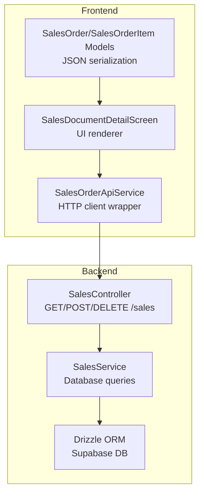
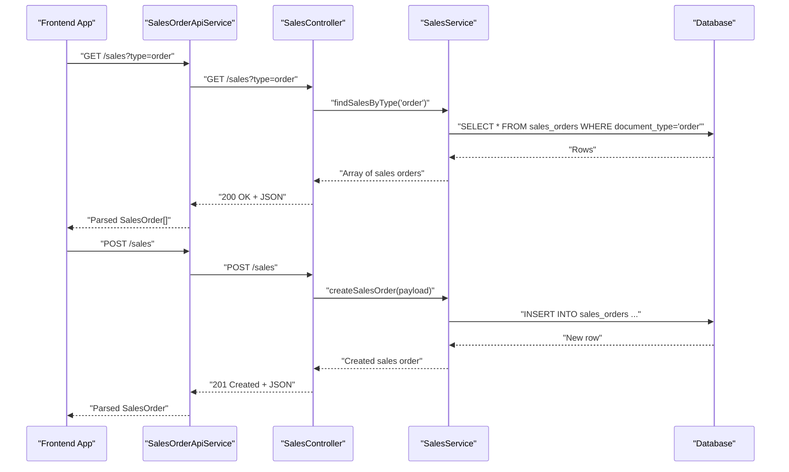
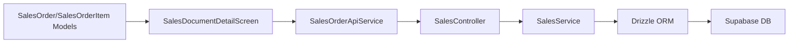

# Sales Document Endpoints

<cite>
**Referenced Files in This Document**
- [sales.controller.ts](file://backend/src/sales/sales.controller.ts)
- [sales.service.ts](file://backend/src/sales/sales.service.ts)
- [schema.ts](file://backend/src/db/schema.ts)
- [db.ts](file://backend/src/db/db.ts)
- [sales_order_api_service.dart](file://lib/modules/sales/services/sales_order_api_service.dart)
- [sales_order_model.dart](file://lib/modules/sales/models/sales_order_model.dart)
- [sales_order_item_model.dart](file://lib/modules/sales/models/sales_order_item_model.dart)
- [sales_document_detail.dart](file://lib/modules/sales/presentation/sales_document_detail.dart)
</cite>

## Table of Contents
1. [Introduction](#introduction)
2. [Project Structure](#project-structure)
3. [Core Components](#core-components)
4. [Architecture Overview](#architecture-overview)
5. [Detailed Component Analysis](#detailed-component-analysis)
6. [Dependency Analysis](#dependency-analysis)
7. [Performance Considerations](#performance-considerations)
8. [Troubleshooting Guide](#troubleshooting-guide)
9. [Conclusion](#conclusion)

## Introduction
This document provides comprehensive API documentation for sales document management endpoints. It covers:
- Listing sales documents with optional type filtering
- Retrieving individual sales documents
- Creating new sales documents
- Deleting sales documents
- Understanding multi-document relationships and validation patterns
- Documenting the current backend implementation and frontend consumption patterns

The backend exposes a REST-like API under the /sales namespace, while the frontend consumes these endpoints through a dedicated service.

## Project Structure
The sales module spans both backend and frontend:
- Backend: NestJS controller and service with Drizzle ORM and Supabase database
- Frontend: Dart service and models for consuming the API and rendering sales documents

**Diagram sources**
- [sales.controller.ts](file://backend/src/sales/sales.controller.ts#L14-L101)
- [sales.service.ts](file://backend/src/sales/sales.service.ts#L63-L106)
- [schema.ts](file://backend/src/db/schema.ts#L236-L253)
- [sales_order_api_service.dart](file://lib/modules/sales/services/sales_order_api_service.dart#L10-L132)
- [sales_order_model.dart](file://lib/modules/sales/models/sales_order_model.dart#L4-L117)
- [sales_document_detail.dart](file://lib/modules/sales/presentation/sales_document_detail.dart#L9-L43)

**Section sources**
- [sales.controller.ts](file://backend/src/sales/sales.controller.ts#L14-L101)
- [sales.service.ts](file://backend/src/sales/sales.service.ts#L63-L106)
- [schema.ts](file://backend/src/db/schema.ts#L236-L253)
- [sales_order_api_service.dart](file://lib/modules/sales/services/sales_order_api_service.dart#L10-L132)
- [sales_order_model.dart](file://lib/modules/sales/models/sales_order_model.dart#L4-L117)
- [sales_document_detail.dart](file://lib/modules/sales/presentation/sales_document_detail.dart#L9-L43)

## Core Components
- SalesController: Exposes endpoints for sales documents and related resources (customers, payments, e-way bills, payment links).
- SalesService: Implements business logic and database operations using Drizzle ORM.
- Database Schema: Defines sales_orders and related tables.
- Frontend SalesOrderApiService: Wraps HTTP requests to the backend.
- Frontend Models: Define serialization/deserialization for sales documents and items.

Key endpoints:
- GET /sales?type={order|quote|invoice|...}
- GET /sales/:id
- POST /sales
- DELETE /sales/:id

**Section sources**
- [sales.controller.ts](file://backend/src/sales/sales.controller.ts#L77-L100)
- [sales.service.ts](file://backend/src/sales/sales.service.ts#L63-L106)
- [schema.ts](file://backend/src/db/schema.ts#L236-L253)
- [sales_order_api_service.dart](file://lib/modules/sales/services/sales_order_api_service.dart#L42-L132)

## Architecture Overview
The sales document lifecycle is handled by the controller delegating to the service, which executes database queries against the Supabase database via Drizzle ORM. The frontend consumes these endpoints through a typed API service and renders the results using models.

**Diagram sources**
- [sales.controller.ts](file://backend/src/sales/sales.controller.ts#L77-L95)
- [sales.service.ts](file://backend/src/sales/sales.service.ts#L63-L97)
- [schema.ts](file://backend/src/db/schema.ts#L236-L253)
- [sales_order_api_service.dart](file://lib/modules/sales/services/sales_order_api_service.dart#L42-L121)

## Detailed Component Analysis

### Endpoint: GET /sales
- Purpose: Retrieve sales documents with optional type filtering.
- Query parameter:
  - type: Filters by document type (e.g., order, quote, invoice).
- Behavior:
  - If type is provided, returns documents matching the given type.
  - If type is omitted, defaults to returning orders.
- Response: Array of sales documents.

Validation and constraints:
- Type filtering is enforced at the service level by matching the documentType column.
- No pagination or sorting is applied in the current implementation.

**Section sources**
- [sales.controller.ts](file://backend/src/sales/sales.controller.ts#L77-L84)
- [sales.service.ts](file://backend/src/sales/sales.service.ts#L63-L70)
- [schema.ts](file://backend/src/db/schema.ts#L246-L247)

### Endpoint: GET /sales/:id
- Purpose: Retrieve a single sales document by ID.
- Path parameter:
  - id: UUID of the sales document.
- Behavior:
  - Returns the matching sales order if found.
  - Throws a not-found error if the ID does not exist.
- Response: Single sales document object.

Validation and constraints:
- ID existence is verified before returning.
- The endpoint currently returns the base sales order fields; extended details (line items, taxes, discounts) are not included in the backend response.

**Section sources**
- [sales.controller.ts](file://backend/src/sales/sales.controller.ts#L86-L89)
- [sales.service.ts](file://backend/src/sales/sales.service.ts#L72-L78)
- [schema.ts](file://backend/src/db/schema.ts#L236-L253)

### Endpoint: POST /sales
- Purpose: Create a new sales document.
- Request body: Partial sales document payload.
- Behavior:
  - Inserts a new sales order with defaults for unspecified fields.
  - Sets documentType to 'order' and status to 'draft' if not provided.
- Response: The newly created sales document.

Validation and constraints:
- Required fields: customerId, total, currency.
- Optional fields: saleNumber, reference, saleDate, expectedShipmentDate, deliveryMethod, paymentTerms, documentType, status, currency, customerNotes, termsAndConditions.
- Date fields are normalized to timestamps.
- The endpoint does not compute taxes, discounts, or line item totals; these are application-level concerns handled by the frontend.

**Section sources**
- [sales.controller.ts](file://backend/src/sales/sales.controller.ts#L91-L95)
- [sales.service.ts](file://backend/src/sales/sales.service.ts#L80-L97)
- [schema.ts](file://backend/src/db/schema.ts#L236-L253)

### Endpoint: DELETE /sales/:id
- Purpose: Remove a sales document by ID.
- Path parameter:
  - id: UUID of the sales document.
- Behavior:
  - Deletes the sales order if found.
  - Returns a success message upon deletion.
  - Throws a not-found error if the ID does not exist.

Validation and constraints:
- ID existence is verified before deletion.
- The operation removes only the sales order record; related entities (e.g., payments, e-way bills) are not automatically removed.

**Section sources**
- [sales.controller.ts](file://backend/src/sales/sales.controller.ts#L97-L100)
- [sales.service.ts](file://backend/src/sales/sales.service.ts#L100-L106)
- [schema.ts](file://backend/src/db/schema.ts#L236-L253)

### Multi-Document Relationships and Extended Details
While the base sales endpoint returns minimal fields, the frontend models support richer structures:
- SalesOrder includes customer, items, and summary fields (subTotal, taxTotal, discountTotal, shippingCharges, adjustment, total).
- SalesOrderItem includes itemId, description, quantity, rate, discount, taxId, taxAmount, itemTotal, and optionally the associated Item model.

These extended details are not returned by the backend endpoints but are used by the frontend to render complete sales documents.

**Section sources**
- [sales_order_model.dart](file://lib/modules/sales/models/sales_order_model.dart#L4-L117)
- [sales_order_item_model.dart](file://lib/modules/sales/models/sales_order_item_model.dart#L3-L61)

### Frontend Consumption Patterns
The frontend service encapsulates HTTP calls and maps responses to models:
- getSalesByType: Fetches filtered sales documents.
- getSalesOrderById: Fetches a single sales document by ID.
- createSalesOrder: Submits a new sales document.
- deleteSalesOrder: Removes a sales document by ID.

The detail screen consumes these APIs to present customer info, document metadata, items table, and summary totals.

**Section sources**
- [sales_order_api_service.dart](file://lib/modules/sales/services/sales_order_api_service.dart#L42-L132)
- [sales_document_detail.dart](file://lib/modules/sales/presentation/sales_document_detail.dart#L9-L43)

## Dependency Analysis
The sales module depends on:
- Database schema for sales_orders and related entities
- Drizzle ORM for database operations
- Supabase connection for database connectivity
- Frontend service for HTTP communication and model mapping

**Diagram sources**
- [sales.controller.ts](file://backend/src/sales/sales.controller.ts#L14-L101)
- [sales.service.ts](file://backend/src/sales/sales.service.ts#L1-L7)
- [db.ts](file://backend/src/db/db.ts#L1-L13)
- [schema.ts](file://backend/src/db/schema.ts#L236-L253)
- [sales_order_api_service.dart](file://lib/modules/sales/services/sales_order_api_service.dart#L10-L132)
- [sales_order_model.dart](file://lib/modules/sales/models/sales_order_model.dart#L4-L117)
- [sales_document_detail.dart](file://lib/modules/sales/presentation/sales_document_detail.dart#L9-L43)

**Section sources**
- [sales.controller.ts](file://backend/src/sales/sales.controller.ts#L14-L101)
- [sales.service.ts](file://backend/src/sales/sales.service.ts#L1-L7)
- [db.ts](file://backend/src/db/db.ts#L1-L13)
- [schema.ts](file://backend/src/db/schema.ts#L236-L253)
- [sales_order_api_service.dart](file://lib/modules/sales/services/sales_order_api_service.dart#L10-L132)
- [sales_order_model.dart](file://lib/modules/sales/models/sales_order_model.dart#L4-L117)
- [sales_document_detail.dart](file://lib/modules/sales/presentation/sales_document_detail.dart#L9-L43)

## Performance Considerations
- Current implementation performs straightforward SELECT and INSERT operations without pagination or indexing strategies.
- Filtering by documentType is supported; consider adding database indexes on documentType and status for improved query performance.
- Date normalization occurs at insertion; ensure consistent timezone handling across clients.
- Frontend rendering relies on model parsing; keep payloads minimal to reduce bandwidth and parsing overhead.

[No sources needed since this section provides general guidance]

## Troubleshooting Guide
Common issues and resolutions:
- Not Found Errors:
  - Occur when querying non-existent IDs or attempting to delete non-existent records.
  - Resolution: Verify the ID exists before invoking GET or DELETE.
- Validation Failures:
  - Missing required fields (customerId, total, currency) during creation will cause insertion failures.
  - Resolution: Ensure the payload includes required fields and defaults are acceptable.
- Type Filtering:
  - If no results are returned for a given type, confirm the documentType matches stored values.
- Date Handling:
  - Date fields are normalized to timestamps; ensure client-side dates are valid ISO strings.

**Section sources**
- [sales.service.ts](file://backend/src/sales/sales.service.ts#L36-L39)
- [sales.service.ts](file://backend/src/sales/sales.service.ts#L74-L76)
- [sales.service.ts](file://backend/src/sales/sales.service.ts#L102-L104)
- [sales.service.ts](file://backend/src/sales/sales.service.ts#L80-L97)

## Conclusion
The sales document endpoints provide a solid foundation for managing sales orders with optional type filtering, retrieval by ID, creation, and deletion. While the backend currently returns basic sales order fields, the frontend models and UI support rich document rendering. Extending the backend to include line items, taxes, and discounts would align the API with typical ERP needs. Adding database indexes and refining validation rules would further improve reliability and performance.