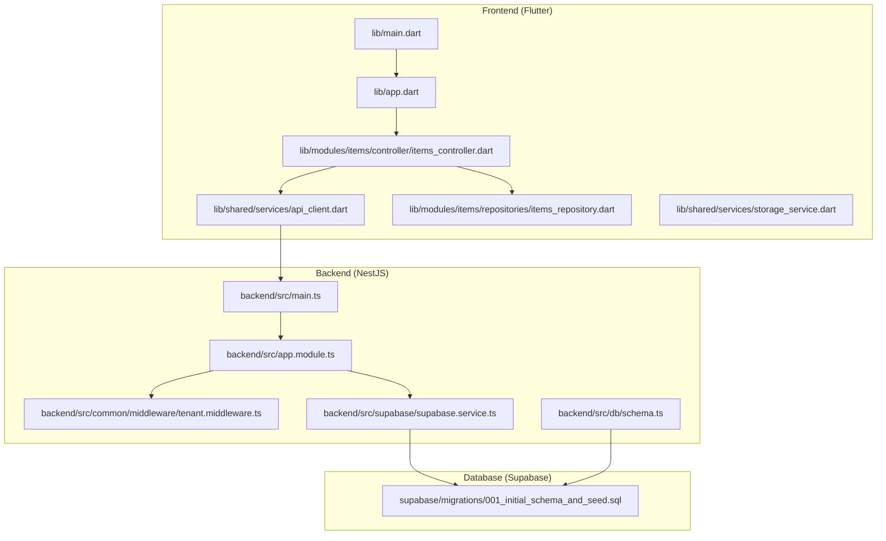
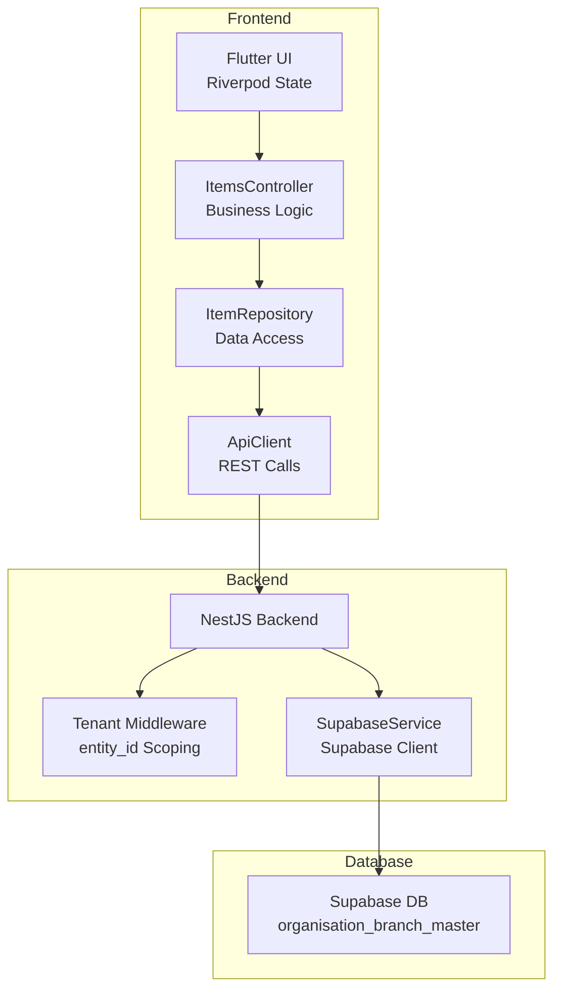
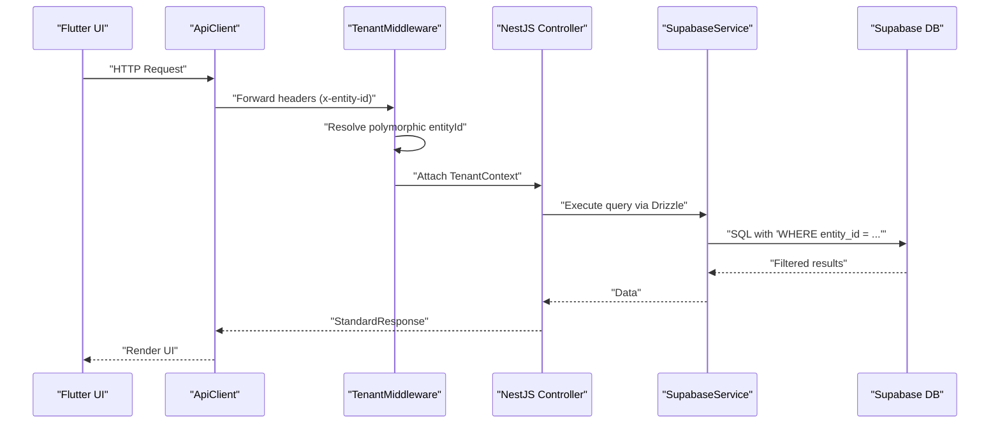
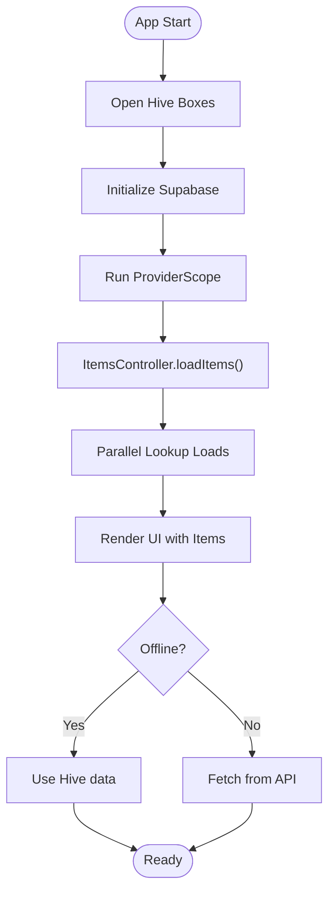
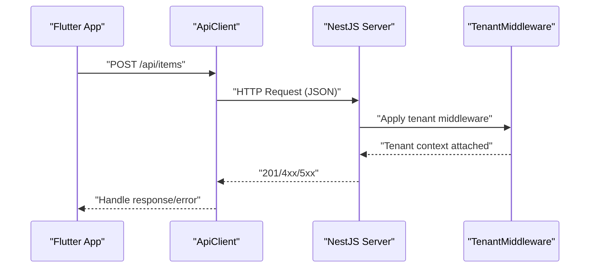
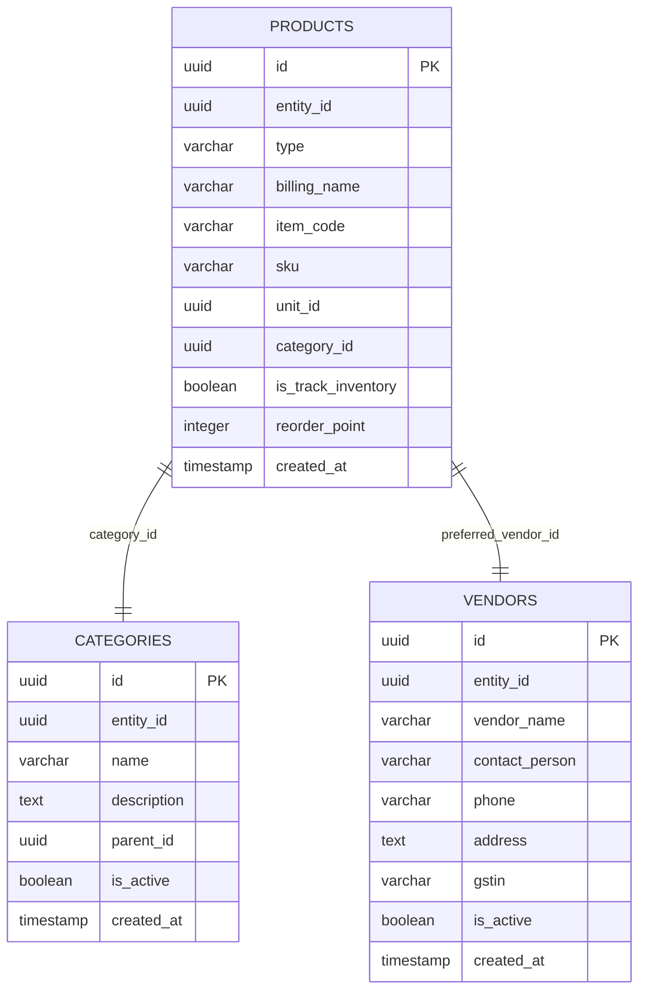
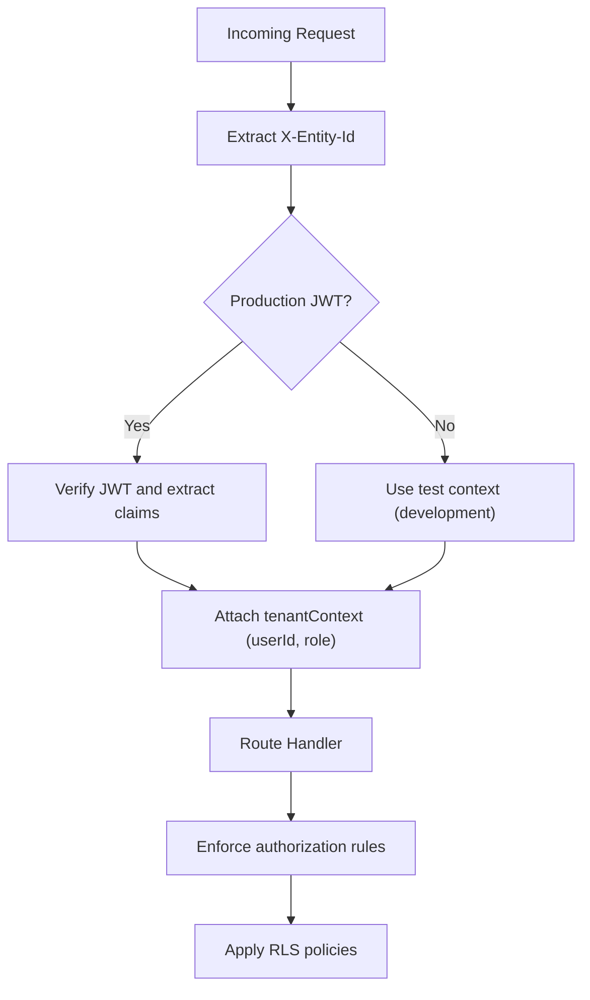
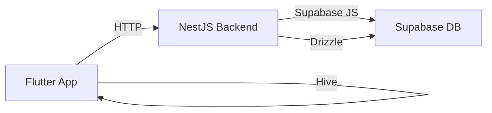

# Architecture & Design

<cite>
**Referenced Files in This Document**
- [README.md](file://README.md)
- [lib/main.dart](file://lib/main.dart)
- [lib/app.dart](file://lib/app.dart)
- [lib/shared/services/api_client.dart](file://lib/shared/services/api_client.dart)
- [lib/modules/items/controller/items_controller.dart](file://lib/modules/items/controller/items_controller.dart)
- [lib/modules/items/repositories/items_repository.dart](file://lib/modules/items/repositories/items_repository.dart)
- [lib/shared/services/storage_service.dart](file://lib/shared/services/storage_service.dart)
- [backend/src/main.ts](file://backend/src/main.ts)
- [backend/src/app.module.ts](file://backend/src/app.module.ts)
- [backend/src/common/middleware/tenant.middleware.ts](file://backend/src/common/middleware/tenant.middleware.ts)
- [backend/src/supabase/supabase.service.ts](file://backend/src/supabase/supabase.service.ts)
- [backend/src/db/schema.ts](file://backend/src/db/schema.ts)
- [supabase/migrations/001_initial_schema_and_seed.sql](file://supabase/migrations/001_initial_schema_and_seed.sql)
</cite>

## Table of Contents
1. [Introduction](#introduction)
2. [Project Structure](#project-structure)
3. [Core Components](#core-components)
4. [Architecture Overview](#architecture-overview)
5. [Detailed Component Analysis](#detailed-component-analysis)
6. [Dependency Analysis](#dependency-analysis)
7. [Performance Considerations](#performance-considerations)
8. [Troubleshooting Guide](#troubleshooting-guide)
9. [Conclusion](#conclusion)
10. [Appendices](#appendices)

## Introduction
This document describes the ZerpAI ERP system architecture, focusing on the Flutter frontend, NestJS backend, and Supabase database integration. It explains the **Unified Entity Tenancy** design, which utilizes a polymorphic entity model centered around the `organisation_branch_master` table and `entity_id` scoping. The system follows a layered architecture (presentation, business logic, data access, persistence), uses Riverpod for state management, and implements an offline-first strategy. It also covers security via Row-level Security (RLS) and integrated multi-tenant middleware.

## Project Structure
The monorepo follows a clear separation of concerns:
- Frontend: Flutter application (`lib/`) organized by modules, shared service providers, and core infrastructure.
- Backend: NestJS framework (`backend/src/`) using modular controllers, `TenantMiddleware` for polymorphic scoping, and Drizzle ORM.
- Database: Supabase PostgreSQL with schema managed via Drizzle migrations (`backend/drizzle/`).

**Diagram sources**
- [lib/main.dart](file://lib/main.dart#L1-L29)
- [lib/app.dart](file://lib/app.dart#L1-L32)
- [lib/shared/services/api_client.dart](file://lib/shared/services/api_client.dart#L1-L62)
- [lib/modules/items/controller/items_controller.dart](file://lib/modules/items/controller/items_controller.dart#L1-L568)
- [lib/modules/items/repositories/items_repository.dart](file://lib/modules/items/repositories/items_repository.dart#L1-L53)
- [lib/shared/services/storage_service.dart](file://lib/shared/services/storage_service.dart#L1-L227)
- [backend/src/main.ts](file://backend/src/main.ts#L1-L56)
- [backend/src/app.module.ts](file://backend/src/app.module.ts#L1-L20)
- [backend/src/common/middleware/tenant.middleware.ts](file://backend/src/common/middleware/tenant.middleware.ts#L1-L70)
- [backend/src/db/schema.ts](file://backend/src/db/schema.ts#L1-L293)
- [backend/src/supabase/supabase.service.ts](file://backend/src/supabase/supabase.service.ts#L1-L32)
- [supabase/migrations/001_initial_schema_and_seed.sql](file://supabase/migrations/001_initial_schema_and_seed.sql#L1-L218)

**Section sources**
- [README.md](file://README.md#L1-L122)
- [lib/main.dart](file://lib/main.dart#L1-L29)
- [lib/app.dart](file://lib/app.dart#L1-L32)
- [backend/src/main.ts](file://backend/src/main.ts#L1-L56)
- [backend/src/app.module.ts](file://backend/src/app.module.ts#L1-L20)
- [backend/src/db/schema.ts](file://backend/src/db/schema.ts#L1-L293)
- [supabase/migrations/001_initial_schema_and_seed.sql](file://supabase/migrations/001_initial_schema_and_seed.sql#L1-L218)

## Core Components
- Flutter Application Bootstrap and Initialization
  - Initializes Hive for offline storage, Supabase client, and wraps the app in Riverpod’s ProviderScope
  - See [lib/main.dart](file://lib/main.dart#L8-L28)
- API Client
  - Centralized Dio-based HTTP client configured with base URL and interceptors
  - See [lib/shared/services/api_client.dart](file://lib/shared/services/api_client.dart#L6-L62)
- Riverpod State Management
  - ItemsController orchestrates loading, validation, saving, and error handling for items
  - Provides provider bindings for consumption by UI
  - See [lib/modules/items/controller/items_controller.dart](file://lib/modules/items/controller/items_controller.dart#L16-L568)
- Repository Layer
  - Abstraction for data access; includes a mock implementation for development
  - See [lib/modules/items/repositories/items_repository.dart](file://lib/modules/items/repositories/items_repository.dart#L3-L53)
- Backend Entry Point
  - Bootstraps NestJS app, enables CORS, sets global validation pipe, and listens on configured port
  - See [backend/src/main.ts](file://backend/src/main.ts#L10-L53)
- Tenant Middleware
  - Resolves `entityId` from headers (`x-entity-id`, `x-org-id`, `x-branch-id`) or JWT claims.
  - Performs polymorphic lookup in `organisation_branch_master` to ensure valid scoping.
  - See [backend/src/common/middleware/tenant.middleware.ts](file://backend/src/common/middleware/tenant.middleware.ts)
- Supabase Service
  - Creates a Supabase client using service role credentials
  - See [backend/src/supabase/supabase.service.ts](file://backend/src/supabase/supabase.service.ts#L7-L31)
- Database Schema
  - Drizzle ORM schema for products, categories, vendors, and sales entities
  - See [backend/src/db/schema.ts](file://backend/src/db/schema.ts#L1-L293)
- Database Migration
  - Current schema utilizes `entity_id` as the canonical foreign key for all business entities.
  - Migrations are managed via Drizzle Kit in `backend/drizzle/`.
  - See [backend/drizzle/](file://backend/drizzle/)

**Section sources**
- [lib/main.dart](file://lib/main.dart#L8-L28)
- [lib/shared/services/api_client.dart](file://lib/shared/services/api_client.dart#L6-L62)
- [lib/modules/items/controller/items_controller.dart](file://lib/modules/items/controller/items_controller.dart#L16-L568)
- [lib/modules/items/repositories/items_repository.dart](file://lib/modules/items/repositories/items_repository.dart#L3-L53)
- [backend/src/main.ts](file://backend/src/main.ts#L10-L53)
- [backend/src/common/middleware/tenant.middleware.ts](file://backend/src/common/middleware/tenant.middleware.ts#L24-L68)
- [backend/src/supabase/supabase.service.ts](file://backend/src/supabase/supabase.service.ts#L7-L31)
- [backend/src/db/schema.ts](file://backend/src/db/schema.ts#L116-L293)
- [supabase/migrations/001_initial_schema_and_seed.sql](file://supabase/migrations/001_initial_schema_and_seed.sql#L24-L141)

## Architecture Overview
ZerpAI ERP follows a layered architecture:
- Presentation Layer: Flutter UI with Riverpod state management
- Business Logic Layer: Controllers and services coordinating workflows
- Data Access Layer: Repositories and API services
- Persistence Layer: Supabase (PostgreSQL) with RLS and indexes

**Diagram sources**
- [lib/modules/items/controller/items_controller.dart](file://lib/modules/items/controller/items_controller.dart#L16-L568)
- [lib/shared/services/api_client.dart](file://lib/shared/services/api_client.dart#L6-L62)
- [backend/src/common/middleware/tenant.middleware.ts](file://backend/src/common/middleware/tenant.middleware.ts#L24-L68)
- [backend/src/supabase/supabase.service.ts](file://backend/src/supabase/supabase.service.ts#L7-L31)
- [supabase/migrations/001_initial_schema_and_seed.sql](file://supabase/migrations/001_initial_schema_and_seed.sql#L24-L141)

## Detailed Component Analysis

### Multi-Tenant Design and Tenant Middleware
- Headers
  - X-Entity-Id is used to isolate data per organization or branch entity.
- Middleware Behavior
  - Currently attaches a test tenant context for development
  - Includes commented production code for JWT verification and header extraction
- Impact
  - Ensures backend routes operate under tenant context; database queries should filter by entity_id.

**Diagram sources**
- [lib/shared/services/api_client.dart](file://lib/shared/services/api_client.dart#L46-L60)
- [backend/src/common/middleware/tenant.middleware.ts](file://backend/src/common/middleware/tenant.middleware.ts#L24-L68)
- [backend/src/supabase/supabase.service.ts](file://backend/src/supabase/supabase.service.ts#L28-L31)
- [supabase/migrations/001_initial_schema_and_seed.sql](file://supabase/migrations/001_initial_schema_and_seed.sql#L30-L33)

**Section sources**
- [README.md](file://README.md#L93-L100)
- [backend/src/common/middleware/tenant.middleware.ts](file://backend/src/common/middleware/tenant.middleware.ts#L24-L68)

### Riverpod State Management and Offline-First Strategy
- Initialization
  - Hive boxes opened for offline support (products, customers, pos drafts, config)
- State Management
  - ItemsController manages loading, validation, saving, and error states
  - Parallel loading of lookup data improves responsiveness
- Offline-First
  - Hive initialization ensures offline readiness
  - Image uploads to Cloudflare R2 bypass Supabase for media assets

**Diagram sources**
- [lib/main.dart](file://lib/main.dart#L11-L28)
- [lib/modules/items/controller/items_controller.dart](file://lib/modules/items/controller/items_controller.dart#L25-L184)

**Section sources**
- [lib/main.dart](file://lib/main.dart#L11-L28)
- [lib/modules/items/controller/items_controller.dart](file://lib/modules/items/controller/items_controller.dart#L25-L184)

### API Communication Patterns and CORS
- Backend CORS
  - Enabled for localhost origins and allowed headers including X-Entity-Id.
- Error Handling
  - Global `StandardResponseInterceptor` ensures all responses follow the `{ data, meta }` format.
  - Global `ValidationPipe` logs detailed validation errors and enforces DTO constraints.

**Diagram sources**
- [lib/shared/services/api_client.dart](file://lib/shared/services/api_client.dart#L46-L60)
- [backend/src/main.ts](file://backend/src/main.ts#L19-L24)
- [backend/src/common/middleware/tenant.middleware.ts](file://backend/src/common/middleware/tenant.middleware.ts#L24-L39)

**Section sources**
- [backend/src/main.ts](file://backend/src/main.ts#L19-L42)
- [lib/shared/services/api_client.dart](file://lib/shared/services/api_client.dart#L12-L43)

### Data Model and Polymorphic Scoping
- Business tables (items, sales, vendors, etc.) use `entity_id` for scoping.
- Global lookup tables (units, currencies, tax_rates) are shared and have no `entity_id`.
- The `organisation_branch_master` table acts as the unified entity registry.

**Diagram sources**
- [supabase/migrations/001_initial_schema_and_seed.sql](file://supabase/migrations/001_initial_schema_and_seed.sql#L26-L89)
- [supabase/migrations/001_initial_schema_and_seed.sql](file://supabase/migrations/001_initial_schema_and_seed.sql#L94-L120)

**Section sources**
- [supabase/migrations/001_initial_schema_and_seed.sql](file://supabase/migrations/001_initial_schema_and_seed.sql#L24-L141)
- [backend/src/db/schema.ts](file://backend/src/db/schema.ts#L116-L195)

### Cross-Cutting Concerns: Authentication, Authorization, and Data Security
- Authentication
  - Supabase Auth is available; current tenant middleware uses test context
  - Production code includes placeholders for JWT verification and extracting user/role from headers
- Authorization
  - Backend middleware attaches role to tenant context; enforcement depends on route handlers
- Data Security
  - Row-level Security (RLS) policies are intentionally disabled for development
  - Recommended to enable RLS and fine-grained policies before production deployment

**Diagram sources**
- [backend/src/common/middleware/tenant.middleware.ts](file://backend/src/common/middleware/tenant.middleware.ts#L41-L67)
- [supabase/migrations/001_initial_schema_and_seed.sql](file://supabase/migrations/001_initial_schema_and_seed.sql#L137-L141)

**Section sources**
- [backend/src/common/middleware/tenant.middleware.ts](file://backend/src/common/middleware/tenant.middleware.ts#L41-L67)
- [supabase/migrations/001_initial_schema_and_seed.sql](file://supabase/migrations/001_initial_schema_and_seed.sql#L137-L141)

## Dependency Analysis
- Frontend Dependencies
  - Flutter, Riverpod, Dio, Supabase Flutter SDK, Hive
- Backend Dependencies
  - NestJS, Supabase client, Drizzle ORM schema
- Database Dependencies
  - Supabase PostgreSQL with multi-tenant tables and indexes

**Diagram sources**
- [lib/shared/services/api_client.dart](file://lib/shared/services/api_client.dart#L3-L5)
- [backend/src/supabase/supabase.service.ts](file://backend/src/supabase/supabase.service.ts#L4-L5)
- [backend/src/db/schema.ts](file://backend/src/db/schema.ts#L1-L2)

**Section sources**
- [lib/shared/services/api_client.dart](file://lib/shared/services/api_client.dart#L3-L5)
- [backend/src/supabase/supabase.service.ts](file://backend/src/supabase/supabase.service.ts#L4-L5)
- [backend/src/db/schema.ts](file://backend/src/db/schema.ts#L1-L2)

## Performance Considerations
- Parallel Lookup Loading
  - ItemsController loads multiple lookup datasets concurrently to reduce latency
- Indexes
  - Database includes indexes on entity_id and frequently queried columns.
- Validation Pipe
  - Global ValidationPipe provides structured error logging and early failure detection
- Media Handling
  - Product images uploaded to Cloudflare R2 to offload storage and improve CDN reach

**Section sources**
- [lib/modules/items/controller/items_controller.dart](file://lib/modules/items/controller/items_controller.dart#L72-L88)
- [supabase/migrations/001_initial_schema_and_seed.sql](file://supabase/migrations/001_initial_schema_and_seed.sql#L124-L134)
- [backend/src/main.ts](file://backend/src/main.ts#L27-L42)
- [lib/shared/services/storage_service.dart](file://lib/shared/services/storage_service.dart#L25-L44)

## Troubleshooting Guide
- CORS Issues
  - Ensure API_BASE_URL matches backend CORS configuration and allowed headers include tenant headers
- Validation Errors
  - Global ValidationPipe returns detailed messages; inspect logs for field-specific constraints
- Tenant Context
  - Confirm X-Entity-Id header is present; middleware currently attaches test context in development.
- RLS Policies
  - During development, RLS is disabled; enable policies and verify row-level filtering before production

**Section sources**
- [backend/src/main.ts](file://backend/src/main.ts#L19-L24)
- [backend/src/main.ts](file://backend/src/main.ts#L32-L41)
- [backend/src/common/middleware/tenant.middleware.ts](file://backend/src/common/middleware/tenant.middleware.ts#L24-L39)
- [supabase/migrations/001_initial_schema_and_seed.sql](file://supabase/migrations/001_initial_schema_and_seed.sql#L137-L141)

## Conclusion
ZerpAI ERP employs a clean layered architecture with a Flutter frontend powered by Riverpod, a NestJS backend enforcing multi-tenant isolation via headers and middleware, and a Supabase-backed database with multi-tenant tables and indexes. The system is designed for scalability and maintainability, with room for production hardening around authentication, authorization, and RLS. The offline-first strategy leverages Hive and external media storage to ensure resilience and performance.

## Appendices
- Deployment Topology
  - Frontend: Hosted via Flutter web or native platforms
  - Backend: Deployed as a NestJS server with environment-specific CORS and ports
  - Database: Supabase managed PostgreSQL with RLS policies enabled in production
- Scalability Notes
  - Horizontal scaling of backend instances supported by stateless controllers and shared database
  - CDN and external storage for media improve global availability and throughput