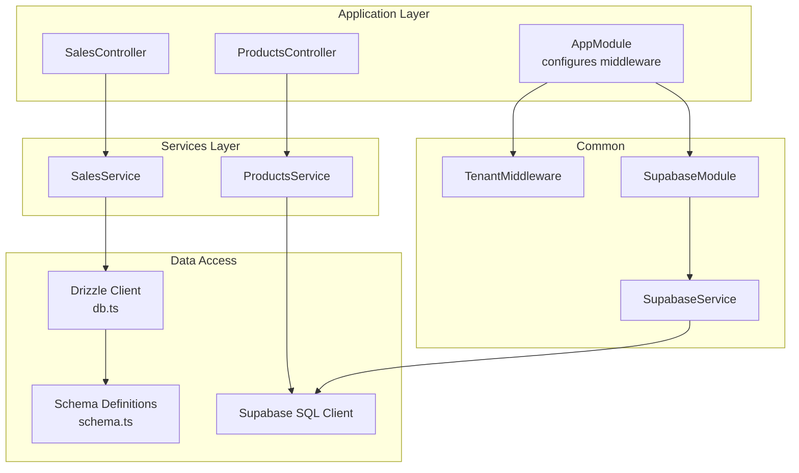
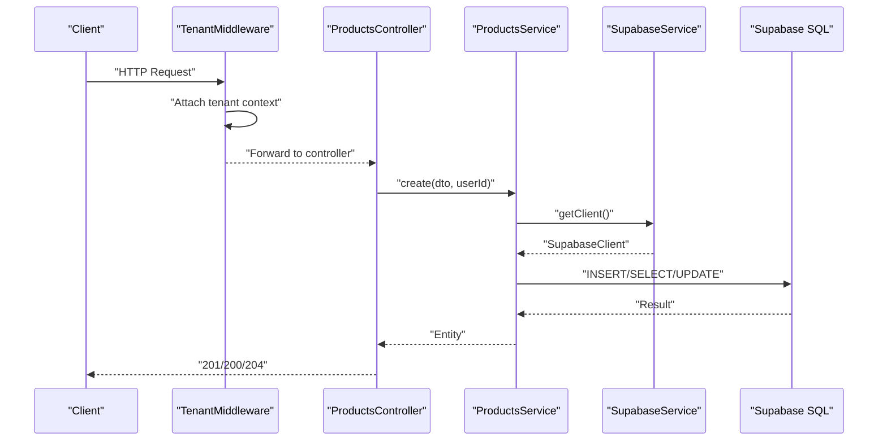
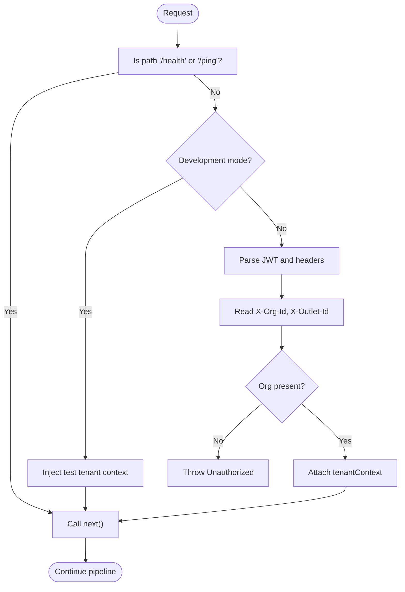
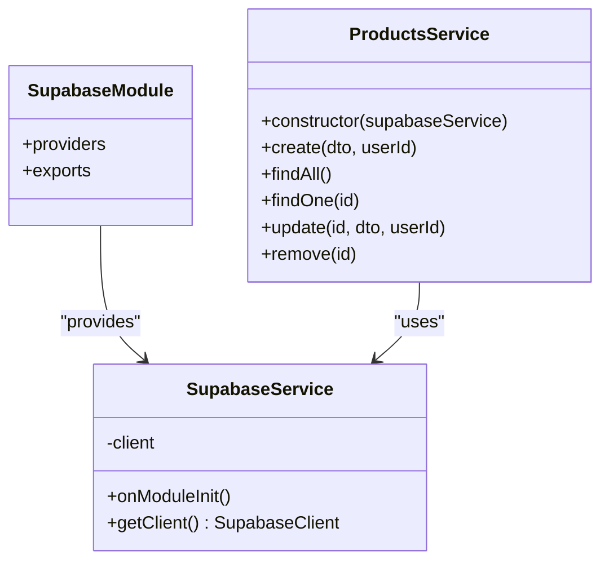
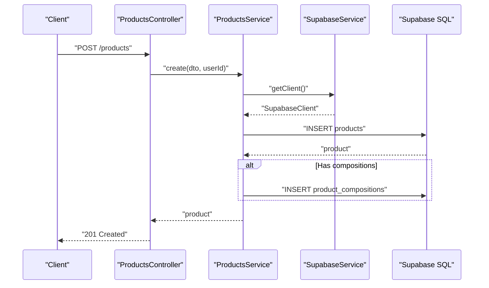
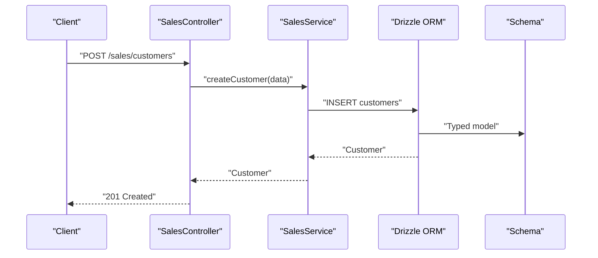
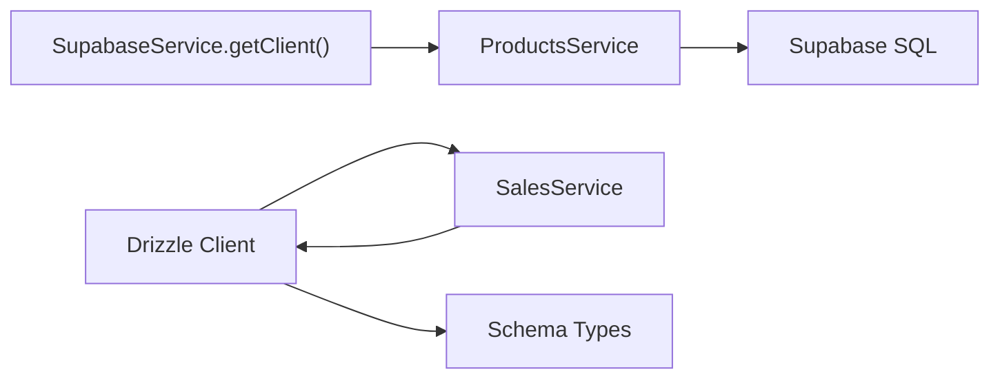
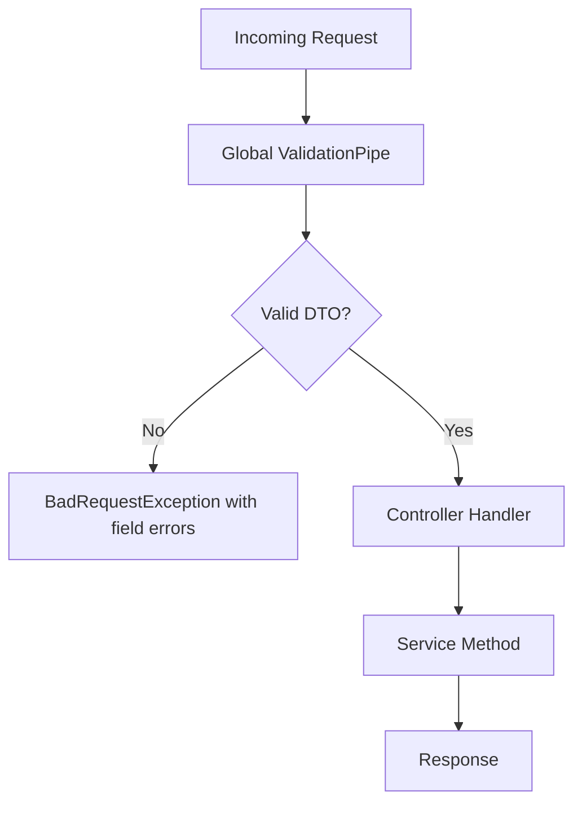
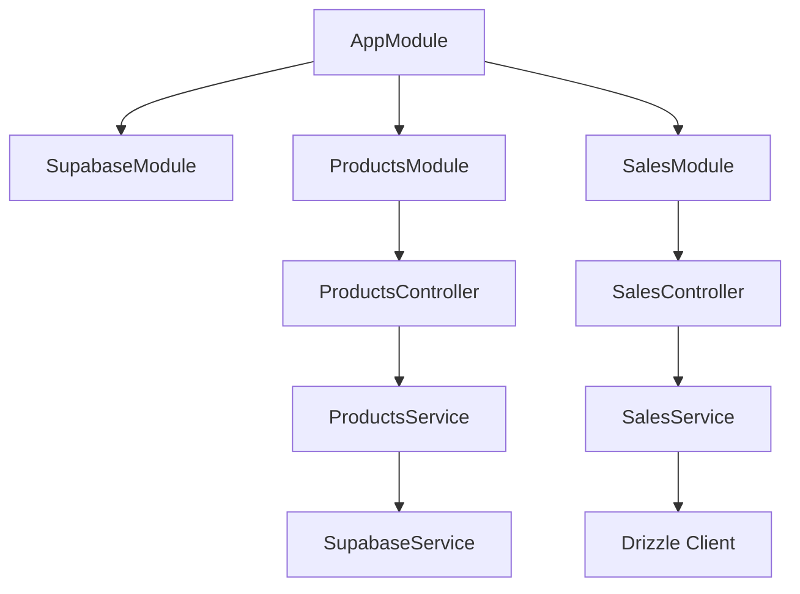

# Backend Architecture

<cite>
**Referenced Files in This Document**
- [main.ts](file://backend/src/main.ts)
- [app.module.ts](file://backend/src/app.module.ts)
- [tenant.middleware.ts](file://backend/src/common/middleware/tenant.middleware.ts)
- [supabase.module.ts](file://backend/src/supabase/supabase.module.ts)
- [supabase.service.ts](file://backend/src/supabase/supabase.service.ts)
- [products.module.ts](file://backend/src/products/products.module.ts)
- [products.controller.ts](file://backend/src/products/products.controller.ts)
- [products.service.ts](file://backend/src/products/products.service.ts)
- [create-product.dto.ts](file://backend/src/products/dto/create-product.dto.ts)
- [update-product.dto.ts](file://backend/src/products/dto/update-product.dto.ts)
- [sales.module.ts](file://backend/src/sales/sales.module.ts)
- [sales.controller.ts](file://backend/src/sales/sales.controller.ts)
- [sales.service.ts](file://backend/src/sales/sales.service.ts)
- [db.ts](file://backend/src/db/db.ts)
- [schema.ts](file://backend/src/db/schema.ts)
</cite>

## Table of Contents
1. [Introduction](#introduction)
2. [Project Structure](#project-structure)
3. [Core Components](#core-components)
4. [Architecture Overview](#architecture-overview)
5. [Detailed Component Analysis](#detailed-component-analysis)
6. [Dependency Analysis](#dependency-analysis)
7. [Performance Considerations](#performance-considerations)
8. [Troubleshooting Guide](#troubleshooting-guide)
9. [Conclusion](#conclusion)

## Introduction
This document describes the backend architecture of the NestJS-based ERP system. It explains the modular design separating products, sales, and common concerns, the layered structure (controllers, services), middleware for multi-tenancy, dependency injection and module organization, API design with DTOs and validation, database integration via Supabase and Drizzle ORM, and operational aspects such as error handling and logging.

## Project Structure
The backend follows a feature-based module organization:
- Root module initializes middleware and imports feature modules.
- Feature modules encapsulate domain logic: products and sales.
- Common middleware enforces tenant context.
- Supabase module provides a globally available client for row-level security and auth-controlled data access.
- Database integration uses Drizzle ORM for typed queries in the sales domain and Supabase SQL client for products.

**Diagram sources**
- [app.module.ts](file://backend/src/app.module.ts#L9-L19)
- [tenant.middleware.ts](file://backend/src/common/middleware/tenant.middleware.ts#L23-L69)
- [supabase.module.ts](file://backend/src/supabase/supabase.module.ts#L6-L11)
- [supabase.service.ts](file://backend/src/supabase/supabase.service.ts#L7-L31)
- [products.controller.ts](file://backend/src/products/products.controller.ts#L19-L249)
- [products.service.ts](file://backend/src/products/products.service.ts#L7-L9)
- [sales.controller.ts](file://backend/src/sales/sales.controller.ts#L14-L101)
- [sales.service.ts](file://backend/src/sales/sales.service.ts#L6-L7)
- [db.ts](file://backend/src/db/db.ts#L1-L12)
- [schema.ts](file://backend/src/db/schema.ts#L1-L293)

**Section sources**
- [app.module.ts](file://backend/src/app.module.ts#L9-L19)
- [main.ts](file://backend/src/main.ts#L10-L55)

## Core Components
- Application bootstrap configures CORS, global validation pipe, and starts the server.
- AppModule registers Supabase, Products, and Sales modules and applies tenant middleware globally.
- TenantMiddleware injects a tenant context into requests (placeholder implementation currently).
- SupabaseModule provides a singleton Supabase client for auth-controlled data access.
- Products module exposes CRUD and lookup endpoints plus metadata synchronization helpers.
- Sales module exposes customer, order, payment, e-way bill, and payment link endpoints backed by Drizzle ORM.

**Section sources**
- [main.ts](file://backend/src/main.ts#L10-L55)
- [app.module.ts](file://backend/src/app.module.ts#L9-L19)
- [tenant.middleware.ts](file://backend/src/common/middleware/tenant.middleware.ts#L23-L69)
- [supabase.module.ts](file://backend/src/supabase/supabase.module.ts#L6-L11)
- [supabase.service.ts](file://backend/src/supabase/supabase.service.ts#L7-L31)
- [products.module.ts](file://backend/src/products/products.module.ts#L7-L11)
- [sales.module.ts](file://backend/src/sales/sales.module.ts#L5-L9)

## Architecture Overview
The system employs a layered architecture:
- Controllers handle HTTP requests and delegate to Services.
- Services encapsulate business logic and orchestrate data access.
- Data access uses two complementary clients:
  - Supabase SQL client for products (enabling RLS and auth-controlled reads/writes).
  - Drizzle ORM for typed queries in the sales domain.

**Diagram sources**
- [tenant.middleware.ts](file://backend/src/common/middleware/tenant.middleware.ts#L23-L69)
- [products.controller.ts](file://backend/src/products/products.controller.ts#L227-L233)
- [products.service.ts](file://backend/src/products/products.service.ts#L18-L89)
- [supabase.service.ts](file://backend/src/supabase/supabase.service.ts#L28-L30)

## Detailed Component Analysis

### Tenant Middleware
Purpose:
- Enforce multi-tenant context per request.
- Currently injects a test context; placeholder for production JWT parsing and X-Org-Id/X-Outlet-Id extraction.

Behavior:
- Skips tenant checks for health endpoints.
- Injects a default tenant context for development/testing.
- Production code path outlines JWT verification and header-based context extraction.

**Diagram sources**
- [tenant.middleware.ts](file://backend/src/common/middleware/tenant.middleware.ts#L24-L68)

**Section sources**
- [tenant.middleware.ts](file://backend/src/common/middleware/tenant.middleware.ts#L23-L69)

### Supabase Integration
- SupabaseModule is global and exports a single SupabaseService instance.
- SupabaseService creates a client using environment variables and logs initialization.
- ProductsService uses the Supabase client for all product-related operations, enabling RLS and auth-controlled access.

**Diagram sources**
- [supabase.module.ts](file://backend/src/supabase/supabase.module.ts#L6-L11)
- [supabase.service.ts](file://backend/src/supabase/supabase.service.ts#L7-L31)
- [products.service.ts](file://backend/src/products/products.service.ts#L7-L9)

**Section sources**
- [supabase.module.ts](file://backend/src/supabase/supabase.module.ts#L6-L11)
- [supabase.service.ts](file://backend/src/supabase/supabase.service.ts#L7-L31)
- [products.service.ts](file://backend/src/products/products.service.ts#L18-L89)

### Products Module
Endpoints:
- CRUD for products.
- Rich set of lookup endpoints and synchronization helpers for master data (units, categories, tax rates, manufacturers, brands, vendors, storage locations, racks, reorder terms, accounts, contents, strengths, buying rules, drug schedules).

DTOs and Validation:
- CreateProductDto defines strict validation rules for product creation.
- UpdateProductDto leverages PartialType to derive partial updates.

Service logic:
- Normalizes legacy field names and handles optional fields.
- Supports product composition inserts.
- Provides usage checks and generic metadata synchronization with upsert and conflict handling.

**Diagram sources**
- [products.controller.ts](file://backend/src/products/products.controller.ts#L227-L233)
- [products.service.ts](file://backend/src/products/products.service.ts#L18-L89)
- [supabase.service.ts](file://backend/src/supabase/supabase.service.ts#L28-L30)

**Section sources**
- [products.controller.ts](file://backend/src/products/products.controller.ts#L19-L249)
- [create-product.dto.ts](file://backend/src/products/dto/create-product.dto.ts#L21-L245)
- [update-product.dto.ts](file://backend/src/products/dto/update-product.dto.ts#L3-L6)
- [products.service.ts](file://backend/src/products/products.service.ts#L18-L194)

### Sales Module
Endpoints:
- Customers: list, retrieve by ID, create.
- Sales orders: list by type or all, retrieve by ID, create, delete.
- Payments: list, create.
- E-way bills: list, create.
- Payment links: list, create.
- GSTIN lookup: mock implementation.

Data access:
- Uses Drizzle ORM with typed schema definitions.
- Queries are constructed with eq and and predicates.

**Diagram sources**
- [sales.controller.ts](file://backend/src/sales/sales.controller.ts#L29-L33)
- [sales.service.ts](file://backend/src/sales/sales.service.ts#L42-L61)
- [db.ts](file://backend/src/db/db.ts#L1-L12)
- [schema.ts](file://backend/src/db/schema.ts#L213-L234)

**Section sources**
- [sales.controller.ts](file://backend/src/sales/sales.controller.ts#L14-L101)
- [sales.service.ts](file://backend/src/sales/sales.service.ts#L6-L161)
- [db.ts](file://backend/src/db/db.ts#L1-L12)
- [schema.ts](file://backend/src/db/schema.ts#L213-L291)

### Database Integration Patterns
- Supabase SQL client for products:
  - Auth-controlled access via SupabaseService.
  - Uses Supabase SQL for inserts/selects/updates.
- Drizzle ORM for sales:
  - Strongly-typed schema definitions.
  - Uses eq and and predicates for filtering.
  - Returns typed results.

**Diagram sources**
- [supabase.service.ts](file://backend/src/supabase/supabase.service.ts#L28-L30)
- [products.service.ts](file://backend/src/products/products.service.ts#L18-L89)
- [sales.service.ts](file://backend/src/sales/sales.service.ts#L1-L7)
- [db.ts](file://backend/src/db/db.ts#L1-L12)
- [schema.ts](file://backend/src/db/schema.ts#L1-L293)

**Section sources**
- [products.service.ts](file://backend/src/products/products.service.ts#L18-L89)
- [sales.service.ts](file://backend/src/sales/sales.service.ts#L1-L7)
- [db.ts](file://backend/src/db/db.ts#L1-L12)
- [schema.ts](file://backend/src/db/schema.ts#L1-L293)

### API Design Principles, DTOs, and Validation
- RESTful design with clear resource paths (/products, /sales/*).
- DTO-driven validation using class-validator decorators.
- Global ValidationPipe configured to:
  - Transform and whitelist inputs.
  - Return structured error arrays with field, constraints, and value.
  - Log detailed validation failures.

**Diagram sources**
- [main.ts](file://backend/src/main.ts#L26-L42)
- [create-product.dto.ts](file://backend/src/products/dto/create-product.dto.ts#L21-L245)

**Section sources**
- [main.ts](file://backend/src/main.ts#L26-L42)
- [create-product.dto.ts](file://backend/src/products/dto/create-product.dto.ts#L21-L245)
- [update-product.dto.ts](file://backend/src/products/dto/update-product.dto.ts#L3-L6)

### Security and Logging
- CORS enabled for development origins and required headers.
- Tenant middleware intended to enforce multi-tenant context; current dev-mode bypass.
- Logging:
  - Validation errors logged with field details.
  - Supabase client initialization logged.
  - Extensive console logs in product service for sync operations.

**Section sources**
- [main.ts](file://backend/src/main.ts#L13-L24)
- [main.ts](file://backend/src/main.ts#L32-L41)
- [supabase.service.ts](file://backend/src/supabase/supabase.service.ts#L25-L25)
- [products.service.ts](file://backend/src/products/products.service.ts#L209-L252)

## Dependency Analysis
High-level dependencies:
- AppModule depends on SupabaseModule, ProductsModule, SalesModule.
- Controllers depend on Services.
- Services depend on SupabaseService (products) or Drizzle client (sales).
- DTOs validate inputs for controllers.

**Diagram sources**
- [app.module.ts](file://backend/src/app.module.ts#L9-L11)
- [products.module.ts](file://backend/src/products/products.module.ts#L7-L11)
- [sales.module.ts](file://backend/src/sales/sales.module.ts#L5-L9)
- [products.controller.ts](file://backend/src/products/products.controller.ts#L19-L21)
- [sales.controller.ts](file://backend/src/sales/sales.controller.ts#L14-L15)
- [products.service.ts](file://backend/src/products/products.service.ts#L7-L9)
- [sales.service.ts](file://backend/src/sales/sales.service.ts#L6-L7)
- [supabase.service.ts](file://backend/src/supabase/supabase.service.ts#L7-L31)
- [db.ts](file://backend/src/db/db.ts#L1-L12)

**Section sources**
- [app.module.ts](file://backend/src/app.module.ts#L9-L19)
- [products.module.ts](file://backend/src/products/products.module.ts#L7-L11)
- [sales.module.ts](file://backend/src/sales/sales.module.ts#L5-L9)

## Performance Considerations
- Prefer selective field selection and joins in controllers/services to minimize payload sizes.
- Use pagination for large lists (not yet implemented).
- Batch operations for metadata synchronization reduce round-trips.
- Avoid unnecessary transformations; rely on DTOs and ValidationPipe to keep payloads minimal.
- Monitor Supabase and database query latency; consider caching for frequently accessed lookups.

## Troubleshooting Guide
Common issues and resolutions:
- Missing Supabase environment variables:
  - Symptom: Application fails to start.
  - Resolution: Set SUPABASE_URL and SUPABASE_SERVICE_ROLE_KEY.
- Validation failures:
  - Symptom: 400 Bad Request with field-level errors.
  - Resolution: Review DTO constraints and input shape.
- Tenant context errors:
  - Symptom: Unauthorized in production path.
  - Resolution: Ensure X-Org-Id header is present; implement JWT parsing.
- Product creation conflicts:
  - Symptom: 409 Conflict for duplicate item codes.
  - Resolution: Use unique item codes or update existing records.
- Drizzle query errors:
  - Symptom: Type mismatches or constraint violations.
  - Resolution: Align input data with schema definitions and constraints.

**Section sources**
- [supabase.service.ts](file://backend/src/supabase/supabase.service.ts#L14-L16)
- [main.ts](file://backend/src/main.ts#L32-L41)
- [products.service.ts](file://backend/src/products/products.service.ts#L45-L51)
- [sales.service.ts](file://backend/src/sales/sales.service.ts#L64-L78)

## Conclusion
The backend adopts a clean, modular NestJS architecture with clear separation of concerns. Controllers are thin, services encapsulate business logic, and data access is handled via Supabase and Drizzle ORM. The tenant middleware establishes a foundation for multi-tenancy, while DTOs and a global validation pipe ensure robust API contracts. With minor enhancements—such as re-enabling production authentication in tenant middleware and adding pagination and standardized error responses—the system is well-positioned for production readiness.