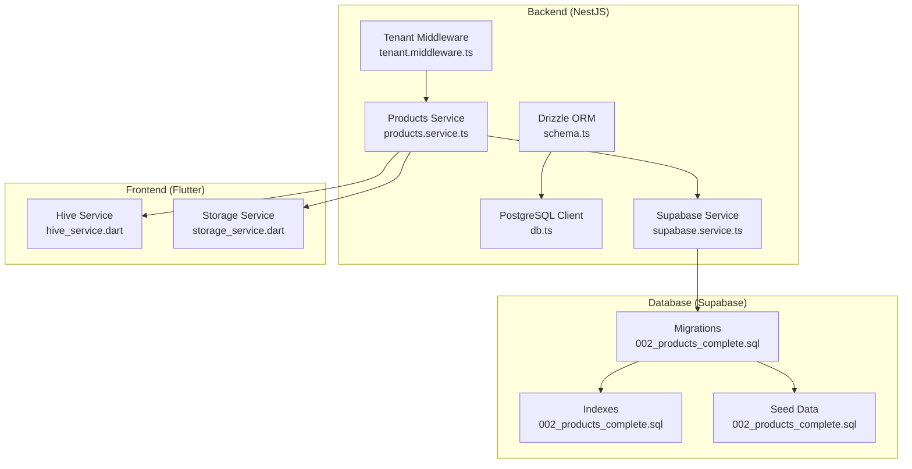
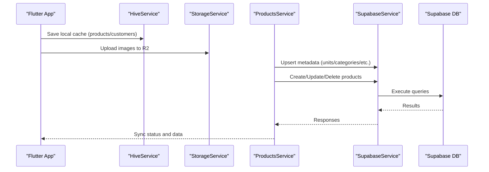
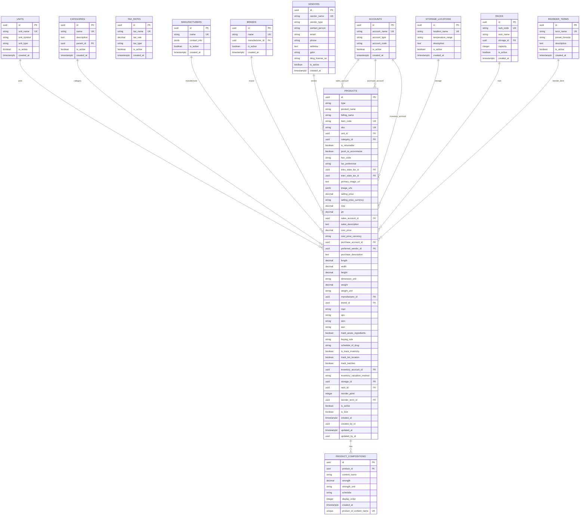
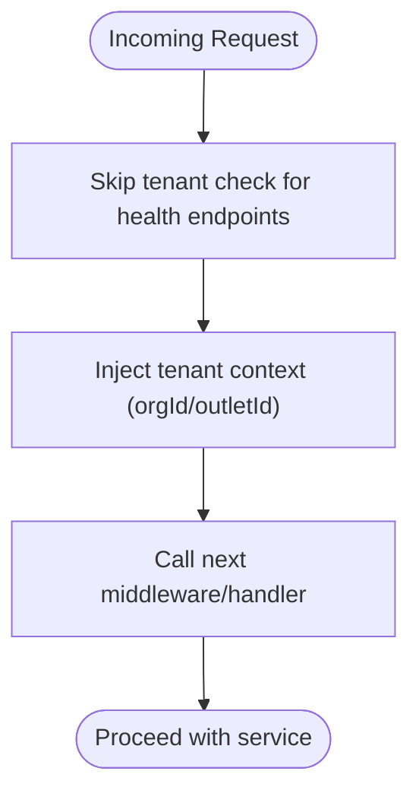
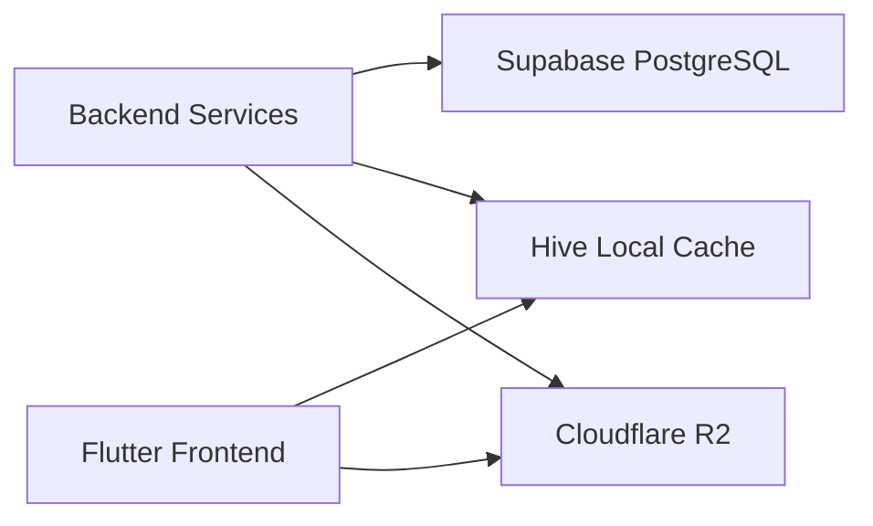
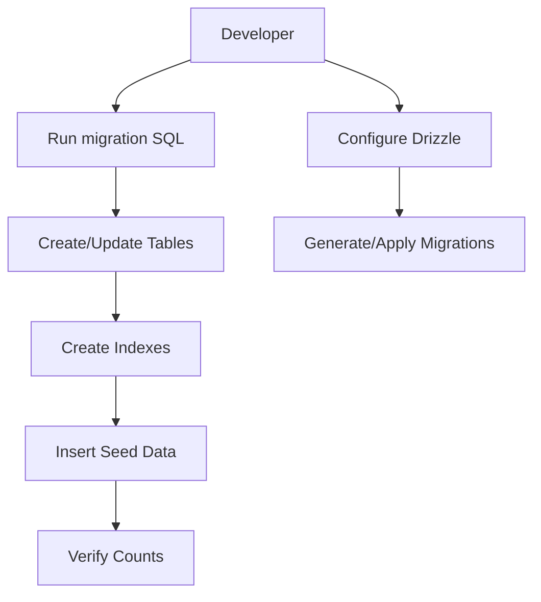
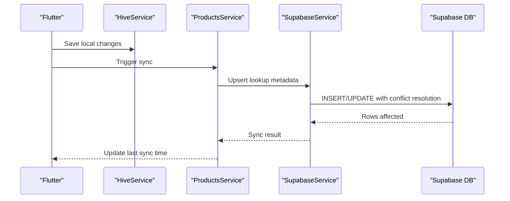
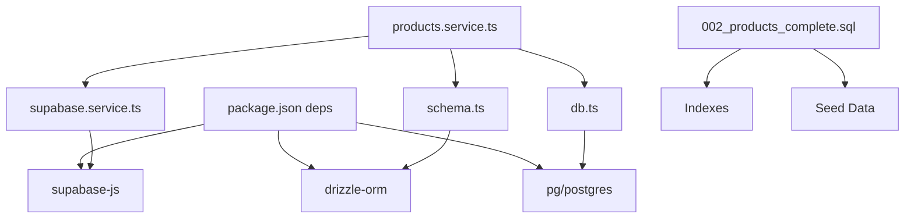

# Data Architecture

<cite>
**Referenced Files in This Document**
- [001_initial_schema_and_seed.sql](file://supabase/migrations/001_initial_schema_and_seed.sql)
- [002_products_complete.sql](file://supabase/migrations/002_products_complete.sql)
- [003_add_missing_lookup_tables.sql](file://supabase/migrations/003_add_missing_lookup_tables.sql)
- [schema.ts](file://backend/src/db/schema.ts)
- [db.ts](file://backend/src/db/db.ts)
- [drizzle.config.ts](file://backend/drizzle.config.ts)
- [tenant.middleware.ts](file://backend/src/common/middleware/tenant.middleware.ts)
- [supabase.service.ts](file://backend/src/supabase/supabase.service.ts)
- [products.service.ts](file://backend/src/products/products.service.ts)
- [hive_service.dart](file://lib/shared/services/hive_service.dart)
- [storage_service.dart](file://lib/shared/services/storage_service.dart)
- [README.md](file://supabase/migrations/README.md)
- [insert-dummy-data.ts](file://backend/scripts/insert-dummy-data.ts)
- [package.json](file://backend/package.json)
</cite>

## Table of Contents
1. [Introduction](#introduction)
2. [Project Structure](#project-structure)
3. [Core Components](#core-components)
4. [Architecture Overview](#architecture-overview)
5. [Detailed Component Analysis](#detailed-component-analysis)
6. [Dependency Analysis](#dependency-analysis)
7. [Performance Considerations](#performance-considerations)
8. [Security and Compliance](#security-and-compliance)
9. [Backup and Recovery](#backup-and-recovery)
10. [Troubleshooting Guide](#troubleshooting-guide)
11. [Conclusion](#conclusion)

## Introduction
This document describes the data architecture of ZerpAI ERP, focusing on the database schema design, multi-tenant isolation, data persistence strategy, migration and seed management, synchronization between online and offline modes, indexing and query optimization, security controls, and operational procedures. It synthesizes the Supabase PostgreSQL schema, Drizzle ORM model, NestJS backend services, and Flutter frontend caching/storage layers.

## Project Structure
The data architecture spans three layers:
- Backend (NestJS): Drizzle ORM schema, Supabase client, middleware, and services.
- Database (Supabase PostgreSQL): Migrations, indexes, and seed data.
- Frontend (Flutter): Hive local storage and Cloudflare R2 image storage.

**Diagram sources**
- [schema.ts](file://backend/src/db/schema.ts#L1-L293)
- [db.ts](file://backend/src/db/db.ts#L1-L13)
- [tenant.middleware.ts](file://backend/src/common/middleware/tenant.middleware.ts#L1-L70)
- [supabase.service.ts](file://backend/src/supabase/supabase.service.ts#L1-L32)
- [products.service.ts](file://backend/src/products/products.service.ts#L1-L723)
- [002_products_complete.sql](file://supabase/migrations/002_products_complete.sql#L1-L381)
- [hive_service.dart](file://lib/shared/services/hive_service.dart#L1-L134)
- [storage_service.dart](file://lib/shared/services/storage_service.dart#L1-L227)

**Section sources**
- [schema.ts](file://backend/src/db/schema.ts#L1-L293)
- [002_products_complete.sql](file://supabase/migrations/002_products_complete.sql#L1-L381)
- [drizzle.config.ts](file://backend/drizzle.config.ts#L1-L16)

## Core Components
- Supabase PostgreSQL schema: Defines entities, relationships, enums, and indexes.
- Drizzle ORM schema: TypeScript model mirroring the database for type-safe queries.
- Supabase client: Backend service for database operations.
- Tenant middleware: Injects organization/outlet context for multi-tenancy.
- Products service: CRUD and metadata sync logic against Supabase.
- Hive service: Local caching for offline-first UX.
- Storage service: Cloudflare R2 integration for images.

**Section sources**
- [002_products_complete.sql](file://supabase/migrations/002_products_complete.sql#L132-L226)
- [schema.ts](file://backend/src/db/schema.ts#L117-L195)
- [supabase.service.ts](file://backend/src/supabase/supabase.service.ts#L1-L32)
- [tenant.middleware.ts](file://backend/src/common/middleware/tenant.middleware.ts#L1-L70)
- [products.service.ts](file://backend/src/products/products.service.ts#L1-L723)
- [hive_service.dart](file://lib/shared/services/hive_service.dart#L1-L134)
- [storage_service.dart](file://lib/shared/services/storage_service.dart#L1-L227)

## Architecture Overview
ZerpAI ERP employs a hybrid online/offline architecture:
- Online mode: Direct Supabase PostgreSQL reads/writes via NestJS services.
- Offline mode: Flutter caches frequently accessed entities in Hive and uploads images to R2.
- Sync: Services coordinate server-side metadata and product composition data; offline clients reconcile local changes upon reconnection.

**Diagram sources**
- [hive_service.dart](file://lib/shared/services/hive_service.dart#L19-L45)
- [storage_service.dart](file://lib/shared/services/storage_service.dart#L25-L45)
- [products.service.ts](file://backend/src/products/products.service.ts#L609-L722)
- [supabase.service.ts](file://backend/src/supabase/supabase.service.ts#L1-L32)
- [002_products_complete.sql](file://supabase/migrations/002_products_complete.sql#L244-L272)

## Detailed Component Analysis

### Database Schema Design
- Entities: units, categories, tax_rates, manufacturers, brands, accounts, storage_locations, racks, reorder_terms, vendors, products, product_compositions.
- Relationships:
  - products.unit_id → units
  - products.category_id → categories
  - products.manufacturer_id → manufacturers
  - products.brand_id → brands
  - products.preferred_vendor_id → vendors
  - products.sales_account_id → accounts
  - products.purchase_account_id → accounts
  - products.inventory_account_id → accounts
  - products.storage_id → storage_locations
  - products.rack_id → racks
  - products.reorder_term_id → reorder_terms
  - product_compositions.product_id → products (cascade delete)
- Constraints and enums:
  - Enumerations for product_type, tax_preference, inventory_valuation_method, unit_type, tax_type, account_type, vendor_type.
  - Unique constraints on item_code and sku per organization context.
- Indexes:
  - Products: type, item_code, sku, category_id, unit_id, manufacturer_id, brand_id, preferred_vendor_id, is_active, push_to_ecommerce, hsn_code.
  - Product compositions: product_id.
  - Lookup tables: parent_id, active flags.

**Diagram sources**
- [002_products_complete.sql](file://supabase/migrations/002_products_complete.sql#L25-L241)
- [schema.ts](file://backend/src/db/schema.ts#L13-L195)

**Section sources**
- [002_products_complete.sql](file://supabase/migrations/002_products_complete.sql#L132-L241)
- [schema.ts](file://backend/src/db/schema.ts#L117-L195)

### Multi-Tenant Data Isolation
- Tenant context injection: The middleware attaches orgId/outletId to requests for downstream services to scope queries.
- Development note: RLS policies are disabled in migrations for development; production requires enabling RLS and policies to enforce tenant boundaries.

**Diagram sources**
- [tenant.middleware.ts](file://backend/src/common/middleware/tenant.middleware.ts#L24-L39)

**Section sources**
- [tenant.middleware.ts](file://backend/src/common/middleware/tenant.middleware.ts#L1-L70)
- [002_products_complete.sql](file://supabase/migrations/002_products_complete.sql#L274-L278)

### Data Persistence Strategy
- Online persistence: Supabase PostgreSQL via Drizzle ORM and Supabase client.
- Offline persistence: Hive local storage for products, customers, POS drafts, and configuration.
- Image storage: Cloudflare R2 for product images with signed request generation.

**Diagram sources**
- [db.ts](file://backend/src/db/db.ts#L1-L13)
- [supabase.service.ts](file://backend/src/supabase/supabase.service.ts#L1-L32)
- [hive_service.dart](file://lib/shared/services/hive_service.dart#L1-L134)
- [storage_service.dart](file://lib/shared/services/storage_service.dart#L1-L227)

**Section sources**
- [db.ts](file://backend/src/db/db.ts#L1-L13)
- [supabase.service.ts](file://backend/src/supabase/supabase.service.ts#L1-L32)
- [hive_service.dart](file://lib/shared/services/hive_service.dart#L1-L134)
- [storage_service.dart](file://lib/shared/services/storage_service.dart#L1-L227)

### Data Migration and Seed Management
- Migrations: Versioned SQL scripts define schema, indexes, and seed data.
- Drizzle configuration: Maps TypeScript schema to database for migrations and introspection.
- Seed scripts: Populate lookup tables and master data for immediate usability.

**Diagram sources**
- [002_products_complete.sql](file://supabase/migrations/002_products_complete.sql#L1-L381)
- [drizzle.config.ts](file://backend/drizzle.config.ts#L1-L16)
- [README.md](file://supabase/migrations/README.md#L1-L48)
- [insert-dummy-data.ts](file://backend/scripts/insert-dummy-data.ts#L1-L141)

**Section sources**
- [002_products_complete.sql](file://supabase/migrations/002_products_complete.sql#L280-L381)
- [drizzle.config.ts](file://backend/drizzle.config.ts#L1-L16)
- [README.md](file://supabase/migrations/README.md#L1-L48)
- [insert-dummy-data.ts](file://backend/scripts/insert-dummy-data.ts#L1-L141)

### Data Synchronization Strategy
- Metadata sync: Products service supports upserting lookup tables (units, categories, manufacturers, brands, vendors, storage locations, racks, reorder terms, accounts, contents, strengths, buying rules, drug schedules) with conflict resolution on unique keys.
- Product composition sync: Child records cascade with product updates.
- Offline reconciliation: Hive stores local state; upon reconnect, compare timestamps and resolve conflicts (conflict resolution pattern is implied by cache timestamps and draft handling).

**Diagram sources**
- [products.service.ts](file://backend/src/products/products.service.ts#L609-L722)
- [hive_service.dart](file://lib/shared/services/hive_service.dart#L101-L113)

**Section sources**
- [products.service.ts](file://backend/src/products/products.service.ts#L609-L722)
- [hive_service.dart](file://lib/shared/services/hive_service.dart#L101-L113)

### Data Security Controls
- Multi-tenancy: Tenant context injected into requests; RLS disabled in current migrations for development.
- Access control: Supabase client configured without automatic token refresh in backend service.
- Encryption: No explicit encryption of sensitive fields in the schema; consider encrypting PII at rest if required by compliance.
- Audit trails: Created/updated timestamps and user IDs present in schema; production should enforce RLS and audit triggers.

**Section sources**
- [tenant.middleware.ts](file://backend/src/common/middleware/tenant.middleware.ts#L1-L70)
- [supabase.service.ts](file://backend/src/supabase/supabase.service.ts#L1-L32)
- [002_products_complete.sql](file://supabase/migrations/002_products_complete.sql#L222-L226)

## Dependency Analysis
- Backend depends on:
  - Drizzle ORM for type-safe schema and migrations.
  - Supabase client for database operations.
  - Environment variables for credentials.
- Database depends on:
  - Migrations for schema evolution.
  - Indexes for query performance.
- Frontend depends on:
  - Hive for offline caching.
  - R2 for image storage.

**Diagram sources**
- [package.json](file://backend/package.json#L22-L36)
- [schema.ts](file://backend/src/db/schema.ts#L1-L10)
- [db.ts](file://backend/src/db/db.ts#L1-L13)
- [supabase.service.ts](file://backend/src/supabase/supabase.service.ts#L1-L32)
- [products.service.ts](file://backend/src/products/products.service.ts#L1-L10)
- [002_products_complete.sql](file://supabase/migrations/002_products_complete.sql#L244-L381)

**Section sources**
- [package.json](file://backend/package.json#L22-L36)
- [schema.ts](file://backend/src/db/schema.ts#L1-L10)
- [db.ts](file://backend/src/db/db.ts#L1-L13)
- [supabase.service.ts](file://backend/src/supabase/supabase.service.ts#L1-L32)
- [products.service.ts](file://backend/src/products/products.service.ts#L1-L10)
- [002_products_complete.sql](file://supabase/migrations/002_products_complete.sql#L244-L381)

## Performance Considerations
- Indexes: Strategic indexes on products (type, item_code, sku, category_id, unit_id, manufacturer_id, brand_id, preferred_vendor_id, is_active, push_to_ecommerce, hsn_code) and product_compositions (product_id) improve query performance.
- Joins: Products service performs left joins and selects denormalized relations to reduce round trips.
- Pagination and ordering: Use cursor-based pagination and appropriate ORDER BY clauses for large datasets.
- Concurrency: Supabase client configured for transaction pool mode; avoid prefetch to prevent unsupported scenarios.

**Section sources**
- [002_products_complete.sql](file://supabase/migrations/002_products_complete.sql#L244-L262)
- [products.service.ts](file://backend/src/products/products.service.ts#L96-L110)
- [db.ts](file://backend/src/db/db.ts#L10-L12)

## Security and Compliance
- Multi-tenancy enforcement: Enable RLS and policies in production to isolate tenant data.
- Secrets management: Store Supabase credentials in environment variables; do not commit secrets.
- Data retention: Define retention policies for logs and audit data; align with regional regulations.
- Compliance: Align schema and access controls with applicable standards; consider encryption for sensitive data.

**Section sources**
- [tenant.middleware.ts](file://backend/src/common/middleware/tenant.middleware.ts#L1-L70)
- [002_products_complete.sql](file://supabase/migrations/002_products_complete.sql#L274-L278)

## Backup and Recovery
- Backups: Use Supabase-managed backups or export logical dumps for disaster recovery.
- Recovery: Restore from backups and re-apply migrations; verify data integrity and indexes.
- Testing: Periodically validate restore procedures and cross-check counts for critical tables.

**Section sources**
- [README.md](file://supabase/migrations/README.md#L34-L41)

## Troubleshooting Guide
- Migration failures: Review migration SQL for syntax errors and missing dependencies; confirm indexes and seed data integrity.
- Sync errors: Inspect upsert logic and conflict resolution; validate unique keys and UUID formats.
- Offline cache issues: Clear cache selectively and re-sync; monitor last sync timestamps.
- Image upload failures: Verify R2 credentials and bucket permissions; check signed request generation.

**Section sources**
- [002_products_complete.sql](file://supabase/migrations/002_products_complete.sql#L280-L381)
- [products.service.ts](file://backend/src/products/products.service.ts#L609-L722)
- [hive_service.dart](file://lib/shared/services/hive_service.dart#L117-L132)
- [storage_service.dart](file://lib/shared/services/storage_service.dart#L138-L217)

## Conclusion
ZerpAI ERP’s data architecture combines a robust Supabase PostgreSQL schema with Drizzle ORM, a tenant-aware backend, and a hybrid online/offline frontend. While development currently disables RLS and includes placeholder user references, production readiness requires enabling RLS, enforcing access controls, and implementing comprehensive audit and retention policies. The migration and seed system, combined with Hive caching and R2 image storage, provides a scalable foundation for growth and compliance.